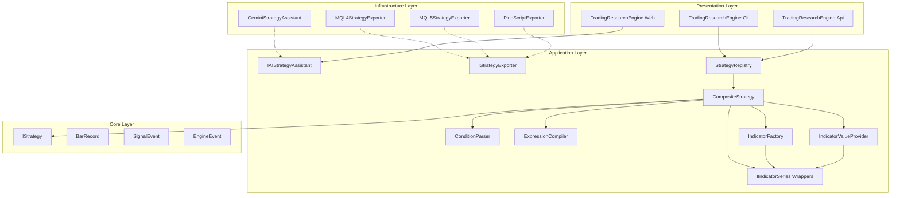
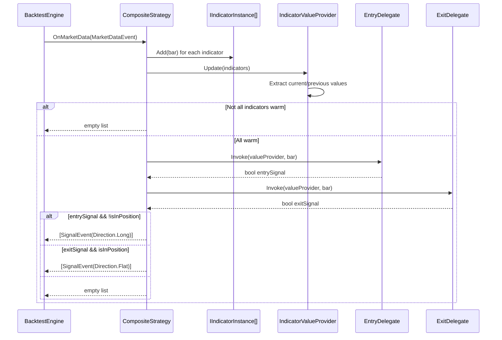
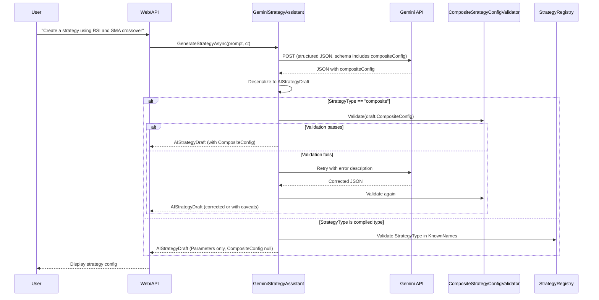
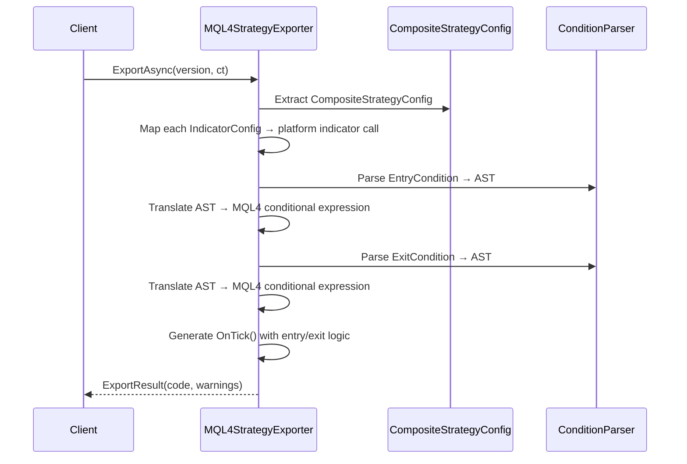
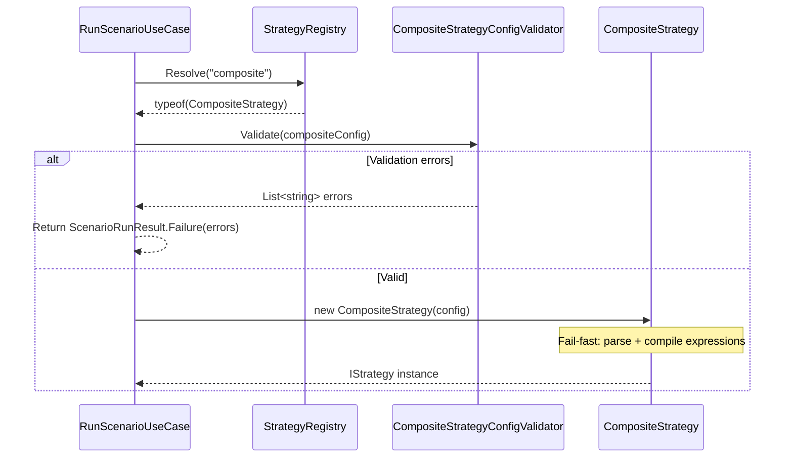

# Design Document — Composite Strategy Engine

## Overview

The Composite Strategy Engine introduces a runtime-configurable `CompositeStrategy` class that implements `IStrategy` and evaluates declarative entry/exit condition expressions against dynamically instantiated indicators. This removes the constraint that the AI Strategy Assistant can only output one of 6 hardcoded strategy types — it can now produce arbitrary `CompositeStrategyConfig` JSON describing any combination of the 8 existing Skender indicator wrappers and rule-based conditions.

The design adds four new components to the Application layer:

1. **CompositeStrategy** — an `IStrategy` implementation that feeds bars to configured indicators and evaluates compiled condition delegates to emit signals.
2. **Condition Expression Parser** — a recursive-descent parser that converts a declarative rule string into an AST, validates indicator references, and compiles the AST into a `Func<>` delegate for zero-allocation per-bar evaluation.
3. **Indicator Factory** — instantiates `IIndicatorSeries<T>` wrappers from declarative `IndicatorConfig` records.
4. **Indicator Value Provider** — a runtime context that exposes current indicator values by ID for use during condition evaluation.

The existing 6 compiled strategies remain unchanged. The AI assistant is updated to output `CompositeStrategyConfig` as its primary output format, with fallback to compiled types when appropriate. Strategy exporters are extended to translate composite configs into MQL4/MQL5/PineScript.

---

## Architecture

### High-Level Component Diagram



### Dependency Rule Compliance

| New Component | Layer | References |
|---|---|---|
| `CompositeStrategy` | Application | Core (`IStrategy`, `BarRecord`, `SignalEvent`, `Direction`) |
| `CompositeStrategyConfig`, `IndicatorConfig` | Application | Core (none — pure records) |
| `ConditionParser`, `ExpressionCompiler` | Application | Core (`BarRecord`) |
| `IndicatorFactory` | Application | Application (`IIndicatorSeries<T>` wrappers) |
| `IndicatorValueProvider` | Application | Application (`IIndicatorSeries<T>`) |
| AST node records | Application | — (self-contained) |
| Exporter extensions | Infrastructure | Application (`CompositeStrategyConfig`, AST) |

### Execution Flow Within the Engine Pipeline

```
DataHandler → MarketDataEvent → CompositeStrategy.OnMarketData(evt)
                                    │
                                    ├─ Feed bar to all IIndicatorSeries instances
                                    ├─ Update IndicatorValueProvider with latest values
                                    ├─ Check AllWarm gate
                                    ├─ Evaluate compiled entry delegate
                                    ├─ Evaluate compiled exit delegate
                                    └─ Emit SignalEvent(Direction.Long/Flat) or empty list
                                    │
                              SignalEvent → RiskLayer → ExecutionHandler → FillEvent
```

The `CompositeStrategy` slots into the existing pipeline identically to compiled strategies — it receives `MarketDataEvent` and returns `IReadOnlyList<EngineEvent>`. No modifications to `BacktestEngine`, `IRiskLayer`, `IExecutionHandler`, or any other pipeline component are required.

---

## Components and Interfaces

### CompositeStrategy (Application)

```csharp
namespace TradingResearchEngine.Application.Strategy;

/// <summary>
/// Runtime-configurable strategy that evaluates declarative condition expressions
/// against dynamically instantiated indicators. Registered as [StrategyName("composite")].
/// </summary>
[StrategyName("composite")]
public sealed class CompositeStrategy : IStrategy
{
    private readonly CompositeStrategyConfig _config;
    private readonly IReadOnlyList<IIndicatorInstance> _indicators;
    private readonly IndicatorValueProvider _valueProvider;
    private readonly Func<IndicatorValueProvider, BarRecord, bool> _entryDelegate;
    private readonly Func<IndicatorValueProvider, BarRecord, bool> _exitDelegate;
    private bool _isInPosition;

    public CompositeStrategy(CompositeStrategyConfig config)
    {
        // 1. Validate config (indicator IDs unique, types supported)
        // 2. Instantiate indicators via IndicatorFactory
        // 3. Parse + validate + compile entry/exit expressions
        // All fail-fast at construction time
    }

    public IReadOnlyList<EngineEvent> OnMarketData(MarketDataEvent evt)
    {
        // 1. Feed bar to all indicators
        // 2. Update value provider
        // 3. If not all warm → return empty
        // 4. Evaluate entry/exit delegates
        // 5. Emit signal based on state machine (Long/Flat)
    }
}
```

### IndicatorFactory (Application)

```csharp
namespace TradingResearchEngine.Application.Strategy.Composite;

/// <summary>
/// Instantiates IIndicatorSeries wrappers from declarative IndicatorConfig records.
/// Supports all 8 existing indicator types.
/// </summary>
public static class IndicatorFactory
{
    /// <summary>
    /// Creates an IIndicatorInstance (wrapping IIndicatorSeries + metadata) from config.
    /// Throws ArgumentException for unknown types or missing required parameters.
    /// </summary>
    public static IIndicatorInstance Create(IndicatorConfig config);
}
```

### ConditionParser (Application)

```csharp
namespace TradingResearchEngine.Application.Strategy.Composite;

/// <summary>
/// Recursive-descent parser for the condition expression language.
/// Produces an AST from a condition string.
/// </summary>
public static class ConditionParser
{
    /// <summary>
    /// Parses a condition expression string into an AST.
    /// Throws ConditionParseException on syntax errors.
    /// </summary>
    public static ConditionNode Parse(string expression);
}
```

### ExpressionCompiler (Application)

```csharp
namespace TradingResearchEngine.Application.Strategy.Composite;

/// <summary>
/// Compiles a validated AST into a Func delegate for zero-allocation per-bar evaluation.
/// </summary>
public static class ExpressionCompiler
{
    /// <summary>
    /// Compiles an AST node tree into an executable delegate.
    /// The delegate accepts the current IndicatorValueProvider and BarRecord.
    /// </summary>
    public static Func<IndicatorValueProvider, BarRecord, bool> Compile(ConditionNode ast);
}
```

### ConditionPrettyPrinter (Application)

```csharp
namespace TradingResearchEngine.Application.Strategy.Composite;

/// <summary>
/// Formats an AST back into a canonical condition expression string.
/// Used for round-trip validation and export.
/// </summary>
public static class ConditionPrettyPrinter
{
    public static string Print(ConditionNode ast);
}
```

### IndicatorValueProvider (Application)

```csharp
namespace TradingResearchEngine.Application.Strategy.Composite;

/// <summary>
/// Runtime context providing current indicator values by ID.
/// Updated after all indicators process the current bar.
/// </summary>
public sealed class IndicatorValueProvider
{
    private readonly Dictionary<string, double?> _values = new(StringComparer.OrdinalIgnoreCase);

    /// <summary>Updates all indicator values from the current indicator instances.</summary>
    public void Update(IReadOnlyList<IIndicatorInstance> indicators);

    /// <summary>Gets the current value for an indicator reference (supports dot notation).</summary>
    public double? GetValue(string reference);

    /// <summary>Gets the previous value for cross-detection.</summary>
    public double? GetPreviousValue(string reference);

    /// <summary>Returns true if all indicators are warm.</summary>
    public bool AllWarm { get; }
}
```

### IIndicatorInstance (Application)

```csharp
namespace TradingResearchEngine.Application.Strategy.Composite;

/// <summary>
/// Wraps an IIndicatorSeries with its config ID and provides typed value extraction.
/// </summary>
public interface IIndicatorInstance
{
    string Id { get; }
    string Type { get; }
    bool IsWarm { get; }
    void Add(BarRecord bar);
    void Reset();

    /// <summary>Gets the current primary value (e.g., SMA value, RSI value).</summary>
    double? CurrentValue { get; }

    /// <summary>Gets the previous primary value (for cross detection).</summary>
    double? PreviousValue { get; }

    /// <summary>Gets a sub-property value (e.g., "Signal" for MACD).</summary>
    double? GetSubValue(string subProperty);

    /// <summary>Gets the previous sub-property value.</summary>
    double? GetPreviousSubValue(string subProperty);
}
```

### CompositeStrategyConfigValidator (Application)

```csharp
namespace TradingResearchEngine.Application.Strategy.Composite;

/// <summary>
/// Validates a CompositeStrategyConfig before engine execution.
/// Returns all violations, not just the first.
/// </summary>
public static class CompositeStrategyConfigValidator
{
    public static IReadOnlyList<string> Validate(CompositeStrategyConfig config);
}
```

---

## Data Models

### CompositeStrategyConfig (Application)

```csharp
namespace TradingResearchEngine.Application.Strategy.Composite;

/// <summary>
/// Immutable configuration record for a composite strategy.
/// Serialisable to/from JSON via System.Text.Json.
/// </summary>
public sealed record CompositeStrategyConfig(
    /// <summary>Human-readable name for this composite strategy.</summary>
    string Name,
    /// <summary>Ordered list of indicator definitions.</summary>
    IReadOnlyList<IndicatorConfig> Indicators,
    /// <summary>Entry condition expression string.</summary>
    string EntryCondition,
    /// <summary>Exit condition expression string.</summary>
    string ExitCondition,
    /// <summary>Direction mode: Long, Short, or Both. Default Long.</summary>
    DirectionMode DirectionMode = DirectionMode.Long);

/// <summary>Direction mode for composite strategy signal generation.</summary>
public enum DirectionMode { Long, Short, Both }
```

### IndicatorConfig (Application)

```csharp
namespace TradingResearchEngine.Application.Strategy.Composite;

/// <summary>
/// Declarative specification of an indicator instance within a composite strategy.
/// </summary>
public sealed record IndicatorConfig(
    /// <summary>Unique ID used to reference this indicator in conditions (e.g., "sma20").</summary>
    string Id,
    /// <summary>Indicator type matching a known type: sma, ema, rsi, macd, bollinger, atr, stochastic, donchian.</summary>
    string Type,
    /// <summary>Parameters for the indicator (e.g., {"period": 20}).</summary>
    IReadOnlyDictionary<string, object> Parameters);
```

### AST Node Hierarchy (Application)

```csharp
namespace TradingResearchEngine.Application.Strategy.Composite;

/// <summary>Base type for all condition expression AST nodes.</summary>
public abstract record ConditionNode;

/// <summary>Logical AND/OR combination of two sub-expressions.</summary>
public sealed record LogicalNode(
    ConditionNode Left,
    LogicalOperator Operator,
    ConditionNode Right) : ConditionNode;

/// <summary>Comparison between two value expressions.</summary>
public sealed record ComparisonNode(
    ValueNode Left,
    ComparisonOperator Operator,
    ValueNode Right) : ConditionNode;

/// <summary>Cross-detection function: crosses_above(a, b) or crosses_below(a, b).</summary>
public sealed record CrossNode(
    ValueNode Left,
    ValueNode Right,
    CrossDirection Direction) : ConditionNode;

/// <summary>Base type for value-producing expressions.</summary>
public abstract record ValueNode;

/// <summary>Reference to an indicator value by ID, optionally with sub-property.</summary>
public sealed record IndicatorRefNode(string IndicatorId, string? SubProperty = null) : ValueNode;

/// <summary>Reference to a price field (open, high, low, close, volume).</summary>
public sealed record PriceRefNode(PriceField Field) : ValueNode;

/// <summary>A numeric literal constant.</summary>
public sealed record LiteralNode(double Value) : ValueNode;

/// <summary>Logical operators.</summary>
public enum LogicalOperator { And, Or }

/// <summary>Comparison operators.</summary>
public enum ComparisonOperator { GreaterThan, LessThan, GreaterThanOrEqual, LessThanOrEqual, Equal, NotEqual }

/// <summary>Cross direction for crosses_above / crosses_below.</summary>
public enum CrossDirection { Above, Below }

/// <summary>Price fields available in conditions.</summary>
public enum PriceField { Open, High, Low, Close, Volume }
```

### Extended AIStrategyDraft (Application)

```csharp
// Extended from existing record — adds optional CompositeConfig property
public sealed record AIStrategyDraft(
    string StrategyName,
    string Hypothesis,
    string StrategyType,
    IReadOnlyDictionary<string, object> Parameters,
    RiskConfig SuggestedRisk,
    string Rationale,
    IReadOnlyList<string> Caveats,
    CompositeStrategyConfig? CompositeConfig = null,  // NEW — null for non-composite drafts
    SourceType SourceType = SourceType.AIGenerated);
```

---

## Sequence Diagrams

### Composite Strategy Execution (Per-Bar)



### AI Generation with Composite Output



### Composite Strategy Export Flow



### Configuration Validation Flow



---

## Condition Expression Language Grammar

```
expression     → logical_or
logical_or     → logical_and ( "OR" logical_and )*
logical_and    → primary ( "AND" primary )*
primary        → comparison | cross_call | "(" expression ")"
comparison     → value comp_op value
cross_call     → ("crosses_above" | "crosses_below") "(" value "," value ")"
comp_op        → ">" | "<" | ">=" | "<=" | "==" | "!="
value          → indicator_ref | price_ref | number
indicator_ref  → IDENTIFIER ( "." IDENTIFIER )?
price_ref      → "open" | "high" | "low" | "close" | "volume"
number         → ["-"] DIGIT+ ["." DIGIT+]
IDENTIFIER     → LETTER (LETTER | DIGIT | "_")*
```

**Operator Precedence** (lowest to highest):
1. `OR`
2. `AND`
3. Comparisons (`>`, `<`, `>=`, `<=`, `==`, `!=`)
4. Parentheses (override precedence)

**Examples:**
- `sma20 > sma50 AND rsi14 < 70`
- `crosses_above(close, bollinger1.Upper) OR macd1.Histogram > 0`
- `(close > sma200) AND (rsi14 > 30 AND rsi14 < 70)`

---

## Export Translation Strategy

Each exporter translates composite configs using a two-phase approach:

### Phase 1: Indicator Mapping

| Indicator Type | MQL4 | MQL5 | PineScript |
|---|---|---|---|
| sma | `iMA(..., MODE_SMA, ...)` | `iMA(..., MODE_SMA, ...)` | `ta.sma(close, period)` |
| ema | `iMA(..., MODE_EMA, ...)` | `iMA(..., MODE_EMA, ...)` | `ta.ema(close, period)` |
| rsi | `iRSI(...)` | `iRSI(...)` | `ta.rsi(close, period)` |
| macd | `iMACD(...)` | `iMACD(...)` | `ta.macd(close, fast, slow, signal)` |
| bollinger | `iBands(...)` | `iBands(...)` | `ta.bb(close, period, stdDev)` |
| atr | `iATR(...)` | `iATR(...)` | `ta.atr(period)` |
| stochastic | `iStochastic(...)` | `iStochastic(...)` | `ta.stoch(high, low, close, ...)` |
| donchian | Manual `iHighest`/`iLowest` | Manual `iHighest`/`iLowest` | `ta.highest`/`ta.lowest` |

### Phase 2: Expression Translation

The AST is walked recursively, translating each node to platform-specific syntax:
- `ComparisonNode` → infix comparison (same syntax across platforms)
- `LogicalNode` → `&&` / `||` (MQL4/5) or `and` / `or` (PineScript)
- `CrossNode` → previous-bar comparison pattern (MQL4/5) or `ta.crossover`/`ta.crossunder` (PineScript)
- `IndicatorRefNode` → platform-specific buffer access
- `PriceRefNode` → `Close[0]` (MQL4/5) or `close` (PineScript)

When an indicator or construct has no direct equivalent, the exporter emits a `// NOTE:` comment and adds a warning to `ExportResult.Warnings`.

---

## Error Handling

| Error Condition | Exception Type | Layer | Behaviour |
|---|---|---|---|
| Unknown indicator type in IndicatorConfig | `ArgumentException` | Application | Lists supported types in message |
| Missing required indicator parameter | `ArgumentException` | Application | Identifies the missing parameter |
| Syntax error in condition expression | `ConditionParseException` | Application | Includes position, expected tokens |
| Unknown indicator ID in expression | `ConditionValidationException` | Application | Lists defined indicator IDs |
| Composite config validation failure | Structured error list | Application | All violations returned, not just first |
| AI returns invalid composite config | Retry once with correction prompt | Infrastructure | Falls back to caveat on second failure |
| Indicator not warm during evaluation | No signal emitted | Application | Silent — no exception, no signal |
| Division by zero in expression | Returns `false` for the condition | Application | Defensive — treats as non-triggering |

### Custom Exception Types

```csharp
namespace TradingResearchEngine.Application.Strategy.Composite;

/// <summary>Thrown when a condition expression contains a syntax error.</summary>
public sealed class ConditionParseException : Exception
{
    public int Position { get; }
    public string Expected { get; }
    public string Found { get; }
}

/// <summary>Thrown when a condition expression references undefined indicators.</summary>
public sealed class ConditionValidationException : Exception
{
    public IReadOnlyList<string> UndefinedReferences { get; }
    public IReadOnlyList<string> DefinedIndicatorIds { get; }
}
```

---


## Correctness Properties

### Property 1: CompositeStrategyConfig JSON Round-Trip

*For any* valid `CompositeStrategyConfig` instance, serialising to JSON and deserialising back SHALL produce a semantically equivalent object with all fields preserved (indicator configs, conditions, direction mode, name).

**Validates: Requirements 2.3, 2.4**

### Property 2: Condition Expression Parse Round-Trip

*For any* valid condition expression string, parsing into an AST and pretty-printing back to a string then re-parsing SHALL produce an equivalent AST.

**Validates: Requirements 5.5, 5.6**

### Property 3: Compiled Expression Determinism

*For any* valid condition expression and *for any* indicator value state, evaluating the compiled delegate SHALL produce a deterministic boolean result identical to interpreting the AST directly.

**Validates: Requirements 6.1, 6.2**

### Property 4: Indicator Factory Completeness

*For any* indicator type string in the set {sma, ema, rsi, macd, bollinger, atr, stochastic, donchian} with valid parameters, the Indicator Factory SHALL return a non-null `IIndicatorSeries` instance that becomes warm after sufficient bars.

**Validates: Requirements 3.1, 3.2**

### Property 5: CompositeStrategy Signal Equivalence

*For any* `CompositeStrategyConfig` that encodes the same logic as a compiled strategy (e.g., SMA crossover with matching periods), the CompositeStrategy SHALL produce identical signal sequences on the same bar data (after both strategies are warm).

**Validates: Requirements 10.3, 15.1**

### Property 6: Condition Evaluation Short-Circuit

*For any* AND expression where the left operand evaluates to false, the right operand SHALL NOT be evaluated. *For any* OR expression where the left operand evaluates to true, the right operand SHALL NOT be evaluated.

**Validates: Requirement 6.4**

### Property 7: Crosses Detection Correctness

*For any* pair of indicator value sequences (a, b), `crosses_above(a, b)` SHALL be true only on the bar where `a[current] > b[current]` AND `a[previous] <= b[previous]`. `crosses_below(a, b)` SHALL be true only on the bar where `a[current] < b[current]` AND `a[previous] >= b[previous]`.

**Validates: Requirements 4.6, 14.4**

### Property 8: Warm-Up Gating

*For any* CompositeStrategy configuration, no signals SHALL be emitted until ALL configured indicators report `IsWarm == true`.

**Validates: Requirement 1.6**

---

## Folder Structure (New Code)

```
src/
  TradingResearchEngine.Application/
    Strategy/
      Composite/
        CompositeStrategy.cs              (IStrategy implementation)
        CompositeStrategyConfig.cs        (immutable config record)
        IndicatorConfig.cs                (indicator definition record)
        IndicatorFactory.cs               (instantiates wrappers from config)
        IndicatorValueProvider.cs         (runtime indicator value context)
      Composite/Conditions/
        IConditionNode.cs                 (AST node interface)
        ComparisonNode.cs                 (>, <, >=, <=, ==, !=)
        LogicalNode.cs                    (AND, OR)
        CrossesNode.cs                    (crosses_above, crosses_below)
        IndicatorRefNode.cs               (indicator value reference)
        PriceRefNode.cs                   (open, high, low, close, volume)
        LiteralNode.cs                    (numeric constant)
        ConditionParser.cs                (recursive-descent parser)
        ConditionCompiler.cs              (AST → Func<> delegate)
        ConditionPrettyPrinter.cs         (AST → string)
        ConditionValidator.cs             (validates indicator references)

  TradingResearchEngine.Infrastructure/
    Export/
      CompositeExportHelper.cs            (shared DSL → platform code translation)
      (MQL4/MQL5/PineScript exporters extended with composite handling)

  TradingResearchEngine.UnitTests/
    Strategy/
      Composite/
        CompositeStrategyTests.cs
        CompositeStrategyProperties.cs
        ConditionParserTests.cs
        ConditionParserProperties.cs
        ConditionCompilerTests.cs
        IndicatorFactoryTests.cs
        IndicatorValueProviderTests.cs

  TradingResearchEngine.IntegrationTests/
    Strategy/
      CompositeStrategyIntegrationTests.cs
      CompositeExportIntegrationTests.cs
```
