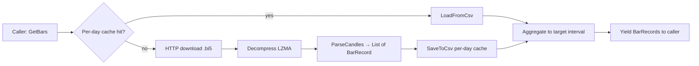
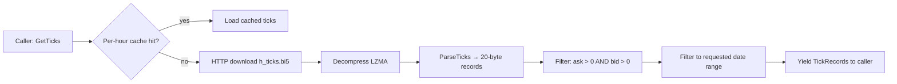

# Design — Dukascopy Data Quality Fixes

## Overview

This design addresses nine requirements that fix data-quality bugs and add missing capabilities in the Dukascopy data pipeline. The changes span two existing files (`DukascopyHelpers.cs`, `DukascopyDataProvider.cs`) and one new test file (`DukascopyHelpersTests.cs`). No Core types, Application layer, Web layer, or other providers are modified.

The fixes fall into three categories:

1. **Correctness** (Req 1–2): strict interval parsing and OHLC integrity guards.
2. **Infrastructure hardening** (Req 3, 6–8): per-day cache, portable endianness, partial-bar logging, HTTP retry.
3. **New capabilities** (Req 4–5): tick data implementation and ASK/mid-price candle support.

---

## Architecture

### Affected Components

```
DukascopyHelpers.cs          (static utility — parsing, aggregation, cache paths, decompression)
DukascopyDataProvider.cs     (IDataProvider implementation — GetBars, GetTicks, HTTP, caching)
DukascopyHelpersTests.cs     (new — unit tests in UnitTests project)
```

### Data Flow (Candles)



### Data Flow (Ticks — new)



### Design Decisions

| # | Decision | Rationale |
|---|---|---|
| 1 | `IntervalToMinutes()` throws `ArgumentException` on unrecognized input; `null` throws `ArgumentNullException` | Silent fallback to daily was the root cause of the 1H bug; fail-fast is safer. Explicit null guard gives a clean API contract rather than leaking `NullReferenceException` from `.ToLowerInvariant()` |
| 2 | OHLC integrity enforced at aggregation, not post-processing | Single enforcement point; prevents invalid bars from ever being emitted |
| 3 | Per-day cache replaces monolithic date-range file | Enables incremental fetches; overlapping ranges reuse cached days |
| 4 | No migration of old cache files | Old files are simply not found and regenerated on next request |
| 5 | ASK candle download is opt-in via `PriceType` parameter | Backwards-compatible; default remains BID-only |
| 6 | `BinaryPrimitives.ReadInt64LittleEndian` replaces `BitConverter.ToInt64` | Explicit endianness; correct on all platforms |
| 7 | Partial session bars logged as warnings, still emitted | Informational only; no new fields on `BarRecord` |
| 8 | HTTP retry via Polly with exponential back-off (3 attempts) | Handles transient failures; 404 is not retried |
| 9 | Tick parsing uses big-endian reads for the 20-byte record format | Matches Dukascopy's documented binary layout |
| 10 | Dukascopy ticks mapped to `TickRecord` as single-element bid/ask lists with synthesized `LastTrade` at mid-price | Dukascopy provides top-of-book only (no depth, no trade prints). `LastTrade` is synthesized from `(ask+bid)/2` with `min(askVol, bidVol)` for size. This is documented as provider-derived, not exchange-reported |
| 11 | `BuildDayUrl` adds an overload with `priceType` parameter; original 2-arg signature delegates to `BuildDayUrl(symbol, date, "Bid")` | Preserves `DukascopyImportProvider` compatibility without forcing changes to that class |
| 12 | `DukascopyImportProvider` is out of scope for behavioral changes | Import provider keeps its own cache layout and manual retry. Only non-breaking compatibility changes (e.g. helper overloads) are made. Consolidation is a separate follow-up spec |
| 13 | Polly retry applies only to `DukascopyDataProvider` | `DukascopyImportProvider` retains its existing manual retry loop; migrating it to Polly is out of scope |

---

## Components and Interfaces

### `DukascopyHelpers` (static class — modified)

| Member | Change | Requirement |
|---|---|---|
| `IntervalToMinutes(string)` | Add `null` guard throwing `ArgumentNullException`; replace `_ => 1440` with `var unknown => throw new ArgumentException(...)` | Req 1 |
| `Aggregate(List<BarRecord>, string, string)` | Add OHLC guards on window init and close-clamping before emit | Req 2 |
| `ParseCandles(byte[], DateTime, string, decimal)` | Add `h >= l` to the existing positivity guard | Req 2.4 |
| `Decompress(byte[])` | Replace `BitConverter.ToInt64(data, 5)` with `BinaryPrimitives.ReadInt64LittleEndian(data.AsSpan(5, 8))` | Req 6 |
| `ParseTicks(byte[], DateTime, string, decimal)` | **New** — parses 20-byte big-endian tick records into `TickRecord` instances using single-element bid/ask lists and synthesized mid-price `LastTrade` | Req 4 |
| `BuildDayUrl(string, DateTime, string)` | **New overload** with `priceType` parameter to select `BID_candles_min_1.bi5` or `ASK_candles_min_1.bi5`; original 2-arg signature delegates to this with `"Bid"` default | Req 5 |
| `GetDayCachePath(string, string, DateTime)` | **New** — returns `{CacheDir}/{symbol}/{priceType}/{yyyy}/{MM}/{dd}.csv` | Req 3, 5 |

### `DukascopyDataProvider` (class — modified)

| Member | Change | Requirement |
|---|---|---|
| Constructor | Accept `PriceType` parameter (default `Bid`) | Req 5 |
| `GetBars(...)` | Use per-day cache; fetch ASK/BID/Mid based on `PriceType`; log partial session bars | Req 3, 5, 7 |
| `GetTicks(...)` | Implement real tick download using `ParseTicks`; remove warning log | Req 4 |
| `FetchDayAsync(...)` | Add Polly retry policy; handle 404 as empty result | Req 8 |
| `GetCachePath(...)` | Remove old monolithic path; delegate to `DukascopyHelpers.GetDayCachePath` | Req 3 |

### `PriceType` (new enum)

```csharp
public enum DukascopyPriceType { Bid, Ask, Mid }
```

Defined in `DukascopyDataProvider.cs` (Infrastructure layer). Not a Core type.

---

## Data Models

No new Core data models are introduced. The existing `BarRecord` and `TickRecord` types are unchanged.

### Tick Binary Layout (Dukascopy format — for `ParseTicks`)

| Offset | Size | Type | Field |
|---|---|---|---|
| 0 | 4 | uint32 BE | Millisecond offset from hour start |
| 4 | 4 | uint32 BE | Ask price × point size |
| 8 | 4 | uint32 BE | Bid price × point size |
| 12 | 4 | float32 BE | Ask volume |
| 16 | 4 | float32 BE | Bid volume |

Total: 20 bytes per tick record.

### Tick-to-TickRecord Mapping

Dukascopy provides top-of-book data only: one bid price, one ask price, and two volumes. There is no market depth and no real trade print stream. The mapping to the existing `TickRecord` type (which expects `IReadOnlyList<BidLevel>`, `IReadOnlyList<AskLevel>`, and `LastTrade`) is as follows:

- `BidLevels`: single-element list `[ new BidLevel(bidPrice, bidVol) ]`
- `AskLevels`: single-element list `[ new AskLevel(askPrice, askVol) ]`
- `LastTrade`: synthesized from mid-price `(ask + bid) / 2` with size `Math.Min(askVol, bidVol)` and the tick's timestamp
- `Symbol`: passed through from the request
- `Timestamp`: computed as `hourStart + TimeSpan.FromMilliseconds(offset)`

**Important**: This `LastTrade` is provider-derived, not exchange-reported. Dukascopy does not publish actual trade prints. Consumers should not treat this as a real trade record. This is documented in the XML doc comment on `ParseTicks`.

### Per-Day Cache Path

```
{CacheDir}/{SYMBOL}/{PriceType}/{yyyy}/{MM}/{dd}.csv
```

Example: `DukascopyDayCache/EURUSD/Bid/2026/03/05.csv`

### Mid-Price Computation

When `PriceType == Mid`, both BID and ASK files are fetched for each day. The output bar is:

```
Open  = (BidOpen  + AskOpen)  / 2
High  = (BidHigh  + AskHigh)  / 2
Low   = (BidLow   + AskLow)   / 2
Close = (BidClose + AskClose) / 2
Volume = BidVolume  (ASK volume is discarded)
```

---

## Error Handling

### Interval Parsing (Req 1)

`IntervalToMinutes()` throws `ArgumentNullException` for `null` input and `ArgumentException` with the unrecognized value and the list of supported values for non-null invalid input:

```csharp
public static int IntervalToMinutes(string interval)
{
    ArgumentNullException.ThrowIfNull(interval);
    return interval.ToLowerInvariant() switch
    {
        // ... supported mappings ...
        var unknown => throw new ArgumentException(
            $"Unrecognized interval '{unknown}'. Supported values: 1m, 5m, 15m, 30m, 1h, 60m, 4h, 1d, daily.",
            nameof(interval))
    };
}
```

### OHLC Integrity (Req 2)

Invalid source bars (`high < low`, any OHLC value ≤ 0) are silently discarded in `ParseCandles`. The aggregation loop enforces `Low ≤ Open ≤ High` and `Low ≤ Close ≤ High` via clamping — no exceptions thrown.

### HTTP Retry (Req 8)

Polly retry policy on `HttpClient`:

- Triggers on `HttpRequestException` or HTTP 5xx status codes
- 3 retries with exponential back-off: 1s → 2s → 4s
- HTTP 404 returns empty result (not retried — missing data for off-market hours is expected)
- After exhausting retries: log at `LogLevel.Error` with URL, attempt count, and exception message, then re-throw

### Mid-Price Failure Handling (Req 5)

When `PriceType == Mid`, both BID and ASK files must be present for a given day. If the ASK file download fails (404 or exhausted retries) but the BID file succeeds, the day is treated as a download failure — no partial mid-price bar is emitted. The error is logged at `LogLevel.Warning` with the symbol, date, and which file failed. This prevents silently emitting BID-only data when the caller explicitly requested mid-price.

### Partial Session Bars (Req 7)

When the first minute bar of a day does not align with the aggregation window boundary, a `LogLevel.Warning` is emitted containing: symbol, date, interval, window boundary, and first bar timestamp. The bar is still emitted. Warning fires at most once per trading day per symbol.

### Tick Data (Req 4)

- Records with `ask ≤ 0` or `bid ≤ 0` are discarded
- Trailing incomplete records (byte array length not a multiple of 20) are discarded without throwing
- Ticks outside the requested `[from, to]` range are filtered before yielding

---

## Testing Strategy

All new tests go in `src/TradingResearchEngine.IntegrationTests/MarketData/DukascopyHelpersTests.cs`, extending the existing test class. Per the steering rules, UnitTests references Core and Application only — never Infrastructure. Since `DukascopyHelpers` lives in Infrastructure, the tests belong in IntegrationTests where the existing `DukascopyHelpersTests` class already resides. The new test methods exercise pure static functions with no HTTP calls, so they are effectively unit-level tests hosted in the IntegrationTests project for dependency reasons.

### Test Categories

#### 1. Interval Parsing (Req 9.2)

| Test | Input | Expected |
|---|---|---|
| `IntervalToMinutes_SupportedInterval_ReturnsCorrectMinutes` | `1m, 5m, 15m, 30m, 1h, 1H, 60m, 4h, 4H, 1d, 1D, daily, Daily` | Correct minute count |
| `IntervalToMinutes_UnrecognizedInterval_ThrowsArgumentException` | `H1, hourly, 1 hour, "", bad` | `ArgumentException` |
| `IntervalToMinutes_NullInterval_ThrowsArgumentNullException` | `null` | `ArgumentNullException` |

#### 2. OHLC Aggregation (Req 9.3)

| Test | Scenario | Assertion |
|---|---|---|
| `Aggregate_FirstBarOpenExceedsHigh_OutputHighCoversOpen` | Source bar: Open > High | `result.High >= result.Open` |
| `Aggregate_LastBarCloseExceedsHigh_OutputHighCoversClose` | Last bar: Close > running High | `result.High >= result.Close` |
| `Aggregate_FirstBarOpenBelowLow_OutputLowCoversOpen` | Source bar: Open < Low | `result.Low <= result.Open` |
| `Aggregate_CleanInput_OhlcUnchanged` | Normal bars | OHLC values match expected |
| `Aggregate_EmptyInput_ReturnsEmpty` | Empty list | Empty result, no throw |

#### 3. Cache Path (Req 9.4)

| Test | Scenario | Assertion |
|---|---|---|
| `GetDayCachePath_ReturnsCorrectStructure` | `EURUSD, 2024-03-05, Bid` | Path ends in `EURUSD/Bid/2024/03/05.csv` |
| `GetDayCachePath_OverlappingRanges_SameDaySamePath` | Two ranges sharing a day | Same file path for the shared day |

#### 4. Tick Parsing (Req 9.5)

| Test | Scenario | Assertion |
|---|---|---|
| `ParseTicks_ValidRecord_ReturnsExpectedValues` | Well-formed 20-byte record | Correct ask, bid, timestamp |
| `ParseTicks_ZeroAsk_Discarded` | Record with ask = 0 | Empty result |
| `ParseTicks_IncompleteTrailingRecord_Discarded` | Byte array not multiple of 20 | No throw; trailing bytes ignored |

#### 5. Endianness (Req 9.6)

| Test | Scenario | Assertion |
|---|---|---|
| `Decompress_LittleEndianSize_ReadCorrectly` | Known byte slice at offset 5 | `BinaryPrimitives.ReadInt64LittleEndian` returns expected value |

### Test Conventions

- Naming: `<Method>_<Condition>_<Expected>`
- Framework: xUnit with `[Fact]` and `[Theory]`/`[InlineData]`
- No real HTTP calls
- All tests grouped under `DukascopyHelpersTests`

---

## Files Changed

| File | Change |
|---|---|
| `src/TradingResearchEngine.Infrastructure/DataProviders/DukascopyHelpers.cs` | Fix `IntervalToMinutes` (throw on unknown); fix `Aggregate` (OHLC guards); extend `ParseCandles` (`h >= l`); replace `BitConverter.ToInt64` with `BinaryPrimitives.ReadInt64LittleEndian`; add `ParseTicks`; add `GetDayCachePath`; add `priceType` to `BuildDayUrl` |
| `src/TradingResearchEngine.Infrastructure/DataProviders/DukascopyDataProvider.cs` | Add `PriceType` constructor param; implement per-day cache in `GetBars`; implement `GetTicks` with real tick download; add Polly retry policy; add partial session bar warning logging; remove old monolithic cache path |
| `src/TradingResearchEngine.IntegrationTests/MarketData/DukascopyHelpersTests.cs` | Extend existing test class with interval parsing, OHLC aggregation, cache paths, tick parsing, and endianness tests |

No Core types, Application layer, or Web layer files are modified.
