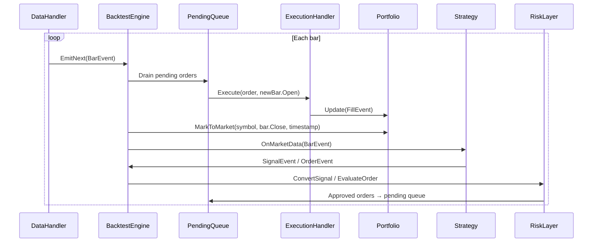
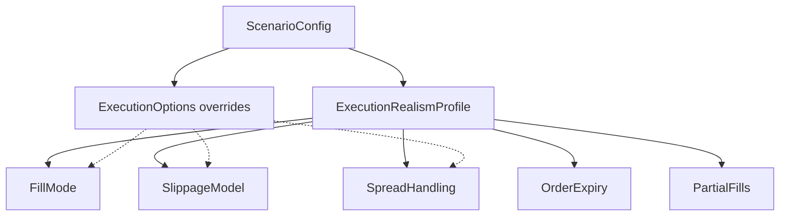

# Design Document — TradingResearchEngine V2 + V2.1

## Overview

This design covers two phases of engine evolution:

- **V2**: Critical correctness fixes (look-ahead bias, Sharpe/Sortino computation, continuous mark-to-market, Direction enum cleanup, Monte Carlo normalisation) plus medium-priority improvements (rolling SMA, ADF caching, K-Ratio, bid/ask fills, intra-bar order logic).
- **V2.1**: Execution realism profiles, advanced slippage models, session awareness, partial fills, walk-forward upgrades, parameter stability/fragility, sensitivity analysis, regime segmentation, portfolio constraints, position sizing policies, experiment metadata, event trace mode, extended analytics, and strategy comparison.

Both phases preserve the existing clean-architecture layer boundaries:

```
Core ← Application ← Infrastructure ← { Cli, Api, Web }
```

No V1 abstractions are removed unless explicitly called out (e.g. `Direction.Short`). All changes are additive or corrective.

---

## Architecture

### V2 Engine Loop — Corrected Per-Bar Processing

The V1 engine processes all events synchronously within a single bar, causing look-ahead bias. V2 introduces a pending-order queue and a strict per-bar processing order.



#### RunState Changes

```csharp
private sealed class RunState
{
    public BacktestStatus Status { get; set; } = BacktestStatus.Completed;
    public MarketDataEvent? LastMarketEvent { get; set; }
    public FillMode FillMode { get; set; } = FillMode.NextBarOpen;
    public List<OrderEvent> PendingOrders { get; } = new();
}
```

#### FillMode Enum (Core)

```csharp
/// <summary>Controls when approved orders are filled relative to the bar that generated them.</summary>
public enum FillMode
{
    /// <summary>Orders fill at the next bar's Open price. Eliminates look-ahead bias.</summary>
    NextBarOpen,
    /// <summary>V1 legacy: orders fill at the same bar's Close. For backward compatibility only.</summary>
    SameBarClose
}
```

### V2.1 Execution Realism Architecture

V2.1 layers execution realism profiles on top of the corrected engine loop.



---

## Components and Interfaces

### Core Layer Changes

#### ScenarioConfig (amended)

```csharp
public sealed record ScenarioConfig(
    // ... all existing V1 fields ...
    // V2 additions:
    FillMode FillMode = FillMode.NextBarOpen,
    int BarsPerYear = 252,
    bool EnableEventTrace = false,
    // V2.1 additions:
    ExecutionRealismProfile RealismProfile = ExecutionRealismProfile.StandardBacktest,
    ExecutionOptions? ExecutionOptions = null,
    string? SessionCalendarType = null,
    Dictionary<string, object>? SessionFilterOptions = null,
    Dictionary<string, object>? SlippageModelOptions = null
) : IHasId
{
    public string Id => ScenarioId;
}
```

#### Direction Enum (amended — BUG-04 Option A)

```csharp
/// <summary>
/// Trade direction. V2 is long-only; short-selling is out of scope.
/// <c>Flat</c> is used as the exit signal to close a long position.
/// </summary>
public enum Direction { Long, Flat }
```

Decision rationale: All concrete strategies are long-only. Removing `Short` eliminates the silent portfolio accounting error where a short fill with no matching long position inflates cash. This is the simplest fix with the least risk. Short-selling can be added in a future version with proper `PositionSide` semantics.

#### OrderEvent (amended)

```csharp
public record OrderEvent(
    string Symbol,
    Direction Direction,
    decimal Quantity,
    OrderType OrderType,
    decimal? LimitPrice,
    decimal? StopPrice,           // V2: for StopMarket and StopLimit orders
    DateTimeOffset Timestamp,
    bool RiskApproved = false,
    int MaxBarsPending = 0,       // V2: 0 = GTC, >0 = expire after N bars
    bool StopTriggered = false)   // V2: for StopLimit state tracking
    : EngineEvent(Timestamp);
```

#### OrderType Enum (amended)

```csharp
public enum OrderType { Market, Limit, StopMarket, StopLimit }
```

#### FillEvent (unchanged for V2, extended for V2.1)

V2: No changes to FillEvent shape.
V2.1: Add optional `ExecutionOutcome` field:

```csharp
public record FillEvent(
    string Symbol,
    Direction Direction,
    decimal Quantity,
    decimal FillPrice,
    decimal Commission,
    decimal SlippageAmount,
    DateTimeOffset Timestamp,
    ExecutionOutcome Outcome = ExecutionOutcome.Filled,  // V2.1
    decimal RemainingQuantity = 0m,                       // V2.1
    string? RejectionReason = null)                       // V2.1
    : EngineEvent(Timestamp);

/// <summary>Outcome of an order execution attempt.</summary>
public enum ExecutionOutcome { Filled, PartiallyFilled, Unfilled, Rejected, Expired }
```

#### EquityCurvePoint (enriched — BUG-03)

```csharp
/// <summary>A timestamped portfolio snapshot appended on every bar.</summary>
public sealed record EquityCurvePoint(
    DateTimeOffset Timestamp,
    decimal TotalEquity,
    decimal CashBalance,
    decimal UnrealisedPnl,
    decimal RealisedPnl,
    int OpenPositionCount);
```

#### ClosedTrade (amended — REQ-V2-04)

```csharp
public sealed record ClosedTrade(
    string Symbol,
    DateTimeOffset EntryTime,
    DateTimeOffset ExitTime,
    decimal EntryPrice,
    decimal ExitPrice,
    decimal Quantity,
    Direction Direction,
    decimal GrossPnl,
    decimal Commission,
    decimal NetPnl,
    decimal MAE = 0m,    // V2.1: maximum adverse excursion
    decimal MFE = 0m)    // V2.1: maximum favourable excursion
{
    /// <summary>Return on risk: NetPnl / (EntryPrice * Quantity). Returns 0 when denominator is zero.</summary>
    public decimal ReturnOnRisk => EntryPrice * Quantity > 0m
        ? NetPnl / (EntryPrice * Quantity)
        : 0m;
}
```

#### TickEvent (amended — IMP-04)

```csharp
public record TickEvent(
    string Symbol,
    IReadOnlyList<BidLevel> BidLevels,
    IReadOnlyList<AskLevel> AskLevels,
    LastTrade LastTrade,
    Quote? Bid,    // V2: best bid
    Quote? Ask,    // V2: best ask
    DateTimeOffset Timestamp)
    : MarketDataEvent(Symbol, Timestamp);

/// <summary>A single price/size quote level.</summary>
public record Quote(decimal Price, decimal Size);
```

#### New Core Types

```csharp
/// <summary>Controls when approved orders are filled.</summary>
public enum FillMode { NextBarOpen, SameBarClose }

/// <summary>Execution realism level for scenario configuration.</summary>
public enum ExecutionRealismProfile { FastResearch, StandardBacktest, BrokerConservative }

/// <summary>Override individual realism profile defaults.</summary>
public sealed record ExecutionOptions(
    FillMode? FillModeOverride = null,
    string? SlippageModelOverride = null,
    bool? EnablePartialFills = null,
    int? DefaultMaxBarsPending = null);
```

#### Session Calendar (V2.1 — Core interface)

```csharp
/// <summary>A named trading session window.</summary>
public readonly record struct TradingSession(
    string Name,
    TimeOnly Start,
    TimeOnly End,
    string TimeZoneId);

/// <summary>Classifies timestamps into trading sessions.</summary>
public interface ISessionCalendar
{
    /// <summary>Returns true if the timestamp falls within a tradable session.</summary>
    bool IsTradable(DateTimeOffset timestamp);

    /// <summary>Returns the session bucket name for the timestamp (e.g. "London", "NewYork", "AfterHours").</summary>
    string ClassifySession(DateTimeOffset timestamp);
}
```

Ownership: `ISessionCalendar` and `TradingSession` live in Core. Default implementations (`ForexSessionCalendar`, `UsEquitySessionCalendar`) live in Application. Strategies never reference session logic directly — the engine and risk layer use it.

#### Position Sizing Policy (V2.1 — Core interface)

```csharp
/// <summary>Computes position size given a signal, portfolio state, and market data.</summary>
public interface IPositionSizingPolicy
{
    /// <summary>Returns the quantity to trade.</summary>
    decimal ComputeSize(
        SignalEvent signal,
        PortfolioSnapshot snapshot,
        MarketDataEvent market);
}
```

Ownership: Interface in Core. Implementations in Application:
- `FixedQuantitySizingPolicy` — always returns a configured fixed quantity
- `FixedDollarRiskSizingPolicy` — risks a fixed dollar amount per trade
- `PercentEquitySizingPolicy` — risks a percentage of current equity
- `VolatilityTargetSizingPolicy` — targets a volatility level using ATR

The `DefaultRiskLayer` delegates to the active `IPositionSizingPolicy` instead of embedding fixed-fractional sizing directly.

---

### Application Layer Changes

#### BacktestEngine.Dispatch — Corrected (BUG-01)

The `Dispatch` method is replaced with a structured per-bar processing pipeline:

```csharp
// Pseudocode for corrected engine loop
while (dataHandler.HasMore)
{
    await dataHandler.EmitNextAsync(queue, ct);

    while (queue.TryDequeue(out var evt))
    {
        if (evt is MarketDataEvent mde)
        {
            state.LastMarketEvent = mde;

            // Step 1: Fill pending orders from previous bar
            if (state.FillMode == FillMode.NextBarOpen)
                ProcessPendingOrders(mde, queue, portfolio, state);

            // Step 2: Mark-to-market with current bar's Close
            if (mde is BarEvent bar)
                portfolio.MarkToMarket(bar.Symbol, bar.Close, bar.Timestamp);
            else if (mde is TickEvent tick)
                portfolio.MarkToMarket(tick.Symbol, tick.LastTrade.Price, tick.Timestamp);

            // Step 3: Pass to strategy
            var outputs = _strategy.OnMarketData(mde);
            foreach (var output in outputs)
                queue.Enqueue(output);
        }
        else if (evt is SignalEvent signal)
        {
            var order = _riskLayer.ConvertSignal(signal, portfolio.TakeSnapshot());
            if (order is not null)
                RouteApprovedOrder(order, queue, state);
        }
        else if (evt is OrderEvent { RiskApproved: false } rawOrder)
        {
            var approved = _riskLayer.EvaluateOrder(rawOrder, portfolio.TakeSnapshot());
            if (approved is not null)
                RouteApprovedOrder(approved, queue, state);
        }
        else if (evt is OrderEvent { RiskApproved: true } approvedOrder)
        {
            // SameBarClose: execute immediately (V1 compat)
            // NextBarOpen: should not reach here — orders go to pending queue
            if (state.LastMarketEvent is not null)
                queue.Enqueue(_executionHandler.Execute(approvedOrder, state.LastMarketEvent));
        }
        else if (evt is FillEvent fill)
        {
            portfolio.Update(fill);
        }
    }
}

private void RouteApprovedOrder(OrderEvent order, IEventQueue queue, RunState state)
{
    var approved = order with { RiskApproved = true };
    if (state.FillMode == FillMode.NextBarOpen)
        state.PendingOrders.Add(approved);
    else
        queue.Enqueue(approved); // SameBarClose: immediate dispatch
}
```

#### ProcessPendingOrders — Intra-Bar Fill Logic (BUG-01 + IMP-05)

```csharp
private void ProcessPendingOrders(
    MarketDataEvent mde, IEventQueue queue, Portfolio portfolio, RunState state)
{
    var remaining = new List<OrderEvent>();

    foreach (var order in state.PendingOrders)
    {
        var fillResult = TryFillOrder(order, mde);
        if (fillResult is not null)
        {
            queue.Enqueue(fillResult);
        }
        else
        {
            // Check expiry
            int barsPending = order.MaxBarsPending;
            if (barsPending > 0)
            {
                barsPending--;
                if (barsPending <= 0) continue; // expired, drop
                remaining.Add(order with { MaxBarsPending = barsPending });
            }
            else
            {
                remaining.Add(order); // GTC, keep
            }
        }
    }

    state.PendingOrders.Clear();
    state.PendingOrders.AddRange(remaining);
}

private FillEvent? TryFillOrder(OrderEvent order, MarketDataEvent mde)
{
    if (mde is not BarEvent bar) return _executionHandler.Execute(order, mde);

    return order.OrderType switch
    {
        OrderType.Market => _executionHandler.Execute(
            order, CreateOpenPriceBar(bar)),
        OrderType.Limit => TryFillLimit(order, bar),
        OrderType.StopMarket => TryFillStopMarket(order, bar),
        OrderType.StopLimit => TryFillStopLimit(order, bar),
        _ => null
    };
}
```

Fill logic per order type:
- **Market**: fill at `bar.Open` + slippage
- **Limit buy**: fill if `bar.Low <= LimitPrice`, at `LimitPrice`
- **Limit sell**: fill if `bar.High >= LimitPrice`, at `LimitPrice`
- **Stop-market buy**: fill if `bar.High >= StopPrice`, at `StopPrice` + slippage
- **Stop-market sell**: fill if `bar.Low <= StopPrice`, at `StopPrice` - slippage
- **Stop-limit buy**: trigger if `bar.High >= StopPrice`, then fill if `bar.Low <= LimitPrice` at `LimitPrice`; if triggered but not filled, convert to pending limit
- **Stop-limit sell**: trigger if `bar.Low <= StopPrice`, then fill if `bar.High >= LimitPrice` at `LimitPrice`; if triggered but not filled, convert to pending limit

#### Portfolio.MarkToMarket — Continuous Equity Curve (BUG-03)

```csharp
/// <summary>
/// Updates unrealised P&amp;L for open positions and appends an equity curve point.
/// Called by the engine on every bar, after pending fills and before strategy invocation.
/// </summary>
public void MarkToMarket(string symbol, decimal price, DateTimeOffset timestamp)
{
    if (_positions.TryGetValue(symbol, out var state))
        state.UpdateUnrealisedPnl(price);

    RecalculateTotalEquity();

    decimal unrealisedPnl = _positions.Values.Sum(p => p.UnrealisedPnl);
    decimal realisedPnl = _positions.Values.Sum(p => p.RealisedPnl)
        + _closedTrades.Sum(t => t.NetPnl);
    int openCount = _positions.Count(p => p.Value.Quantity > 0m);

    _equityCurve.Add(new EquityCurvePoint(
        timestamp, TotalEquity, CashBalance,
        unrealisedPnl, realisedPnl, openCount));
}
```

The `Update(FillEvent)` method no longer appends to the equity curve — that responsibility moves entirely to `MarkToMarket`. This ensures exactly one equity curve point per bar regardless of fill activity.

#### MetricsCalculator — Equity Curve Period Returns (BUG-02)

```csharp
/// <summary>
/// Computes annualised Sharpe ratio from equity curve period returns.
/// Returns null when fewer than 2 equity points or zero standard deviation.
/// </summary>
public static decimal? ComputeSharpeRatio(
    IReadOnlyList<EquityCurvePoint> curve,
    decimal annualRiskFreeRate,
    int barsPerYear)
{
    if (curve.Count < 2) return null;

    var returns = GetPeriodReturns(curve);
    decimal stdDev = StdDev(returns);
    if (stdDev == 0m) return null;

    decimal meanReturn = returns.Average();
    decimal periodRiskFree = annualRiskFreeRate / barsPerYear;
    return (meanReturn - periodRiskFree) / stdDev * (decimal)Math.Sqrt(barsPerYear);
}

/// <summary>
/// Computes annualised Sortino ratio from equity curve period returns.
/// Downside deviation uses period returns below the risk-free rate.
/// </summary>
public static decimal? ComputeSortinoRatio(
    IReadOnlyList<EquityCurvePoint> curve,
    decimal annualRiskFreeRate,
    int barsPerYear)
{
    if (curve.Count < 2) return null;

    var returns = GetPeriodReturns(curve);
    decimal periodRiskFree = annualRiskFreeRate / barsPerYear;
    decimal meanReturn = returns.Average();

    var downsideReturns = returns.Where(r => r < periodRiskFree).ToList();
    if (downsideReturns.Count == 0) return null;

    decimal downsideDev = StdDev(downsideReturns);
    if (downsideDev == 0m) return null;

    return (meanReturn - periodRiskFree) / downsideDev * (decimal)Math.Sqrt(barsPerYear);
}

private static List<decimal> GetPeriodReturns(IReadOnlyList<EquityCurvePoint> curve)
{
    var returns = new List<decimal>(curve.Count - 1);
    for (int i = 1; i < curve.Count; i++)
    {
        decimal prev = curve[i - 1].TotalEquity;
        if (prev != 0m)
            returns.Add((curve[i].TotalEquity - prev) / prev);
    }
    return returns;
}
```

The old `ComputeSharpeRatio(IReadOnlyList<ClosedTrade>, decimal)` overload is removed. The `GetNetReturns` helper is removed. `BuildResult` in `BacktestEngine` passes `config.BarsPerYear` to the new signatures.

#### MetricsCalculator — K-Ratio (IMP-03)

```csharp
/// <summary>
/// K-Ratio (Zephyr/Kestner): slope of log-equity OLS / (SE of slope * sqrt(n)).
/// Positive = consistent upward; negative = consistent decline.
/// </summary>
public static decimal? ComputeEquityCurveSmoothness(IReadOnlyList<EquityCurvePoint> curve)
{
    if (curve.Count < 3) return null;

    int n = curve.Count;
    // OLS on log(equity) vs bar index
    double sumX = 0, sumY = 0, sumXY = 0, sumX2 = 0;
    for (int i = 0; i < n; i++)
    {
        double x = i;
        double y = Math.Log((double)curve[i].TotalEquity);
        sumX += x; sumY += y;
        sumXY += x * y; sumX2 += x * x;
    }

    double meanX = sumX / n;
    double meanY = sumY / n;
    double sxx = sumX2 - n * meanX * meanX;
    if (sxx == 0) return null;

    double slope = (sumXY - n * meanX * meanY) / sxx;

    // Standard error of slope
    double ssResidual = 0;
    for (int i = 0; i < n; i++)
    {
        double predicted = meanY + slope * (i - meanX);
        double actual = Math.Log((double)curve[i].TotalEquity);
        ssResidual += (actual - predicted) * (actual - predicted);
    }
    double seSlope = Math.Sqrt(ssResidual / ((n - 2) * sxx));
    if (seSlope == 0) return null;

    return (decimal)(slope / (seSlope * Math.Sqrt(n)));
}
```

#### Monte Carlo — Normalised Returns (BUG-05)

```csharp
// In RunSimulation:
var returns = trades
    .Select(t => t.ReturnOnRisk)
    .ToArray();

// Reconstruct paths multiplicatively:
for (int i = 0; i < tradeCount; i++)
{
    int idx = rng.Next(tradeCount);
    decimal sampledReturn = returns[idx];
    equity *= (1m + sampledReturn);
    path[i + 1] = equity;
    // ... drawdown tracking unchanged
}
```

#### SimulatedExecutionHandler — Bid/Ask Fills (IMP-04)

```csharp
public FillEvent Execute(OrderEvent order, MarketDataEvent currentBar)
{
    decimal basePrice = currentBar switch
    {
        BarEvent bar => bar.Close,
        TickEvent tick => GetTickFillPrice(tick, order.Direction),
        _ => throw new InvalidOperationException(...)
    };
    // ... slippage and commission unchanged
}

private static decimal GetTickFillPrice(TickEvent tick, Direction direction)
{
    if (direction == Direction.Long && tick.Ask is not null)
        return tick.Ask.Price;
    if (direction == Direction.Flat && tick.Bid is not null)
        return tick.Bid.Price;
    return tick.LastTrade.Price; // fallback
}
```

#### Rolling SMA Strategy Pattern (IMP-01)

```csharp
// SmaCrossoverStrategy — rolling sum pattern
private decimal _fastSum;
private decimal _slowSum;

public IReadOnlyList<EngineEvent> OnMarketData(MarketDataEvent evt)
{
    if (evt is not BarEvent bar) return Array.Empty<EngineEvent>();
    _closes.Add(bar.Close);

    // Warmup
    if (_closes.Count <= _slowPeriod)
    {
        if (_closes.Count <= _fastPeriod) _fastSum += bar.Close;
        else { _fastSum += bar.Close; _fastSum -= _closes[_closes.Count - _fastPeriod - 1]; }

        _slowSum += bar.Close;
        if (_closes.Count == _slowPeriod) { /* first valid bar */ }
        return Array.Empty<EngineEvent>();
    }

    // Rolling update: add new, subtract departed
    _fastSum += bar.Close - _closes[_closes.Count - _fastPeriod - 1];
    _slowSum += bar.Close - _closes[_closes.Count - _slowPeriod - 1];

    decimal fastSma = _fastSum / _fastPeriod;
    decimal slowSma = _slowSum / _slowPeriod;
    // ... signal logic unchanged
}
```

Same pattern applied to `MeanReversionStrategy` (rolling SMA + rolling variance), `RsiStrategy` (Wilder smoothing accumulators), and `BollingerBandsStrategy` (rolling SMA + rolling sum-of-squares).

#### ADF Caching (IMP-02)

```csharp
// StationaryMeanReversionStrategy additions
private readonly int _adfRecheckInterval;
private int _barsSinceAdfCheck;
private bool _cachedStationarity;

// In OnMarketData:
_barsSinceAdfCheck++;
if (_barsSinceAdfCheck >= _adfRecheckInterval || !_warmedUp)
{
    _cachedStationarity = IsStationary(returns, (double)_adfPValueThreshold);
    _barsSinceAdfCheck = 0;
    _warmedUp = true;
}
bool isStationary = _skipStationarityTest || _cachedStationarity;

// Fix biased variance in IsStationary:
double varYl = sumYl2 / (m - 1) - meanYl * meanYl * m / (m - 1);
// Simplified: use Bessel-corrected sample variance
```

---

### V2.1 Application Layer — New Workflows and Components

#### RealismSensitivityWorkflow (EXR-01)

```csharp
public sealed class RealismSensitivityWorkflow
    : IResearchWorkflow<RealismSensitivityOptions, RealismSensitivityResult>
{
    // Runs the same strategy under FastResearch, StandardBacktest, BrokerConservative
    // Returns per-profile: CAGR, Sharpe, MaxDrawdown, ProfitFactor
    // Plus degradation percentages between profiles
}

public sealed record RealismSensitivityResult(
    IReadOnlyList<RealismProfileResult> ProfileResults,
    decimal SharpeDropFastToStandard,
    decimal SharpeDropStandardToConservative);

public sealed record RealismProfileResult(
    ExecutionRealismProfile Profile,
    BacktestResult Result,
    decimal CAGR,
    decimal? Sharpe,
    decimal MaxDrawdown,
    decimal? ProfitFactor);
```

#### Advanced Slippage Models (EXR-02)

All implement `ISlippageModel`. All live in `Application/Execution/`.

```csharp
public sealed class AtrScaledSlippageModel : ISlippageModel
{
    // Maintains rolling ATR from recent bars
    // Slippage = ATR * configurable fraction (e.g. 0.1 = 10% of ATR)
}

public sealed class PercentOfPriceSlippageModel : ISlippageModel
{
    // Slippage = basePrice * basisPoints / 10000
}

public sealed class SessionAwareSlippageModel : ISlippageModel
{
    // Uses ISessionCalendar to widen slippage during illiquid sessions
    // Core session: base slippage; off-hours: base * multiplier
}

public sealed class VolatilityBucketSlippageModel : ISlippageModel
{
    // Maps recent realised volatility into low/medium/high buckets
    // Each bucket has a configured slippage amount
}
```

#### Session Calendar Implementations (EXR-03)

```csharp
// Application/Sessions/
public sealed class ForexSessionCalendar : ISessionCalendar
{
    // Asia: 00:00-09:00 UTC, London: 07:00-16:00 UTC,
    // NewYork: 12:00-21:00 UTC, Overlap: 12:00-16:00 UTC
}

public sealed class UsEquitySessionCalendar : ISessionCalendar
{
    // Pre-market: 04:00-09:30 ET, Regular: 09:30-16:00 ET,
    // After-hours: 16:00-20:00 ET
}
```

Engine integration: when `SessionFilter` is active, the engine checks `ISessionCalendar.IsTradable(bar.Timestamp)` before invoking the strategy. Mark-to-market still runs regardless.

#### WalkForwardSummary (RSR-01)

```csharp
public sealed record WalkForwardSummary(
    IReadOnlyList<WalkForwardWindow> Windows,
    IReadOnlyList<EquityCurvePoint> CompositeEquityCurve,
    decimal? AverageOutOfSampleSharpe,
    decimal WorstWindowDrawdown,
    decimal ParameterDriftScore,
    decimal? MeanEfficiencyRatio);
```

`ParameterDriftScore` = normalised standard deviation of selected parameter values across windows. High drift = parameters are unstable across time.

The `WalkForwardWorkflow` stitches OOS equity curves by chaining the end equity of window N as the start equity of window N+1.

#### ParameterStabilityWorkflow (RSR-02)

```csharp
public sealed class ParameterStabilityWorkflow
    : IResearchWorkflow<ParameterStabilityOptions, ParameterStabilityResult>
{
    // Takes a target parameter set and a SweepResult
    // Evaluates all parameter combinations within ±neighbourhoodPercent
    // Computes FragilityScore
}

public sealed record ParameterStabilityResult(
    decimal LocalMedianSharpe,
    decimal LocalWorstSharpe,
    decimal ProfitableNeighbourProportion,
    decimal FragilityScore);  // 0 = robust, 1 = fragile
```

`FragilityScore = 1 - ProfitableNeighbourProportion` (simplified). A more nuanced version could weight by distance from the target.

#### SensitivityAnalysisWorkflow (RSR-03)

```csharp
public sealed class SensitivityAnalysisWorkflow
    : IResearchWorkflow<SensitivityOptions, SensitivityResult>
{
    // Reruns strategy under perturbations:
    // spread: 1.25x, 1.5x, 2x
    // slippage: 1.5x, 2x
    // entry delay: +1 bar
    // exit delay: +1 bar
    // sizing: 0.5x
}

public sealed record SensitivityResult(
    IReadOnlyList<SensitivityRow> Matrix,
    decimal CostSensitivity,
    decimal DelaySensitivity,
    decimal ExecutionRobustnessScore);

public sealed record SensitivityRow(
    string PerturbationName,
    decimal CAGR,
    decimal? Sharpe,
    decimal MaxDrawdown,
    decimal? ProfitFactor);
```

`ExecutionRobustnessScore` = average Sharpe across all perturbations / base Sharpe. Higher = more resilient.

#### RegimePerformanceReport (RSR-04)

```csharp
public sealed record RegimePerformanceReport(
    IReadOnlyList<RegimeSegment> Segments);

public sealed record RegimeSegment(
    string RegimeName,
    string RegimeDimension,  // "Volatility", "Trend", "Session"
    int TradeCount,
    decimal WinRate,
    decimal Expectancy,
    TimeSpan AverageHoldTime,
    decimal MaxDrawdownContribution);
```

#### ExperimentMetadata (RAD-01)

```csharp
public sealed record ExperimentMetadata(
    string StrategyName,
    Dictionary<string, object> ParameterValues,
    string DataSourceIdentifier,
    DateTimeOffset DataRangeStart,
    DateTimeOffset DataRangeEnd,
    ExecutionRealismProfile RealismProfile,
    string SlippageModelType,
    Dictionary<string, object>? SlippageModelOptions,
    string CommissionModelType,
    FillMode FillMode,
    int BarsPerYear,
    int? RandomSeed,
    string? EngineVersion);
```

Attached to `BacktestResult` as an optional field. Populated by `RunScenarioUseCase` from the `ScenarioConfig`.

#### EventTraceRecord (RAD-02)

```csharp
public sealed record EventTraceRecord(
    DateTimeOffset Timestamp,
    string EventType,        // "MarketData", "Signal", "RiskDecision", "Order", "Execution", "PortfolioUpdate"
    string Symbol,
    string Description,      // Human-readable summary
    Dictionary<string, object>? Details);
```

The engine maintains a `List<EventTraceRecord>` only when `EnableEventTrace` is true. Zero allocation overhead when disabled.

#### Extended Analytics (RPT-01)

New metrics added to `MetricsCalculator`:

```csharp
public static decimal? ComputeRecoveryFactor(
    IReadOnlyList<EquityCurvePoint> curve, decimal startEquity, decimal endEquity)
{
    decimal maxDd = ComputeMaxDrawdown(curve);
    if (maxDd == 0m) return null;
    decimal netProfit = endEquity - startEquity;
    return netProfit / (maxDd * startEquity);
}

public static int ComputeAverageBarsInTrade(
    IReadOnlyList<ClosedTrade> trades, IReadOnlyList<EquityCurvePoint> curve)
{
    // Approximate bars in trade from entry/exit timestamps and curve timestamps
}

public static int ComputeLongestFlatPeriod(IReadOnlyList<ClosedTrade> trades)
{
    // Bars between consecutive trades (exit of N to entry of N+1)
}
```

MAE and MFE are tracked during the engine loop by monitoring per-bar P&L of open positions. When a position closes, the worst and best unrealised P&L seen during the trade are recorded on the `ClosedTrade`.

#### StrategyComparisonWorkflow (RPT-02)

```csharp
public sealed class StrategyComparisonWorkflow
{
    public StrategyComparisonResult Compare(
        IReadOnlyList<BacktestResult> results)
    {
        // Validate matching assumptions
        // Produce comparison table
    }
}

public sealed record StrategyComparisonResult(
    IReadOnlyList<StrategyComparisonRow> Rows,
    IReadOnlyList<string>? MismatchWarnings);

public sealed record StrategyComparisonRow(
    string StrategyName,
    decimal CAGR,
    decimal? Sharpe,
    decimal? Sortino,
    decimal MaxDrawdown,
    decimal? ProfitFactor,
    decimal? Expectancy,
    decimal? RecoveryFactor);
```

---

## Data Models

### BacktestResult (amended)

```csharp
public sealed record BacktestResult(
    Guid RunId,
    ScenarioConfig ScenarioConfig,
    BacktestStatus Status,
    IReadOnlyList<EquityCurvePoint> EquityCurve,
    IReadOnlyList<ClosedTrade> Trades,
    decimal StartEquity,
    decimal EndEquity,
    decimal MaxDrawdown,
    decimal? SharpeRatio,
    decimal? SortinoRatio,
    decimal? CalmarRatio,
    decimal? ReturnOnMaxDrawdown,
    int TotalTrades,
    decimal? WinRate,
    decimal? ProfitFactor,
    decimal? AverageWin,
    decimal? AverageLoss,
    decimal? Expectancy,
    TimeSpan? AverageHoldingPeriod,
    decimal? EquityCurveSmoothness,    // Now K-Ratio
    int MaxConsecutiveLosses,
    int MaxConsecutiveWins,
    long RunDurationMs,
    // V2.1 additions:
    decimal? RecoveryFactor = null,
    ExperimentMetadata? Metadata = null,
    IReadOnlyList<EventTraceRecord>? EventTrace = null) : IHasId
{
    public string Id => RunId.ToString();
}
```

---

## Folder Structure Changes

```
src/TradingResearchEngine.Core/
  Configuration/
    ScenarioConfig.cs          # amended: FillMode, BarsPerYear, RealismProfile, etc.
    FillMode.cs                # NEW
    ExecutionRealismProfile.cs # NEW
    ExecutionOptions.cs        # NEW
  Events/
    Enums.cs                   # amended: Direction { Long, Flat }, OrderType + StopLimit
    OrderEvent.cs              # amended: StopPrice, MaxBarsPending, StopTriggered
    TickEvent.cs               # amended: Bid, Ask quotes
    FillEvent.cs               # amended: ExecutionOutcome, RemainingQuantity, RejectionReason
    ValueTypes.cs              # amended: Quote record added
  Portfolio/
    Portfolio.cs               # amended: MarkToMarket, MAE/MFE tracking
    EquityCurvePoint.cs        # amended: enriched fields
    ClosedTrade.cs             # amended: ReturnOnRisk, MAE, MFE
  Metrics/
    MetricsCalculator.cs       # amended: equity curve Sharpe/Sortino, K-Ratio, RecoveryFactor
  Sessions/                    # NEW
    TradingSession.cs
    ISessionCalendar.cs
  Risk/
    IPositionSizingPolicy.cs   # NEW
  Engine/
    BacktestEngine.cs          # amended: pending queue, per-bar processing, trace
  Results/
    BacktestResult.cs          # amended: RecoveryFactor, Metadata, EventTrace
    ExperimentMetadata.cs      # NEW
    EventTraceRecord.cs        # NEW
    ExecutionOutcome.cs        # NEW

src/TradingResearchEngine.Application/
  Execution/
    SimulatedExecutionHandler.cs  # amended: bid/ask fills, intra-bar logic
    AtrScaledSlippageModel.cs     # NEW
    PercentOfPriceSlippageModel.cs # NEW
    SessionAwareSlippageModel.cs  # NEW
    VolatilityBucketSlippageModel.cs # NEW
  Strategies/
    SmaCrossoverStrategy.cs       # amended: rolling sum
    MeanReversionStrategy.cs      # amended: rolling sum
    RsiStrategy.cs                # amended: Wilder smoothing
    BollingerBandsStrategy.cs     # amended: rolling sum
    StationaryMeanReversionStrategy.cs # amended: ADF cache, variance fix
  Sessions/                       # NEW
    ForexSessionCalendar.cs
    UsEquitySessionCalendar.cs
  Risk/
    DefaultRiskLayer.cs           # amended: delegates to IPositionSizingPolicy
    FixedQuantitySizingPolicy.cs  # NEW
    FixedDollarRiskSizingPolicy.cs # NEW
    PercentEquitySizingPolicy.cs  # NEW
    VolatilityTargetSizingPolicy.cs # NEW
    PortfolioConstraints.cs       # NEW
  Research/
    RealismSensitivityWorkflow.cs # NEW
    ParameterStabilityWorkflow.cs # NEW
    SensitivityAnalysisWorkflow.cs # NEW
    RegimeSegmentationWorkflow.cs # NEW
    StrategyComparisonWorkflow.cs # NEW
    Results/
      RealismSensitivityResult.cs # NEW
      ParameterStabilityResult.cs # NEW
      SensitivityResult.cs        # NEW
      RegimePerformanceReport.cs  # NEW
      StrategyComparisonResult.cs # NEW
      WalkForwardResult.cs        # amended: WalkForwardSummary
```

---

## Error Handling

### V2 Error Handling Additions

| Scenario | Behaviour |
|---|---|
| Pending order expires (`MaxBarsPending` reached) | Drop order, log `OrderExpired` with symbol and order details |
| Stop-limit trigger without fill | Convert to pending limit, continue |
| `MarkToMarket` called with no open position | Append equity curve point with current state, no error |
| `Direction.Flat` fill with no matching position | Do not modify cash, log warning |
| `BarsPerYear` is zero or negative | Return validation error before run starts |
| `FillMode` not recognised | Return validation error before run starts |

### V2.1 Error Handling Additions

| Scenario | Behaviour |
|---|---|
| Partial fill with zero remaining | Treat as full fill |
| Session calendar not found for type | Return validation error before run starts |
| Sensitivity workflow base run fails | Propagate failure, do not run perturbations |
| Parameter stability with no neighbours | Return result with `FragilityScore = 1.0` |
| Strategy comparison with mismatched assumptions | Return validation error listing mismatches |
| Event trace on long run | Trace records accumulate in memory; warn if > 100k records |

---

## Testing Strategy

### V2 Regression Tests (REQ-V2-05)

| Test | Validates |
|---|---|
| `BacktestEngine_NextBarOpen_FillsAtNextBarOpen` | BUG-01: signal on bar N fills at bar N+1's Open |
| `MetricsCalculator_FlatEquityCurve_SharpeIsNull` | BUG-02: flat curve → null Sharpe |
| `MetricsCalculator_LinearRisingCurve_SharpeWithinTolerance` | BUG-02: known slope → expected ratio |
| `Portfolio_MarkToMarket_UpdatesBetweenFills` | BUG-03: TotalEquity changes between fills |
| `Portfolio_FlatFillNoPosition_CashUnchanged` | BUG-04: no cash inflation on orphan flat fill |
| `MonteCarlo_NormalisedReturns_SeedReproducible` | BUG-05: same seed, variable size → identical paths |

### V2.1 Test Additions

| Test | Validates |
|---|---|
| `RealismSensitivity_ThreeProfiles_DegradationReported` | EXR-01 |
| `AtrScaledSlippage_Deterministic` | EXR-02 |
| `SessionCalendar_ForexSessions_CorrectClassification` | EXR-03 |
| `PartialFill_RemainingCarriedForward` | EXR-04 |
| `WalkForward_CompositeEquityCurve_Stitched` | RSR-01 |
| `ParameterStability_FragileIsland_HighScore` | RSR-02 |
| `SensitivityAnalysis_SpreadWidened_SharpeDegrades` | RSR-03 |
| `RegimeSegmentation_VolBuckets_TradesClassified` | RSR-04 |
| `PortfolioConstraints_MaxPositions_OrderRejected` | PRM-01 |
| `PercentEquitySizing_CorrectQuantity` | PRM-02 |
| `ExperimentMetadata_RoundTrip_Serialisable` | RAD-01 |
| `EventTrace_EnabledRecordsEvents_DisabledEmpty` | RAD-02 |
| `RecoveryFactor_KnownValues` | RPT-01 |
| `StrategyComparison_MismatchedAssumptions_Error` | RPT-02 |

### Property-Based Test Updates

- **Property 2 (EquityCurve length)**: Updated to assert curve length equals bar count (not fill count), reflecting continuous mark-to-market.
- **Property 3 (Cash conservation)**: Unchanged — still validates cash accounting.
- **New Property 9**: For any `ClosedTrade` with `EntryPrice > 0` and `Quantity > 0`, `ReturnOnRisk * EntryPrice * Quantity ≈ NetPnl` within floating-point tolerance.

---

## Design Guardrails

1. Strategies must not absorb execution realism logic. Signal generation only.
2. Provider-specific session calendars must not leak into Core strategy code.
3. Prop-firm constraints must not be hardcoded into Core. PropFirm remains an Application-layer consumer.
4. Advanced realism features are opt-in. Defaults remain simple.
5. Deterministic behaviour is preserved whenever a seed is supplied.
6. Additive extension is preferred over breaking rewrites.
