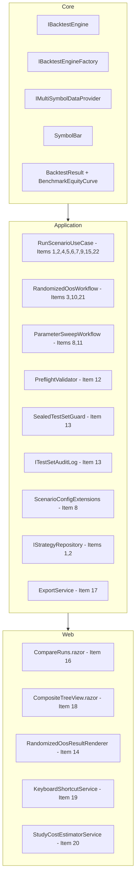

# Design Document — Engine Review Pass 2

## Overview

This design addresses 23 issues identified in the second-pass code review of TradingResearchEngine, organised by priority (P0 critical bugs → P3 polish). The changes span the Application and Core layers primarily, with supporting UI work in the Web layer. All modifications preserve the `Core ← Application ← Infrastructure ← { Cli, Api, Web }` dependency rule and follow existing conventions for XML doc comments, deterministic stochastic workflows, immutable record types, and CancellationToken propagation.

### Design Principles

- **Correctness over performance**: P0 bugs fix data corruption and invalid measurements first.
- **Isolation**: Parallel sweep workers must operate on fully independent state (services, configs, collections).
- **Testability**: New interfaces (`IBacktestEngine`, `IBacktestEngineFactory`, `ITestSetAuditLog`) enable unit testing without real infrastructure.
- **Backward compatibility**: Existing `IDataProvider`, `IStrategy`, and `ScenarioConfig` contracts remain unchanged.
- **No new NuGet packages**: All implementations use existing dependencies (xUnit, FsCheck.Xunit, Moq, Plotly.Blazor, MudBlazor, Microsoft.Data.Sqlite).

---

## Architecture

### Dependency Flow (unchanged)

```
Core ← Application ← Infrastructure ← { Cli, Api, Web }
```

### Affected Layers by Item



---

## Components and Interfaces

### P0 — Critical Bug Fixes

#### Item 1: Direct Version Lookup (IStrategyRepository)

**New method on `IStrategyRepository`:**

```csharp
/// <summary>Gets a strategy version by its unique ID without loading all strategies.</summary>
Task<StrategyVersion?> GetVersionByIdAsync(Guid versionId, CancellationToken ct = default);
```

**Rationale:** The existing `GetVersionAsync(string)` accepts a string ID. Item 1 requires a `Guid`-typed overload that queries directly by `StrategyVersionId` without the O(N×M) scan. Since `StrategyVersion.StrategyVersionId` is stored as `string`, the implementation converts the Guid to string and delegates to the existing `GetVersionAsync`. This avoids breaking the existing interface while providing the typed API the prompt specifies.

**Decision:** Rather than adding a new `Guid` overload that duplicates `GetVersionAsync(string)`, we will refactor `EnrichWithTrialCountAndDsrAsync` to use the existing `GetVersionAsync(string strategyVersionId)` method which already performs a direct lookup. The `result.StrategyVersionId` is already a string, so no Guid conversion is needed.

#### Item 2: Atomic Trial Count Increment

**New method on `IStrategyRepository`:**

```csharp
/// <summary>Atomically increments TotalTrialsRun by 1 for the specified version.</summary>
Task IncrementTrialCountAsync(string versionId, CancellationToken ct = default);
```

**Implementation in `JsonStrategyRepository`:** Uses a file-level `SemaphoreSlim(1,1)` to serialise read-modify-write. In `SqliteStrategyRepository`: uses `UPDATE strategy_versions SET TotalTrialsRun = TotalTrialsRun + 1 WHERE StrategyVersionId = @id`.

#### Item 3: Contiguous OOS Blocks with Warmup

**Changes to `RandomizedOosOptions`:**

```csharp
/// <summary>Number of bars prepended as indicator warmup context (not counted in OOS metrics).</summary>
public int WarmupBars { get; set; } = 200;
```

**Algorithm change:** Replace scattered `HashSet<int>` index selection with random contiguous block selection. Each iteration picks a random start index `oosStart ∈ [0, allBars.Count - oosCount - warmupBuffer]`, takes `oosCount` contiguous bars as OOS, and prepends `WarmupBars` bars before `oosStart` as warmup context.

#### Item 4: Per-Run Service Scope

**Change in `RunScenarioUseCase.RunAsync`:**

```csharp
using var scope = _serviceProvider.CreateScope();
var riskLayer = scope.ServiceProvider.GetRequiredService<IRiskLayer>();
var executionHandler = scope.ServiceProvider.GetRequiredService<IExecutionHandler>();
```

Each `RunAsync` invocation creates and disposes its own `IServiceScope`, ensuring `SimulatedExecutionHandler.RealismAdvisories` is never shared between concurrent runs.

---

### P1 — Architecture & Correctness

#### Item 5: Memoized Strategy Factory

**New static field on `RunScenarioUseCase`:**

```csharp
private static readonly ConcurrentDictionary<Type, Func<Dictionary<string, object>, IStrategy>>
    _strategyFactoryCache = new();
```

`BuildFactory(Type)` is called once per unique strategy type. It caches the `ConstructorInfo` and parameter metadata, then returns a delegate that performs parameter matching and invocation without further reflection.

#### Item 6: Extended ConvertJsonElement

Adds explicit handling for `Enum` (string and integer), `TimeSpan`, `Guid`, `DateTimeOffset`, `DateTime`, and `Nullable<T>` unwrapping. Unhandled types throw `NotSupportedException` which is caught in the constructor-matching loop and surfaced as `PreflightSeverity.Error`.

#### Item 7: Trade-Level Return Moments for DSR

`ComputeReturnMoments` now prefers `result.Trades` when `Count >= 3`, computing per-trade percentage returns as `PnL / (EntryPrice × Quantity)`. Falls back to equity curve bar returns when trades are insufficient.

#### Item 8: ScenarioConfig.DeepClone()

**New file: `src/TradingResearchEngine.Core/Configuration/ScenarioConfigExtensions.cs`**

```csharp
public static class ScenarioConfigExtensions
{
    /// <summary>Creates an independent copy with all dictionary properties cloned.</summary>
    public static ScenarioConfig DeepClone(this ScenarioConfig config) => config with
    {
        DataProviderOptions = new Dictionary<string, object>(config.DataProviderOptions),
        StrategyParameters = new Dictionary<string, object>(config.StrategyParameters),
        RiskParameters = new Dictionary<string, object>(config.RiskParameters),
        ResearchWorkflowOptions = config.ResearchWorkflowOptions is not null
            ? new Dictionary<string, object>(config.ResearchWorkflowOptions)
            : null,
        ExecutionOptions = config.ExecutionOptions is null ? null : config.ExecutionOptions with { },
    };
}
```

All `Parallel.ForEachAsync` bodies in `ParameterSweepWorkflow` and `RandomizedOosWorkflow` use `baseConfig.DeepClone()` before mutation.

#### Item 9: Injectable BacktestEngine

**New interfaces in Core:**

```csharp
// src/TradingResearchEngine.Core/Engine/IBacktestEngine.cs
public interface IBacktestEngine
{
    Task<BacktestResult> RunAsync(ScenarioConfig config, IProgress<ProgressUpdate>? progress = null, CancellationToken ct = default);
}

// src/TradingResearchEngine.Core/Engine/IBacktestEngineFactory.cs
public interface IBacktestEngineFactory
{
    IBacktestEngine Create(
        IDataProvider dataProvider,
        IStrategy strategy,
        IRiskLayer riskLayer,
        IExecutionHandler executionHandler,
        ISessionCalendar? sessionCalendar = null,
        BarDataPool? barDataPool = null);
}
```

`BacktestEngine` implements `IBacktestEngine`. `BacktestEngineFactory` (Application layer) implements `IBacktestEngineFactory` and is registered as Transient.

#### Item 10: Failed Iteration Tracking

**Updated `RandomizedOosResult`:**

```csharp
public sealed record RandomizedOosResult(
    IReadOnlyList<RandomizedOosIteration> Iterations,
    decimal MeanOosSharpe,
    decimal StdDevOosSharpe,
    decimal MeanIsSharpe,
    int FailedIterationCount,
    IReadOnlyList<string>? Advisories = null);
```

#### Item 11: Explicit Sweep Sort

**New enum and property:**

```csharp
public enum SweepSortMetric { SharpeRatio, MaxDrawdown, ProfitFactor, WinRate, CalmarRatio }

// On SweepOptions:
public SweepSortMetric SortBy { get; set; } = SweepSortMetric.SharpeRatio;
```

Sort is applied after `ConcurrentBag` collection, before constructing `SweepResult`.

#### Item 12: BarsPerYear/Interval Consistency

**New validation in `PreflightValidator`:**

Static lookup `BarsPerYearByInterval` maps interval strings to `(Min, Max)` ranges. When `BarsPerYear` falls outside the expected range for the configured interval, a `PreflightSeverity.Warning` is emitted. Unknown intervals are silently skipped.

#### Item 13: Test Set Audit Log

**New interface (Application layer):**

```csharp
public interface ITestSetAuditLog
{
    Task RecordUnlockAsync(Guid versionId, string? reason, CancellationToken ct = default);
    Task RecordResealAsync(Guid versionId, string? reason, CancellationToken ct = default);
    Task<IReadOnlyList<TestSetAuditEntry>> GetEntriesAsync(Guid versionId, CancellationToken ct = default);
}

public sealed record TestSetAuditEntry(
    Guid StrategyVersionId,
    DateTimeOffset Timestamp,
    TestSetAuditAction Action,
    string? Reason);

public enum TestSetAuditAction { Unlock, Reseal }
```

`SealedTestSetGuard` becomes a non-static class injecting `ITestSetAuditLog`. Implementation is JSON-file-backed in Infrastructure.

---

### P2 — Research Features

#### Item 14: Efficiency Ratio Histogram

New `RandomizedOosResultRenderer.razor` component using Plotly.Blazor for the histogram with 10 bins, reference line at 1.0, and colour-coded badge.

#### Item 15: Buy-and-Hold Benchmark

**New property on `BacktestResult`:**

```csharp
public IReadOnlyList<EquityCurvePoint>? BenchmarkEquityCurve { get; init; }
```

Computed in `RunScenarioUseCase.RunAsync` after the engine run by normalising close prices to `InitialCash`. Null when data is unavailable.

#### Item 16: Strategy Comparison View

New `CompareRuns.razor` page accepting `?runIds=id1,id2,...` (max 5). Renders overlaid Plotly equity curves and a MudBlazor `MudSimpleTable` metrics comparison with green highlight on best values.

#### Item 17: CSV/JSON Export

**New `ExportService` (Application layer):**

```csharp
public interface IResultExportService
{
    Task<byte[]> ExportTradeLogAsync(BacktestResult result, ExportFormat format, CancellationToken ct = default);
    Task<byte[]> ExportEquityCurveAsync(BacktestResult result, ExportFormat format, CancellationToken ct = default);
}
```

CSV uses `CsvHelper` (already in Infrastructure). JSON uses `System.Text.Json`. Download triggered via Blazor JS interop file download.

#### Item 18: Composite Strategy Tree View

New `CompositeTreeView.razor` using `MudTreeView<CompositeNode>` with recursive rendering up to 3+ levels. Leaf selection shows parameter summary in a `MudDrawer`.

#### Item 19: Keyboard Shortcuts

New `KeyboardShortcutService` using Blazor JS interop to register global key handlers. Command palette rendered as `MudOverlay` + `MudAutocomplete` with fuzzy matching via simple substring/Levenshtein scoring.

#### Item 20: Study Cost Estimator

New `StudyCostEstimatorService` (Application layer) computing `estimatedDuration = iterations × barCount × costFactorMs`. Cost factor calibrated from the most recent completed study of the same type, or a conservative default (50ms/iteration for sweep, 100ms for OOS).

---

### P3 — Polish

#### Item 21: StdDev Double Arithmetic Fix

Replace the existing `StdDev` helper in `RandomizedOosWorkflow` with a version that performs all intermediate computation in `double`, uses population variance (divide by N), and converts to `decimal` only for the final return value.

#### Item 22: Remove Obsolete Validate Method

Delete the `[Obsolete] private static List<string> Validate(ScenarioConfig config)` method from `RunScenarioUseCase`. Update any remaining callers to use `PreflightValidator.Validate`.

#### Item 23: Multi-Symbol Data Provider Interface

**New types in Core (interface only, no implementation):**

```csharp
// src/TradingResearchEngine.Core/DataHandling/IMultiSymbolDataProvider.cs
public interface IMultiSymbolDataProvider
{
    IAsyncEnumerable<SymbolBar> GetBarsAsync(
        IReadOnlyList<string> symbols,
        DateTimeOffset from, DateTimeOffset to,
        string interval,
        CancellationToken ct = default);
}

// src/TradingResearchEngine.Core/DataHandling/SymbolBar.cs
public readonly record struct SymbolBar(
    string Symbol,
    DateTimeOffset Timestamp,
    decimal Open,
    decimal High,
    decimal Low,
    decimal Close,
    decimal Volume);
```

---

## Data Models

### Modified Records

| Record | Change | Item |
|--------|--------|------|
| `BacktestResult` | Add `BenchmarkEquityCurve` property | 15 |
| `RandomizedOosResult` | Add `FailedIterationCount`, `Advisories` | 10 |
| `RandomizedOosOptions` | Add `WarmupBars` (default 200) | 3 |
| `SweepOptions` | Add `SortBy` property | 11 |
| `StrategyVersion` | No schema change (increment logic moves to repository) | 2 |

### New Types

| Type | Layer | Item |
|------|-------|------|
| `IBacktestEngine` | Core | 9 |
| `IBacktestEngineFactory` | Core | 9 |
| `IMultiSymbolDataProvider` | Core | 23 |
| `SymbolBar` | Core | 23 |
| `ScenarioConfigExtensions` | Core | 8 |
| `SweepSortMetric` | Application | 11 |
| `ITestSetAuditLog` | Application | 13 |
| `TestSetAuditEntry` | Application | 13 |
| `TestSetAuditAction` | Application | 13 |
| `IResultExportService` | Application | 17 |
| `BacktestEngineFactory` | Application | 9 |
| `JsonTestSetAuditLog` | Infrastructure | 13 |
| `CompareRuns.razor` | Web | 16 |
| `CompositeTreeView.razor` | Web | 18 |
| `RandomizedOosResultRenderer.razor` | Web | 14 |
| `KeyboardShortcutService` | Web | 19 |
| `StudyCostEstimatorService` | Application | 20 |

---

## Correctness Properties

*A property is a characteristic or behavior that should hold true across all valid executions of a system — essentially, a formal statement about what the system should do. Properties serve as the bridge between human-readable specifications and machine-verifiable correctness guarantees.*

### Property 1: Atomic Trial Count Increment

*For any* number N of concurrent `IncrementTrialCountAsync` calls against the same `StrategyVersionId`, the final `TotalTrialsRun` value SHALL equal the initial value plus N, with no lost updates.

**Validates: Requirements 2.2, 2.4**

### Property 2: Contiguous OOS Window Construction

*For any* valid bar list, OOS fraction, and warmup bar count, the `RandomizedOosWorkflow` SHALL select OOS bars that form a contiguous block (consecutive indices in the original bar list), and the OOS engine configuration SHALL include exactly `WarmupBars` preceding bars as warmup context.

**Validates: Requirements 3.1, 3.6**

### Property 3: Per-Run Service Isolation

*For any* two concurrent `RunAsync` invocations, the `RealismAdvisories` collection produced by one run SHALL be disjoint from the collection produced by the other — no advisory string appears in both collections.

**Validates: Requirements 4.2, 4.3**

### Property 4: Strategy Factory Reflection Caching

*For any* N invocations of `CreateStrategy` with the same strategy type (where N ≥ 2), `GetConstructors()` SHALL be called exactly once, and all N invocations SHALL produce valid `IStrategy` instances.

**Validates: Requirements 5.1, 5.2, 5.4**

### Property 5: Cached Factory Preserves Construction Behaviour

*For any* valid strategy type and parameter dictionary, the strategy instance produced by the cached factory delegate SHALL have the same parameter values as one produced by direct constructor invocation with the same parameters.

**Validates: Requirements 5.3**

### Property 6: JsonElement Conversion Round-Trip

*For any* supported CLR type (int, long, decimal, double, float, bool, string, Guid, TimeSpan, DateTimeOffset, DateTime, and any Enum), serialising a value to a `JsonElement` and then converting it back via `ConvertJsonElement` SHALL produce a value equal to the original. For `Nullable<T>` wrappers, the conversion SHALL behave identically to the unwrapped type.

**Validates: Requirements 6.1, 6.2, 6.3, 6.4, 6.5**

### Property 7: Trade-Level Return Moments

*For any* `BacktestResult` with 3 or more trades where `EntryPrice > 0`, `ComputeReturnMoments` SHALL compute skewness and kurtosis from the per-trade return series `PnL / (EntryPrice × Quantity)`, not from equity curve bar returns.

**Validates: Requirements 7.1**

### Property 8: DeepClone Isolation

*For any* `ScenarioConfig` with non-null dictionary properties, calling `DeepClone()` and then mutating any key in the clone's `DataProviderOptions`, `StrategyParameters`, or `ResearchWorkflowOptions` SHALL not affect the corresponding dictionary on the original instance.

**Validates: Requirements 8.1, 8.2**

### Property 9: Failed Iteration Tracking and Mean Computation

*For any* set of randomised OOS iterations where some succeed and some fail, `MeanOosSharpe` SHALL equal the arithmetic mean of only the succeeded iterations' OOS Sharpe values, and `FailedIterationCount` SHALL equal the number of failed iterations. When `FailedIterationCount / TotalIterations > 0.20`, the result SHALL contain an advisory warning.

**Validates: Requirements 10.2, 10.3**

### Property 10: Sweep Sort Correctness

*For any* list of `BacktestResult` records and any `SweepSortMetric` value, the sorted output from `ParameterSweepWorkflow` SHALL be ordered according to that metric (descending for Sharpe/ProfitFactor/WinRate/Calmar, ascending for MaxDrawdown).

**Validates: Requirements 11.3, 11.4**

### Property 11: BarsPerYear/Interval Mismatch Detection

*For any* interval present in the lookup table and any `BarsPerYear` value outside that interval's expected `(Min, Max)` range, `PreflightValidator` SHALL emit a `PreflightSeverity.Warning` finding. For any `BarsPerYear` within the range, no warning SHALL be emitted for this check.

**Validates: Requirements 12.1, 12.2**

### Property 12: Audit Log Recording and Chronological Order

*For any* sequence of unlock and re-seal events on a strategy version, `ITestSetAuditLog.GetEntriesAsync` SHALL return all events in chronological order (ascending by timestamp), and the count SHALL equal the total number of transitions recorded.

**Validates: Requirements 13.1, 13.2, 13.3**

### Property 13: Benchmark Equity Curve Computation

*For any* price series with at least 2 bars and a positive `InitialCash`, the computed buy-and-hold benchmark equity curve's final value SHALL equal `InitialCash × (lastClose / firstClose)`, and its first value SHALL equal `InitialCash`.

**Validates: Requirements 15.1**

### Property 14: Export Data Round-Trip

*For any* list of `ClosedTrade` records, exporting to CSV and parsing the CSV back SHALL produce records with matching field values (EntryDate, ExitDate, Direction, EntryPrice, ExitPrice, Quantity, PnL). Similarly, *for any* list of `EquityCurvePoint` records, JSON export and deserialization SHALL produce equivalent objects.

**Validates: Requirements 17.1, 17.2, 17.3, 17.4**

### Property 15: Population Standard Deviation Correctness

*For any* list of decimal values, the `StdDev` computation in `RandomizedOosWorkflow` SHALL produce a result equal to the population standard deviation (dividing by N, not N-1), computed entirely in `double` arithmetic with conversion to `decimal` only at the final step. When all values are identical, the result SHALL be exactly zero.

**Validates: Requirements 21.1, 21.2, 21.3**

### Property 16: Fuzzy Search Returns Relevant Commands

*For any* registered command name and any substring of that name used as a search query, the command palette fuzzy search SHALL include that command in its results.

**Validates: Requirements 19.5**

---

## Error Handling

| Scenario | Handling | Item |
|----------|----------|------|
| `GetVersionByIdAsync` returns null | Return result unchanged (no DSR enrichment) | 1 |
| `IncrementTrialCountAsync` fails | Log warning, continue with stale count | 2 |
| Insufficient bars for OOS + warmup | Throw `InvalidOperationException` with descriptive message before engine run | 3 |
| `ConvertJsonElement` encounters unsupported type | Throw `NotSupportedException`, caught and surfaced as `PreflightSeverity.Error` | 6 |
| Benchmark data unavailable | Set `BenchmarkEquityCurve = null`, chart renders single line | 15 |
| > 5 run IDs in CompareRuns | Display error message, render nothing | 16 |
| > 20% OOS iterations fail | Attach realism advisory warning to result | 10 |
| All OOS iterations fail | Throw `InvalidOperationException` (existing behaviour preserved) | 10 |
| Export format unsupported | Return empty byte array with warning | 17 |
| Keyboard shortcut conflicts with browser | JS interop checks `event.defaultPrevented`, skips if browser handled it | 19 |
| Cost estimator has no prior study data | Use conservative default cost factor | 20 |

---

## Testing Strategy

### Property-Based Tests (FsCheck.Xunit)

All property tests live in `src/TradingResearchEngine.UnitTests/` and use `[Property(MaxTest = 100)]`. Each test is tagged with:

```csharp
// Feature: engine-review-pass-2, Property N: <description>
```

**Library:** FsCheck.Xunit (already in UnitTests project).

**Properties to implement:**

| # | Property | Test Class |
|---|----------|-----------|
| 1 | Atomic trial count increment | `StrategyRepositoryProperties` |
| 2 | Contiguous OOS window construction | `RandomizedOosWorkflowProperties` |
| 3 | Per-run service isolation | `RunScenarioUseCaseProperties` |
| 4 | Strategy factory reflection caching | `StrategyFactoryCacheProperties` |
| 5 | Cached factory preserves construction | `StrategyFactoryCacheProperties` |
| 6 | JsonElement conversion round-trip | `ConvertJsonElementProperties` |
| 7 | Trade-level return moments | `DsrComputationProperties` |
| 8 | DeepClone isolation | `ScenarioConfigExtensionsProperties` |
| 9 | Failed iteration tracking | `RandomizedOosWorkflowProperties` |
| 10 | Sweep sort correctness | `ParameterSweepWorkflowProperties` |
| 11 | BarsPerYear/Interval mismatch | `PreflightValidatorProperties` |
| 12 | Audit log recording and order | `TestSetAuditLogProperties` |
| 13 | Benchmark equity curve computation | `BenchmarkComputationProperties` |
| 14 | Export data round-trip | `ExportServiceProperties` |
| 15 | Population StdDev correctness | `RandomizedOosWorkflowProperties` |
| 16 | Fuzzy search returns relevant commands | `KeyboardShortcutProperties` |

### Unit Tests (xUnit)

Example-based tests for:
- `GetVersionByIdAsync` returns correct version (Item 1)
- `EnrichWithTrialCountAndDsrAsync` calls no `ListAsync` (Item 1)
- `ConvertJsonElement` throws `NotSupportedException` for unsupported types (Item 6)
- `PreflightValidator` emits no warning for valid BarsPerYear/Interval (Item 12)
- `PreflightValidator` skips unknown intervals (Item 12)
- `RandomizedOosOptions.WarmupBars` defaults to 200 (Item 3)
- `SweepOptions.SortBy` defaults to `SharpeRatio` (Item 11)
- `DeepClone` handles null `ResearchWorkflowOptions` (Item 8)
- Insufficient data throws `InvalidOperationException` (Item 3)
- `ComputeReturnMoments` falls back to equity curve when < 3 trades (Item 7)
- `CompareRuns` rejects > 5 run IDs (Item 16)
- Cost estimator uses default when no prior study (Item 20)
- Solution compiles after removing obsolete `Validate` method (Item 22)

### Integration Tests

- Full `RandomizedOosWorkflow` run with 50-bar SMA strategy produces non-null OOS Sharpe (Item 3)
- 200-combination sweep produces correct `TotalTrialsRun` (Item 2)
- CSV export produces valid parseable file (Item 17)
- `JsonTestSetAuditLog` persists and retrieves entries (Item 13)

### Mocking Strategy

- `IBacktestEngineFactory` → mock returns pre-built `BacktestResult` (Items 4, 9)
- `IStrategyRepository` → mock with in-memory dictionary (Items 1, 2)
- `IDataProvider` → mock returns generated bar sequences (Items 3, 15)
- `ITestSetAuditLog` → mock with in-memory list (Item 13)
- `IServiceProvider` / `IServiceScope` → mock verifies scope creation and disposal (Item 4)
