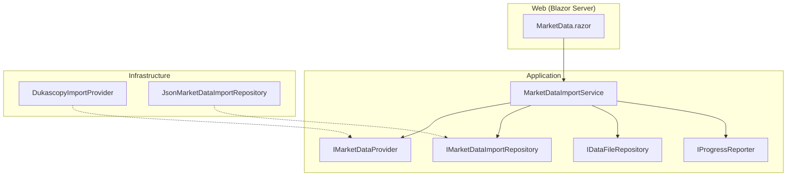
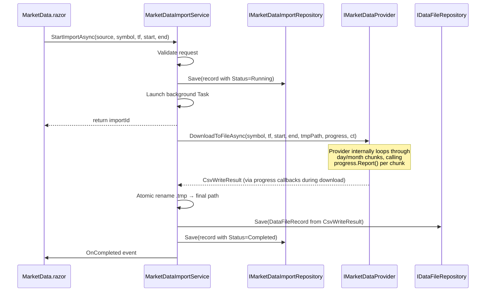

# Design Document — Market Data Acquisition Workflow

## Overview

This design adds a Market Data Acquisition workflow that lets users download historical candles from external providers (starting with Dukascopy), normalize them into the engine's canonical CSV format, and register them as validated Data Files. The workflow runs as a background job with progress and cancellation, producing approved CSV artifacts that flow into the existing Data Files inventory and Strategy Builder.

All new concepts live in Application (domain records, interfaces, orchestration service), Infrastructure (Dukascopy adapter, JSON persistence, CSV writing), and Web (Market Data screen). Core is untouched.

---

## Architecture

### Layer Ownership

```
Application/MarketData/   — IMarketDataProvider, MarketDataImportRecord,
                            MarketDataImportStatus, MarketSymbolInfo,
                            IMarketDataImportRepository, MarketDataImportService
Infrastructure/MarketData/ — DukascopyImportProvider, JsonMarketDataImportRepository
Web/Components/Pages/      — MarketData.razor (new screen)
Web/Components/Layout/     — NavMenu.razor (amended)
```

### Dependency Rule (preserved)

```
Core ← Application ← Infrastructure ← { Cli, Api, Web }
```

No Core changes. The existing `DukascopyDataProvider` in Infrastructure/DataProviders remains untouched — the new import provider is a separate class that reuses the same download/decompress/aggregate logic via shared static helpers.

### Component Diagram



---

## Components and Interfaces

### Application Layer — New Records

```csharp
namespace TradingResearchEngine.Application.MarketData;

/// <summary>Status of a market data import job.</summary>
public enum MarketDataImportStatus
{
    Running,
    Completed,
    Failed,
    Cancelled
}

/// <summary>Persistent record of a market data import job.</summary>
public sealed record MarketDataImportRecord(
    string ImportId,
    string Source,
    string Symbol,
    string Timeframe,
    DateTimeOffset RequestedStart,
    DateTimeOffset RequestedEnd,
    MarketDataImportStatus Status,
    string? OutputFilePath = null,
    string? OutputFileId = null,
    int? DownloadedChunkCount = null,
    int? TotalChunkCount = null,
    string? ErrorDetail = null,
    string CandleBasis = "Bid",
    DateTimeOffset CreatedAt = default,
    DateTimeOffset? CompletedAt = null) : IHasId
{
    public string Id => ImportId;
}

/// <summary>Describes a symbol supported by a market data provider.</summary>
public sealed record MarketSymbolInfo(
    string Symbol,
    string DisplayName,
    string[] SupportedTimeframes);

/// <summary>Result of writing a canonical CSV file.</summary>
public sealed record CsvWriteResult(
    string FilePath,
    string Symbol,
    string Timeframe,
    DateTimeOffset FirstBar,
    DateTimeOffset LastBar,
    int BarCount);
```

### Application Layer — Interfaces

```csharp
namespace TradingResearchEngine.Application.MarketData;

/// <summary>
/// Provider-agnostic interface for downloading market data from an external source.
/// Implementations live in Infrastructure.
/// </summary>
public interface IMarketDataProvider
{
    /// <summary>Human-readable source name (e.g. "Dukascopy").</summary>
    string SourceName { get; }

    /// <summary>Returns the list of symbols this provider supports.</summary>
    Task<IReadOnlyList<MarketSymbolInfo>> GetSupportedSymbolsAsync(
        CancellationToken ct = default);

    /// <summary>
    /// Downloads data for the given parameters and writes a canonical CSV to outputPath.
    /// RequestedStart is inclusive, RequestedEnd is exclusive.
    /// </summary>
    Task<CsvWriteResult> DownloadToFileAsync(
        string symbol,
        string timeframe,
        DateTimeOffset requestedStart,
        DateTimeOffset requestedEnd,
        string outputPath,
        IProgressReporter? progress = null,
        CancellationToken ct = default);
}

/// <summary>Persistence for market data import records.</summary>
public interface IMarketDataImportRepository
{
    Task<MarketDataImportRecord?> GetAsync(string importId, CancellationToken ct = default);
    Task<IReadOnlyList<MarketDataImportRecord>> ListAsync(CancellationToken ct = default);
    Task SaveAsync(MarketDataImportRecord record, CancellationToken ct = default);
    Task DeleteAsync(string importId, CancellationToken ct = default);
}
```

### Application Layer — MarketDataImportService

```csharp
namespace TradingResearchEngine.Application.MarketData;

/// <summary>
/// Orchestrates the full import lifecycle: validate → download → normalize → register → validate.
/// Singleton. Only one import may run at a time.
/// </summary>
public sealed class MarketDataImportService : IDisposable
{
    public event Action<ImportProgressUpdate>? OnProgress;
    public event Action<ImportCompletionUpdate>? OnCompleted;

    /// <summary>
    /// Validates the request, creates a Running import record, launches the background
    /// download, and returns the import ID immediately.
    /// Throws InvalidOperationException if an import is already running.
    /// </summary>
    public Task<string> StartImportAsync(
        string source, string symbol, string timeframe,
        DateTimeOffset requestedStart, DateTimeOffset requestedEnd,
        CancellationToken ct = default);

    /// <summary>Cancels the running import.</summary>
    public void CancelImport(string importId);

    /// <summary>Returns the currently running import, if any.</summary>
    public ActiveImport? GetActiveImport();

    /// <summary>
    /// Called on startup to reset orphaned Running records to Failed
    /// and clean up temp files.
    /// </summary>
    public Task RecoverOnStartupAsync(CancellationToken ct = default);
}

public sealed record ImportProgressUpdate(
    string ImportId, int Current, int Total, string Label);

public sealed record ImportCompletionUpdate(
    string ImportId, MarketDataImportStatus Status, string? ErrorMessage);

public sealed record ActiveImport(
    string ImportId, string Source, string Symbol, string Timeframe,
    int Current, int Total, DateTimeOffset StartedAt);
```

### Import Lifecycle Flow



---

### Infrastructure Layer — DukascopyImportProvider

The new `DukascopyImportProvider` implements `IMarketDataProvider`. It reuses the core download logic from the existing `DukascopyDataProvider`:

- Same `PointSizes` dictionary for symbol → point size mapping
- Same `FetchDayAsync` for downloading and decompressing `.bi5` files
- Same `ParseCandles` for binary → BarRecord conversion
- Same `Aggregate` for minute → target timeframe aggregation

The key differences from the existing provider:
- Writes output directly to a file path instead of yielding `IAsyncEnumerable<BarRecord>`
- Reports progress via `IProgressReporter` (chunk-based)
- Retries transient HTTP failures (3 retries, exponential backoff)
- Returns `CsvWriteResult` with metadata derived from the written stream

```csharp
namespace TradingResearchEngine.Infrastructure.MarketData;

public sealed class DukascopyImportProvider : IMarketDataProvider
{
    public string SourceName => "Dukascopy";

    // Supported symbols with display names
    private static readonly MarketSymbolInfo[] Symbols = new[]
    {
        new MarketSymbolInfo("EURUSD", "Euro / US Dollar", AllTimeframes),
        new MarketSymbolInfo("GBPUSD", "British Pound / US Dollar", AllTimeframes),
        // ... all 15 symbols from PointSizes
    };

    private static readonly string[] AllTimeframes =
        { "1m", "5m", "15m", "30m", "1H", "4H", "Daily" };
}
```

### Infrastructure Layer — JsonMarketDataImportRepository

Standard JSON file persistence following the existing `JsonFileRepository<T>` pattern. Files stored in `imports/{importId}.json`.

---

## Data Models

### Output File Naming

Format: `{source}_{symbol}_{timeframe}_{startYYYYMMDD}_{endYYYYMMDD}.csv`

Examples:
- `dukascopy_EURUSD_1H_20200101_20250101.csv`
- `dukascopy_XAUUSD_Daily_20150101_20241231.csv`

Files are written to the managed data directory (`DataFileService.DataDirectory`).

### Duplicate Import Handling

When `StartImportAsync` detects an existing Completed import with matching (source, symbol, timeframe, range):
1. The service proceeds with the download (user was warned in UI)
2. The new CSV is written to a temporary file first, then atomically moved to the final path on success
3. The existing `DataFileRecord` is found by matching `OutputFileId` from the previous import record, then updated with new metadata (bar count, timestamps)
4. The old import record remains in history; the new one is added

### File Write Safety

All CSV writes use a temp-file-then-rename pattern:
1. Write to `{outputPath}.tmp` during download/normalization
2. On success, delete the existing file (if any) and rename `.tmp` to the final path
3. On failure or cancellation, delete the `.tmp` file

This prevents corrupting an existing file if a running backtest or preview has it open.

---

## Web UI

### Market Data Screen (`/market-data`)

```
┌──────────────────────────────────────────────────────────────┐
│ Market Data                                                  │
├──────────────────────────────────────────────────────────────┤
│ Source: [Dukascopy ▼]                                       │
│ Symbol: [EURUSD — Euro/US Dollar ▼]                         │
│ Timeframe: [1H ▼]                                           │
│ Start: [2020-01-01]  End: [2025-01-01]                      │
│ Quick: [1Y] [3Y] [5Y] [10Y]                                │
│                                                              │
│ ⚠ A completed import for this configuration already exists. │
│   Proceeding will overwrite the existing file.               │
│                                                              │
│                                   [Start Download]           │
├──────────────────────────────────────────────────────────────┤

The import form is disabled while a job is running (all inputs and the Start Download button are greyed out). Only the history list, Cancel button, and page navigation remain active.
│ Recent Imports                                               │
│ ┌──────────────────────────────────────────────────────────┐ │
│ │ ✅ EURUSD 1H 2020-2025 · Dukascopy · Bid                │ │
│ │    43,800 bars · dukascopy_EURUSD_1H_20200101_20250101  │ │
│ │    [View in Data Files] [Re-import]                      │ │
│ └──────────────────────────────────────────────────────────┘ │
│ ┌──────────────────────────────────────────────────────────┐ │
│ │ 🔄 GBPUSD 15m 2022-2024 · Dukascopy · 37%               │ │
│ │    Downloading day 142 of 380                            │ │
│ │    [━━━━━━━━░░░░░░░░░░░░] [Cancel]                       │ │
│ └──────────────────────────────────────────────────────────┘ │
└──────────────────────────────────────────────────────────────┘
```

### Navigation Amendment

```razor
<MudText Typo="Typo.overline" Class="px-4 pt-3 pb-1 text-faint">SETTINGS</MudText>
<MudNavLink Href="/market-data"
            Icon="@Icons.Material.Filled.CloudDownload">Market Data</MudNavLink>
<MudNavLink Href="/data"
            Icon="@Icons.Material.Filled.Storage">Data Files</MudNavLink>
<MudNavLink Href="/settings"
            Icon="@Icons.Material.Filled.Settings">Settings</MudNavLink>
```

### Data Files Integration

Add an [Import from Market Source] button at the top of the Data Files page:
```razor
<MudButton Variant="Variant.Outlined" Size="MudBlazor.Size.Small"
           StartIcon="@Icons.Material.Filled.CloudDownload"
           Href="/market-data">Import from Market Source</MudButton>
```

### Strategy Builder Step 2 Integration

Add a helper link below the file selector or when the list is empty:
```razor
<MudText Typo="Typo.caption" Class="text-muted mt-2">
    Can't find your data?
    <MudLink Href="/market-data">Import market data →</MudLink>
</MudText>
```

---

## Error Handling

| Scenario | UI Behaviour | Persistence |
|---|---|---|
| Invalid request (bad range, unsupported symbol) | Inline validation errors, download blocked | Not stored |
| Import already running | Inline error: "An import is already in progress" | Not stored |
| Network failure during download | ❌ Failed badge, error detail | `Status = Failed`, `ErrorDetail` set |
| Normalization failure | ❌ Failed badge, error detail | `Status = Failed`, `ErrorDetail` set |
| Validation failure after download | ✅ Completed badge, file linked as Invalid | `Status = Completed`, `DataFileRecord` with `ValidationStatus = Invalid`. Import "Completed" means the download and normalization succeeded; the linked `DataFileRecord.ValidationStatus` indicates whether the file is research-ready. |
| User cancellation | ⚠️ Cancelled badge | `Status = Cancelled`, partial/temp files deleted |
| App restart during import | ❌ Failed badge on next startup | `Status = Failed`, `ErrorDetail = "Interrupted by application restart"` |
| Duplicate import | Warning shown, user may proceed | New import record, existing DataFileRecord updated |

---

## Testing Strategy

### Unit Tests (UnitTests project)

| Test | Validates | Requirements |
|---|---|---|
| `MarketDataImportRecord_RoundTrip_Json` | JSON serialization | 6.1 |
| `ImportRequest_InvalidRange_FailsValidation` | Start >= End rejected | 1.7, 7.2 |
| `ImportRequest_UnsupportedSymbol_FailsValidation` | Unknown symbol rejected | 1.7, 7.2 |
| `ImportService_AlreadyRunning_ThrowsInvalidOperation` | Concurrency guard | 2.11 |
| `ImportService_StartImport_CreatesRunningRecord` | Lifecycle start | 2.1 |
| `ImportService_DownloadSuccess_CreatesDataFileRecord` | Lifecycle completion | 2.6, 2.7 |
| `ImportService_DownloadFailure_SetsFailedStatus` | Failure handling | 2.9 |
| `ImportService_Cancel_SetsCancelledStatus` | Cancellation | 2.4 |
| `ImportService_StartupRecovery_ResetsRunningToFailed` | Restart recovery | 7.7 |
| `CsvWriteResult_MetadataFromStream` | Metadata accuracy | 8.4 |

### Integration Tests (IntegrationTests project)

| Test | Validates | Requirements |
|---|---|---|
| `JsonMarketDataImportRepository_CRUD` | Persistence | 6.4 |
| `MockProvider_FullImport_CreatesValidDataFile` | End-to-end lifecycle | 2.5, 2.6, 2.7, 8.1 |
| `MockProvider_FailedImport_PersistsFailureRecord` | Failure persistence | 2.9 |

---

## Folder Structure Changes

```
src/TradingResearchEngine.Application/
  MarketData/                              # NEW folder
    MarketDataImportRecord.cs              # NEW
    MarketDataImportStatus.cs              # NEW
    MarketSymbolInfo.cs                    # NEW
    CsvWriteResult.cs                      # NEW
    IMarketDataProvider.cs                 # NEW
    IMarketDataImportRepository.cs         # NEW
    MarketDataImportService.cs             # NEW

src/TradingResearchEngine.Infrastructure/
  MarketData/                              # NEW folder
    DukascopyImportProvider.cs             # NEW
    JsonMarketDataImportRepository.cs      # NEW

src/TradingResearchEngine.Web/
  Components/Pages/
    MarketData.razor                       # NEW
  Components/Layout/
    NavMenu.razor                          # AMENDED (new nav link)
  Components/Pages/Strategies/
    StrategyBuilder.razor                  # AMENDED (helper link)

src/TradingResearchEngine.UnitTests/
  MarketData/                              # NEW folder
    MarketDataImportRecordTests.cs         # NEW
    MarketDataImportServiceTests.cs        # NEW

src/TradingResearchEngine.IntegrationTests/
  MarketData/                              # NEW folder
    JsonMarketDataImportRepositoryTests.cs # NEW
    MarketDataImportFlowTests.cs           # NEW
```
