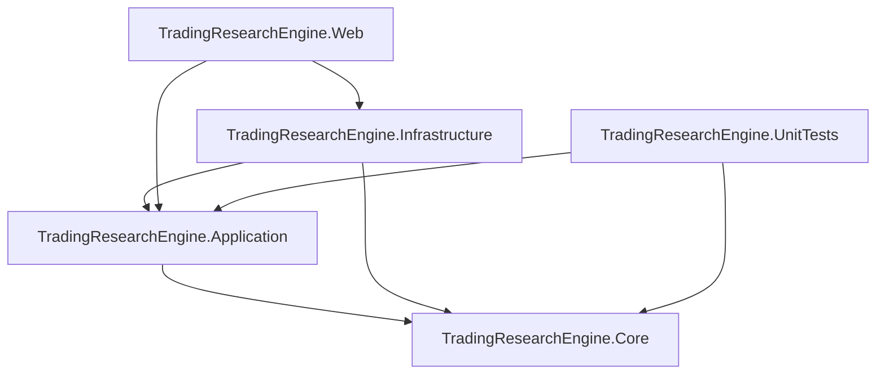

# Design Document: PR Gate Implementation Plan

## Overview

This design covers the technical implementation of 35 requirements across 8 sequential PR gates for the TradingResearchEngine. Each gate is a coherent, reviewable unit that must build cleanly, pass all tests, and align documentation before the next gate begins.

The implementation follows the existing clean architecture (Core ← Application ← Infrastructure ← Web) and leverages .NET 8 / C# 12 patterns already established in the codebase: `IOptions<T>` binding, `IAsyncEnumerable<T>` data providers, `CancellationToken` propagation, and FsCheck.Xunit property-based testing.

**PR Gate Sequence:**

| Gate | Focus | Requirements |
|------|-------|-------------|
| 1 | Walk-Forward Correctness | 1, 2 |
| 2 | Indicator Fixes & Validation | 3, 4, 5, 6, 7 |
| 3 | Performance & Concurrency | 8, 9, 10, 11, 12, 13 |
| 4 | Configuration & Construction | 14, 15, 16 |
| 5 | Persistence & Resilience | 17, 18, 19, 20 |
| 6 | Repository Cleanup | 21, 22, 23 |
| 7 | Research Analytics Expansion | 24, 25, 26, 27, 28 |
| 8 | Engine Capability Expansion | 29, 30, 31, 32, 33, 34, 35 |

## Architecture

The implementation respects the existing dependency rule and introduces no new project references:



**Key architectural decisions:**

1. **Concurrency control** — A shared `ConcurrencyBudget` (Application layer) wraps `SemaphoreSlim` and is injected into all parallelizable workflows. Nested workflows acquire permits from the same budget, preventing oversubscription.

2. **Deterministic parallelism** — Seeded workflows pre-generate per-iteration seeds sequentially from the master RNG, then dispatch iterations in parallel. This ensures identical RNG paths regardless of scheduling order.

3. **Configuration canonicalization** — A `ScenarioConfigNormalizer` (Application layer) transforms any legacy or modern config into the canonical V5+ sub-object shape. All downstream code consumes only the canonical form.

4. **Portfolio optimization** — `Portfolio` maintains cached `IReadOnlyList<Position>` snapshots and an `int _openPositionCount` field, updated incrementally on state changes. No behavioral change; existing property tests validate correctness.

5. **Walk-forward grid optimization** — `WalkForwardWorkflow` gains an inner `GridOptimizer` that evaluates all parameter combinations per in-sample window, ranking by the configured `OptimizationObjective`.

## Components and Interfaces

### PR Gate 1: Walk-Forward Correctness

#### New Types (Application Layer)

```csharp
// Application/Research/OptimizationObjective.cs
public enum OptimizationObjective { Sharpe, CAGR, MAR }

// Application/Research/GridOptimizer.cs
public sealed class GridOptimizer
{
    public GridOptimizationResult Optimize(
        IReadOnlyList<BacktestResult> candidates,
        OptimizationObjective objective);
}

public sealed record GridOptimizationResult(
    Dictionary<string, object> BestParameters,
    decimal ObjectiveValue,
    IReadOnlyList<ExcludedCandidate> Excluded);

public sealed record ExcludedCandidate(
    Dictionary<string, object> Parameters,
    string Reason);

// Application/Research/WalkForwardOptions.cs (extended)
public sealed class WalkForwardOptions
{
    public int InSampleBars { get; set; } = 252;
    public int OutOfSampleBars { get; set; } = 63;
    public int StepBars { get; set; } = 63;
    public ParameterGrid? Grid { get; set; }
    public OptimizationObjective Objective { get; set; } = OptimizationObjective.Sharpe;
}

// Application/Research/ParameterGrid.cs
public sealed record ParameterGrid(
    IReadOnlyList<ParameterRange> Ranges);

public sealed record ParameterRange(
    string Name, decimal Start, decimal End, decimal Step);

// Application/Research/Results/WalkForwardWindow.cs (extended)
public sealed record WalkForwardWindow(
    // ... existing fields ...
    Dictionary<string, object>? SelectedParameters,
    decimal? OptimizationMetricValue,
    OptimizationObjective UsedObjective);

```

#### Modified Types

- `WalkForwardWorkflow.RunAsync` — Accepts `ParameterGrid` and `OptimizationObjective` via options. When grid is provided, runs all combinations per IS window and selects the best via `GridOptimizer`.
- `PreflightValidator` — Extended with walk-forward pre-run validation: checks data range accommodates at least one complete window pair, reports expected window count, warns if fewer than 2 windows.

#### Validation Logic

```csharp
// PreflightValidator addition
public WalkForwardValidation ValidateWalkForward(
    ScenarioConfig config, WalkForwardOptions options, int availableBars)
{
    int minRequired = options.InSampleBars + options.OutOfSampleBars;
    if (availableBars < minRequired)
        return WalkForwardValidation.Fail(
            $"Data range ({availableBars} bars) insufficient. Minimum required: {minRequired} bars.");

    int windowCount = WalkForwardWorkflow.PrecomputeWindows(
        availableBars, options.InSampleBars, options.OutOfSampleBars, options.StepBars).Count;

    if (windowCount < 2)
        return WalkForwardValidation.Warn(windowCount,
            "Fewer than 2 windows limits statistical significance.");

    return WalkForwardValidation.Ok(windowCount);
}
```

### PR Gate 2: Validation & Indicator Fixes

#### Final Validation Confirmation (Requirement 3)

Extends `FinalValidationUseCase` with a confirmation gate:

```csharp
// Application/Engine/FinalValidationUseCase.cs (modified)
public async Task<FinalValidationResult> ExecuteAsync(
    string strategyVersionId,
    bool userConfirmed,
    CancellationToken ct)
{
    if (!userConfirmed)
        return FinalValidationResult.Cancelled("User declined confirmation.");

    var guard = await _testSetGuard.IsConsumedAsync(strategyVersionId, ct);
    if (guard)
        return FinalValidationResult.AlreadyConsumed(
            "Test set already consumed for this strategy version.");

    // Proceed with validation...
}
```

#### Research Checklist Integration (Requirement 4)

`ResearchChecklistService` gains methods to:
- Return incomplete items with navigation paths
- Provide low-confidence explanations
- Integrate with `FinalValidationUseCase` to surface warnings

#### Indicator Catalog Completeness (Requirement 5)

`SkenderIndicatorCatalog.BuildCatalog()` is audited. Any entry whose factory returns null is removed. A startup validation step iterates all entries and logs warnings for any that fail instantiation.

#### LongOnlyGuard Cleanup (Requirement 6)

- Remove XML docs referencing LongOnlyGuard as active runtime behavior
- Mark `LongOnlyGuard` class with `[Obsolete("V6+ supports bidirectional execution. See Direction enum.")]`
- Update test assertions to reflect bidirectional support

#### Beginner-Mode Defaults (Requirement 7)

`StrategyTemplate` gains a `DefaultRealismProfile` property defaulting to `ExecutionRealismProfile.StandardBacktest`. The strategy builder wizard uses this when in beginner mode.

### PR Gate 3: Performance & Concurrency

#### ConcurrencyBudget (Application Layer)

```csharp
// Application/Research/ConcurrencyBudget.cs
public sealed class ConcurrencyBudget : IDisposable
{
    private readonly SemaphoreSlim _semaphore;

    public ConcurrencyBudget(int maxConcurrency)
        => _semaphore = new SemaphoreSlim(maxConcurrency, maxConcurrency);

    public int Available => _semaphore.CurrentCount;

    public async Task<IDisposable> AcquireAsync(CancellationToken ct)
    {
        await _semaphore.WaitAsync(ct);
        return new Releaser(_semaphore);
    }

    private sealed class Releaser(SemaphoreSlim sem) : IDisposable
    {
        public void Dispose() => sem.Release();
    }

    public void Dispose() => _semaphore.Dispose();
}
```

Registered as a singleton in DI, configured via `IOptions<ConcurrencyOptions>`:

```csharp
public sealed class ConcurrencyOptions
{
    public int MaxGlobalConcurrency { get; set; } = Environment.ProcessorCount;
}
```

#### Portfolio Hot-Path Optimization (Requirement 8)

```csharp
// Core/Portfolio/Portfolio.cs modifications
public sealed class Portfolio
{
    // Cached snapshots — rebuilt only on state change
    private IReadOnlyList<Position>? _cachedPositions;
    private IReadOnlyList<Position>? _cachedShortPositions;
    private int _openPositionCount;
    private bool _snapshotDirty = true;

    public IReadOnlyList<Position> Positions
    {
        get
        {
            if (_snapshotDirty) RebuildSnapshots();
            return _cachedPositions!;
        }
    }

    public int OpenPositionCount => _openPositionCount; // O(1)

    private void InvalidateSnapshots() => _snapshotDirty = true;

    // Called from Update(FillEvent) after any position change
    private void RebuildSnapshots()
    {
        _cachedPositions = _positions.Values.Select(p => p.ToPosition()).ToList();
        _cachedShortPositions = _shortPositions.Values.Select(p => p.ToPosition()).ToList();
        _openPositionCount = _positions.Count + _shortPositions.Count;
        _snapshotDirty = false;
    }
}
```

#### Deterministic Parallel Workflows (Requirements 9–12)

All parallelizable workflows follow the same pattern:

```csharp
// Pattern: Pre-generate seeds, then dispatch in parallel
public async Task<TResult> RunParallelAsync(
    int iterationCount, int? masterSeed, ConcurrencyBudget budget, CancellationToken ct)
{
    // 1. Pre-generate per-iteration seeds sequentially (deterministic)
    var rng = masterSeed.HasValue ? new Random(masterSeed.Value) : new Random();
    var seeds = Enumerable.Range(0, iterationCount)
        .Select(_ => rng.Next())
        .ToArray();

    // 2. Dispatch iterations in parallel with bounded concurrency
    var results = new BacktestResult?[iterationCount];
    await Parallel.ForEachAsync(
        Enumerable.Range(0, iterationCount),
        new ParallelOptions
        {
            MaxDegreeOfParallelism = budget.Available,
            CancellationToken = ct
        },
        async (i, token) =>
        {
            using var permit = await budget.AcquireAsync(token);
            results[i] = await RunSingleIterationAsync(seeds[i], token);
        });

    // 3. Aggregate results (order-independent)
    return Aggregate(results.Where(r => r is not null).ToList()!);
}
```

**Monte Carlo parallelization** — The simulation loop is split into chunks. Each chunk gets a pre-seeded `Random` instance. Results are collected into a pre-allocated array indexed by simulation number, ensuring deterministic output regardless of completion order.

**CPCV parallelization** — Fold evaluations are dispatched via `Parallel.ForEachAsync`. Each fold creates its own engine instance (no shared mutable state). Results are collected into an indexed array and aggregated after all folds complete.

**Parameter Perturbation parallelization** — Same pattern as Monte Carlo: pre-generate jitter seeds sequentially, dispatch runs in parallel, collect into indexed array.

#### Progress Estimation (Requirement 13)

```csharp
// Core/DataHandling/IDataProvider.cs (extended)
public interface IDataProvider
{
    // Existing methods...
    
    /// <summary>
    /// Returns an estimated bar count for progress reporting, or null if unknown.
    /// Must be lightweight — no full data preloading.
    /// </summary>
    ValueTask<int?> EstimateBarCountAsync(CancellationToken ct);
}
```

`DataHandler` uses the provider estimate when available, falling back to `BarsPerYear * estimatedYears` from the date range. Progress updates refine the estimate as actual bars are consumed.

### PR Gate 4: Configuration & Construction

#### ScenarioConfig Canonicalization (Requirement 14)

```csharp
// Application/Configuration/ScenarioConfigNormalizer.cs
public static class ScenarioConfigNormalizer
{
    /// <summary>
    /// Transforms any config (legacy flat or modern sub-object) into canonical V5+ shape.
    /// Does NOT modify the source file on disk.
    /// </summary>
    public static ScenarioConfig Normalize(ScenarioConfig raw)
    {
        // If already canonical (sub-objects present), return as-is
        if (raw.Data is not null && raw.Strategy is not null)
            return raw;

        // Transform legacy flat fields into sub-objects
        return raw with
        {
            Data = raw.Data ?? new DataConfig(
                raw.DataProviderType, raw.DataProviderOptions, raw.Timeframe, raw.BarsPerYear),
            Strategy = raw.Strategy ?? new StrategyConfig(
                raw.StrategyType, raw.StrategyParameters),
            Risk = raw.Risk ?? new RiskConfig(
                raw.RiskParameters, raw.InitialCash, raw.AnnualRiskFreeRate),
            Execution = raw.Execution ?? new ExecutionConfig(
                raw.SlippageModelType, raw.CommissionModelType, raw.FillMode,
                raw.RealismProfile, raw.ExecutionOptions, raw.SessionOptions),
            Research = raw.Research ?? new ResearchConfig(
                raw.ResearchWorkflowType, raw.ResearchWorkflowOptions,
                raw.RandomSeed, raw.TraceOptions)
        };
    }
}
```

All config loading paths call `Normalize()` before validation. Explicit save operations persist the canonical shape.

#### Unified Strategy Construction (Requirement 15)

`StrategyRegistry` is already the single entry point. This gate:
- Removes any remaining `Activator.CreateInstance` calls that bypass the registry
- Adds startup verification: `StrategyRegistry.VerifyAll()` attempts instantiation of every registered strategy with default parameters
- Ensures `ReflectionStrategyFactory` delegates to `StrategyRegistry.Resolve`

#### Typed Provider Configuration (Requirement 16)

```csharp
// Application/Configuration/DataProviderOptions.cs
public sealed class CsvDataProviderOptions
{
    public string FilePath { get; set; } = "";
    public string DateFormat { get; set; } = "yyyy-MM-dd";
    public bool HasHeader { get; set; } = true;
}

public sealed class HttpDataProviderOptions
{
    public string BaseUrl { get; set; } = "";
    public string ApiKey { get; set; } = "";
    public TimeSpan Timeout { get; set; } = TimeSpan.FromSeconds(30);
}

public sealed class DukascopyDataProviderOptions
{
    public string CacheDirectory { get; set; } = "data/cache";
    public TimeSpan CacheTtl { get; set; } = TimeSpan.FromHours(24);
}
```

Bound via `IOptions<T>` in `ServiceCollectionExtensions`. Existing JSON configs continue to work via a compatibility adapter that maps `DataProviderOptions` dictionary keys to typed properties.

### PR Gate 5: Persistence & Resilience

#### AI Call Timeout (Requirement 17)

```csharp
// Application/Configuration/GeminiOptions.cs (extended)
public sealed class GeminiOptions
{
    // Existing fields...
    public TimeSpan CallTimeout { get; set; } = TimeSpan.FromSeconds(60);
}

// Infrastructure/AI/GeminiClient.cs (modified)
public async Task<string> GenerateJsonAsync(
    string systemPrompt, string userMessage, CancellationToken ct)
{
    using var timeoutCts = new CancellationTokenSource(_options.CallTimeout);
    using var linkedCts = CancellationTokenSource.CreateLinkedTokenSource(ct, timeoutCts.Token);

    try
    {
        // Existing call with linkedCts.Token...
    }
    catch (OperationCanceledException) when (timeoutCts.IsCancellationRequested)
    {
        throw new TimeoutException(
            $"AI call exceeded configured timeout of {_options.CallTimeout.TotalSeconds}s.");
    }
}
```

#### Job Retry and Failure Handling (Requirement 18)

```csharp
// Application/Research/RetryPolicy.cs
public sealed class RetryPolicy
{
    public int MaxRetries { get; set; } = 3;
    public TimeSpan InitialBackoff { get; set; } = TimeSpan.FromSeconds(2);
    public double BackoffMultiplier { get; set; } = 2.0;

    public bool IsTransient(Exception ex) => ex is
        HttpRequestException or TimeoutException or IOException;
}

// Application/Research/JobStatus.cs (extended)
public enum JobStatus
{
    Queued, Running, Completed, Failed,
    Retrying  // New: indicates transient failure with pending retry
}
```

`JobWorkerService.ProcessJobAsync` wraps dispatch in a retry loop:
- Transient failures → retry with exponential backoff up to `MaxRetries`
- Terminal failures → immediate transition to `Failed` state
- Each retry attempt logged with structured diagnostics
- Final failure includes sanitized user-visible message

#### SQLite/JSON Reconciliation (Requirement 19)

```csharp
// Infrastructure/Persistence/ConsistencyReconciler.cs
public sealed class ConsistencyReconciler
{
    public async Task ReconcileAsync<T>(
        ISqliteIndex<T> index,
        IRepository<T> jsonStore,
        ILogger logger,
        CancellationToken ct) where T : IHasId
    {
        var jsonIds = await jsonStore.ListIdsAsync(ct);
        var indexIds = await index.ListIdsAsync(ct);

        // JSON is source of truth: add missing entries to index
        var missingInIndex = jsonIds.Except(indexIds);
        foreach (var id in missingInIndex)
        {
            var entity = await jsonStore.GetByIdAsync(id, ct);
            if (entity is not null)
            {
                await index.UpsertAsync(entity, ct);
                logger.LogWarning("Reconciled: added {Id} to SQLite index from JSON store", id);
            }
        }

        // Remove orphaned index entries not in JSON
        var orphanedInIndex = indexIds.Except(jsonIds);
        foreach (var id in orphanedInIndex)
        {
            await index.RemoveAsync(id, ct);
            logger.LogWarning("Reconciled: removed orphaned {Id} from SQLite index", id);
        }
    }
}
```

Invoked at startup via `IHostedService` before the application accepts requests.

#### Configurable Paper-Trading Polling (Requirement 20)

```csharp
// Application/Configuration/PaperTradingOptions.cs
public sealed class PaperTradingOptions
{
    public TimeSpan PollingInterval { get; set; } = TimeSpan.FromSeconds(5);
    public TimeSpan MinInterval { get; set; } = TimeSpan.FromMilliseconds(500);
    public TimeSpan MaxInterval { get; set; } = TimeSpan.FromMinutes(5);
}
```

`SimulatedPaperTradingSession` uses `IOptionsMonitor<PaperTradingOptions>` for hot-reload support. Validates interval bounds on change.

### PR Gate 6: Repository Cleanup

This gate is primarily file operations:
- Audit `Prompts/` directory; retain only files referenced by `PromptLoader` in production code
- Remove obsolete samples, docs, and references from prior architecture transitions
- Update README, CHANGELOG, and docs to reflect current architecture
- Remove stale XML doc comments
- Mark completed tasks in `.kiro/specs/*/tasks.md`

No new types or interfaces. Verified by build + test pass.

### PR Gate 7: Research Analytics Expansion

#### Expanded Monte Carlo Modes (Requirement 24)

```csharp
// Application/Research/MonteCarloSimulationMode.cs
public enum MonteCarloSimulationMode
{
    TradeResample,      // Existing: IID bootstrap of trade returns
    BlockBootstrap,     // Existing: block-correlated bootstrap
    ReturnSeries        // New: resample daily return series directly
}
```

`MonteCarloOptions` gains a `SimulationMode` property. The `RunSimulation` method dispatches to mode-specific logic. `ReturnSeries` mode resamples the equity curve's period returns rather than trade-level returns, providing a different statistical perspective on path variability.

#### Enriched Walk-Forward Analytics (Requirement 25)

```csharp
// Application/Research/Results/WalkForwardAnalytics.cs
public sealed record WalkForwardAnalytics(
    decimal OosProfitabilityRate,
    IReadOnlyList<EquityCurvePoint> ConcatenatedOosEquityCurve,
    decimal ParameterDriftScore,
    IReadOnlyList<ParameterWindowSnapshot> ParameterHistory);

public sealed record ParameterWindowSnapshot(
    int WindowIndex,
    Dictionary<string, object> Parameters,
    decimal ObjectiveValue);
```

`WalkForwardResult` gains a `WalkForwardAnalytics` property with OOS profitability rate, concatenated equity curve, and parameter drift score. The analytics are computed after all walk-forward windows complete: OOS profitability rate is the fraction of profitable OOS windows, the concatenated equity curve stitches individual OOS curves chronologically, and parameter drift score quantifies how much the selected parameters change across windows.

#### Trade Anatomy Analytics (Requirement 26)

```csharp
// Core/Portfolio/TradeAnatomy.cs
public sealed record TradeAnatomy(
    decimal? MaxAdverseExcursion,
    decimal? MaxFavorableExcursion,
    TimeSpan Duration);

// Core/Portfolio/ClosedTrade.cs (extended)
public sealed record ClosedTrade(
    // ... existing fields ...
    TradeAnatomy? Anatomy);
```

MAE/MFE computation requires intra-trade price data. When `TraceOptions.EnableEventTrace` is active, the engine records per-bar high/low during open positions. `MetricsCalculator` computes MAE/MFE from the trace. When trace data is unavailable, `Anatomy` is null.

#### Correlation-Aware Portfolio Constraints (Requirement 27)

```csharp
// Core/Configuration/PortfolioRiskConfig.cs (extended)
public sealed record PortfolioRiskConfig(
    // ... existing fields ...
    decimal? MaxPairwiseCorrelation,
    int CorrelationLookbackBars);

// Application/Risk/CorrelationConstraintEnforcer.cs
public sealed class CorrelationConstraintEnforcer
{
    public ConstraintResult Evaluate(
        string candidateSymbol,
        IReadOnlyList<Position> existingPositions,
        ICorrelationMatrix correlationMatrix,
        decimal maxCorrelation)
    {
        foreach (var position in existingPositions)
        {
            var corr = correlationMatrix.Get(candidateSymbol, position.Symbol);
            if (Math.Abs(corr) > maxCorrelation)
                return ConstraintResult.Rejected(
                    $"Correlation {corr:F3} between {candidateSymbol} and {position.Symbol} exceeds limit {maxCorrelation}");
        }
        return ConstraintResult.Allowed;
    }
}
```

Integrated into `DefaultRiskLayer` — when `PortfolioRiskConfig.MaxPairwiseCorrelation` is set, the risk layer evaluates correlation before approving orders.

#### Comparison Report Generation (Requirement 28)

```csharp
// Application/Export/ComparisonReportGenerator.cs
public sealed class ComparisonReportGenerator
{
    public ComparisonReportArtifact Generate(
        IReadOnlyList<BacktestResult> results,
        ComparisonReportOptions options);
}

public sealed record ComparisonReportArtifact(
    string MarkdownContent,
    string? HtmlContent,  // null unless HTML export enabled
    string OutputPath);

public sealed class ComparisonReportOptions
{
    public string OutputDirectory { get; set; } = "reports";
    public bool IncludeHtml { get; set; } = false;
    public IReadOnlyList<string> MetricNames { get; set; } = new[]
    {
        "Sharpe", "CAGR", "MaxDrawdown", "WinRate", "TradeCount", "K-Ratio"
    };
}
```

### PR Gate 8: Engine Capability Expansion

#### AI Refinement with Backtest Context (Requirement 29)

`GeminiStrategyAssistant.RefineStrategyAsync` gains an optional `BacktestResult` parameter. When provided, it extracts key metrics (Sharpe, max drawdown, win rate, trade count, K-Ratio) and appends a concise summary to the refinement prompt.

#### Large Sweep Result Usability (Requirement 30)

`PagedResult<T>` (already exists in Application/Research) is used for sweep results. The Web layer implements virtualized rendering via Blazor's `Virtualize` component.

#### Multi-Timeframe Strategy Support (Requirement 32)

```csharp
// Core/Configuration/ScenarioConfig.cs (extended)
public sealed record ScenarioConfig(
    // ... existing fields ...
    IReadOnlyList<SecondaryTimeframeConfig>? SecondaryTimeframes = null);

public sealed record SecondaryTimeframeConfig(
    string Timeframe,
    string DataProviderType,
    Dictionary<string, object> DataProviderOptions);

// Core/Strategy/IMultiTimeframeStrategy.cs
public interface IMultiTimeframeStrategy : IStrategy
{
    void OnSecondaryBar(string timeframe, BarRecord bar);
}
```

The engine's heartbeat loop is extended to interleave secondary timeframe bars in chronological order. A `MultiTimeframeDataHandler` merges bars from all timeframes into a single chronologically-ordered stream.

#### Export Validation (Requirement 33)

```csharp
// Application/Export/ExportValidator.cs
public sealed class ExportValidator
{
    public ExportValidationResult Validate(string code, ExportFormat format);
}

public sealed record ExportValidationResult(
    bool IsValid,
    IReadOnlyList<ExportValidationError> Errors);

public sealed record ExportValidationError(
    int? Line, string Section, string Message);
```

Validates structural correctness: matching braces, required sections (Pine Script: `//@version`, `strategy()`; MQL: `OnInit`, `OnTick`), and basic syntax heuristics.

#### Expression Compiler Negative Testing (Requirement 34)

No new production types. This gate adds comprehensive negative test coverage for `ExpressionCompiler`:
- Missing operators between operands
- Unbalanced parentheses
- Invalid identifiers (starting with digits, special characters)
- Empty expressions
- Deeply nested expressions exceeding stack limits

All malformed inputs must produce a descriptive `ExpressionCompileError` rather than throwing unhandled exceptions.

## Data Models

### New Records and Value Types

```csharp
// Core layer
public enum OptimizationObjective { Sharpe, CAGR, MAR }

public sealed record TradeAnatomy(
    decimal? MaxAdverseExcursion,
    decimal? MaxFavorableExcursion,
    TimeSpan Duration);

public sealed record SecondaryTimeframeConfig(
    string Timeframe,
    string DataProviderType,
    Dictionary<string, object> DataProviderOptions);

// Application layer
public sealed record ParameterGrid(IReadOnlyList<ParameterRange> Ranges);
public sealed record ParameterRange(string Name, decimal Start, decimal End, decimal Step);

public sealed record GridOptimizationResult(
    Dictionary<string, object> BestParameters,
    decimal ObjectiveValue,
    IReadOnlyList<ExcludedCandidate> Excluded);

public sealed record ExcludedCandidate(
    Dictionary<string, object> Parameters, string Reason);

public sealed record WalkForwardAnalytics(
    decimal OosProfitabilityRate,
    IReadOnlyList<EquityCurvePoint> ConcatenatedOosEquityCurve,
    decimal ParameterDriftScore,
    IReadOnlyList<ParameterWindowSnapshot> ParameterHistory);

public sealed record ParameterWindowSnapshot(
    int WindowIndex,
    Dictionary<string, object> Parameters,
    decimal ObjectiveValue);

public sealed record ComparisonReportArtifact(
    string MarkdownContent, string? HtmlContent, string OutputPath);

public sealed record ExportValidationResult(
    bool IsValid, IReadOnlyList<ExportValidationError> Errors);

public sealed record ExportValidationError(
    int? Line, string Section, string Message);

public enum MonteCarloSimulationMode
{
    TradeResample, BlockBootstrap, ReturnSeries
}
```

### Extended Existing Records

| Record | New Fields |
|--------|-----------|
| `WalkForwardOptions` | `ParameterGrid? Grid`, `OptimizationObjective Objective` |
| `WalkForwardWindow` | `Dictionary<string,object>? SelectedParameters`, `decimal? OptimizationMetricValue` |
| `WalkForwardResult` | `WalkForwardAnalytics? Analytics` |
| `MonteCarloOptions` | `MonteCarloSimulationMode Mode` |
| `ClosedTrade` | `TradeAnatomy? Anatomy` |
| `PortfolioRiskConfig` | `decimal? MaxPairwiseCorrelation`, `int CorrelationLookbackBars` |
| `ScenarioConfig` | `IReadOnlyList<SecondaryTimeframeConfig>? SecondaryTimeframes` |
| `GeminiOptions` | `TimeSpan CallTimeout` |
| `JobWorkerOptions` | `RetryPolicy RetryPolicy` |
| `BacktestJob` | `int RetryCount`, `JobFailureType? FailureType` |

### Configuration Options Classes (New)

| Class | Layer | Bound From |
|-------|-------|-----------|
| `ConcurrencyOptions` | Application | `appsettings.json:Concurrency` |
| `CsvDataProviderOptions` | Application | `appsettings.json:DataProviders:Csv` |
| `HttpDataProviderOptions` | Application | `appsettings.json:DataProviders:Http` |
| `DukascopyDataProviderOptions` | Application | `appsettings.json:DataProviders:Dukascopy` |
| `PaperTradingOptions` | Application | `appsettings.json:PaperTrading` |
| `ComparisonReportOptions` | Application | `appsettings.json:Reports:Comparison` |

## Correctness Properties

*A property is a characteristic or behavior that should hold true across all valid executions of a system — essentially, a formal statement about what the system should do. Properties serve as the bridge between human-readable specifications and machine-verifiable correctness guarantees.*

### Property 1: Walk-Forward Grid Optimization Selects Maximum Objective

*For any* valid parameter grid and set of in-sample backtest results with computable objectives, the `GridOptimizer` SHALL select the parameter combination that produces the highest value of the configured `OptimizationObjective`, and the selected value SHALL be greater than or equal to all other candidates' objective values.

**Validates: Requirements 1.1, 1.4**

### Property 2: Invalid Parameter Grid Produces Structured Error

*For any* parameter grid that is empty, contains zero-step ranges, or has reversed start/end values, the `WalkForwardWorkflow` SHALL return a structured validation error identifying the specific invalid fields, and SHALL NOT begin execution.

**Validates: Requirements 1.3**

### Property 3: Undefined Objective Excludes Candidate Without Fallthrough

*For any* set of candidates where the configured `OptimizationObjective` is undefined (e.g., null Sharpe from zero trades), those candidates SHALL be excluded from ranking with a structured explanation, and the workflow SHALL NOT silently substitute a different objective.

**Validates: Requirements 1.8, 1.9, 25.6**

### Property 4: Walk-Forward Window Count Formula

*For any* valid combination of data length, in-sample bars, out-of-sample bars, and step size, the computed window count SHALL equal `1 + floor((dataLength - inSample - outOfSample) / step)`, and configurations with insufficient data SHALL be rejected with the correct minimum required length.

**Validates: Requirements 2.1, 2.2, 2.3**

### Property 5: Seeded Workflow Determinism Under Concurrency

*For any* seeded stochastic workflow (Monte Carlo, CPCV, Parameter Perturbation) executed with the same seed and input data, the final numeric outputs SHALL be equal (or within a documented floating-point tolerance of 1e-10 for order-dependent aggregation) regardless of the parallelism configuration or scheduling order.

**Validates: Requirements 9.4, 9.5, 10.2, 10.3, 12.2, 12.3**

### Property 6: CPCV Fold Aggregation Order-Independence

*For any* set of CPCV fold results, aggregating them in any permutation of completion order SHALL produce logically equivalent final outputs (within documented floating-point tolerance), and no fold SHALL observe or mutate state from any other concurrent fold.

**Validates: Requirements 11.3, 11.4, 11.5**

### Property 7: ScenarioConfig Normalization Preserves Semantics

*For any* valid ScenarioConfig (legacy flat format or modern sub-object format), normalizing to canonical shape and then accessing effective config properties SHALL produce identical runtime values to accessing the original config's effective properties. Additionally, for any valid existing JSON config file, loading through the new typed system SHALL succeed without error.

**Validates: Requirements 14.1, 16.4**

### Property 8: Job Retry Bounded Termination

*For any* sequence of job failures (transient or terminal), the retry mechanism SHALL terminate within `MaxRetries` attempts, and the job SHALL reach a final state (Completed or Failed) in finite time regardless of failure type.

**Validates: Requirements 18.4**

### Property 9: JSON Store Data Preservation During Reconciliation

*For any* state of the JSON store and SQLite index (including divergent states), reconciliation SHALL preserve all records present in the JSON store, and the post-reconciliation SQLite index SHALL contain exactly the set of IDs present in the JSON store.

**Validates: Requirements 19.4**

### Property 10: OOS Profitability Rate Computation

*For any* set of walk-forward out-of-sample windows with known PnL values, the computed OOS profitability rate SHALL equal the count of profitable windows (positive PnL) divided by the total window count.

**Validates: Requirements 25.1**

### Property 11: Concatenated OOS Equity Curve Chronological Continuity

*For any* sequence of OOS window equity curves, the concatenated curve SHALL be in strictly non-decreasing chronological order by timestamp, and the total point count SHALL equal the sum of individual window point counts.

**Validates: Requirements 25.2**

### Property 12: Trade Excursion Computation (MAE/MFE)

*For any* closed trade with available intra-trade price data, the computed MAE SHALL equal the maximum percentage decline from entry price to the lowest adverse price during the trade, and MFE SHALL equal the maximum percentage advance from entry price to the highest favorable price. Duration SHALL equal exit timestamp minus entry timestamp.

**Validates: Requirements 26.1, 26.2, 26.3**

### Property 13: Correlation Constraint Enforcement

*For any* portfolio state with configured correlation constraints and a candidate position whose pairwise correlation with any existing position exceeds `MaxPairwiseCorrelation`, the risk layer SHALL reject the order and the position SHALL NOT be entered.

**Validates: Requirements 27.1, 27.2**

### Property 14: Comparison Report Completeness

*For any* non-empty set of backtest results, the generated comparison report Markdown SHALL contain all configured metric names, and for each result SHALL include at minimum the strategy name, final equity, and Sharpe ratio (or "N/A" indicator).

**Validates: Requirements 28.1, 28.2**

### Property 15: Expression Compiler Rejects All Malformed Inputs

*For any* malformed expression (missing operators, unbalanced parentheses, invalid identifiers, empty string), the `ExpressionCompiler` SHALL return a descriptive error result and SHALL NOT produce a valid compiled expression or throw an unhandled exception.

**Validates: Requirements 34.1, 34.2, 34.3**

### Property 16: Multi-Timeframe Event Chronological Ordering

*For any* combination of bars from multiple timeframes, the engine SHALL deliver them to the strategy in strictly non-decreasing chronological order by timestamp, regardless of the relative frequencies of the timeframes.

**Validates: Requirements 32.2**

### Property 17: Export Validation Correctness

*For any* generated Pine Script or MQL export, the `ExportValidator` SHALL correctly identify structural issues (missing required sections, unbalanced braces) and SHALL NOT report false positives on known-good export patterns from the regression fixture set.

**Validates: Requirements 33.1, 33.2**

### Property 18: Indicator Catalog Completeness

*For any* entry advertised in the `SkenderIndicatorCatalog`, invoking the factory with default parameters SHALL produce a non-null indicator instance that can process at least one bar without throwing.

**Validates: Requirements 5.1, 5.3**

### Property 19: Portfolio Optimization Preserves Correctness

*For any* sequence of fill events applied to a Portfolio, the optimized implementation SHALL produce identical `TotalEquity`, `Cash`, `Positions`, and `EquityCurve` values as the pre-optimization implementation. (Validated by existing properties: cash conservation, equity curve length, risk layer traceability.)

**Validates: Requirements 8.4**

### Property 20: Monte Carlo Mode Isolation

*For any* selected `MonteCarloSimulationMode`, the simulation SHALL execute only that mode's algorithm, and the statistical characteristics of the output (autocorrelation structure for BlockBootstrap, independence for TradeResample) SHALL match the expected behavior of the selected mode.

**Validates: Requirements 24.5**

## Error Handling

### Structured Error Responses

All validation errors follow the existing pattern: structured error objects with field identification rather than raw exceptions.

| Component | Error Type | Response |
|-----------|-----------|----------|
| Walk-forward validation | Invalid grid | `WalkForwardValidationError { Field, Message }` |
| Walk-forward validation | Insufficient data | `WalkForwardValidationError { MinRequired, Available }` |
| Grid optimizer | Undefined objective | `ExcludedCandidate { Parameters, Reason }` |
| Final validation | Already consumed | `FinalValidationResult.AlreadyConsumed` |
| Final validation | Declined | `FinalValidationResult.Cancelled` |
| AI timeout | Timeout exceeded | `TimeoutException` with descriptive message |
| Job system | Terminal failure | `JobStatus.Failed` with sanitized message |
| Job system | Transient failure | Retry with backoff; eventual `Failed` if exhausted |
| Export validation | Structural error | `ExportValidationError { Line, Section, Message }` |
| Correlation constraint | Violation | `ConstraintResult.Rejected` with explanation |
| Config normalization | Invalid legacy format | `ConfigurationException` with field details |
| Multi-timeframe | Missing source | Structured validation error before execution |

### Cancellation Propagation

All new async paths accept and propagate `CancellationToken`:
- `ConcurrencyBudget.AcquireAsync` respects cancellation
- Parallel workflow iterations check cancellation between iterations
- AI calls use linked tokens (caller + timeout)
- Job worker uses linked tokens (host shutdown + per-job cancellation)

### Logging

All new components use `ILogger<T>` with structured log events:
- `GridOptimizationCompleted` — selected parameters, objective value, excluded count
- `WalkForwardValidationFailed` — reason, minimum required, available
- `ConcurrencyBudgetExhausted` — waiting task count
- `RetryAttempt` — job ID, attempt number, backoff duration, exception type
- `ReconciliationAction` — entity type, entity ID, action taken
- `CorrelationConstraintRejection` — candidate symbol, violating pair, correlation value

## Testing Strategy

### Property-Based Tests (FsCheck.Xunit)

All property tests live in `TradingResearchEngine.UnitTests` and use `[Property(MaxTest = 100)]`.

Each property test is tagged:
```csharp
// Feature: pr-gate-implementation-plan, Property N: <description>
[Property(MaxTest = 100)]
public Property GridOptimizerSelectsMaximumObjective() { ... }
```

**New property tests (20 properties):**

| # | Property | PR Gate |
|---|----------|---------|
| 1 | Grid optimization selects maximum | 1 |
| 2 | Invalid grid produces structured error | 1 |
| 3 | Undefined objective excludes without fallthrough | 1 |
| 4 | Window count formula | 1 |
| 5 | Seeded workflow determinism | 3 |
| 6 | CPCV fold aggregation order-independence | 3 |
| 7 | Config normalization preserves semantics | 4 |
| 8 | Job retry bounded termination | 5 |
| 9 | JSON store preservation during reconciliation | 5 |
| 10 | OOS profitability rate | 7 |
| 11 | Concatenated OOS equity curve ordering | 7 |
| 12 | Trade excursion (MAE/MFE) | 7 |
| 13 | Correlation constraint enforcement | 7 |
| 14 | Comparison report completeness | 7 |
| 15 | Expression compiler rejects malformed | 8 |
| 16 | Multi-timeframe chronological ordering | 8 |
| 17 | Export validation correctness | 8 |
| 18 | Indicator catalog completeness | 2 |
| 19 | Portfolio optimization preserves correctness | 3 |
| 20 | Monte Carlo mode isolation | 7 |

### Unit Tests (xUnit)

Example-based tests for specific scenarios and edge cases:

- Walk-forward: default objective is Sharpe; CAGR/MAR selectable; fewer than 2 windows warns
- Final validation: confirmation required; declined cancels; already consumed blocks
- Research checklist: incomplete items have navigation paths; low confidence has explanation
- Beginner mode: defaults to StandardBacktest; never FastResearch
- AI timeout: short timeout triggers TimeoutException; cancellation propagates
- Job retry: transient retries with backoff; terminal fails immediately; structured logs
- Paper trading: default interval; validation rejects zero/excessive; hot-reload applies
- Config normalization: legacy format transforms correctly; canonical format passes through
- Reconciliation: JSON wins over SQLite; orphans removed; no data loss
- Monte Carlo modes: each mode produces expected statistical characteristics
- Export validation: known-good passes; known-bad fails with specific errors

### Integration Tests

- Full walk-forward with grid optimization against CSV fixture data
- Parallel Monte Carlo produces same results as sequential (seeded)
- SQLite/JSON reconciliation with actual file system
- AI call timeout with mock HTTP handler
- Multi-timeframe engine run with two CSV data sources

### Existing Property Tests (Preserved)

The 8 existing property tests from `testing-standards.md` remain unchanged and continue to validate core engine correctness throughout all gates:

1. BacktestResult JSON round-trip
2. EquityCurve length equals Fill count
3. Cash conservation
4. RiskLayer mandatory
5. Deterministic replay
6. Monte Carlo seed reproducibility
7. WalkForward window count formula
8. BreakevenMonths formula

Property 19 (Portfolio optimization preserves correctness) is validated by properties 2, 3, and 4 continuing to pass after the optimization in Gate 3.
