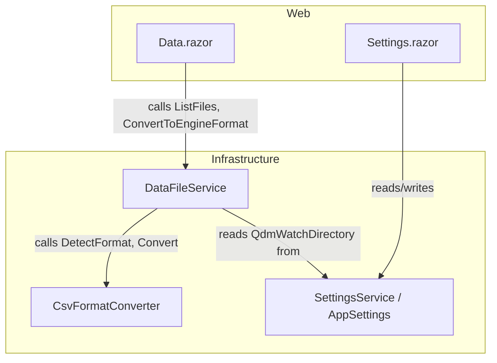

# Design Document — QDM Folder Integration

## Overview

This feature adds QuantDataManager (QDM) CSV import support to the TradingResearchEngine. QDM exports bar data in a MetaTrader 4 variant format with dot-separated dates (`yyyy.MM.dd`) and no seconds in the time field (`HH:mm`). The existing `CsvFormatConverter` misidentifies these files as `MetaTrader` and then fails to parse the dot-separated dates.

The integration is folder-based: a configurable watch directory is scanned for QDM CSV files, which appear in the Data Files page alongside existing data. The Convert action transforms them into engine-format CSV and writes the output to the engine's `DataDirectory`. No changes are required to the backtesting core, `CsvDataProvider`, `DataProviderFactory`, or any strategy/research workflow.

### Key Design Decisions

1. **Extend existing infrastructure** rather than adding a new provider — QDM files are just another CSV format variant, so `CsvFormatConverter` is the right home for detection and conversion logic.
2. **Signature change for `DetectFormat`** — the method must accept `string[] lines` (header + data rows) instead of just the header line, because the header alone cannot distinguish QDM from MetaTrader. The first data row's date separator is the disambiguator.
3. **Optional watch directory** — `QdmWatchDirectory` is nullable on `AppSettings`. When null/empty, behaviour is identical to today. Files are listed in-place (no copying at scan time); conversion writes output to `DataDirectory`.

## Architecture

The feature touches three layers but adds no new projects, services, or abstractions:



**Data flow for QDM import:**
1. User configures `QdmWatchDirectory` in Settings page → `SettingsService.Save()`
2. User opens Data Files page → `DataFileService.ListFiles()` scans `DataDirectory` + `QdmWatchDirectory`
3. `AnalyzeFile()` calls `CsvFormatConverter.DetectFormat(lines)` → returns `QuantDataManager`
4. User clicks Convert → `CsvFormatConverter.Convert()` calls `ConvertQuantDataManager()` per line
5. Output written to `DataDirectory` as `{filename}_converted.csv`

## Components and Interfaces

### 1. CsvFormatConverter (Infrastructure/DataProviders)

**SourceFormat enum** — add new member:

```csharp
/// <summary>
/// QuantDataManager export: Date,Time,Open,High,Low,Close,Volume
/// Date format is yyyy.MM.dd and Time format is HH:mm (no seconds).
/// </summary>
QuantDataManager,
```

**DetectFormat signature change:**

```csharp
// Before:
public static SourceFormat DetectFormat(string headerLine)

// After:
public static SourceFormat DetectFormat(string[] lines)
```

Detection logic for the MetaTrader/QDM branch:

```csharp
if (lower.Contains("date") && lower.Contains("time") && !lower.Contains("timestamp"))
{
    // Peek at first data row to distinguish QDM (yyyy.MM.dd) from MT5 (yyyy-MM-dd)
    if (lines.Length > 1 && lines[1].Length > 4 && lines[1][4] == '.')
        return SourceFormat.QuantDataManager;
    return SourceFormat.MetaTrader;
}
```

A backward-compatible overload `DetectFormat(string headerLine)` will be retained for callers that only have the header. It will delegate to the new overload with a single-element array, defaulting to `MetaTrader` when no data row is available for disambiguation.

**ConvertQuantDataManager method:**

```csharp
private static string ConvertQuantDataManager(string line)
{
    var p = line.Split(',');
    if (p.Length < 7) throw new FormatException();
    var datePart = p[0].Trim().Replace('.', '-');   // 2020.01.02 → 2020-01-02
    var timePart = p[1].Trim();                      // 00:00
    var ts = DateTimeOffset.Parse(
        $"{datePart}T{timePart}:00Z",
        CultureInfo.InvariantCulture);
    return $"{ts:O},{p[2].Trim()},{p[3].Trim()},{p[4].Trim()},{p[5].Trim()},{p[6].Trim()}";
}
```

**ConvertLine** — add case:

```csharp
SourceFormat.QuantDataManager => ConvertQuantDataManager(line),
```

**Convert method** — update to pass `lines` array to `DetectFormat`:

```csharp
if (format == SourceFormat.Auto)
    format = DetectFormat(lines);  // was: DetectFormat(lines[0])
```

**Caller updates:** All callers of `DetectFormat` that currently pass `headerLine` must be updated to pass the lines array. The two internal callers are:
- `Convert()` — already has `lines` array available
- `DataFileService.AnalyzeFile()` and `DataFileService.ValidateSchema()` — must read at least 2 lines and pass them as an array

### 2. AppSettings (Infrastructure/Settings)

Add nullable `QdmWatchDirectory` property:

```csharp
public sealed record AppSettings(
    string DataDirectory,
    string ExportDirectory,
    string? QdmWatchDirectory,          // new — null means not configured
    ExecutionRealismProfile DefaultRealismProfile,
    decimal DefaultInitialCash,
    decimal DefaultRiskFreeRate,
    string DefaultSizingPolicy)
{
    public static AppSettings Default { get; } = new(
        "data",
        "exports",
        null,                           // QdmWatchDirectory not set by default
        ExecutionRealismProfile.StandardBacktest,
        100_000m,
        0.02m,
        "PercentEquity");
}
```

`System.Text.Json` handles missing properties gracefully — old settings files without `QdmWatchDirectory` will deserialise with `null` (the default for `string?` in a record constructor).

### 3. DataFileService (Infrastructure/DataProviders)

**Constructor change** — accept an optional `AppSettings` (or just the `QdmWatchDirectory` string) so `ListFiles()` knows where to look:

```csharp
public sealed class DataFileService
{
    private readonly string _dataDir;
    private readonly string? _qdmWatchDir;

    public DataFileService(string? dataDir = null, string? qdmWatchDir = null)
    {
        _dataDir = dataDir ?? Path.Combine(Directory.GetCurrentDirectory(), "data");
        _qdmWatchDir = qdmWatchDir;
        if (!Directory.Exists(_dataDir)) Directory.CreateDirectory(_dataDir);
    }
    // ...
}
```

**ListFiles() merge logic** — after scanning `DataDirectory` and `samples/data`, scan `QdmWatchDirectory`:

```csharp
if (!string.IsNullOrWhiteSpace(_qdmWatchDir) && Directory.Exists(_qdmWatchDir))
{
    foreach (var path in Directory.GetFiles(_qdmWatchDir, "*.csv"))
    {
        if (!files.Any(f => f.FileName == Path.GetFileName(path)))
            files.Add(AnalyzeFile(path));
    }
}
```

Deduplication: `DataDirectory` files take precedence. No recursive scan. Only `*.csv` files.

**AnalyzeFile() update** — read first two lines and pass as array to `DetectFormat`:

```csharp
var headerLine = reader.ReadLine();
var firstDataLine = reader.ReadLine();
if (headerLine is not null)
{
    headers = headerLine.Split(',');
    var lines = firstDataLine is not null
        ? new[] { headerLine, firstDataLine }
        : new[] { headerLine };
    format = CsvFormatConverter.DetectFormat(lines).ToString();
}
```

**ValidateSchema() update** — same pattern: read two lines, pass array.

**ConvertToEngineFormat()** — no change needed. It already calls `CsvFormatConverter.Convert(content)` which splits all lines internally. The output is always written to `_dataDir`, which is correct for QDM files originating from the watch directory.

### 4. Settings.razor (Web)

Add a row in the "Storage Paths" table for QDM Watch Directory. The current Settings page is read-only (displays `appsettings.json` values). To make `QdmWatchDirectory` editable, inject `SettingsService` and add a text field with save capability:

```razor
<tr>
    <td>QDM Watch Directory</td>
    <td style="word-break:break-all">
        @(string.IsNullOrEmpty(_settings?.QdmWatchDirectory)
            ? "(not configured)"
            : _settings.QdmWatchDirectory)
    </td>
</tr>
```

For editability, add a `MudTextField` bound to the setting value with a Save button that calls `SettingsService.Save()`. The field should include helper text: "Optional — path to QDM export folder".

### 5. Data.razor (Web)

Update the empty-state alert message:

```razor
<MudAlert Severity="Severity.Info" Class="mt-4">
    No CSV files found. Place CSV files in the data directory,
    use Dukascopy to download data, or configure a QDM Watch Directory
    in Settings to import QuantDataManager exports.
</MudAlert>
```

### 6. DI Registration (ServiceCollectionExtensions)

Update the `DataFileService` singleton registration to pass `QdmWatchDirectory` from loaded settings:

```csharp
services.AddSingleton(sp =>
{
    var settingsService = sp.GetRequiredService<SettingsService>();
    var settings = settingsService.Load();
    return new DataFileService(settings.DataDirectory, settings.QdmWatchDirectory);
});
```

## Data Models

### SourceFormat Enum (updated)

```csharp
public enum SourceFormat
{
    Auto,
    YahooFinance,
    TradingView,
    MetaTrader,
    QuantDataManager,   // new
    Engine
}
```

### AppSettings Record (updated)

```csharp
public sealed record AppSettings(
    string DataDirectory,
    string ExportDirectory,
    string? QdmWatchDirectory,
    ExecutionRealismProfile DefaultRealismProfile,
    decimal DefaultInitialCash,
    decimal DefaultRiskFreeRate,
    string DefaultSizingPolicy);
```

### QDM CSV Format

| Column | Format | Example |
|--------|--------|---------|
| Date | `yyyy.MM.dd` | `2020.01.02` |
| Time | `HH:mm` | `00:00` |
| Open | decimal | `1.12100` |
| High | decimal | `1.12250` |
| Low | decimal | `1.12000` |
| Close | decimal | `1.12190` |
| Volume | integer | `1234` |

### Engine CSV Format (target)

| Column | Format | Example |
|--------|--------|---------|
| Timestamp | ISO 8601 UTC (`O` specifier) | `2020-01-02T00:00:00.0000000+00:00` |
| Open | decimal | `1.12100` |
| High | decimal | `1.12250` |
| Low | decimal | `1.12000` |
| Close | decimal | `1.12190` |
| Volume | integer | `1234` |

## Correctness Properties

*A property is a characteristic or behavior that should hold true across all valid executions of a system — essentially, a formal statement about what the system should do. Properties serve as the bridge between human-readable specifications and machine-verifiable correctness guarantees.*

### Property 1: Format detection disambiguation

*For any* CSV lines array where the header contains `Date` and `Time` columns (and not `Timestamp`), `DetectFormat` SHALL return `SourceFormat.QuantDataManager` when the first data row's date uses dot separators (`yyyy.MM.dd`), and `SourceFormat.MetaTrader` when the first data row's date uses dash separators (`yyyy-MM-dd`).

**Validates: Requirements 1.2, 1.3**

### Property 2: QDM conversion timestamp round-trip

*For any* valid QDM CSV row with a date in `yyyy.MM.dd` format and time in `HH:mm` format, converting the row via `ConvertQuantDataManager` and then parsing the resulting Timestamp field with `DateTimeOffset.Parse` using `InvariantCulture` SHALL produce a `DateTimeOffset` whose year, month, day, hour, and minute match the original input values.

**Validates: Requirements 2.1, 2.2, 2.3, 3.2**

### Property 3: QDM conversion OHLCV preservation

*For any* valid QDM CSV row, the Open, High, Low, Close, and Volume values in the converted engine-format output SHALL be identical (string-equal after trimming) to the corresponding values in the source row.

**Validates: Requirements 2.4**

### Property 4: Malformed line rejection

*For any* CSV line containing fewer than seven comma-separated fields, `ConvertLine` with `SourceFormat.QuantDataManager` SHALL return null (skip the line).

**Validates: Requirements 2.5**

### Property 5: AppSettings QdmWatchDirectory persistence round-trip

*For any* `AppSettings` instance with a non-null `QdmWatchDirectory` string, serialising to JSON via `SettingsService.Save` and then deserialising via `SettingsService.Load` SHALL produce an `AppSettings` where `QdmWatchDirectory` equals the original value.

**Validates: Requirements 4.3**

## Error Handling

| Scenario | Handling |
|----------|----------|
| QDM CSV line has fewer than 7 fields | `ConvertQuantDataManager` throws `FormatException`; `ConvertLine` catches it and returns `null` (line skipped) |
| QDM date field contains unexpected format | `DateTimeOffset.Parse` throws; `ConvertLine` catches and returns `null` |
| `QdmWatchDirectory` path does not exist | `ListFiles()` skips the directory silently (checked via `Directory.Exists`) |
| `QdmWatchDirectory` is null or empty | `ListFiles()` behaves identically to current implementation |
| Old `settings.json` missing `QdmWatchDirectory` | `System.Text.Json` deserialises with `null` default — no error |
| File name collision between DataDirectory and QdmWatchDirectory | DataDirectory version takes precedence; QDM duplicate excluded |
| File I/O error reading a QDM CSV during `AnalyzeFile` | Existing `try/catch` in `AnalyzeFile` handles gracefully (best-effort metadata) |

## Testing Strategy

### Property-Based Tests (FsCheck.Xunit)

All property tests live in `UnitTests`. Each is tagged with:

```csharp
// Feature: qdm-folder-integration, Property N: <description>
```

Minimum 100 iterations per property (`[Property(MaxTest = 100)]`).

| Property | What it tests | Generator strategy |
|----------|--------------|-------------------|
| 1: Format detection disambiguation | `DetectFormat` returns correct `SourceFormat` based on date separator | Generate random valid dates (year 1970–2030, valid month/day), random OHLCV decimals. Build CSV lines array with either dot or dash separator. Assert correct enum value. |
| 2: QDM conversion timestamp round-trip | `ConvertQuantDataManager` produces parseable ISO 8601 timestamp matching input | Generate random valid QDM date (`yyyy.MM.dd`) and time (`HH:mm`), random OHLCV. Convert, parse timestamp back, compare components. |
| 3: QDM conversion OHLCV preservation | Converted output preserves OHLCV values | Generate random decimal OHLCV values and a valid QDM date/time. Convert, split output, compare OHLCV fields. |
| 4: Malformed line rejection | Lines with <7 fields return null | Generate random strings with 0–6 comma-separated fields. Assert ConvertLine returns null. |
| 5: AppSettings round-trip | QdmWatchDirectory survives JSON serialisation | Generate random non-empty path strings. Save/load via SettingsService against a temp file. Compare. |

### Unit Tests (xUnit)

- `DetectFormat_QdmHeader_ReturnsQuantDataManager` — concrete example with known QDM CSV
- `DetectFormat_Mt5Header_StillReturnsMetaTrader` — regression: existing MT5 files still detected correctly
- `DetectFormat_SingleLineOnly_DefaultsToMetaTrader` — backward compat when no data row available
- `ConvertQuantDataManager_KnownRow_ProducesCorrectTimestamp` — concrete conversion example
- `Convert_QdmFile_OutputHeaderIsEngineFormat` — verifies header line of converted output
- `AppSettings_Default_QdmWatchDirectoryIsNull` — default value check
- `AppSettings_OldJsonWithoutQdmField_DeserializesWithNull` — backward compatibility

### Integration Tests

- `DataFileService_QdmWatchDirectory_ListsQdmFiles` — temp directory with QDM CSVs, verify they appear in `ListFiles()`
- `DataFileService_QdmWatchDirectory_DeduplicatesByFileName` — same filename in both dirs, DataDirectory wins
- `DataFileService_QdmWatchDirectory_NullOrMissing_NoChange` — verify no-op when not configured
- `DataFileService_ConvertQdmFile_OutputInDataDirectory` — convert from watch dir, verify output location
- `DataFileService_ConvertQdmFile_OriginalUnmodified` — verify source file unchanged after conversion
