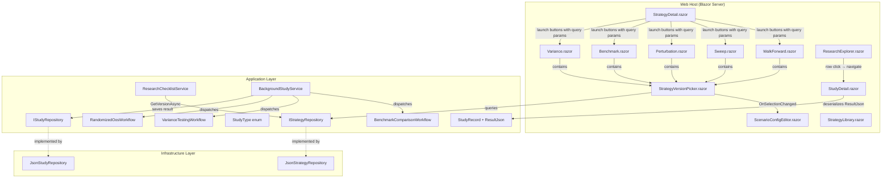

# Design Document: Research Page Routing & UX (V7)

## Overview

This design addresses the V7 sprint for TradingResearchEngine — closing the gap between the fully-working Monte Carlo research page and the five remaining research pages (WalkForward, Sweep, Perturbation, Benchmark, Variance). The core problem: research pages ignore URL query parameters passed from StrategyDetail, forcing users to manually re-enter configuration every time they launch a study.

The design introduces a reusable `StrategyVersionPicker` component, wires `[SupplyParameterFromQuery]` parameters across all research pages, adds missing `StudyType` enum values and their dispatch logic, persists study results via `ResultJson` on `StudyRecord`, renders results in `StudyDetail`, replaces hardcoded timeframe options with `TimeframeOptions.All`, wires the `BenchmarkExcessSharpe` chip from real persisted data, makes `ResearchExplorer` rows clickable, adds a retired-strategy counter to `StrategyLibrary`, and introduces `IStrategyRepository.GetVersionAsync` to eliminate O(n×m) full scans.

### Layers Affected

```
Core           — No changes (BarsPerYearDefaults already exists)
Application    — StudyRecord (ResultJson), IStudyRepository (SaveResultAsync),
                 IStrategyRepository (GetVersionAsync), StudyType enum,
                 ResearchChecklistService, BackgroundStudyService dispatch
Infrastructure — JsonStrategyRepository (GetVersionAsync impl),
                 JsonStudyRepository (SaveResultAsync impl)
Web            — StrategyVersionPicker component, 5 research pages,
                 StrategyDetail, StudyDetail, ResearchExplorer, StrategyLibrary
```

### Implementation Order

The fixes are ordered by dependency:

1. **Fix 1** — `GetVersionAsync` on `IStrategyRepository` (unblocks Fix 3, Fix 4)
2. **Fix 2** — `StudyType` enum values + dispatch wiring (unblocks Fix 3)
3. **Fix 3** — `ResultJson` persistence + `StudyDetail` rendering + `BenchmarkExcessSharpe` chip (depends on Fix 1, Fix 2)
4. **Fix 4** — `StrategyVersionPicker` + query parameter wiring + launch buttons (depends on Fix 1)
5. **Fix 5** — Timeframe options in Edit Execution Window dialog (standalone)
6. **Fix 6** — Strategy Library retired counter (standalone, most already implemented)
7. **Fix 7** — ResearchExplorer row click navigation (standalone)

---

## Architecture



---

## Components and Interfaces

### 1. `IStrategyRepository.GetVersionAsync` (Fix 1)

**Interface addition** in `Application/Strategy/IStrategyRepository.cs`:

```csharp
/// <summary>Gets a strategy version by its ID directly, or null if not found.</summary>
Task<StrategyVersion?> GetVersionAsync(string strategyVersionId, CancellationToken ct = default);
```

**Implementation** in `JsonStrategyRepository`: Two-level directory scan — iterate `strategies/{strategyId}/versions/` directories, check for `{strategyVersionId}.json` file existence before deserializing. O(n) in strategy count but avoids deserializing every version.

**Callers to update:**
- `ResearchChecklistService.GetVersionAsync` (private method, lines 95–103) — replace with `_strategyRepo.GetVersionAsync(versionId, ct)`
- `StudyDetail.razor` `OnInitializedAsync` — replace nested loop with `GetVersionAsync` + `GetAsync`
- `ResearchExplorer.razor` `OnInitializedAsync` — replace nested loop with `GetVersionAsync` + `GetAsync`

### 2. `StudyType` Enum Extensions (Fix 2)

Add three values to `StudyType` in `StudyRecord.cs`:

```csharp
BenchmarkComparison,  // distinct int, maps to BenchmarkComparisonWorkflow
Variance,             // distinct int, maps to VarianceTestingWorkflow
RandomisedOos,        // distinct int, maps to RandomizedOosWorkflow
```

These values enable `BackgroundStudyService` dispatch, `StrategyDetail` launch URL mapping, and `StudyDetail` result type routing.

### 3. `StudyRecord.ResultJson` and Persistence (Fix 3)

**`StudyRecord`** — add nullable `string? ResultJson = null` parameter to the record constructor.

**`IStudyRepository`** — add:
```csharp
Task SaveResultAsync(string studyId, string resultJson, CancellationToken ct = default);
```

**`JsonStudyRepository`** — implement `SaveResultAsync`: load study, apply `with { ResultJson = resultJson }`, save back.

**Workflow orchestrator** — after each workflow's `RunAsync` completes, serialize the result to JSON using a shared static `JsonSerializerOptions` instance and call `SaveResultAsync`. Apply to all 11 workflow types.

### 4. `StrategyVersionPicker.razor` (Fix 4)

A reusable Blazor component in `Web/Components/Builder/`:

**Parameters:**
- `PreselectedStrategyId: string?` — URL-driven strategy preselection
- `PreselectedVersionId: string?` — URL-driven version preselection
- `OnSelectionChanged: EventCallback<(StrategyIdentity Strategy, StrategyVersion Version, BacktestResult? LatestRun)>`

**Behavior:**
1. On init, loads all non-retired strategies from `IStrategyRepository`
2. If `PreselectedStrategyId` provided, auto-selects strategy and loads versions
3. If `PreselectedVersionId` provided, auto-selects version and emits event
4. Strategy dropdown → version dropdown → emit selection with latest `BacktestResult`
5. When only one version exists, auto-selects it

### 5. Research Page Query Parameter Pattern (Fixes 1–5, 9)

All five research pages follow the same pattern:

```razor
@code {
    [SupplyParameterFromQuery] public string? StrategyId { get; set; }
    [SupplyParameterFromQuery] public string? VersionId { get; set; }
}
```

**Layout pattern:**
1. `StrategyVersionPicker` at top (primary input)
2. `ScenarioConfigEditor` inside a collapsed `MudExpansionPanel` ("Advanced / Manual Config")
3. Workflow-specific options below
4. `WorkflowRunner` for execution

**On version selected** via picker: call `_configEditor!.LoadFromConfig(version.BaseScenarioConfig)`.

**Perturbation, Benchmark, Variance** also accept `[SupplyParameterFromQuery] public string? ResultId { get; set; }` for pre-populating from a saved `BacktestResult`.

### 6. `BackgroundStudyService` Dispatch (Fix 2 + Fix 3)

The `BackgroundStudyService` is an abstract coordination service — it manages `CancellationToken`s and progress events but does NOT contain the actual workflow dispatch logic. The dispatch logic needs to be added in the Web host (or a new Application-layer service) that maps `StudyType` to workflow classes.

New dispatch cases:
- `StudyType.BenchmarkComparison` → `BenchmarkComparisonWorkflow.RunAsync`
- `StudyType.Variance` → `VarianceTestingWorkflow.RunAsync`
- `StudyType.RandomisedOos` → `RandomizedOosWorkflow.RunAsync`

Each follows the same pattern: inject workflow, call `RunAsync`, serialize result, call `SaveResultAsync`, mark study completed.

### 7. `StudyDetail` Result Rendering (Fix 3)

When `_study.ResultJson` is non-null and `_study.Status == Completed`, deserialize based on `_study.Type`:

| StudyType | Result Type | Rendered Component |
|---|---|---|
| MonteCarlo | `MonteCarloResult` | `MonteCarloFanChart` + `EquityDistributionChart` |
| WalkForward / AnchoredWalkForward | `WalkForwardResult` | `WalkForwardCompositeChart` |
| ParameterSweep / Sensitivity | `SweepResult` | `ParameterSweepHeatmap` |
| Realism | `PerturbationResult` | Metric cards (MeanSharpe, StdDevSharpe, etc.) |
| BenchmarkComparison | `BenchmarkComparisonResult` | Metric cards (StrategyReturn, Alpha, Beta, etc.) |
| Cpcv | `CpcvResult` | Metric cards (MedianOosSharpe, PBO, PerformanceDegradation) |
| Variance | `VarianceResult` | Variant table (PresetName, Sharpe, MaxDD, etc.) |

### 8. `BenchmarkExcessSharpe` Chip Wiring (Fix 2 + Fix 3)

In `StrategyDetail.LoadVersionData()`, replace the hardcoded approximation:

```csharp
// Current (broken): _benchmarkExcessSharpe = _latestRun.SharpeRatio;
// New: read from persisted BenchmarkComparison study
var benchmarkStudies = await StudyRepo.ListByVersionAsync(_selectedVersionId);
var latestBenchmark = benchmarkStudies
    .Where(s => s.Type == StudyType.BenchmarkComparison
             && s.Status == StudyStatus.Completed
             && s.ResultJson is not null)
    .OrderByDescending(s => s.CreatedAt)
    .FirstOrDefault();

if (latestBenchmark?.ResultJson is not null)
{
    var result = JsonSerializer.Deserialize<BenchmarkComparisonResult>(
        latestBenchmark.ResultJson, _jsonOpts);
    _benchmarkExcessSharpe = result?.ExcessReturn;
}
else
{
    _benchmarkExcessSharpe = null; // tooltip: "Run a Benchmark Comparison study..."
}
```

Note: The underlying property on `BenchmarkComparisonResult` is `ExcessReturn` (defined as strategy Sharpe minus benchmark Sharpe), not `ExcessSharpe`.

### 9. Edit Execution Window Timeframe Options (Fix 5)

Replace the hardcoded `MudSelectItem` list in `StrategyDetail.razor`'s Edit Execution Window dialog with:

```razor
@foreach (var tf in TimeframeOptions.All)
{
    <MudSelectItem T="string" Value="@tf.Value">@tf.Label (@tf.BarsPerYear.ToString("N0") bars/year)</MudSelectItem>
}
```

`Step2DataExecutionWindow.razor` already uses `TimeframeOptions.All` — no changes needed there.

On timeframe selection change in the dialog, auto-populate `BarsPerYear` from the selected `TimeframeOption.BarsPerYear`.

### 10. Strategy Library Retired Counter (Fix 6)

The existing `StrategyLibrary.razor` already implements:
- `_showRetired` toggle
- `FilteredStrategies` filtering
- Retirement dialog with `_retirementNote`
- Reduced opacity for retired cards
- RETIRED chip

**Only missing piece:** Add a counter in the toolbar:

```razor
@{ var retiredCount = _strategies.Count(s => s.Stage == DevelopmentStage.Retired); }
@if (!_showRetired && retiredCount > 0)
{
    <MudText Typo="Typo.caption" Class="text-muted">@retiredCount retired hidden</MudText>
}
```

### 11. ResearchExplorer Row Click Navigation (Fix 7)

Add to the `MudTable`:
- `OnRowClick="@(args => Nav.NavigateTo($"/research/study/{args.Item.Study.StudyId}"))"`
- `Hover="true"` (already present)
- `Style="cursor:pointer"`

Add an action column with `MudIconButton` pointing to `/research/study/{studyId}`.

---

## Data Models

### StudyRecord (modified)

```csharp
public sealed record StudyRecord(
    string StudyId,
    string StrategyVersionId,
    StudyType Type,
    StudyStatus Status,
    DateTimeOffset CreatedAt,
    string? SourceRunId = null,
    string? ErrorSummary = null,
    bool IsPartial = false,
    int CompletedCount = 0,
    int TotalCount = 0,
    /// <summary>V7: Serialized JSON of the workflow result. Null until the study completes.</summary>
    string? ResultJson = null) : IHasId
{
    public string Id => StudyId;
}
```

### StudyType (modified)

```csharp
public enum StudyType
{
    MonteCarlo,
    WalkForward,
    AnchoredWalkForward,
    CombinatorialPurgedCV,
    Cpcv = CombinatorialPurgedCV,
    Sensitivity,
    ParameterSweep,
    Realism,
    ParameterStability,
    RegimeSegmentation,
    /// <summary>V7: Benchmark comparison against a buy-and-hold baseline.</summary>
    BenchmarkComparison,
    /// <summary>V7: Variance testing — stability across sub-period slices.</summary>
    Variance,
    /// <summary>V7: Randomised OOS sampling study.</summary>
    RandomisedOos,
}
```

### IStrategyRepository (modified)

```csharp
public interface IStrategyRepository
{
    // ... existing methods ...

    /// <summary>Gets a strategy version by its ID directly, or null if not found.</summary>
    Task<StrategyVersion?> GetVersionAsync(string strategyVersionId, CancellationToken ct = default);
}
```

### IStudyRepository (modified)

```csharp
public interface IStudyRepository
{
    // ... existing methods ...

    /// <summary>Saves the result JSON for a completed study.</summary>
    Task SaveResultAsync(string studyId, string resultJson, CancellationToken ct = default);
}
```

---

## Correctness Properties

*A property is a characteristic or behavior that should hold true across all valid executions of a system — essentially, a formal statement about what the system should do. Properties serve as the bridge between human-readable specifications and machine-verifiable correctness guarantees.*

### Property 1: StudyType JSON serialization round-trip

*For any* `StudyType` enum value (excluding the `Cpcv` alias), serializing to JSON and deserializing back should produce the original enum value.

**Validates: Requirements 6.4**

### Property 2: StrategyVersionPicker excludes retired strategies

*For any* list of `StrategyIdentity` records with mixed `DevelopmentStage` values, the filtered list used by `StrategyVersionPicker` should never contain a strategy with `Stage == DevelopmentStage.Retired`.

**Validates: Requirements 8.8**

### Property 3: StudyDetail result deserialization round-trip

*For any* valid study result object and its corresponding `StudyType`, serializing the result to JSON and then deserializing it using the `StudyType`-dispatched deserialization logic should produce an object equivalent to the original.

**Validates: Requirements 11.1**

### Property 4: TimeframeOption BarsPerYear consistency

*For any* `TimeframeOption` in `TimeframeOptions.All`, the `BarsPerYear` field should equal the corresponding `BarsPerYearDefaults` constant for that timeframe.

**Validates: Requirements 13.4**

### Property 5: GetVersionAsync round-trip

*For any* `StrategyVersion` saved via `SaveVersionAsync`, calling `GetVersionAsync` with that version's `StrategyVersionId` should return a `StrategyVersion` with matching `StrategyVersionId`, `StrategyId`, and `VersionNumber`.

**Validates: Requirements 14.2, 14.3**

---

## Error Handling

| Scenario | Handling |
|---|---|
| Invalid `versionId` query parameter | Show `ISnackbar` warning, leave editors in default state |
| Invalid `resultId` query parameter | Show `ISnackbar` warning, leave editors in default state |
| `GetVersionAsync` with non-existent ID | Return `null` (no exception) |
| `GetVersionAsync` with missing base directory | Return `null` (no exception) |
| `SaveResultAsync` with non-existent study ID | No-op (return without throwing) |
| `ResultJson` deserialization failure in `StudyDetail` | Catch `JsonException`, show error alert, render metadata only |
| `BackgroundStudyService` dispatch for unknown `StudyType` | Log warning, mark study as `Failed` with error summary |
| `BenchmarkExcessSharpe` with no completed benchmark study | Display null chip with tooltip guidance |

---

## Testing Strategy

### Property-Based Tests (FsCheck.Xunit)

Five property tests, each with minimum 100 iterations, tagged per convention:

```csharp
// Feature: research-page-routing-ux, Property 1: StudyType JSON round-trip
[Property(MaxTest = 100)]

// Feature: research-page-routing-ux, Property 2: StrategyVersionPicker excludes retired
[Property(MaxTest = 100)]

// Feature: research-page-routing-ux, Property 3: StudyDetail result deserialization round-trip
[Property(MaxTest = 100)]

// Feature: research-page-routing-ux, Property 4: TimeframeOption BarsPerYear consistency
[Property(MaxTest = 100)]

// Feature: research-page-routing-ux, Property 5: GetVersionAsync round-trip
[Property(MaxTest = 100)]
```

### Unit Tests (xUnit)

| Test Class | Coverage |
|---|---|
| `GetVersionAsyncTests` | Returns correct version, returns null for missing ID, handles empty base dir |
| `StudyTypeEnumTests` | All new values have distinct integers, no duplicates (excluding Cpcv alias) |
| `StudyResultPersistenceTests` | `SaveResultAsync` round-trip, `ResultJson` null for running study |
| `TimeframeOptionsTests` | Contains exactly 8 entries, all map to non-zero `BarsPerYearDefaults` |
| `ResearchChecklistServiceTests` | Uses `GetVersionAsync` (mock verifies no `ListAsync` + `GetVersionsAsync` calls) |
| `GetStudyLaunchUrlTests` | `BenchmarkComparison` → `/research/benchmark?...`, `Variance` → `/research/variance?...` |

### Integration / UI Tests

- Manual verification of all 5 research pages with query parameters
- Manual verification of `StrategyVersionPicker` preselection
- Manual verification of `StudyDetail` result rendering for each study type
- Manual verification of `ResearchExplorer` row click navigation
- Manual verification of `StrategyLibrary` retired counter
- Manual verification of Edit Execution Window timeframe dropdown

### Test Boundaries

Per project conventions:
- `UnitTests` references Core and Application only — never Infrastructure, Web
- `GetVersionAsync` implementation tests use a temp directory with real files (in `IntegrationTests`)
- Blazor component tests are manual (no bUnit in the project)
