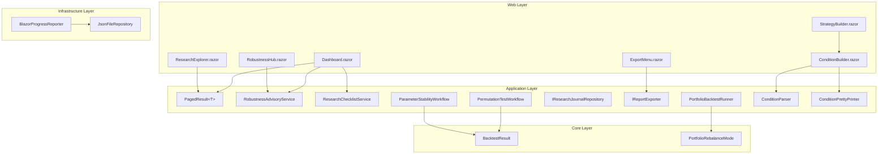
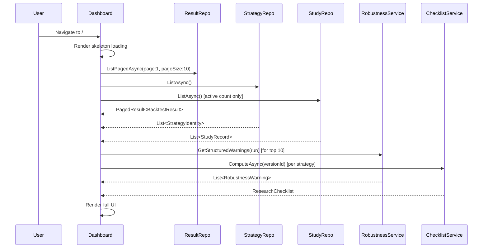
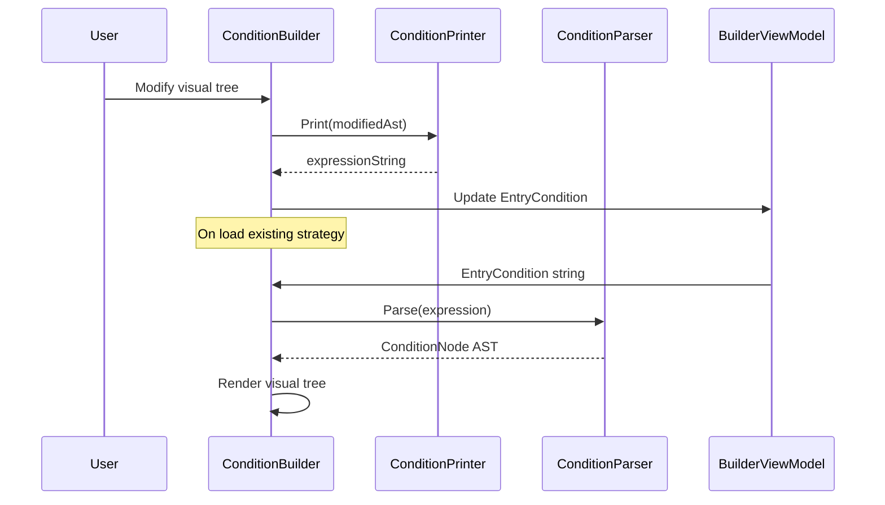
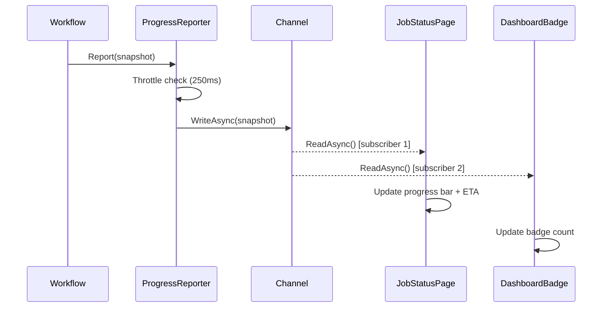

# Design Document — Research Platform V9

## Overview

Research Platform V9 is a phased upgrade to the TradingResearchEngine application delivering architecture quality improvements, strategy builder UX enhancements, robustness workflows, dashboard redesign, results exploration, portfolio evolution, real-time execution experience, accessibility, and comprehensive testing. The design preserves Clean Architecture boundaries (Core ← Application ← Infrastructure ← Web) and extends existing components incrementally.

### Design Principles

1. **Incremental extension** — modify existing files rather than rewriting; add fields with defaults for backward compatibility.
2. **Clean Architecture compliance** — domain types in Core, use cases in Application, I/O in Infrastructure, UI in Web.
3. **Backward-compatible persistence** — new JSON fields use `default` values so legacy records deserialize without error.
4. **Property-based correctness** — critical logic (parser round-trip, value objects, pagination math) validated via FsCheck.
5. **Phased delivery** — each phase is independently deployable without breaking prior functionality.

### Phased Rollout

| Phase | Focus | Requirements |
|-------|-------|-------------|
| Phase 1 | Foundation | Req 1–17, 41, 43, 46–48 |
| Phase 2 | Builder & Robustness | Req 18–34, 37–39, 42, 44, 49–53 |
| Phase 3 | Portfolio & Polish | Req 35–36, 40, 45 |

---

## Architecture

### Layer Responsibilities

```
┌─────────────────────────────────────────────────────────────┐
│  Web (Blazor SSR + MudBlazor 8.15.0)                        │
│  - Pages, Components, Services, Design Tokens               │
├─────────────────────────────────────────────────────────────┤
│  Infrastructure                                              │
│  - JsonFileRepository (atomic writes), BlazorProgressReporter│
│  - Channel-based streaming, SQLite index (existing)          │
├─────────────────────────────────────────────────────────────┤
│  Application                                                 │
│  - Use cases, Workflows, Services, Value Objects             │
│  - StrategyTypeId, PagedResult<T>, RobustnessWarning         │
├─────────────────────────────────────────────────────────────┤
│  Core                                                        │
│  - Domain models, Events, Engine, Portfolio, Metrics          │
│  - BacktestResult (extended), PortfolioRebalanceMode          │
└─────────────────────────────────────────────────────────────┘
```

### Key Architectural Decisions

| Decision | Rationale |
|----------|-----------|
| CSS custom properties over CSS-in-JS | Zero runtime cost, MudBlazor-compatible, server-rendered |
| `StrategyTypeId` as `readonly record struct` | Compile-time safety with zero allocation overhead |
| `Channel<ProgressSnapshot>` for streaming | Backpressure-aware, thread-safe, no SignalR dependency needed for SSR |
| Paginated repository methods | Eliminates O(n) memory for large datasets; enables Dashboard < 2s load |
| Atomic JSON writes (temp + rename) | Prevents corruption from interrupted writes |
| FsCheck for property tests | Established .NET PBT library, integrates with xUnit via FsCheck.Xunit |

---

## Components and Interfaces

### Phase 1 — Foundation Components

#### 1. Design Token System

**New file:** `src/TradingResearchEngine.Web/wwwroot/css/design-tokens.css`

Defines CSS custom properties for the entire application:

```css
:root {
  /* Spacing scale */
  --space-1: 4px; --space-2: 8px; --space-3: 12px;
  --space-4: 16px; --space-5: 24px; --space-6: 32px; --space-7: 48px;

  /* Typography */
  --font-size-xs: 0.75rem; --font-size-sm: 0.875rem;
  --font-size-base: 1rem; --font-size-lg: 1.125rem;
  --font-weight-normal: 400; --font-weight-medium: 500; --font-weight-bold: 700;
  --line-height-tight: 1.25; --line-height-normal: 1.5;

  /* Color palette */
  --color-primary: var(--mud-palette-primary);
  --color-secondary: var(--mud-palette-secondary);
  --color-success: var(--mud-palette-success);
  --color-warning: var(--mud-palette-warning);
  --color-error: var(--mud-palette-error);
  --color-surface: var(--mud-palette-surface);
  --color-background: var(--mud-palette-background-grey);

  /* Status states */
  --status-active: var(--color-success);
  --status-untested: var(--mud-palette-text-disabled);
  --status-failed: var(--color-error);
  --status-running: var(--color-primary);
  --status-completed: var(--color-success);

  /* Data segment colors */
  --segment-is: #2196F3;       /* In-Sample: blue */
  --segment-oos: #4CAF50;      /* Out-of-Sample: green */
  --segment-wf: #9C27B0;       /* Walk-Forward: purple */
  --segment-cpcv: #009688;     /* CPCV: teal */
  --segment-heldout: #FF9800;  /* Held-Out: orange */

  /* Development stages */
  --stage-exploration: #2196F3;
  --stage-validation: #FF9800;
  --stage-finaltest: #4CAF50;
  --stage-live: #9C27B0;
  --stage-retired: #9E9E9E;

  /* Robustness severity */
  --severity-critical: #D32F2F;
  --severity-high: #F44336;
  --severity-medium: #FF9800;
  --severity-low: #FFC107;

  /* Interactive states */
  --state-hover-opacity: 0.08;
  --state-focus-ring-color: var(--color-primary);
  --state-focus-ring-width: 2px;
  --state-active-scale: 0.98;

  /* Breakpoints */
  --breakpoint-sm: 600px;
  --breakpoint-md: 960px;
  --breakpoint-lg: 1280px;
}

@media (prefers-reduced-motion: reduce) {
  * { transition-duration: 0s !important; animation-duration: 0s !important; }
}
```

**Modified file:** `src/TradingResearchEngine.Web/wwwroot/css/app.css`
- Migrate `.text-muted`, `.text-faint`, `.strategy-strip-card`, `.strip-active`, `.strip-untested` to reference design token variables.
- Remove all inline color hex values.

#### 2. StrategyTypeId Value Object

**New file:** `src/TradingResearchEngine.Application/Strategies/StrategyTypeId.cs`

```csharp
namespace TradingResearchEngine.Application.Strategies;

/// <summary>
/// Strongly-typed identifier for strategy types, replacing raw string usage.
/// Serialises to/from a plain JSON string for backward compatibility.
/// </summary>
[System.Text.Json.Serialization.JsonConverter(typeof(StrategyTypeIdJsonConverter))]
public readonly record struct StrategyTypeId(string Value)
{
    public override string ToString() => Value;
    public static implicit operator StrategyTypeId(string value) => new(value);
    public static implicit operator string(StrategyTypeId id) => id.Value;
}
```

**New file:** `src/TradingResearchEngine.Application/Strategies/StrategyTypeIdJsonConverter.cs`

Custom `JsonConverter<StrategyTypeId>` that reads/writes a plain string token.

**Modified files:**
- `ScenarioConfig` — `StrategyType` property type changes to `StrategyTypeId`
- `StrategyIdentity` — `StrategyType` property type changes to `StrategyTypeId`
- `StrategyRegistry.Resolve` — accepts `StrategyTypeId`

#### 3. Explicit Timestamp Fields

**Modified file:** `src/TradingResearchEngine.Core/Results/BacktestResult.cs`

Add to the record:
```csharp
DateTimeOffset CreatedAt = default,
DateTimeOffset? CompletedAt = null
```

**Modified file:** `src/TradingResearchEngine.Application/Research/StudyRecord.cs`

Add:
```csharp
DateTimeOffset StartedAt = default,
DateTimeOffset? CompletedAt = null
```

**Migration strategy:** Fields use `default` values. The `JsonFileRepository` deserialization handles missing fields gracefully (System.Text.Json assigns defaults). A one-time migration helper in Infrastructure parses legacy RunId prefixes to populate `CreatedAt` on first access.

#### 4. Paginated Repository

**New file:** `src/TradingResearchEngine.Application/Research/PagedResult.cs`

```csharp
namespace TradingResearchEngine.Application.Research;

public sealed record PagedResult<T>(
    IReadOnlyList<T> Items,
    int TotalCount,
    int Page,
    int PageSize)
{
    public int TotalPages => PageSize > 0
        ? (int)Math.Ceiling((double)TotalCount / PageSize)
        : 0;
}
```

**Modified file:** `src/TradingResearchEngine.Application/Research/IBacktestResultRepository.cs`

Add:
```csharp
Task<PagedResult<BacktestResult>> ListPagedAsync(
    int page, int pageSize,
    StrategyTypeId? strategyTypeFilter = null,
    BacktestStatus? statusFilter = null,
    CancellationToken ct = default);
```

**Modified file:** `src/TradingResearchEngine.Application/Research/IStudyRepository.cs`

Add:
```csharp
Task<PagedResult<StudyRecord>> ListPagedAsync(
    int page, int pageSize,
    StudyType? typeFilter = null,
    StudyStatus? statusFilter = null,
    string? strategyVersionId = null,
    CancellationToken ct = default);
```

**Modified file:** `src/TradingResearchEngine.Infrastructure/Persistence/JsonFileRepository.cs`

Implement `ListPagedAsync` with in-memory filtering and pagination (acceptable for JSON file store; SQLite index provides O(log n) for large datasets).

#### 5. Progress Reporting Enhancement

**Modified file:** `src/TradingResearchEngine.Application/Research/ProgressSnapshot.cs`

Add `EstimatedTimeRemaining`:
```csharp
public sealed record ProgressSnapshot(
    int Current, int Total, decimal Percentage,
    string Stage, string? CurrentItemLabel,
    TimeSpan ElapsedTime,
    IReadOnlyList<string> Warnings)
{
    public TimeSpan? EstimatedTimeRemaining => Current > 0 && Total > 0
        ? TimeSpan.FromTicks((long)(ElapsedTime.Ticks / (double)Current * (Total - Current)))
        : null;

    public int WarningCount => Warnings.Count;
}
```

**Modified file:** `src/TradingResearchEngine.Infrastructure/Progress/BlazorProgressReporter.cs`

Replace simple callback with `Channel<ProgressSnapshot>`:

```csharp
public sealed class BlazorProgressReporter : IProgressReporter, IAsyncDisposable
{
    private readonly Channel<ProgressSnapshot> _channel;
    private readonly Stopwatch _stopwatch = Stopwatch.StartNew();
    private DateTime _lastEmit = DateTime.MinValue;
    private static readonly TimeSpan ThrottleInterval = TimeSpan.FromMilliseconds(250); // 4/sec max

    public ChannelReader<ProgressSnapshot> Reader => _channel.Reader;

    public BlazorProgressReporter()
    {
        _channel = Channel.CreateBounded<ProgressSnapshot>(
            new BoundedChannelOptions(16) { FullMode = BoundedChannelFullMode.DropOldest });
    }
    // ... throttled Report implementations
}
```

#### 6. Dashboard Redesign

**Modified file:** `src/TradingResearchEngine.Web/Components/Pages/Dashboard.razor`

Key changes:
- Replace `MudProgressCircular` loading with skeleton placeholders (`MudSkeleton`)
- Add empty states for strategies, runs, and robustness sections
- Add sparkline data to KPI cards (last 5 Sharpe values)
- Strategy strip cards: add mini progress bar, relative date, stage badge, action indicator
- Strategy strip: add horizontal scroll affordances
- Research pipeline: horizontal flow diagram with stage counts
- "Suggested Next Steps" section (up to 3 strategies with recommended actions)
- Replace `FilteredRecentRuns` computed property with cached field
- Add `@key` directives to strategy cards and table rows
- Replace empty `catch {}` with `ILogger<Dashboard>` warning logs
- Use `ListPagedAsync` instead of `ListAsync().Take(10)`
- Add error state with retry button

**New file:** `src/TradingResearchEngine.Web/Components/Shared/KpiSparkline.razor`

Renders a mini SVG sparkline (5 data points) inside a KPI card.

**New file:** `src/TradingResearchEngine.Web/Components/Shared/SkeletonDashboard.razor`

Skeleton loading state matching Dashboard layout.

#### 7. NavMenu Enhancement

**Modified file:** `src/TradingResearchEngine.Web/Components/Layout/NavMenu.razor`

Add Robustness Hub link:
```razor
<MudNavLink Href="/robustness-hub"
            Icon="@Icons.Material.Filled.Shield">Robustness Hub</MudNavLink>
```

Add `<nav aria-label="Main navigation">` wrapper and skip-to-content link.

---

### Phase 2 — Builder & Robustness Components

#### 8. Condition Builder UI

**New file:** `src/TradingResearchEngine.Web/Components/Builder/ConditionBuilder.razor`

Visual tree editor for `ConditionNode` AST:
- Renders `LogicalNode` as nested groups (AND/OR toggle)
- Renders `ComparisonNode` as indicator/price dropdown + operator + value rows
- Renders `CrossNode` as cross-detection rows
- Supports drag-and-drop reordering (up to 3 levels deep)
- On change: calls `ConditionPrettyPrinter.Print()` → updates `BuilderViewModel`
- On load: calls `ConditionParser.Parse()` → renders visual tree
- Fallback: raw text editor on parse failure

**New file:** `src/TradingResearchEngine.Web/Components/Builder/ConditionGroupNode.razor`

Recursive component for rendering logical groups.

**New file:** `src/TradingResearchEngine.Web/Components/Builder/ConditionRow.razor`

Single comparison or cross row with dropdowns.

**Modified file:** `src/TradingResearchEngine.Web/Components/Builder/BuilderViewModel.cs`

Add:
```csharp
public ConditionNode? ParsedEntryCondition { get; set; }
public ConditionNode? ParsedExitCondition { get; set; }
public bool IsBeginnerMode { get; set; } = true;
```

#### 9. Robustness Hub

**New file:** `src/TradingResearchEngine.Web/Components/Pages/Research/RobustnessHub.razor`

Route: `/robustness-hub`

Displays all strategies with active warnings, grouped by strategy, with:
- Severity badges (Critical/High/Medium/Low)
- Human-readable explanations
- Recommended actions (clickable → navigate to study launch)
- Filter by severity and strategy
- Summary bar with total warnings by severity

**New file:** `src/TradingResearchEngine.Application/Research/RobustnessWarning.cs`

```csharp
namespace TradingResearchEngine.Application.Research;

public enum RobustnessSeverity { Critical, High, Medium, Low }

public sealed record RobustnessWarning(
    RobustnessSeverity Severity,
    string Code,
    string Explanation,
    string RecommendedAction,
    string? Cause = null,
    string? Remediation = null,
    string? CauseCategory = null);
```

**Modified file:** `src/TradingResearchEngine.Application/Research/RobustnessAdvisoryService.cs`

Extend to return `IReadOnlyList<RobustnessWarning>` instead of `IReadOnlyList<string>`:

```csharp
public IReadOnlyList<RobustnessWarning> GetStructuredWarnings(BacktestResult result)
{
    var warnings = new List<RobustnessWarning>();
    if (result.SharpeRatio > _thresholds.MaxSharpeRatio)
        warnings.Add(new RobustnessWarning(
            RobustnessSeverity.High, "HIGH_SHARPE",
            $"Sharpe ratio ({result.SharpeRatio:F2}) exceeds {_thresholds.MaxSharpeRatio}",
            "Run a walk-forward study to validate out-of-sample performance",
            Cause: "Sharpe > 3.0 often indicates curve-fitting to noise in the training period",
            Remediation: "Run walk-forward or CPCV study",
            CauseCategory: "Overfitting"));
    // ... additional threshold checks with structured warnings
    return warnings;
}
```

Preserve existing `GetWarnings()` for backward compatibility.

**Modified file:** `src/TradingResearchEngine.Application/Research/IRobustnessAdvisoryService.cs`

Add: `IReadOnlyList<RobustnessWarning> GetStructuredWarnings(BacktestResult result);`

#### 10. Strategy Builder Enhancements

**New file:** `src/TradingResearchEngine.Web/Components/Builder/TimelineSplitVisualizer.razor`

Horizontal bar showing IS/OOS/Held-Out segments with draggable boundaries.

**New file:** `src/TradingResearchEngine.Web/Components/Builder/AdvancedOverridesPanel.razor`

Summary of all non-default parameters with navigation to relevant step.

**New file:** `src/TradingResearchEngine.Web/Components/Builder/ShortcutHelpOverlay.razor`

Modal listing keyboard shortcuts (Ctrl+Enter, Ctrl+Shift+Enter, Ctrl+S, ?).

**New file:** `src/TradingResearchEngine.Web/Components/Builder/ParameterGroupEditor.razor`

Groups parameters by `Group` property with collapsible sections, inline validation, tooltips, and reset buttons.

**Modified file:** `src/TradingResearchEngine.Web/Components/Pages/Strategies/StrategyBuilder.razor`

- Add beginner/expert mode toggle
- Add "Quick Preview" button on Step 3+
- Add keyboard shortcut handling via `@onkeydown`
- Integrate `ConditionBuilder`, `TimelineSplitVisualizer`, `AdvancedOverridesPanel`

#### 11. Statistical Workflows

**New file:** `src/TradingResearchEngine.Application/Research/Workflows/PermutationTestWorkflow.cs`

```csharp
public sealed class PermutationTestWorkflow
{
    public Task<PermutationTestResult> RunAsync(
        BacktestResult originalResult,
        int permutationCount = 1000,
        int? seed = null,
        CancellationToken ct = default);
}
```

**New file:** `src/TradingResearchEngine.Application/Research/Workflows/ParameterStabilityWorkflow.cs`

Computes stability scores for parameter grid cells based on neighbour variance.

**New file:** `src/TradingResearchEngine.Application/Research/Results/PermutationTestResult.cs`

```csharp
public sealed record PermutationTestResult(
    decimal OriginalMetric,
    IReadOnlyList<decimal> PermutedMetrics,
    decimal PValue,
    int PermutationCount,
    int Seed);
```

#### 12. Research Journal

**New file:** `src/TradingResearchEngine.Application/Research/ResearchJournalEntry.cs`

```csharp
public sealed record ResearchJournalEntry(
    string EntryId,
    string StrategyId,
    string? StrategyVersionId,
    DateTimeOffset Timestamp,
    JournalAction Action,
    string Reason,
    DevelopmentStage? FromStage = null,
    DevelopmentStage? ToStage = null) : IHasId
{
    public string Id => EntryId;
}

public enum JournalAction { Promoted, Rejected, Revised, Noted }
```

**New file:** `src/TradingResearchEngine.Application/Research/IResearchJournalRepository.cs`

```csharp
public interface IResearchJournalRepository
{
    Task<IReadOnlyList<ResearchJournalEntry>> ListByStrategyAsync(string strategyId, CancellationToken ct);
    Task<IReadOnlyList<ResearchJournalEntry>> ListByDateRangeAsync(DateTimeOffset from, DateTimeOffset to, CancellationToken ct);
    Task SaveAsync(ResearchJournalEntry entry, CancellationToken ct);
}
```

#### 13. Extended Export

**Modified file:** `src/TradingResearchEngine.Web/Components/Shared/ExportMenu.razor`

Add menu items:
- "Study Report (Markdown)" — exports study results
- "Comparison Report" — exports run comparison
- "Portfolio Report" — exports portfolio results

**Modified file:** `src/TradingResearchEngine.Application/Export/IReportExporter.cs`

Add:
```csharp
Task<string> ExportStudyMarkdownAsync(StudyRecord study, CancellationToken ct);
Task<string> ExportComparisonMarkdownAsync(IReadOnlyList<BacktestResult> runs, CancellationToken ct);
Task<string> ExportPortfolioMarkdownAsync(PortfolioBacktestResult result, CancellationToken ct);
```

---

### Phase 3 — Portfolio & Polish Components

#### 14. Portfolio Evolution

**Modified file:** `src/TradingResearchEngine.Core/Configuration/PortfolioRebalanceMode.cs`

Add enum values:
```csharp
RiskParity,
CustomWeights
```

**Modified file:** `src/TradingResearchEngine.Application/Portfolio/PortfolioBacktestRunner.cs`

Add `RiskParity` and `CustomWeights` allocation logic to `ComputeWeights`:
- **Risk Parity**: weights inversely proportional to each asset's contribution to portfolio risk (requires correlation matrix estimation from IS period)
- **Custom Weights**: user-specified weights from `PortfolioBacktestConfig.CustomWeights`

**New file:** `src/TradingResearchEngine.Application/Portfolio/PortfolioMetrics.cs`

```csharp
public sealed record PortfolioMetrics(
    decimal DiversificationRatio,
    decimal MaxPairwiseCorrelation,
    decimal AnnualisedTurnover,
    decimal? TrackingError);
```

**Modified file:** `src/TradingResearchEngine.Application/Portfolio/PortfolioBacktestResult.cs`

Add `PortfolioMetrics` field and per-asset metrics.

**New file:** `src/TradingResearchEngine.Web/Components/Pages/Portfolio/PortfolioRunSetup.razor`

Portfolio configuration UI: add/remove symbols, select strategies, configure weights.

**New file:** `src/TradingResearchEngine.Web/Components/Charts/CorrelationHeatmap.razor`

Interactive correlation matrix heatmap using Blazor-ApexCharts.

---

## Data Models

### Modified Domain Records

#### BacktestResult (Extended)

```csharp
public sealed record BacktestResult(
    // ... existing 30+ fields unchanged ...
    DateTimeOffset CreatedAt = default,
    DateTimeOffset? CompletedAt = null,
    IReadOnlyList<string>? Tags = null,
    string? Notes = null) : IHasId;
```

#### StudyRecord (Extended)

```csharp
public sealed record StudyRecord(
    // ... existing fields ...
    DateTimeOffset StartedAt = default,
    DateTimeOffset? CompletedAt = null,
    IReadOnlyList<string>? Tags = null,
    string? Notes = null,
    IReadOnlyList<string>? PartialResultIds = null);
```

### New Domain Records

| Record | Location | Purpose |
|--------|----------|---------|
| `StrategyTypeId` | Application/Strategies/ | Typed strategy identifier |
| `PagedResult<T>` | Application/Research/ | Paginated query result |
| `RobustnessWarning` | Application/Research/ | Structured warning with severity |
| `ResearchJournalEntry` | Application/Research/ | Audit trail entry |
| `PermutationTestResult` | Application/Research/Results/ | Permutation test output |
| `ParameterStabilityResult` | Application/Research/Results/ | Stability analysis output |
| `PortfolioMetrics` | Application/Portfolio/ | Portfolio health metrics |

### JSON Persistence Migration

All new fields on `BacktestResult` and `StudyRecord` use default values (`default`, `null`). System.Text.Json handles missing properties by assigning defaults during deserialization. No explicit migration step is required — records are forward-compatible.

For `CreatedAt` fallback on legacy records:
```csharp
// In JsonBacktestResultRepository
if (result.CreatedAt == default)
{
    result = result with { CreatedAt = ParseRunIdDate(result.RunId) ?? DateTimeOffset.MinValue };
}
```

---

## Correctness Properties

*A property is a characteristic or behavior that should hold true across all valid executions of a system — essentially, a formal statement about what the system should do. Properties serve as the bridge between human-readable specifications and machine-verifiable correctness guarantees.*


### Property 1: Condition Parser Round-Trip

*For any* valid `ConditionNode` AST (generated with depth up to 4, covering `LogicalNode`, `ComparisonNode`, `CrossNode`, `IndicatorRefNode`, `PriceRefNode`, and `LiteralNode`), pretty-printing via `ConditionPrettyPrinter.Print(ast)` and then parsing via `ConditionParser.Parse(printed)` SHALL produce a structurally equivalent AST.

**Validates: Requirements 19.7, 42.1, 42.2, 42.3**

### Property 2: StrategyTypeId JSON Round-Trip

*For any* non-null, non-empty string value, creating a `StrategyTypeId`, serializing it to JSON via `System.Text.Json`, and deserializing the result SHALL produce a `StrategyTypeId` that is equal to the original. The JSON representation SHALL be a plain string token (no wrapper object).

**Validates: Requirements 2.1, 2.4, 41.1**

### Property 3: PagedResult TotalPages Computation

*For any* `TotalCount >= 0` and `PageSize > 0`, the `TotalPages` property of `PagedResult<T>` SHALL equal `⌈TotalCount / PageSize⌉` (ceiling division). When `PageSize == 0`, `TotalPages` SHALL be `0`.

**Validates: Requirements 4.5, 41.3**

### Property 4: ProgressSnapshot ETA Formula

*For any* `ProgressSnapshot` where `Current > 0` and `Total > 0`, the `EstimatedTimeRemaining` SHALL equal `(ElapsedTime / Current) * (Total - Current)`. When `Current == 0` or `Total == 0`, `EstimatedTimeRemaining` SHALL be `null`.

**Validates: Requirement 11.5**

### Property 5: Legacy RunId Date Parsing Fallback

*For any* valid RunId string in the format `yyyyMMdd-HHmmss-{guid}`, when a `BacktestResult` has `CreatedAt == default`, the repository fallback parsing SHALL produce a `DateTimeOffset` matching the date encoded in the RunId prefix.

**Validates: Requirements 3.5, 3.4**

### Property 6: RobustnessAdvisoryService Severity Classification

*For any* `BacktestResult` with metrics exceeding configured thresholds, the `GetStructuredWarnings` method SHALL produce warnings where: Sharpe > `MaxSharpeRatio` yields severity `High`; TotalTrades < `MinTotalTrades` yields severity `Medium`; EquityCurveSmoothness < `MinKRatio` yields severity `Medium`; MaxDrawdown > `MaxDrawdownPercent` yields severity `High`. No warning SHALL be produced for metrics within thresholds.

**Validates: Requirements 25.3, 41.2**

### Property 7: Parameter Stability Score Invariants

*For any* parameter grid where all cells have identical metric values (flat surface), the stability score for every cell SHALL be `0.0`. *For any* parameter grid, all stability scores SHALL be non-negative.

**Validates: Requirements 28.1, 28.2, 44.2, 44.3**

### Property 8: Permutation Test Determinism and P-Value Bounds

*For any* `BacktestResult` and permutation count N, running `PermutationTestWorkflow` twice with the same explicit seed SHALL produce identical `PValue` and `PermutedMetrics`. The `PValue` SHALL always be in the range `[0.0, 1.0]`.

**Validates: Requirements 29.2, 29.5, 41.4**

### Property 9: Portfolio Diversification Ratio Lower Bound

*For any* portfolio with 2+ assets where all individual volatilities are positive, the `DiversificationRatio` (ratio of weighted-average individual volatilities to portfolio volatility) SHALL be `>= 1.0`.

**Validates: Requirements 36.1, 36.5**

### Property 10: ResearchJournalEntry JSON Round-Trip

*For any* valid `ResearchJournalEntry` record, serializing to JSON via `System.Text.Json` and deserializing SHALL produce a record equal to the original.

**Validates: Requirements 33.1, 41.5**

---

## Error Handling

### Strategy

| Layer | Error Type | Handling |
|-------|-----------|----------|
| Web (Pages) | Data loading failure | Log via `ILogger<T>`, display error alert with retry button |
| Web (Pages) | Empty data | Display informative empty state with CTA |
| Application | Validation failure | Return structured error (no exception) |
| Application | Workflow failure | Persist partial results, set status to Failed, populate FailureDetail |
| Infrastructure | JSON corruption | Log warning, skip corrupted record, continue loading |
| Infrastructure | Atomic write failure | Temp file cleanup, propagate exception |

### Specific Error Handling Changes

1. **Dashboard.razor** — Replace empty `catch {}` blocks with `ILogger<Dashboard>.LogWarning(ex, "...")`. Display error state with retry on repository failure.

2. **ResearchExplorer.razor** — Add `try/catch` around `OnInitializedAsync` with error state display.

3. **BlazorProgressReporter** — Channel overflow handled by `DropOldest` policy (no exception, no data loss for latest state).

4. **ConditionBuilder** — Parse failure falls back to raw text editor with validation error message. Never crashes the builder.

5. **PortfolioBacktestRunner** — Per-symbol failure propagates as `InvalidOperationException` with symbol index context. Partial results are not persisted (all-or-nothing for portfolio runs).

6. **PermutationTestWorkflow** — Cancellation preserves completed permutations as partial result.

---

## Testing Strategy

### Dual Testing Approach

This feature uses both example-based unit tests (xUnit) and property-based tests (FsCheck.Xunit) for comprehensive coverage.

### Property-Based Tests (FsCheck.Xunit)

**Project:** `src/TradingResearchEngine.UnitTests`

**Library:** FsCheck.Xunit (already in project dependencies per tech standards)

**Configuration:** Minimum 100 iterations per property (`[Property(MaxTest = 100)]`)

**Tag format:** `// Feature: research-platform-v9, Property N: <description>`

| Property | Test Class | File Path |
|----------|-----------|-----------|
| 1: Condition parser round-trip | `ConditionParserProperties` | `UnitTests/Strategies/Composite/Conditions/ConditionParserProperties.cs` |
| 2: StrategyTypeId JSON round-trip | `StrategyTypeIdProperties` | `UnitTests/Strategies/StrategyTypeIdProperties.cs` |
| 3: PagedResult TotalPages | `PagedResultProperties` | `UnitTests/Research/PagedResultProperties.cs` |
| 4: ProgressSnapshot ETA | `ProgressSnapshotProperties` | `UnitTests/Research/ProgressSnapshotProperties.cs` |
| 5: Legacy RunId parsing | `BacktestResultMigrationProperties` | `UnitTests/Results/BacktestResultMigrationProperties.cs` |
| 6: Robustness severity | `RobustnessAdvisoryProperties` | `UnitTests/Research/RobustnessAdvisoryProperties.cs` |
| 7: Parameter stability | `ParameterStabilityProperties` | `UnitTests/Research/ParameterStabilityProperties.cs` |
| 8: Permutation determinism | `PermutationTestProperties` | `UnitTests/Research/PermutationTestProperties.cs` |
| 9: Diversification ratio | `PortfolioMetricsProperties` | `UnitTests/Portfolio/PortfolioMetricsProperties.cs` |
| 10: Journal entry round-trip | `ResearchJournalProperties` | `UnitTests/Research/ResearchJournalProperties.cs` |

### FsCheck Arbitrary for ConditionNode (Property 1)

```csharp
public static class ConditionNodeArbitrary
{
    public static Arbitrary<ConditionNode> Generate() =>
        Gen.Sized(size => GenConditionNode(Math.Min(size, 4))).ToArbitrary();

    private static Gen<ConditionNode> GenConditionNode(int depth) =>
        depth <= 0
            ? GenLeafCondition()
            : Gen.OneOf(
                GenLeafCondition(),
                GenLogicalNode(depth - 1),
                GenCrossNode());

    private static Gen<ConditionNode> GenLeafCondition() =>
        from left in GenValueNode()
        from op in Gen.Elements(Enum.GetValues<ComparisonOperator>())
        from right in GenValueNode()
        select (ConditionNode)new ComparisonNode(left, op, right);

    private static Gen<ConditionNode> GenLogicalNode(int depth) =>
        from left in GenConditionNode(depth)
        from op in Gen.Elements(LogicalOperator.And, LogicalOperator.Or)
        from right in GenConditionNode(depth)
        select (ConditionNode)new LogicalNode(left, op, right);

    private static Gen<ConditionNode> GenCrossNode() =>
        from left in GenValueNode()
        from right in GenValueNode()
        from dir in Gen.Elements(CrossDirection.Above, CrossDirection.Below)
        select (ConditionNode)new CrossNode(left, right, dir);

    private static Gen<ValueNode> GenValueNode() =>
        Gen.OneOf(
            GenIndicatorRef(),
            GenPriceRef(),
            GenLiteral());

    private static Gen<ValueNode> GenIndicatorRef() =>
        from id in GenIdentifier()
        from hasSub in Arb.Generate<bool>()
        from sub in hasSub ? GenIdentifier() : Gen.Constant<string?>(null)
        select (ValueNode)new IndicatorRefNode(id, sub);

    private static Gen<ValueNode> GenPriceRef() =>
        Gen.Elements(Enum.GetValues<PriceField>())
            .Select(f => (ValueNode)new PriceRefNode(f));

    private static Gen<ValueNode> GenLiteral() =>
        Gen.Choose(-10000, 10000)
            .Select(i => (ValueNode)new LiteralNode(i / 100.0));

    private static Gen<string> GenIdentifier() =>
        from first in Gen.Elements("abcdefghijklmnopqrstuvwxyz".ToCharArray())
        from rest in Gen.ArrayOf(Gen.Elements("abcdefghijklmnopqrstuvwxyz0123456789_".ToCharArray()))
            .Where(a => a.Length >= 1 && a.Length <= 10)
        select new string(new[] { first }.Concat(rest).ToArray());
}
```

### Example-Based Unit Tests (xUnit)

| Test Class | Coverage |
|-----------|----------|
| `StrategyTypeIdTests` | Equality, ToString, implicit conversion, null handling |
| `RobustnessAdvisoryServiceTests` | All threshold conditions, severity levels, structured warnings |
| `PagedResultTests` | TotalPages edge cases (0 items, exact boundary, partial page) |
| `PermutationTestWorkflowTests` | Deterministic output with fixed seed, known-outcome dataset |
| `ResearchJournalEntryTests` | JSON round-trip, field validation |
| `ResearchChecklistServiceTests` | Stage transition enforcement, next action computation |
| `PreflightValidatorTests` | Data bar count check, indicator reference check, look-ahead bias check |
| `ParameterStabilityWorkflowTests` | Flat surface → score 0, steep gradient → score > threshold |
| `CpcvPboTests` | All OOS underperform IS → PBO ≈ 1.0 |

### Integration Tests

| Test Class | Coverage |
|-----------|----------|
| `PaginatedRepositoryTests` | Seed 25 records, verify page sizes, filters, total counts |
| `JsonFileRepositoryAtomicWriteTests` | Verify temp-file-then-rename pattern |
| `PortfolioBacktestRunnerIntegrationTests` | 5 symbols × 1000 bars end-to-end |

### Performance Benchmarks (BenchmarkDotNet)

| Benchmark | Target |
|-----------|--------|
| `ListPagedAsync` with 1000 records | < 200ms |
| Dashboard `OnInitializedAsync` (50 strategies, 500 runs) | < 500ms |
| `MergeEquityCurves` (10 symbols × 5000 bars) | < 100ms |

---

## Component Interaction Diagram



---

## Data Flow

### Dashboard Load Sequence



### Condition Builder Round-Trip Flow



### Progress Streaming Flow



---

## Risks and Tradeoffs

| Risk | Mitigation |
|------|-----------|
| JSON pagination is O(n) scan for large datasets | Acceptable for V9 (< 5000 records typical); SQLite index already exists for future optimization |
| Channel-based progress requires careful disposal | `IAsyncDisposable` on `BlazorProgressReporter`; bounded channel prevents memory growth |
| StrategyTypeId migration touches many files | Implicit conversion from `string` ensures existing code compiles without changes in most cases |
| Condition Builder drag-and-drop complexity | Limit nesting to 3 levels; fallback to raw text editor on any rendering issue |
| Phase 2 statistical workflows add computation cost | All workflows accept cancellation tokens; permutation test is parallelizable |
| Design tokens CSS file grows large | Organized by category with comments; tree-shaking not needed for server-rendered Blazor |
| Backward compatibility of new BacktestResult fields | All new fields have `default`/`null` values; System.Text.Json handles missing properties gracefully |
| Portfolio Risk Parity requires correlation estimation | Use IS-period returns for estimation; fall back to Equal Weight if insufficient data |

---

## File Change Summary

### New Files

| Path | Phase | Purpose |
|------|-------|---------|
| `Web/wwwroot/css/design-tokens.css` | 1 | CSS custom properties |
| `Application/Strategies/StrategyTypeId.cs` | 1 | Typed strategy identifier |
| `Application/Strategies/StrategyTypeIdJsonConverter.cs` | 1 | JSON serialization |
| `Application/Research/PagedResult.cs` | 1 | Paginated query result |
| `Application/Research/RobustnessWarning.cs` | 2 | Structured warning record |
| `Application/Research/ResearchJournalEntry.cs` | 2 | Journal audit trail |
| `Application/Research/IResearchJournalRepository.cs` | 2 | Journal repository interface |
| `Application/Research/Workflows/PermutationTestWorkflow.cs` | 2 | Statistical significance |
| `Application/Research/Workflows/ParameterStabilityWorkflow.cs` | 2 | Parameter surface analysis |
| `Application/Research/Results/PermutationTestResult.cs` | 2 | Permutation test output |
| `Application/Research/Results/ParameterStabilityResult.cs` | 2 | Stability analysis output |
| `Application/Portfolio/PortfolioMetrics.cs` | 3 | Portfolio health metrics |
| `Web/Components/Pages/Research/RobustnessHub.razor` | 2 | Robustness Hub page |
| `Web/Components/Builder/ConditionBuilder.razor` | 2 | Visual condition editor |
| `Web/Components/Builder/ConditionGroupNode.razor` | 2 | Recursive group component |
| `Web/Components/Builder/ConditionRow.razor` | 2 | Comparison/cross row |
| `Web/Components/Builder/TimelineSplitVisualizer.razor` | 2 | IS/OOS/Held-Out timeline |
| `Web/Components/Builder/AdvancedOverridesPanel.razor` | 2 | Non-default settings summary |
| `Web/Components/Builder/ShortcutHelpOverlay.razor` | 2 | Keyboard shortcut modal |
| `Web/Components/Builder/ParameterGroupEditor.razor` | 2 | Grouped parameter editor |
| `Web/Components/Shared/KpiSparkline.razor` | 1 | Mini sparkline SVG |
| `Web/Components/Shared/SkeletonDashboard.razor` | 1 | Skeleton loading state |
| `Web/Components/Pages/Portfolio/PortfolioRunSetup.razor` | 3 | Portfolio config UI |
| `Web/Components/Charts/CorrelationHeatmap.razor` | 3 | Correlation matrix chart |
| `Web/Components/Charts/CpcvDistributionChart.razor` | 2 | CPCV histogram |
| `Web/Components/Charts/ParameterSweepHeatmap.razor` | 2 | 2D sweep heatmap |
| `UnitTests/Strategies/Composite/Conditions/ConditionParserProperties.cs` | 2 | PBT: parser round-trip |
| `UnitTests/Strategies/StrategyTypeIdProperties.cs` | 1 | PBT: type ID round-trip |
| `UnitTests/Research/PagedResultProperties.cs` | 1 | PBT: TotalPages |
| `UnitTests/Research/ProgressSnapshotProperties.cs` | 1 | PBT: ETA formula |
| `UnitTests/Research/RobustnessAdvisoryProperties.cs` | 2 | PBT: severity |
| `UnitTests/Research/ParameterStabilityProperties.cs` | 2 | PBT: stability scores |
| `UnitTests/Research/PermutationTestProperties.cs` | 2 | PBT: determinism |
| `UnitTests/Portfolio/PortfolioMetricsProperties.cs` | 3 | PBT: diversification |
| `UnitTests/Research/ResearchJournalProperties.cs` | 2 | PBT: journal round-trip |

### Modified Files

| Path | Phase | Changes |
|------|-------|---------|
| `Core/Results/BacktestResult.cs` | 1 | Add CreatedAt, CompletedAt, Tags, Notes |
| `Core/Configuration/PortfolioRebalanceMode.cs` | 3 | Add RiskParity, CustomWeights |
| `Application/Research/ProgressSnapshot.cs` | 1 | Add EstimatedTimeRemaining, WarningCount |
| `Application/Research/RobustnessAdvisoryService.cs` | 2 | Add GetStructuredWarnings method |
| `Application/Research/IRobustnessAdvisoryService.cs` | 2 | Add GetStructuredWarnings signature |
| `Application/Research/IBacktestResultRepository.cs` | 1 | Add ListPagedAsync |
| `Application/Research/IStudyRepository.cs` | 1 | Add ListPagedAsync |
| `Application/Research/StudyRecord.cs` | 1 | Add StartedAt, CompletedAt, Tags, Notes, PartialResultIds |
| `Application/Portfolio/PortfolioBacktestRunner.cs` | 3 | Add RiskParity/CustomWeights allocation |
| `Application/Export/IReportExporter.cs` | 2 | Add study/comparison/portfolio export methods |
| `Infrastructure/Progress/BlazorProgressReporter.cs` | 1 | Channel-based streaming, throttling |
| `Infrastructure/Persistence/JsonFileRepository.cs` | 1 | Implement ListPagedAsync, atomic writes |
| `Web/Components/Pages/Dashboard.razor` | 1 | Full redesign (skeleton, empty states, KPI, strip, pipeline) |
| `Web/Components/Pages/Strategies/StrategyBuilder.razor` | 2 | Condition builder, modes, preview, shortcuts |
| `Web/Components/Pages/Research/ResearchExplorer.razor` | 2 | Pagination, discoverability, comparison |
| `Web/Components/Shared/ExportMenu.razor` | 2 | Study/comparison/portfolio export items |
| `Web/Components/Layout/NavMenu.razor` | 1 | Robustness Hub link, aria-label, nav semantics |
| `Web/Components/Builder/BuilderViewModel.cs` | 2 | Condition state, beginner/expert mode |
| `Web/wwwroot/css/app.css` | 1 | Migrate to design token references |
