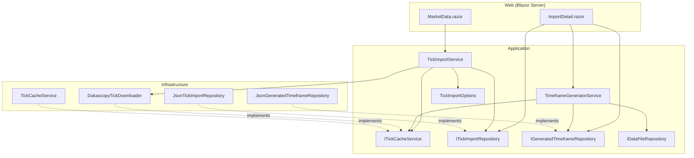
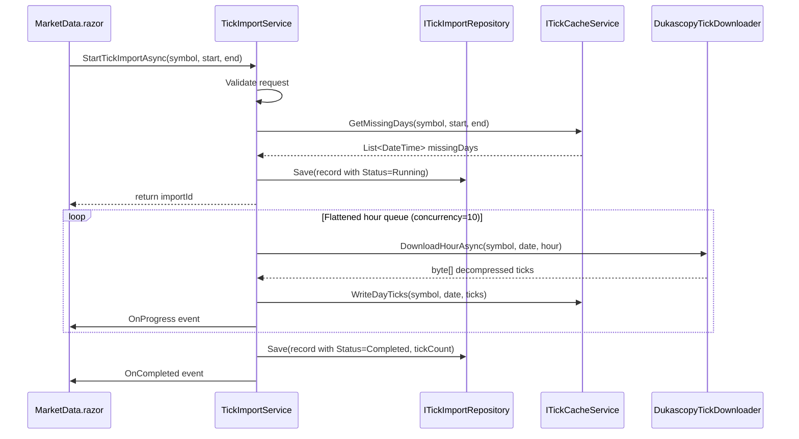
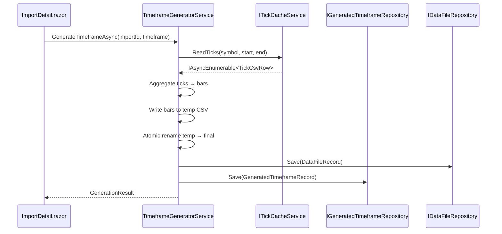
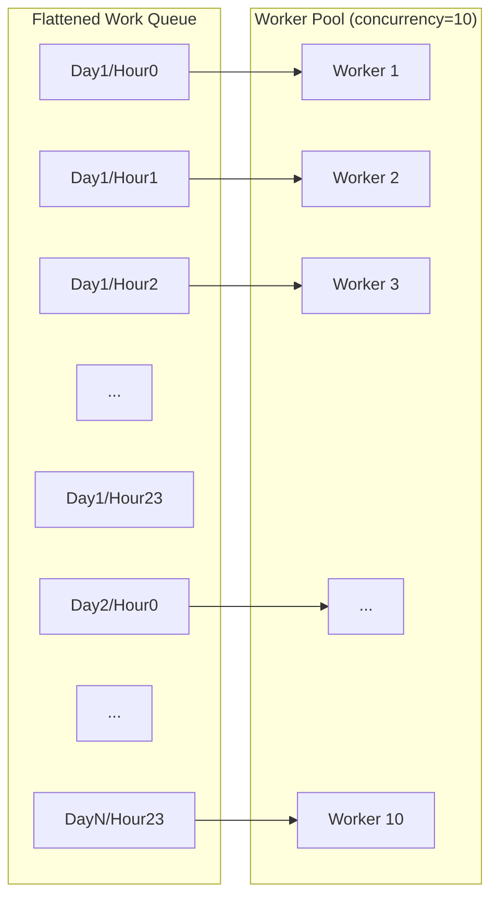

# Design Document — Tick Data First Import

## Overview

This design refactors the Dukascopy market data download workflow to a tick-first architecture. Instead of downloading pre-aggregated candle data at a user-selected timeframe, the system downloads raw tick data (20-byte binary records from Dukascopy's `h_ticks.bi5` files) and caches it as per-day CSV files. Users then generate any bar timeframe (1m, 5m, 15m, 30m, 1H, 4H, Daily) on demand from the stored tick data.

Key architectural decisions:
- **Tick data as master source** — raw tick data is downloaded once and cached permanently
- **Per-day CSV for internal tick cache** — enables incremental downloads; one file per trading day
- **Single consolidated CSV per generated timeframe** — what users see in Data Files
- **Master tick data is internal** — not visible in the Data Files page
- **Drill-down UI** — clicking a completed import opens a detail view for timeframe management
- **Incremental detection** — system detects existing tick data and only downloads missing days
- **High-concurrency downloader** — configurable concurrency (default 10), flattened work queue across all hours/days, connection pool tuning, weekend hour skipping, pipelined I/O

The existing `MarketDataImportService` and `DukascopyDataProvider` remain untouched. New services are added alongside them, following the same patterns.

---

## Architecture

### Layer Ownership

```
Application/TickImport/        — TickImportRecord, GeneratedTimeframeRecord,
                                  ITickCacheService, ITickImportRepository,
                                  IGeneratedTimeframeRepository, TickImportService,
                                  TimeframeGeneratorService, TickImportOptions
Infrastructure/TickImport/     — DukascopyTickDownloader, TickCacheService,
                                  JsonTickImportRepository, JsonGeneratedTimeframeRepository
Web/Components/Pages/          — MarketData.razor (amended), ImportDetail.razor (new)
```

### Dependency Rule (preserved)

```
Core ← Application ← Infrastructure ← { Cli, Api, Web }
```

No Core changes. The existing `TickRecord`, `BarRecord`, and `DukascopyHelpers.ParseTicks()` are reused as-is.

### Component Diagram



### Data Flow — Tick Import



### Data Flow — Timeframe Generation



---

## Components and Interfaces

### Application Layer — New Records

```csharp
namespace TradingResearchEngine.Application.TickImport;

/// <summary>Status of a tick data import job.</summary>
public enum TickImportStatus
{
    /// <summary>Import is actively downloading tick data.</summary>
    Running,
    /// <summary>All requested trading days have been downloaded.</summary>
    Completed,
    /// <summary>Import failed due to network or processing error.</summary>
    Failed,
    /// <summary>Import was cancelled by the user.</summary>
    Cancelled
}

/// <summary>
/// Persistent record of a tick data import job. Tracks the full lifecycle
/// from download initiation through completion.
/// </summary>
public sealed record TickImportRecord(
    string ImportId,
    string Source,
    string Symbol,
    DateTimeOffset RequestedStart,
    DateTimeOffset RequestedEnd,
    TickImportStatus Status,
    long? TotalTickCount = null,
    string? ErrorDetail = null,
    DateTimeOffset CreatedAt = default,
    DateTimeOffset? CompletedAt = null) : IHasId
{
    /// <inheritdoc/>
    public string Id => ImportId;
}

/// <summary>
/// Links a generated bar CSV file to its source tick import and timeframe.
/// </summary>
public sealed record GeneratedTimeframeRecord(
    string RecordId,
    string TickImportId,
    string Timeframe,
    string OutputFilePath,
    string OutputFileId,
    int BarCount,
    DateTimeOffset FirstBar,
    DateTimeOffset LastBar,
    DateTimeOffset GeneratedAt) : IHasId
{
    /// <inheritdoc/>
    public string Id => RecordId;
}
```

### Application Layer — Interfaces

```csharp
namespace TradingResearchEngine.Application.TickImport;

/// <summary>
/// Manages the per-day tick CSV cache. Provides coverage queries,
/// read access for timeframe generation, and write access for the downloader.
/// </summary>
public interface ITickCacheService
{
    /// <summary>Returns trading days in the range that are NOT yet cached for the symbol.</summary>
    Task<IReadOnlyList<DateTime>> GetMissingDaysAsync(
        string symbol, DateTime startDate, DateTime endDate, CancellationToken ct = default);

    /// <summary>Returns the date range of existing tick coverage for a symbol, or null if none.</summary>
    Task<(DateTime Earliest, DateTime Latest)?> GetCoverageAsync(
        string symbol, CancellationToken ct = default);

    /// <summary>Writes tick rows for a single day. Overwrites if file exists.</summary>
    Task WriteDayTicksAsync(
        string symbol, DateTime date, IReadOnlyList<TickCsvRow> ticks, CancellationToken ct = default);

    /// <summary>Streams all tick rows for the symbol across the given date range.</summary>
    IAsyncEnumerable<TickCsvRow> ReadTicksAsync(
        string symbol, DateTime startDate, DateTime endDate, CancellationToken ct = default);

    /// <summary>Returns the total tick count across all cached days for a symbol in the range.</summary>
    Task<long> GetTickCountAsync(
        string symbol, DateTime startDate, DateTime endDate, CancellationToken ct = default);
}

/// <summary>A single row in the per-day tick CSV cache.</summary>
public readonly record struct TickCsvRow(
    DateTimeOffset Timestamp,
    decimal Bid,
    decimal Ask,
    decimal BidVolume,
    decimal AskVolume);

/// <summary>Persistence for tick import records.</summary>
public interface ITickImportRepository
{
    Task<TickImportRecord?> GetAsync(string importId, CancellationToken ct = default);
    Task<IReadOnlyList<TickImportRecord>> ListAsync(CancellationToken ct = default);
    Task SaveAsync(TickImportRecord record, CancellationToken ct = default);
    Task DeleteAsync(string importId, CancellationToken ct = default);
}

/// <summary>Persistence for generated timeframe records.</summary>
public interface IGeneratedTimeframeRepository
{
    Task<GeneratedTimeframeRecord?> GetAsync(string recordId, CancellationToken ct = default);
    Task<IReadOnlyList<GeneratedTimeframeRecord>> ListByImportAsync(
        string tickImportId, CancellationToken ct = default);
    Task SaveAsync(GeneratedTimeframeRecord record, CancellationToken ct = default);
    Task DeleteAsync(string recordId, CancellationToken ct = default);
}
```

### Application Layer — TickImportOptions

```csharp
namespace TradingResearchEngine.Application.TickImport;

/// <summary>
/// Configuration options for the tick import downloader.
/// Bound via IOptions&lt;TickImportOptions&gt; from appsettings.json.
/// </summary>
public sealed class TickImportOptions
{
    /// <summary>Configuration section name.</summary>
    public const string SectionName = "TickImport";

    /// <summary>Maximum number of concurrent HTTP downloads. Default 10.</summary>
    public int MaxConcurrency { get; set; } = 10;

    /// <summary>Maximum connections per server for HttpClient. Matches MaxConcurrency by default.</summary>
    public int MaxConnectionsPerServer { get; set; } = 10;

    /// <summary>Maximum retry attempts for transient HTTP failures.</summary>
    public int MaxRetryAttempts { get; set; } = 3;

    /// <summary>Base directory for the tick cache. Defaults to data/tick-cache.</summary>
    public string CacheDirectory { get; set; } = "data/tick-cache";
}
```

### Application Layer — TickImportService

```csharp
namespace TradingResearchEngine.Application.TickImport;

/// <summary>
/// Orchestrates the tick data download lifecycle:
/// validate → detect coverage → build work queue → download concurrently → cache → complete.
/// Singleton. Only one tick import may run at a time.
/// </summary>
public sealed class TickImportService : IDisposable
{
    /// <summary>Raised on each progress step of a running import.</summary>
    public event Action<TickImportProgressUpdate>? OnProgress;

    /// <summary>Raised when an import completes (success, failure, or cancellation).</summary>
    public event Action<TickImportCompletionUpdate>? OnCompleted;

    /// <summary>
    /// Validates the request, detects existing coverage, creates a Running record,
    /// and launches the background download.
    /// </summary>
    public Task<string> StartTickImportAsync(
        string symbol, DateTimeOffset requestedStart, DateTimeOffset requestedEnd,
        CancellationToken ct = default);

    /// <summary>Cancels the running tick import.</summary>
    public void CancelImport(string importId);

    /// <summary>Returns the currently running import, if any.</summary>
    public ActiveTickImport? GetActiveImport();

    /// <summary>Resets orphaned Running records to Failed on startup.</summary>
    public Task RecoverOnStartupAsync(CancellationToken ct = default);
}

/// <summary>Progress update from a running tick import.</summary>
public sealed record TickImportProgressUpdate(
    string ImportId, int Current, int Total, string Label);

/// <summary>Completion notification from a finished tick import.</summary>
public sealed record TickImportCompletionUpdate(
    string ImportId, TickImportStatus Status, string? ErrorMessage);

/// <summary>Snapshot of the currently active tick import.</summary>
public sealed record ActiveTickImport(
    string ImportId, string Symbol,
    int Current, int Total, DateTimeOffset StartedAt);
```

### Application Layer — TimeframeGeneratorService

```csharp
namespace TradingResearchEngine.Application.TickImport;

/// <summary>
/// Reads cached tick data and produces aggregated bar CSV files at a requested timeframe.
/// Registers the output as a DataFileRecord and creates a GeneratedTimeframeRecord.
/// </summary>
public sealed class TimeframeGeneratorService
{
    /// <summary>
    /// Generates a bar CSV at the specified timeframe from the tick data
    /// associated with the given import.
    /// </summary>
    /// <exception cref="InvalidOperationException">
    /// A generation is already running for this import.
    /// </exception>
    public Task<GenerationResult> GenerateTimeframeAsync(
        string tickImportId, string timeframe,
        IProgressReporter? progress = null,
        CancellationToken ct = default);
}

/// <summary>Result of a timeframe generation operation.</summary>
public sealed record GenerationResult(
    string OutputFilePath,
    string OutputFileId,
    int BarCount,
    DateTimeOffset FirstBar,
    DateTimeOffset LastBar);
```

### Infrastructure Layer — DukascopyTickDownloader

```csharp
namespace TradingResearchEngine.Infrastructure.TickImport;

/// <summary>
/// High-concurrency tick downloader for Dukascopy h_ticks.bi5 files.
/// Flattens all hour-files across all trading days into a single work queue,
/// downloads with configurable concurrency, skips weekend hours, and pipelines
/// disk writes so I/O does not block the next batch of HTTP requests.
/// </summary>
public sealed class DukascopyTickDownloader
{
    /// <summary>
    /// Downloads tick data for all hours in the given trading days.
    /// Yields (date, hour, ticks) tuples as they complete.
    /// </summary>
    public IAsyncEnumerable<TickDownloadResult> DownloadAsync(
        string symbol, IReadOnlyList<DateTime> tradingDays,
        IProgress<(int current, int total)>? progress = null,
        CancellationToken ct = default);
}

/// <summary>Result of downloading a single hour's tick data.</summary>
public sealed record TickDownloadResult(
    DateTime Date, int Hour, IReadOnlyList<TickCsvRow> Ticks);
```

### Infrastructure Layer — TickCacheService

```csharp
namespace TradingResearchEngine.Infrastructure.TickImport;

/// <summary>
/// Implements ITickCacheService using per-day CSV files at:
/// {CacheDir}/{Symbol}/ticks/{yyyy}/{MM}/{dd}.csv
/// </summary>
public sealed class TickCacheService : ITickCacheService
{
    // CSV format: Timestamp,Bid,Ask,BidVolume,AskVolume
    // Timestamp: ISO 8601 with millisecond precision
    // Numerics: InvariantCulture decimal formatting
}
```

### Infrastructure Layer — JSON Repositories

Both `JsonTickImportRepository` and `JsonGeneratedTimeframeRepository` follow the existing `JsonFileRepository<T>` pattern — one JSON file per entity, stored in a configured base directory.

---

## Data Models

### Tick Cache File Layout

```
{CacheDir}/{Symbol}/ticks/{yyyy}/{MM}/{dd}.csv
```

Example: `data/tick-cache/EURUSD/ticks/2023/06/15.csv`

CSV columns:
```
Timestamp,Bid,Ask,BidVolume,AskVolume
2023-06-15T00:00:00.123+00:00,1.08234,1.08236,1.5,2.3
```

- Timestamp: ISO 8601 with millisecond precision (`O` format)
- Bid/Ask: decimal, InvariantCulture
- BidVolume/AskVolume: decimal, InvariantCulture

### Generated Timeframe Output Naming

Format: `dukascopy_{Symbol}_{Timeframe}_{StartYYYYMMDD}_{EndYYYYMMDD}.csv`

Examples:
- `dukascopy_EURUSD_1H_20200101_20250101.csv`
- `dukascopy_XAUUSD_Daily_20150101_20241231.csv`

Output CSV format (canonical engine format):
```
Timestamp,Open,High,Low,Close,Volume
2023-06-15T00:00:00.0000000+00:00,1.08234,1.08250,1.08220,1.08245,1523.7
```

### Tick-to-Bar Aggregation Rules

1. **Open** = first tick's bid price in the aggregation window
2. **High** = highest bid price across all ticks in the window
3. **Low** = lowest bid price across all ticks in the window
4. **Close** = last tick's bid price in the window
5. **Volume** = sum of bid volumes for all ticks in the window
6. **Window boundaries** = aligned to UTC midnight (same logic as `DukascopyHelpers.TruncateToInterval`)
7. **Empty windows** = skipped (no bar produced)

### TickImportRecord JSON Schema

```json
{
  "ImportId": "tick-abc123def456",
  "Source": "Dukascopy",
  "Symbol": "EURUSD",
  "RequestedStart": "2023-01-01T00:00:00+00:00",
  "RequestedEnd": "2024-01-01T00:00:00+00:00",
  "Status": "Completed",
  "TotalTickCount": 48293847,
  "ErrorDetail": null,
  "CreatedAt": "2024-12-01T10:30:00+00:00",
  "CompletedAt": "2024-12-01T10:45:23+00:00"
}
```

### GeneratedTimeframeRecord JSON Schema

```json
{
  "RecordId": "gen-abc123def456",
  "TickImportId": "tick-abc123def456",
  "Timeframe": "1H",
  "OutputFilePath": "data/dukascopy_EURUSD_1H_20230101_20240101.csv",
  "OutputFileId": "df-abc123def456",
  "BarCount": 6048,
  "FirstBar": "2023-01-02T00:00:00+00:00",
  "LastBar": "2023-12-29T23:00:00+00:00",
  "GeneratedAt": "2024-12-01T10:50:00+00:00"
}
```

### Download Work Queue Structure

The downloader flattens all work into a single queue for maximum throughput:



Weekend hours (Saturday 00:00 through Sunday 23:00) are excluded from the queue entirely, eliminating unnecessary 404 round-trips.

### Configuration (appsettings.json)

```json
{
  "TickImport": {
    "MaxConcurrency": 10,
    "MaxConnectionsPerServer": 10,
    "MaxRetryAttempts": 3,
    "CacheDirectory": "data/tick-cache"
  }
}
```

---


## Correctness Properties

*A property is a characteristic or behavior that should hold true across all valid executions of a system — essentially, a formal statement about what the system should do. Properties serve as the bridge between human-readable specifications and machine-verifiable correctness guarantees.*

### Property 1: Tick CSV Serialization Round-Trip

*For any* valid sequence of `TickCsvRow` values (with valid timestamps, positive bid/ask prices, and non-negative volumes), writing them to a per-day CSV file and then reading them back SHALL produce an equivalent sequence of tick rows with identical timestamps (to millisecond precision), bid, ask, bid volume, and ask volume values.

**Validates: Requirements 6.1, 2.2, 2.3, 2.4**

### Property 2: Incremental Detection Correctness

*For any* symbol, set of pre-cached trading days, and requested date range, the set of days identified as "missing" by `ITickCacheService.GetMissingDaysAsync` SHALL equal exactly the set of weekday dates in the requested range that are NOT present in the pre-cached set.

**Validates: Requirements 2.5, 3.1, 3.2**

### Property 3: Bar Aggregation OHLC and Volume Correctness

*For any* non-empty sequence of ticks within a single aggregation window, the generated bar SHALL have: Open equal to the first tick's bid price, High equal to the maximum bid price, Low equal to the minimum bid price, Close equal to the last tick's bid price, and Volume equal to the sum of all bid volumes.

**Validates: Requirements 4.7, 4.8**

### Property 4: Bar Timestamp Alignment

*For any* valid tick dataset and any supported timeframe, every generated bar's timestamp SHALL be aligned to the timeframe's interval boundary computed from UTC midnight (i.e., `timestamp.TotalMinutes % intervalMinutes == 0`).

**Validates: Requirements 4.2**

### Property 5: Bar High >= Low Invariant

*For any* valid tick dataset and any supported timeframe, every generated bar SHALL have its High price greater than or equal to its Low price.

**Validates: Requirements 6.2**

### Property 6: Bars in Strictly Ascending Timestamp Order

*For any* valid tick dataset and any supported timeframe, the sequence of generated bars SHALL have strictly ascending timestamps (each bar's timestamp is greater than the previous bar's timestamp).

**Validates: Requirements 6.3**

### Property 7: Tick Conservation

*For any* valid tick dataset and any supported timeframe, the total number of ticks that fall within any aggregation window (i.e., ticks on weekdays) SHALL equal the sum of tick counts consumed to produce each generated bar.

**Validates: Requirements 6.4**

### Property 8: TickImportRecord JSON Round-Trip

*For any* valid `TickImportRecord` instance (with valid ImportId, Source, Symbol, date range, status, and optional fields), serializing to JSON and then deserializing SHALL produce a record equivalent to the original.

**Validates: Requirements 9.4**

### Property 9: GeneratedTimeframeRecord JSON Round-Trip

*For any* valid `GeneratedTimeframeRecord` instance (with valid RecordId, TickImportId, Timeframe, file path, bar count, date range, and generation timestamp), serializing to JSON and then deserializing SHALL produce a record equivalent to the original.

**Validates: Requirements 10.3**

### Property 10: Work Queue Excludes Weekend Hours

*For any* date range, the flattened download work queue SHALL contain zero entries for Saturday or Sunday dates, and SHALL contain exactly `tradingDays × 24` entries where `tradingDays` is the count of weekdays in the range.

**Validates: Requirements 13.4, 13.2**

---

## Error Handling

| Scenario | Behaviour | Persistence |
|---|---|---|
| Invalid request (bad range, unsupported symbol) | Inline validation errors, download blocked | Not stored |
| Import already running | Inline error: "A tick import is already in progress" | Not stored |
| Network failure during download (retries exhausted) | ❌ Failed badge, error detail in expandable panel | `Status = Failed`, `ErrorDetail` set, cached days retained |
| LZMA decompression failure for a single hour | Log warning, skip hour (zero ticks for that hour), continue | Partial data cached; import may still complete |
| All hours for a day return 404 (no data available) | Skip day silently (common for holidays) | No cache file written for that day |
| User cancellation | ⚠️ Cancelled badge | `Status = Cancelled`, all fully-written cache files retained |
| App restart during import | ❌ Failed badge on next startup | `Status = Failed`, `ErrorDetail = "Interrupted by application restart"`, cache files retained |
| Timeframe generation with no ticks in range | Error: "No tick data available for the requested range" | No GeneratedTimeframeRecord created |
| Disk full during cache write | ❌ Failed badge, IOException detail | `Status = Failed`, partial day file deleted |
| Disk full during timeframe generation | Error returned to UI, temp file deleted | No DataFileRecord or GeneratedTimeframeRecord created |
| Concurrent generation attempt for same import | Inline error: "Generation already in progress for this import" | Not stored |
| Duplicate import (same symbol/range already completed) | Completes immediately with zero downloads (incremental detection) | New TickImportRecord with existing tick count |

### Retry Strategy

The `DukascopyTickDownloader` uses Polly for HTTP retry:
- **Max retries**: 3 (configurable via `TickImportOptions.MaxRetryAttempts`)
- **Backoff**: Exponential (2^attempt seconds)
- **Retried conditions**: HTTP 5xx, network timeouts, `HttpRequestException` without 404 status
- **Not retried**: HTTP 404 (expected for hours with no data), HTTP 4xx

### Graceful Degradation

- Individual hour failures (404, decompression error) do not fail the entire import
- The import continues with remaining hours; the day's cache file contains whatever ticks were successfully parsed
- Only if ALL hours across ALL days fail does the import transition to Failed status
- Progress reporting continues even when individual hours are skipped

---

## Testing Strategy

### Property-Based Tests (FsCheck.Xunit in UnitTests)

All property tests use `[Property(MaxTest = 100)]` minimum and are tagged with:
```csharp
// Feature: tick-data-first-import, Property N: <description>
```

| Property | Test Class | Validates |
|---|---|---|
| 1: Tick CSV round-trip | `TickCsvSerializationProperties` | 6.1, 2.2, 2.3, 2.4 |
| 2: Incremental detection | `TickCacheDetectionProperties` | 2.5, 3.1, 3.2 |
| 3: Bar aggregation OHLC/Volume | `TickToBarAggregationProperties` | 4.7, 4.8 |
| 4: Bar timestamp alignment | `TickToBarAggregationProperties` | 4.2 |
| 5: Bar High >= Low | `TickToBarAggregationProperties` | 6.2 |
| 6: Bars ascending order | `TickToBarAggregationProperties` | 6.3 |
| 7: Tick conservation | `TickToBarAggregationProperties` | 6.4 |
| 8: TickImportRecord JSON round-trip | `TickImportRecordProperties` | 9.4 |
| 9: GeneratedTimeframeRecord JSON round-trip | `GeneratedTimeframeRecordProperties` | 10.3 |
| 10: Work queue excludes weekends | `DownloadWorkQueueProperties` | 13.4, 13.2 |

### Unit Tests (xUnit in UnitTests)

| Test Class | Tests | Validates |
|---|---|---|
| `TickImportServiceTests` | Start creates Running record | 1.1 |
| `TickImportServiceTests` | Rejects start >= end | 1.7 |
| `TickImportServiceTests` | Rejects unsupported symbol | 1.8 |
| `TickImportServiceTests` | Rejects concurrent import | 1.9, 12.1 |
| `TickImportServiceTests` | Cancellation sets Cancelled status | 1.6 |
| `TickImportServiceTests` | Network failure sets Failed status | 1.5 |
| `TickImportServiceTests` | Completion records tick count | 1.4 |
| `TickImportServiceTests` | All days cached → immediate completion | 3.3 |
| `TickImportServiceTests` | Startup recovery resets Running to Failed | 9.3, 12.4 |
| `TimeframeGeneratorServiceTests` | Generates correct output filename | 5.1 |
| `TimeframeGeneratorServiceTests` | Registers DataFileRecord on completion | 4.5 |
| `TimeframeGeneratorServiceTests` | Creates GeneratedTimeframeRecord | 4.6 |
| `TimeframeGeneratorServiceTests` | Overwrites existing file and updates record | 5.2 |
| `TimeframeGeneratorServiceTests` | Rejects concurrent generation for same import | 12.2 |
| `TimeframeGeneratorServiceTests` | Empty windows produce no bars | 4.9 |
| `TimeframeGeneratorServiceTests` | Atomic write via temp file | 5.3, 12.3 |
| `TickCachePathTests` | Path follows expected pattern | 2.1 |
| `TickCachePathTests` | Cache files not registered as DataFileRecords | 2.6, 11.2 |

### Integration Tests (xUnit in IntegrationTests)

| Test Class | Tests | Validates |
|---|---|---|
| `JsonTickImportRepositoryTests` | CRUD operations against temp directory | 9.2 |
| `JsonGeneratedTimeframeRepositoryTests` | CRUD operations against temp directory | 10.2 |
| `TickCacheServiceTests` | Write and read tick files from disk | 2.1, 2.2 |
| `TickImportFlowTests` | Full import with mocked HTTP → cache files created | 1.3, 1.4 |
| `TimeframeGenerationFlowTests` | End-to-end: cached ticks → generated CSV → DataFileRecord | 4.1, 4.4, 4.5, 4.6 |
| `DeletionFlowTests` | Delete generated file removes records, keeps tick cache | 11.3 |

### Test Dependencies

- **UnitTests**: References Application and Core only. Uses Moq for `ITickCacheService`, `ITickImportRepository`, `IGeneratedTimeframeRepository`, `IDataFileRepository`. Uses FsCheck.Xunit for property tests.
- **IntegrationTests**: References all projects. Uses real file system with temp directories. Uses mocked `HttpMessageHandler` for Dukascopy HTTP calls.

---

## Folder Structure Changes

```
src/TradingResearchEngine.Application/
  TickImport/                                    # NEW folder
    TickImportRecord.cs                          # NEW
    TickImportStatus.cs                          # NEW
    GeneratedTimeframeRecord.cs                  # NEW
    TickCsvRow.cs                                # NEW
    ITickCacheService.cs                         # NEW
    ITickImportRepository.cs                     # NEW
    IGeneratedTimeframeRepository.cs             # NEW
    TickImportService.cs                         # NEW
    TimeframeGeneratorService.cs                 # NEW
    TickImportOptions.cs                         # NEW
    TickImportProgressUpdate.cs                  # NEW

src/TradingResearchEngine.Infrastructure/
  TickImport/                                    # NEW folder
    DukascopyTickDownloader.cs                   # NEW
    TickCacheService.cs                          # NEW
    JsonTickImportRepository.cs                  # NEW
    JsonGeneratedTimeframeRepository.cs          # NEW

src/TradingResearchEngine.Web/
  Components/Pages/
    MarketData.razor                             # AMENDED (remove timeframe, tick-first flow)
    ImportDetail.razor                           # NEW (drill-down detail view)

src/TradingResearchEngine.UnitTests/
  TickImport/                                    # NEW folder
    TickImportServiceTests.cs                    # NEW
    TimeframeGeneratorServiceTests.cs            # NEW
    TickCachePathTests.cs                        # NEW
    TickCsvSerializationProperties.cs            # NEW (PBT)
    TickCacheDetectionProperties.cs              # NEW (PBT)
    TickToBarAggregationProperties.cs            # NEW (PBT)
    TickImportRecordProperties.cs                # NEW (PBT)
    GeneratedTimeframeRecordProperties.cs        # NEW (PBT)
    DownloadWorkQueueProperties.cs               # NEW (PBT)

src/TradingResearchEngine.IntegrationTests/
  TickImport/                                    # NEW folder
    JsonTickImportRepositoryTests.cs             # NEW
    JsonGeneratedTimeframeRepositoryTests.cs     # NEW
    TickCacheServiceTests.cs                     # NEW
    TickImportFlowTests.cs                       # NEW
    TimeframeGenerationFlowTests.cs              # NEW
    DeletionFlowTests.cs                         # NEW
```

---

## Web UI Changes

### Market Data Page — Amended (`/market-data`)

The timeframe selector is removed from the import form. The form now initiates a tick data download:

```
┌──────────────────────────────────────────────────────────────┐
│ Market Data                                                  │
├──────────────────────────────────────────────────────────────┤
│ IMPORT TICK DATA FROM PROVIDER                               │
│                                                              │
│ Source: [Dukascopy ▼]  Symbol: [EURUSD — Euro/USD ▼]        │
│ Start: [2020-01-01]   End: [2025-01-01]                     │
│ Quick: [1Y] [3Y] [5Y] [10Y]                                │
│                                                              │
│                              [Start Download]                │
├──────────────────────────────────────────────────────────────┤
│ IMPORT HISTORY                                               │
│ ┌──────────────────────────────────────────────────────────┐ │
│ │ ✅ EURUSD · 2020-01-01 → 2025-01-01 · 48.3M ticks      │ │
│ │    Downloaded 2024-12-01 · Dukascopy                     │ │
│ │    [View Details ▸]                                      │ │
│ └──────────────────────────────────────────────────────────┘ │
│ ┌──────────────────────────────────────────────────────────┐ │
│ │ 🔄 GBPUSD · 2022-01-01 → 2024-01-01 · 37%              │ │
│ │    Downloading hour 892 of 2,400                         │ │
│ │    [━━━━━━━━░░░░░░░░░░░░] [Cancel]                       │ │
│ └──────────────────────────────────────────────────────────┘ │
└──────────────────────────────────────────────────────────────┘
```

### Import Detail View — New Component

Shown when user clicks "View Details" on a completed import:

```
┌──────────────────────────────────────────────────────────────┐
│ ← Back to Market Data                                        │
│                                                              │
│ EURUSD Tick Import                                           │
│ Source: Dukascopy · Range: 2020-01-01 → 2025-01-01          │
│ Total Ticks: 48,293,847 · Downloaded: 2024-12-01 10:45      │
├──────────────────────────────────────────────────────────────┤
│ GENERATE TIMEFRAME                                           │
│                                                              │
│ Timeframe: [1H ▼]  [Generate]                               │
│                                                              │
│ ⚠ 1H has already been generated. Regenerating will          │
│   overwrite the existing file.                               │
├──────────────────────────────────────────────────────────────┤
│ GENERATED TIMEFRAMES                                         │
│ ┌──────────────────────────────────────────────────────────┐ │
│ │ 1H  · dukascopy_EURUSD_1H_20200101_20250101.csv         │ │
│ │      6,048 bars · Generated 2024-12-01 10:50             │ │
│ │      [View in Data Files]                                │ │
│ ├──────────────────────────────────────────────────────────┤ │
│ │ 4H  · dukascopy_EURUSD_4H_20200101_20250101.csv         │ │
│ │      1,512 bars · Generated 2024-12-01 11:02             │ │
│ │      [View in Data Files]                                │ │
│ └──────────────────────────────────────────────────────────┘ │
└──────────────────────────────────────────────────────────────┘
```

### Navigation

No navigation changes needed — the existing "Market Data" nav link at `/market-data` remains. The Import Detail View is accessed via drill-down from the import history, not as a separate nav item.
