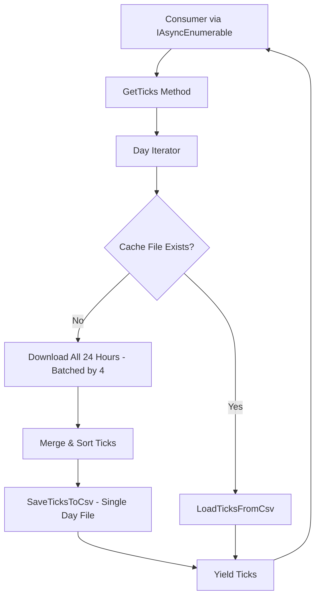
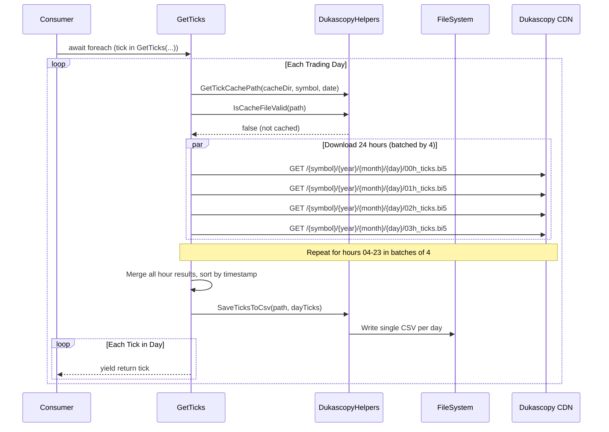
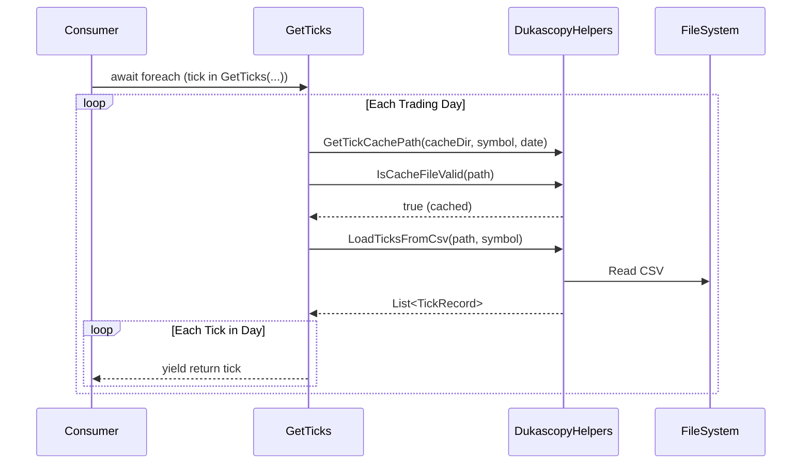

# Design Document: Tick Data Streaming Download

## Overview

The `DukascopyDataProvider.GetTicks()` method currently downloads tick data from Dukascopy's datafeed without any disk caching. While it uses `IAsyncEnumerable<TickRecord>` for streaming to consumers, the lack of persistence means multi-year downloads must restart from scratch on every run, and the download process itself holds all intermediate data in memory across concurrent batch operations.

This design introduces **per-day tick caching** to disk — mirroring the existing per-day bar caching pattern exactly — so that already-downloaded days are loaded from cache on subsequent runs, memory usage stays bounded to one day's worth of ticks at a time, and the existing `IAsyncEnumerable<TickRecord>` streaming contract is preserved unchanged.

**Why per-day (not per-hour or per-month)?**
- Per-hour files are too small (~200-500 KB each), creating excessive file I/O overhead (6,240 files per symbol per year)
- Per-day files are ~5-12 MB for active pairs like EURUSD — well within safe memory bounds
- Per-day matches the existing bar caching path convention exactly (`{cacheDir}/{symbol}/ticks/{year}/{month}/{day:D2}.csv`)
- Corruption blast radius is acceptable: lose 1 day, re-download 24 hourly requests
- Per-month (30-day) was rejected: files too large (110-260 MB), memory accumulation defeats streaming purpose, corruption loses too much data

The solution follows the same cache-first pattern already proven for bar data: check cache → load from disk if valid → download and persist if missing → yield to consumer.

## Architecture



## Sequence Diagrams

### Cache Miss Flow (First Download)



### Cache Hit Flow (Subsequent Run)



## Components and Interfaces

### Component 1: DukascopyHelpers (Extended)

**Purpose**: Provides tick CSV serialization/deserialization and tick cache path generation, extending the existing static helper class.

**New Interface**:
```csharp
public static class DukascopyHelpers
{
    /// <summary>
    /// Returns the per-day tick cache file path for a symbol and date.
    /// Creates the directory structure if it does not exist.
    /// Path convention: {cacheDir}/{symbol}/ticks/{year:D4}/{month:D2}/{day:D2}.csv
    /// Mirrors the existing bar cache path convention exactly.
    /// </summary>
    public static string GetTickCachePath(string cacheDir, string symbol, DateTime date);

    /// <summary>
    /// Writes tick records to a CSV file in canonical engine format.
    /// Columns: Timestamp, BidPrice, BidSize, AskPrice, AskSize, LastPrice, LastSize
    /// </summary>
    public static void SaveTicksToCsv(string path, List<TickRecord> ticks);

    /// <summary>
    /// Loads tick records from a canonical tick CSV file.
    /// Returns an empty list if the file is malformed or empty.
    /// </summary>
    public static List<TickRecord> LoadTicksFromCsv(string path, string symbol);
}
```

**Responsibilities**:
- Generate consistent cache paths following the convention `{cacheDir}/{symbol}/ticks/{year:D4}/{month:D2}/{day:D2}.csv`
- Serialize `TickRecord` to CSV with full precision (no data loss on round-trip)
- Deserialize CSV back to `TickRecord` with proper error handling for malformed rows
- Create directory structure on demand (same pattern as `GetDayCachePath`)

### Component 2: DukascopyDataProvider.GetTicks (Modified)

**Purpose**: Orchestrates the cache-first tick download flow, yielding ticks one day at a time with bounded memory.

**Modified Interface** (public contract unchanged):
```csharp
public sealed class DukascopyDataProvider : IDataProvider
{
    /// <summary>
    /// Streams tick records for the given symbol over the specified range.
    /// Uses per-day disk caching to avoid re-downloading previously fetched data.
    /// Memory usage is bounded to one day's worth of ticks at a time (~5-12 MB for EURUSD).
    /// </summary>
    public async IAsyncEnumerable<TickRecord> GetTicks(
        string symbol, DateTimeOffset from, DateTimeOffset to,
        [EnumeratorCancellation] CancellationToken ct = default);
}
```

**Responsibilities**:
- Check per-day cache before downloading
- On cache miss: download all 24 hours (batched by 4 concurrently), merge, sort, persist, yield
- On cache hit: load from CSV, yield
- Yield ticks within the requested time range
- Maintain bounded memory (one day at a time, sequential day processing)
- Log cache hit/miss statistics

## Data Models

### Tick CSV Format

```
Timestamp,BidPrice,BidSize,AskPrice,AskSize,LastPrice,LastSize
2023-01-02T00:00:00.123+00:00,1.06845,1.5,1.06847,2.0,1.06846,1.5
2023-01-02T00:00:00.456+00:00,1.06844,1.0,1.06846,1.8,1.06845,1.0
```

**Column Definitions**:
| Column | Type | Description |
|--------|------|-------------|
| Timestamp | DateTimeOffset (ISO 8601) | Tick timestamp in UTC |
| BidPrice | decimal | Best bid price |
| BidSize | decimal | Best bid volume |
| AskPrice | decimal | Best ask price |
| AskSize | decimal | Best ask volume |
| LastPrice | decimal | Synthetic last trade price (mid) |
| LastSize | decimal | Synthetic last trade size |

**Validation Rules**:
- All price fields must be positive
- All size fields must be non-negative
- Timestamp must be parseable as `DateTimeOffset`
- Rows with fewer than 7 columns are skipped (malformed)
- File must have a header row matching the expected columns

### Cache Path Convention

```
{cacheDir}/{symbol}/ticks/{year:D4}/{month:D2}/{day:D2}.csv
```

Example: `data/dukascopy-cache/EURUSD/ticks/2023/01/02.csv`

This mirrors the existing bar cache path exactly:
```
{cacheDir}/{symbol}/{priceType}/{year:D4}/{month:D2}/{day:D2}.csv
```

## Algorithmic Pseudocode

### Main Tick Streaming Algorithm

```csharp
ALGORITHM GetTicks(symbol, from, to, ct)
INPUT: symbol ∈ String, from ∈ DateTimeOffset, to ∈ DateTimeOffset, ct ∈ CancellationToken
OUTPUT: IAsyncEnumerable<TickRecord>

BEGIN
    pointSize ← PointSizes[symbol] ?? 100_000
    dates ← BuildTradingDays(from.Date, to.Date)
    cacheHits ← 0
    cacheMisses ← 0

    FOR EACH date IN dates DO
        ct.ThrowIfCancellationRequested()

        cachePath ← GetTickCachePath(_cacheDir, symbol, date)

        IF IsCacheFileValid(cachePath) THEN
            dayTicks ← LoadTicksFromCsv(cachePath, symbol)
            cacheHits ← cacheHits + 1
        ELSE
            dayTicks ← await FetchAndCacheDayTicksAsync(symbol, date, pointSize, ct)
            cacheMisses ← cacheMisses + 1
        END IF

        FOR EACH tick IN dayTicks DO
            IF tick.Timestamp >= from AND tick.Timestamp <= to THEN
                YIELD RETURN tick
            END IF
        END FOR

        // Release day's ticks for GC before moving to next day
        dayTicks ← null
    END FOR

    Log.Information("Tick cache stats: {Hits} hits, {Misses} misses", cacheHits, cacheMisses)
END
```

**Preconditions:**
- `symbol` is non-null and non-empty
- `from` <= `to`
- `_cacheDir` is a valid writable directory path

**Postconditions:**
- All yielded ticks have `Timestamp` within `[from, to]`
- All yielded ticks have `Symbol == symbol`
- After completion, all successfully downloaded days are persisted to disk
- Memory usage never exceeds one day's worth of ticks plus framework overhead (~5-12 MB for EURUSD)

**Loop Invariants:**
- At any point during iteration, only the current day's ticks are held in memory
- All previously yielded ticks have been released for GC
- Cache files written are immediately valid for future reads

### Day Download and Cache Algorithm

```csharp
ALGORITHM FetchAndCacheDayTicksAsync(symbol, date, pointSize, ct)
INPUT: symbol ∈ String, date ∈ DateTime, pointSize ∈ decimal, ct ∈ CancellationToken
OUTPUT: List<TickRecord>

BEGIN
    allHourTicks ← new List<TickRecord>()

    // Download all 24 hours, batched by 4 concurrently for speed
    hourBatches ← [0..23].Chunk(4)  // 6 batches of 4 hours each

    FOR EACH batch IN hourBatches DO
        ct.ThrowIfCancellationRequested()
        tasks ← batch.Select(hour => FetchHourTicksAsync(symbol, date, hour, pointSize, ct))
        results ← await Task.WhenAll(tasks)

        FOR EACH hourResult IN results DO
            allHourTicks.AddRange(hourResult)
        END FOR
    END FOR

    // Sort all ticks by timestamp to ensure chronological order
    allHourTicks.Sort((a, b) => a.Timestamp.CompareTo(b.Timestamp))

    // Persist as single day file
    IF allHourTicks.Count > 0 THEN
        cachePath ← GetTickCachePath(_cacheDir, symbol, date)
        TRY
            SaveTicksToCsv(cachePath, allHourTicks)
        CATCH ex
            Log.Debug("Failed to cache day ticks: {Message}", ex.Message)
        END TRY
    END IF

    RETURN allHourTicks
END
```

**Preconditions:**
- Network is available (or individual hours will fail gracefully)
- `_cacheDir` is writable

**Postconditions:**
- Returns merged, sorted list of all ticks for the day
- If any ticks were downloaded: cache file is written (single file per day)
- If all 24 hours return empty: returns empty list, no cache file written
- Individual hour failures do not prevent other hours from being included

**Loop Invariants:**
- Each batch of 4 concurrent downloads completes before the next batch starts
- `allHourTicks` accumulates results from all completed batches

### Tick CSV Serialization Algorithm

```csharp
ALGORITHM SaveTicksToCsv(path, ticks)
INPUT: path ∈ String, ticks ∈ List<TickRecord>
OUTPUT: void (side effect: file written to disk)

BEGIN
    ASSERT path is not null/empty
    ASSERT ticks is not null

    dir ← Path.GetDirectoryName(path)
    IF dir does not exist THEN
        Directory.CreateDirectory(dir)
    END IF

    OPEN StreamWriter(path)
    WRITE "Timestamp,BidPrice,BidSize,AskPrice,AskSize,LastPrice,LastSize"

    FOR EACH tick IN ticks DO
        WRITE format("{Timestamp:O},{BidPrice},{BidSize},{AskPrice},{AskSize},{LastPrice},{LastSize}",
            tick.Timestamp,
            tick.BidLevels[0].Price, tick.BidLevels[0].Size,
            tick.AskLevels[0].Price, tick.AskLevels[0].Size,
            tick.LastTrade.Price, tick.LastTrade.Volume)
    END FOR

    CLOSE writer
END
```

**Preconditions:**
- `path` is a valid file system path
- `ticks` contains at least one element (caller checks before calling)
- Each tick has at least one BidLevel and one AskLevel

**Postconditions:**
- File at `path` contains a header row plus one row per tick
- File is immediately readable by `LoadTicksFromCsv`
- All decimal values are written with `InvariantCulture` formatting

### Tick CSV Deserialization Algorithm

```csharp
ALGORITHM LoadTicksFromCsv(path, symbol)
INPUT: path ∈ String, symbol ∈ String
OUTPUT: List<TickRecord>

BEGIN
    ticks ← new List<TickRecord>()

    OPEN StreamReader(path)
    SKIP header line

    WHILE (line ← ReadLine()) is not null DO
        parts ← line.Split(',')
        IF parts.Length < 7 THEN CONTINUE

        TRY
            timestamp ← DateTimeOffset.Parse(parts[0], InvariantCulture)
            bidPrice ← decimal.Parse(parts[1], InvariantCulture)
            bidSize ← decimal.Parse(parts[2], InvariantCulture)
            askPrice ← decimal.Parse(parts[3], InvariantCulture)
            askSize ← decimal.Parse(parts[4], InvariantCulture)
            lastPrice ← decimal.Parse(parts[5], InvariantCulture)
            lastSize ← decimal.Parse(parts[6], InvariantCulture)

            tick ← new TickRecord(
                symbol,
                [new BidLevel(bidPrice, bidSize)],
                [new AskLevel(askPrice, askSize)],
                new LastTrade(lastPrice, lastSize, timestamp),
                timestamp)

            ticks.Add(tick)
        CATCH
            CONTINUE  // skip malformed rows
        END TRY
    END WHILE

    CLOSE reader
    RETURN ticks
END
```

**Preconditions:**
- `path` exists and is readable
- `symbol` is non-null

**Postconditions:**
- Returns a list of valid `TickRecord` objects
- Malformed rows are silently skipped (no exceptions propagated)
- Returned ticks are in file order (chronological within the day)

## Key Functions with Formal Specifications

### Function 1: GetTickCachePath

```csharp
/// <summary>
/// Returns the per-day tick cache file path for a symbol and date.
/// Creates the directory structure if it does not exist.
/// </summary>
public static string GetTickCachePath(string cacheDir, string symbol, DateTime date)
```

**Preconditions:**
- `cacheDir` is non-null and represents a valid directory path
- `symbol` is non-null and non-empty
- `date` is a valid date

**Postconditions:**
- Returns a path matching pattern `{cacheDir}/{symbol}/ticks/{year:D4}/{month:D2}/{day:D2}.csv`
- The directory portion of the returned path exists on disk
- The returned path is deterministic for the same inputs

### Function 2: SaveTicksToCsv

```csharp
/// <summary>
/// Writes tick records to a CSV file in canonical engine format.
/// </summary>
public static void SaveTicksToCsv(string path, List<TickRecord> ticks)
```

**Preconditions:**
- `path` is non-null and represents a valid file path
- `ticks` is non-null and non-empty
- Each tick has at least one BidLevel and one AskLevel

**Postconditions:**
- File at `path` contains header + N data rows where N = ticks.Count
- File size > 60 bytes (passes `IsCacheFileValid`)
- `LoadTicksFromCsv(path, symbol)` returns a list equal in count and values to the input

**Loop Invariants:** N/A (single-pass write)

### Function 3: LoadTicksFromCsv

```csharp
/// <summary>
/// Loads tick records from a canonical tick CSV file.
/// </summary>
public static List<TickRecord> LoadTicksFromCsv(string path, string symbol)
```

**Preconditions:**
- `path` exists and is readable
- `symbol` is non-null and non-empty

**Postconditions:**
- Returns a list of valid TickRecord objects (may be empty if file is malformed)
- No exceptions thrown for malformed data (graceful degradation)
- Returned ticks preserve chronological order from file

**Loop Invariants:**
- All previously parsed ticks in the result list are valid TickRecord instances

### Function 4: FetchAndCacheDayTicksAsync (new private method)

```csharp
/// <summary>
/// Downloads all 24 hours of tick data for a single day (batched by 4 concurrently),
/// merges into a sorted list, persists to a single cache file, and returns the ticks.
/// Returns empty list if the day has no data across all hours.
/// </summary>
private async Task<List<TickRecord>> FetchAndCacheDayTicksAsync(
    string symbol, DateTime date, decimal pointSize, CancellationToken ct)
```

**Preconditions:**
- Network is available (or individual hours will fail gracefully)
- `_cacheDir` is writable

**Postconditions:**
- If data exists: returns merged/sorted ticks AND single cache file is written
- If no data across all 24 hours: returns empty list, no cache file written
- Cache file (if written) passes `IsCacheFileValid`
- Ticks in returned list are sorted by timestamp

## Example Usage

```csharp
// Example 1: Basic tick streaming with automatic per-day caching
var provider = new DukascopyDataProvider(httpClient, logger, cacheDir: "/data/cache");

await foreach (var tick in provider.GetTicks("EURUSD",
    new DateTimeOffset(2023, 1, 1, 0, 0, 0, TimeSpan.Zero),
    new DateTimeOffset(2023, 12, 31, 23, 59, 59, TimeSpan.Zero),
    cancellationToken))
{
    // Process tick — only one day's worth in memory at a time (~5-12 MB)
    ProcessTick(tick);
}

// Example 2: Second run — loads from cache, no re-download
// Same call as above, but days already cached are loaded from disk instantly
// Only 260 cache checks per year (one per trading day) instead of 6,240
await foreach (var tick in provider.GetTicks("EURUSD",
    new DateTimeOffset(2023, 1, 1, 0, 0, 0, TimeSpan.Zero),
    new DateTimeOffset(2023, 12, 31, 23, 59, 59, TimeSpan.Zero),
    cancellationToken))
{
    ProcessTick(tick);
}

// Example 3: Direct use of helper methods
var cachePath = DukascopyHelpers.GetTickCachePath("/data/cache", "EURUSD",
    new DateTime(2023, 6, 15));
// Returns: "/data/cache/EURUSD/ticks/2023/06/15.csv"

// Serialize a full day's ticks
DukascopyHelpers.SaveTicksToCsv(cachePath, dayTicks);

// Deserialize a full day's ticks
var loaded = DukascopyHelpers.LoadTicksFromCsv(cachePath, "EURUSD");
```

## Correctness Properties

*A property is a characteristic or behavior that should hold true across all valid executions of a system — essentially, a formal statement about what the system should do. Properties serve as the bridge between human-readable specifications and machine-verifiable correctness guarantees.*

### Property 1: Serialization round-trip fidelity

*For any* valid list of `TickRecord` objects, writing via `SaveTicksToCsv` then reading via `LoadTicksFromCsv` shall produce a list with identical count and identical field values (Timestamp, BidPrice, BidSize, AskPrice, AskSize, LastPrice, LastSize) to the original input.

**Validates: Requirements 4.1, 4.2, 3.4, 2.3, 2.4**

### Property 2: Cache file validity after write

*For any* non-empty list of `TickRecord` objects, the file produced by `SaveTicksToCsv` shall have a size exceeding 60 bytes and therefore pass `IsCacheFileValid`.

**Validates: Requirements 2.2, 10.4**

### Property 3: Chronological ordering after merge

*For any* collection of tick lists from multiple hours (potentially unsorted), merging and sorting by timestamp shall produce a list in non-decreasing timestamp order.

**Validates: Requirements 8.1, 8.2, 7.2**

### Property 4: Timestamp range filtering

*For any* list of tick records and any `from`/`to` range, the filtered output shall contain only ticks with `Timestamp >= from` and `Timestamp <= to`, and shall contain all ticks from the input that satisfy that predicate.

**Validates: Requirements 9.1, 9.2**

### Property 5: Malformed row resilience

*For any* CSV file containing a mix of valid tick rows and malformed rows (fewer than 7 columns or unparseable values), `LoadTicksFromCsv` shall return exactly the valid rows without throwing an exception, and the count of returned ticks shall equal the count of well-formed rows in the file.

**Validates: Requirements 3.2, 3.3, 10.2**

### Property 6: Cache path determinism

*For any* valid combination of `cacheDir`, `symbol`, and `date`, calling `GetTickCachePath` shall always return the same string, and that string shall match the pattern `{cacheDir}/{symbol}/ticks/{year:D4}/{month:D2}/{day:D2}.csv`.

**Validates: Requirements 1.1, 1.3**

## Error Handling

### Error Scenario 1: Network Failure During Download

**Condition**: HTTP request to Dukascopy CDN fails after retry exhaustion for one or more hours
**Response**: `FetchHourTicksAsync` catches `HttpRequestException` and returns empty list for that hour
**Recovery**: Other hours in the day still succeed. The day file is written with whatever ticks were obtained. If ALL hours fail, no file is written and next run retries the entire day.

### Error Scenario 2: Disk Full During Cache Write

**Condition**: `SaveTicksToCsv` throws `IOException` when writing the day file to disk
**Response**: Exception is caught and logged at Debug level (same pattern as bar caching)
**Recovery**: Ticks are still yielded to consumer from memory. Next run will attempt to re-download and cache the day again.

### Error Scenario 3: Corrupted Cache File

**Condition**: Cache file exists but contains malformed data (partial write, manual edit)
**Response**: `IsCacheFileValid` returns false (file too small) OR `LoadTicksFromCsv` returns empty list
**Recovery**: System treats as cache miss and re-downloads all 24 hours for that day. Successful download overwrites the corrupted file.

### Error Scenario 4: Cancellation Requested

**Condition**: `CancellationToken` is triggered during iteration
**Response**: `ct.ThrowIfCancellationRequested()` at day boundary throws `OperationCanceledException`
**Recovery**: Consumer handles cancellation. Already-cached days remain valid for future runs. The in-progress day is not cached (no partial file).

### Error Scenario 5: LZMA Decompression Failure

**Condition**: Downloaded `.bi5` file for a specific hour is corrupted or truncated
**Response**: `Decompress` throws, caught in `FetchHourTicksAsync`, returns empty list for that hour with warning log
**Recovery**: Other hours in the day still succeed. The day file is written without the failed hour's ticks.

### Error Scenario 6: Interruption Mid-Day Download

**Condition**: Process killed or network drops while downloading hours 0-23 for a day
**Response**: No cache file is written for that day (write happens only after all hours complete)
**Recovery**: Next run detects no cache file for that day and re-downloads all 24 hours fresh. Already-completed days remain cached.

## Testing Strategy

### Unit Testing Approach

- **SaveTicksToCsv/LoadTicksFromCsv round-trip**: Verify serialization fidelity with known tick data
- **GetTickCachePath format**: Verify path matches expected convention for various dates (no hour parameter)
- **LoadTicksFromCsv malformed handling**: Verify graceful skip of bad rows
- **IsCacheFileValid with tick files**: Verify size threshold works for tick CSV format
- **Timestamp filtering**: Verify only in-range ticks are yielded
- **Day merge sorting**: Verify ticks from multiple hours are correctly sorted by timestamp

### Property-Based Testing Approach

**Property Test Library**: FsCheck.Xunit

- **Round-trip property**: For any generated list of valid TickRecords, `SaveTicksToCsv` → `LoadTicksFromCsv` produces identical data
- **Cache path determinism**: Same inputs always produce same path string (no hour parameter)
- **Timestamp filter property**: All yielded ticks satisfy the range predicate
- **Sort invariant property**: After merge, ticks are in non-decreasing timestamp order

### Integration Testing Approach

- **End-to-end with temp directory**: Create provider with temp cache dir, fetch a small date range, verify one cache file per day created, fetch again and verify no HTTP calls made
- **Cache invalidation**: Write a truncated file, verify re-download of full day occurs
- **Multi-day streaming**: Verify memory stays bounded across multiple days (process memory check)
- **Partial day failure**: Mock one hour to fail, verify day file still written with remaining hours

## Performance Considerations

- **Per-day vs per-hour file count**: 260 files per symbol per year instead of 6,240 — a 24× reduction in file I/O operations, directory entries, and cache validity checks
- **Concurrent hour downloads**: Within a cache-miss day, all 24 hours are downloaded in batches of 4 concurrent requests. This maintains download speed while keeping memory bounded to one day's accumulation.
- **Sequential day processing**: Days are processed sequentially to guarantee bounded memory. For cache hits, this means fast sequential CSV reads (~5-12 MB each). For cache misses, the 4-concurrent-hour batching provides good download throughput.
- **First-run performance**: Initial download of a full year (~260 trading days × 24 hours = 6,240 HTTP requests) takes the same time as before. The batching-by-4 pattern is preserved. Subsequent runs are near-instant from cache (260 file reads instead of 6,240).
- **Disk I/O**: Single sequential read/write per day is more efficient than 24 small reads/writes. OS file system caches work better with fewer, larger files.
- **Cache size**: A full year of EURUSD tick data is approximately 15-25 GB on disk in CSV format. This is acceptable for research workstations.
- **Resume granularity**: If interrupted mid-year, all completed days remain cached. Only the interrupted day (if any) needs re-downloading — at most 24 HTTP requests to recover.
- **Matches bar pattern**: The per-day granularity means tick caching and bar caching share identical path structure, cache check logic, and mental model for developers.

## Security Considerations

- Cache directory path comes from constructor parameter or defaults to a subdirectory of the working directory. No user-supplied paths from HTTP requests.
- No sensitive data in cache files (only market prices).
- File system permissions are inherited from the process — no elevation required.

## Dependencies

- **Existing**: `System.IO` (file operations), `System.Globalization` (InvariantCulture parsing), `SharpCompress` (LZMA decompression via existing `Decompress` method)
- **No new NuGet packages required** — CsvHelper is available but manual CSV is simpler and consistent with existing `SaveToCsv`/`LoadFromCsv` pattern in `DukascopyHelpers`
- **Infrastructure layer only** — no changes to Core or Application interfaces
