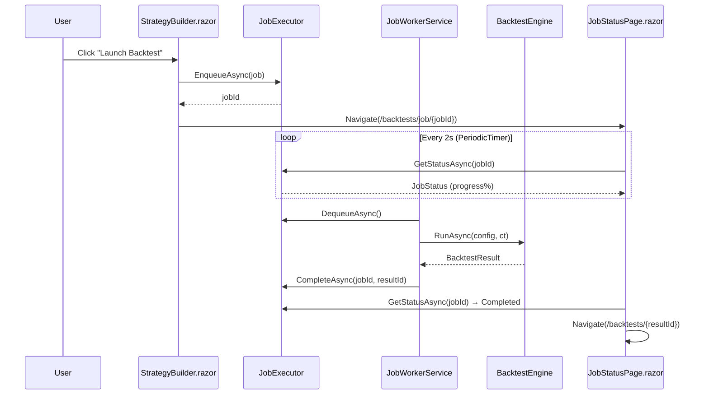
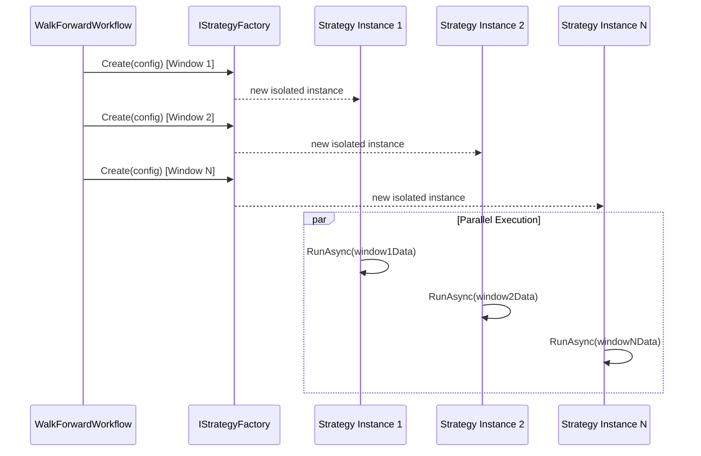

# Design Document: Trading Engine Stories

## Overview

This design covers a batch of 22 stories (P0–P3) for the TradingResearchEngine — a .NET 8 / Blazor Server / MudBlazor event-driven backtesting engine. The stories span critical bug fixes in metrics and fill logic, architecture improvements for parallelism and extensibility, robustness research enhancements, AI-powered strategy creation, and UX polish.

The design respects the established layer boundaries (`Core ← Application ← Infrastructure ← {Cli, Api, Web}`), the strategy registry pattern with `[StrategyName]` attribute discovery, JSON+SQLite persistence, and the Skender adapter pattern for indicators.

### Design Goals

1. **Correctness** — Fix Sortino, Calmar, VaR formulas and short-direction fill logic so backtests produce mathematically accurate results.
2. **Parallelism Safety** — Introduce `IStrategyFactory` to guarantee isolated strategy instances in concurrent workflows.
3. **Responsiveness** — Move backtest execution off the Blazor SignalR thread; add live progress events.
4. **Extensibility** — Pluggable renderer registry, universal Skender bridge, and dynamic interpretation service eliminate switch-statement coupling.
5. **Research Depth** — CPCV visualization, multi-metric heatmaps, fill-delay perturbation, and checklist scoring surface actionable insights.
6. **UX Quality** — Streaming AI responses, builder persistence, tooltips, sorting/filtering, and empty states improve the researcher experience.

---

## Architecture

### High-Level Component Diagram

```mermaid
graph TB
    subgraph Web ["TradingResearchEngine.Web (Blazor Server)"]
        SB[StrategyBuilder.razor]
        JSP[JobStatusPage.razor]
        DB[Dashboard.razor]
        SD[StudyDetail.razor]
        SL[StrategyLibrary.razor]
        RR[StudyRendererRegistry]
        IPP[IndicatorPickerPanel.razor]
    end

    subgraph Application ["TradingResearchEngine.Application"]
        JE[JobExecutor]
        SF[IStrategyFactory impls]
        WF[WalkForwardWorkflow]
        PS[ParameterSweepWorkflow]
        BSS[BackgroundStudyService]
        SIS[StudyInterpretationService]
        RCS[ResearchChecklistService]
        AIA[IAIStrategyAssistant]
        SBI[SkenderBridgeIndicator]
        SIC[SkenderIndicatorCatalog]
        SW[SensitivityWorkflow]
    end

    subgraph Core ["TradingResearchEngine.Core"]
        ISF[IStrategyFactory]
        IS[IStrategy]
        MC[MetricsCalculator]
        FE[Fill Engine]
        IR[IndicatorRegistry]
        REPO[IRepository&lt;T&gt;]
        EC[ExecutionConfig]
    end

    subgraph Infrastructure ["TradingResearchEngine.Infrastructure"]
        SIR[SqliteIndexRepository&lt;T&gt;]
        GA[GeminiStrategyAssistant]
    end

    SB -->|enqueue| JE
    JE -->|create| SF
    SF -->|implements| ISF
    WF -->|factory.Create()| SF
    PS -->|factory.Create()| SF
    SD -->|DynamicComponent| RR
    BSS -->|progress events| SD
    DB -->|ListRecentAsync| SIR
    SIR -->|implements| REPO
    MC -->|BarsPerYear| EC
    FE -->|Direction.Short| IS
    AIA -->|streaming| GA
    SBI -->|catalog lookup| SIC
    SIC -->|descriptors| IR

```

### Data Flow: Async Job Dispatch

> **Note:** `JobWorkerService` already exists at `src/TradingResearchEngine.Application/Research/JobWorkerService.cs` as a `BackgroundService` that polls `JobExecutor` for queued jobs. The tasks should wire it into the new status page flow rather than creating it from scratch.



### Data Flow: Parallel Workflow Isolation



### Layer Interaction Rules

| Source Layer | Target Layer | Allowed Interaction |
|---|---|---|
| Web | Application | Inject services, call use cases, subscribe to events |
| Web | Core | Read domain types (records, enums) for display |
| Application | Core | Implement interfaces, use domain types, call MetricsCalculator |
| Infrastructure | Core | Implement IRepository<T>, IDataProvider |
| Infrastructure | Application | Implement IAIStrategyAssistant |
| Core | — | Zero outward dependencies |

---

## Components and Interfaces

### P0: Core Engine Fixes

#### IStrategyFactory (Core)

> **Namespace note:** The canonical namespace is `TradingResearchEngine.Core.Strategy` (singular), matching the existing `src/TradingResearchEngine.Core/Strategy/` folder. All new strategy-related types in Core use this namespace. Do not create a `Strategies` (plural) folder or namespace.

```csharp
// src/TradingResearchEngine.Core/Strategy/IStrategyFactory.cs
namespace TradingResearchEngine.Core.Strategy;

/// <summary>
/// Creates isolated IStrategy instances for use in parallel workflows.
/// Each call to Create() MUST return a new, independent instance with its own state.
/// </summary>
public interface IStrategyFactory
{
    /// <summary>The strategy type name this factory produces.</summary>
    string StrategyType { get; }

    /// <summary>
    /// Creates a new independent strategy instance configured with the given parameters.
    /// Thread-safe: may be called concurrently from multiple threads.
    /// </summary>
    IStrategy Create(StrategyConfig config);
}
```

#### Fill Engine Short-Direction Methods (Core)

```csharp
// Pseudocode for Direction.Short branches in fill methods

// TryFillLimit — Short limit fills when price rises TO the limit
// Direction.Short: fill when bar.High >= limitPrice (sell at bid)
ExecutionResult? TryFillLimit(PendingOrder order, BarRecord bar)
{
    if (order.Direction == Direction.Short && bar.High >= order.LimitPrice)
        return Fill(order, order.LimitPrice, BidSideAdjustment);
    // existing Long logic unchanged
}

// TryFillStopMarket — Short stop triggers when price falls TO the stop
// Direction.Short: fill when bar.Low <= stopPrice
ExecutionResult? TryFillStopMarket(PendingOrder order, BarRecord bar)
{
    if (order.Direction == Direction.Short && bar.Low <= order.StopPrice)
        return Fill(order, order.StopPrice, BidSideAdjustment);
}

// TryFillStopLimit — Short stop-limit: trigger at stop, fill at limit
// Direction.Short: trigger when bar.Low <= stopPrice AND bar.High >= limitPrice
ExecutionResult? TryFillStopLimit(PendingOrder order, BarRecord bar)
{
    if (order.Direction == Direction.Short 
        && bar.Low <= order.StopPrice 
        && bar.High >= order.LimitPrice)
        return Fill(order, order.LimitPrice, BidSideAdjustment);
}
```

#### MetricsCalculator Fixes (Core)

```csharp
// Sortino — uses ALL returns, zeros out upside deviations
public static decimal? ComputeSortinoRatio(
    IReadOnlyList<EquityCurvePoint> curve, 
    decimal annualRiskFreeRate, 
    int barsPerYear)
{
    if (curve.Count < 2) return null;
    var returns = GetPeriodReturns(curve);
    if (returns.Count == 0) return null;

    decimal periodRiskFree = annualRiskFreeRate / barsPerYear;
    decimal meanReturn = returns.Average();
    decimal sumSquared = returns.Sum(r =>
    {
        decimal diff = Math.Min(r - periodRiskFree, 0m);
        return diff * diff;
    });
    decimal downsideDev = (decimal)Math.Sqrt((double)(sumSquared / returns.Count));
    if (downsideDev == 0m) return null;
    return (meanReturn - periodRiskFree) / downsideDev * (decimal)Math.Sqrt(barsPerYear);
}

// Calmar — accepts barsPerYear, no hardcoded 252
public static decimal? ComputeCalmarRatio(
    IReadOnlyList<EquityCurvePoint> curve, 
    decimal startEquity, 
    decimal endEquity, 
    int barsPerYear)
{
    if (curve.Count < 2 || startEquity == 0m) return null;
    decimal maxDd = ComputeMaxDrawdown(curve);
    if (maxDd == 0m) return null;
    var returns = GetPeriodReturns(curve);
    if (returns.Count == 0) return null;
    decimal annualizedReturn = returns.Average() * barsPerYear;
    return annualizedReturn / maxDd;
}

// VaR/CVaR — minimum 30 samples guard
public static decimal? ComputeHistoricalVaR(
    IReadOnlyList<EquityCurvePoint> curve, decimal confidence)
{
    if (curve.Count < 2) return null;
    var returns = GetPeriodReturns(curve).OrderBy(r => r).ToList();
    if (returns.Count < 30) return null;
    int idx = (int)Math.Floor((1 - confidence) * returns.Count);
    return -returns[Math.Max(0, idx)];
}
```

### P1: Architecture & Feedback

#### IStrategy Lifecycle Extension (Core)

```csharp
// Extended IStrategy interface
public interface IStrategy
{
    /// <summary>Called once before the first bar of a new execution window.</summary>
    void Initialize(StrategyConfig config);

    /// <summary>
    /// Resets all indicator state and internal tracking. After Reset(),
    /// the instance behaves identically to a freshly constructed one.
    /// </summary>
    void Reset();

    /// <summary>
    /// Called for every MarketDataEvent dequeued during the inner dispatch loop.
    /// Returns an empty list to produce no output.
    /// </summary>
    IReadOnlyList<EngineEvent> OnMarketData(MarketDataEvent evt);
}
```

#### StudyRendererRegistry (Web)

```csharp
// src/TradingResearchEngine.Web/Components/Studies/StudyRendererRegistry.cs
namespace TradingResearchEngine.Web.Components.Studies;

public static class StudyRendererRegistry
{
    private static readonly Dictionary<StudyType, Type> _map = new()
    {
        [StudyType.MonteCarlo] = typeof(MonteCarloResultRenderer),
        [StudyType.WalkForward] = typeof(WalkForwardResultRenderer),
        [StudyType.ParameterSweep] = typeof(SweepResultRenderer),
        [StudyType.Realism] = typeof(RealismResultRenderer),
        [StudyType.Benchmark] = typeof(BenchmarkResultRenderer),
        [StudyType.Cpcv] = typeof(CpcvResultRenderer),
        [StudyType.Variance] = typeof(VarianceResultRenderer),
    };

    public static Type? GetRenderer(StudyType type)
        => _map.GetValueOrDefault(type);
}
```

#### IRepository<T> Pagination Extension (Core)

```csharp
// Added to IRepository<T>
/// <summary>Returns the most recent N entities ordered by creation time (DB-level LIMIT).</summary>
Task<IReadOnlyList<T>> ListRecentAsync(int count, CancellationToken ct = default);
```

#### BackgroundStudyService Progress Events (Application)

```csharp
// Event signatures on BackgroundStudyService
public event Action<string, int, int>? OnStudyProgress;  // (studyId, completed, total)
public event Action<string>? OnStudyCompleted;            // (studyId)
```

### P2: Robustness & Research Depth

#### StudyInterpretationService (Application)

```csharp
// src/TradingResearchEngine.Application/Research/StudyInterpretationService.cs
namespace TradingResearchEngine.Application.Research;

/// <summary>
/// Generates result-aware textual interpretations with quantitative threshold warnings.
/// Unit-testable via DI — no inline Razor logic.
/// </summary>
public sealed class StudyInterpretationService
{
    public string InterpretMonteCarlo(MonteCarloResult result);
    public string InterpretWalkForward(WalkForwardResult result);
    public string InterpretCpcv(CpcvResult result);
    public string InterpretParameterSweep(SweepResult result);
    public string InterpretRealism(RealismSensitivityResult result);
    public string InterpretBenchmark(BenchmarkComparisonResult result);
}
```

**Warning Thresholds:**
- Monte Carlo ruin probability > 5% → elevated ruin risk warning
- CPCV P(overfit) > 50% → critical overfitting warning
- Walk-forward OOS Sharpe < 50% of IS Sharpe → performance degradation warning
- Parameter sweep < 20% positive-Sharpe cells → fragile peak warning

#### IAIStrategyAssistant Streaming Extension (Application)

```csharp
public interface IAIStrategyAssistant
{
    Task<AIStrategyDraft> GenerateAsync(string prompt, CancellationToken ct = default);
    IAsyncEnumerable<string> StreamGenerateAsync(string prompt, CancellationToken ct = default);
    Task<AIStrategyDraft> RefineAsync(AIStrategyDraft current, string feedback, CancellationToken ct = default);
    IAsyncEnumerable<string> StreamRefineAsync(AIStrategyDraft current, string feedback, CancellationToken ct = default);
}
```

#### FillDelayBars Configuration (Core)

```csharp
// Added to ExecutionConfig (or ScenarioConfig.ExecutionOptions)
/// <summary>
/// Number of bars to defer order submission. 0 = immediate (default).
/// Used by sensitivity analysis to measure fill-timing impact.
/// </summary>
public int FillDelayBars { get; init; } = 0;
```

### P3: UX & Indicator Library

#### SkenderBridgeIndicator (Application)

```csharp
// src/TradingResearchEngine.Application/Indicators/SkenderBridgeIndicator.cs
namespace TradingResearchEngine.Application.Indicators;

/// <summary>
/// Generic runtime bridge wrapping any Skender indicator via pre-compiled delegates.
/// Zero reflection during bar processing.
/// </summary>
public sealed class SkenderBridgeIndicator : IIndicatorSeries<decimal>
{
    public SkenderBridgeIndicator(
        string indicatorKey,
        Dictionary<string, object> parameters,
        string? outputField = null);

    public IReadOnlyList<decimal> Results { get; }
    public bool IsWarm { get; }
    public void Add(BarRecord bar);
    public void Reset();
}
```

#### SkenderIndicatorCatalog (Application)

```csharp
// src/TradingResearchEngine.Application/Indicators/SkenderIndicatorCatalog.cs
namespace TradingResearchEngine.Application.Indicators;

public sealed record SkenderCatalogEntry(
    string Key,
    string DisplayName,
    string Description,
    string Category,
    IReadOnlyList<SkenderParamDef> Parameters,
    string PrimaryOutputField,
    IReadOnlyList<string> AllOutputFields,
    Func<Dictionary<string, object>, IReadOnlyList<Quote>, string, decimal?> InvokerFactory,
    int WarmupMultiplier = 2);

public sealed record SkenderParamDef(
    string Name, Type ClrType, object DefaultValue, object Min, object Max, string Description);

public static class SkenderIndicatorCatalog
{
    public static SkenderCatalogEntry Get(string key);
    public static IReadOnlyList<SkenderCatalogEntry> All { get; }
}
```

#### RobustnessWarningCatalog (Application)

```csharp
// src/TradingResearchEngine.Application/Research/RobustnessWarningCatalog.cs
public static class RobustnessWarningCatalog
{
    public static readonly IReadOnlyDictionary<string, string> Explanations;
    
    public static string GetExplanation(string warningLabel)
        => Explanations.GetValueOrDefault(warningLabel, warningLabel);
}
```

---

## Data Models

### New Records

```csharp
// BacktestJob — already exists, used by JobExecutor
public sealed record BacktestJob
{
    public string Id { get; init; } = Guid.NewGuid().ToString("N")[..12];
    public ScenarioConfig Config { get; init; } = null!;
    public DateTimeOffset SubmittedAt { get; init; }
}

// JobStatus — tracks job lifecycle
public sealed record JobStatus(
    string JobId,
    JobState State,         // Queued, Running, Completed, Failed
    int? ProgressPercent,
    string? ResultId,
    string? ErrorMessage,
    DateTimeOffset SubmittedAt,
    DateTimeOffset? CompletedAt);

public enum JobState { Queued, Running, Completed, Failed }
```

### Modified Records

```csharp
// SweepCell — extended with multi-metric values
public sealed record SweepCell(
    IReadOnlyDictionary<string, object> Parameters,
    decimal? SharpeRatio,
    decimal? MaxDrawdown,
    decimal? WinRate,
    decimal? ProfitFactor,
    int TotalTrades);

// SweepResult — updated to use SweepCell grid
public sealed record SweepResult(
    IReadOnlyList<BacktestResult> Results,
    IReadOnlyList<BacktestResult> RankedBySharpe,
    IReadOnlyDictionary<string, decimal> ParameterSensitivity,
    IReadOnlyList<SweepCell> Cells);

// CpcvResult — the canonical field name is OosSharpeDistribution (IReadOnlyList<decimal>).
// This field already exists in the codebase and satisfies Requirement 11.4.
// Do NOT add a separate PathSharpeRatios field — use OosSharpeDistribution everywhere.
// The requirements document's "PathSharpeRatios" is a logical name; the implementation
// uses OosSharpeDistribution as the single source of truth.

// AIStrategyDraft — extended with refinement history
public sealed record AIStrategyDraft
{
    // ... existing properties ...
    public IReadOnlyList<string> RefinementHistory { get; init; } = Array.Empty<string>();
}

// ConfigDraft — extended with step persistence
public sealed record ConfigDraft
{
    // ... existing properties ...
    public int CurrentStep { get; init; } = 1;
    public int MaxVisitedStep { get; init; } = 1;
}
```

### ExecutionConfig Extension

```csharp
// Added field to ExecutionConfig
public int FillDelayBars { get; init; } = 0;
```

### IndicatorDescriptor Extension (Core)

```csharp
// Extended IndicatorDescriptor to support catalog entries
public sealed record IndicatorDescriptor(
    string Key,
    string DisplayName,
    string Description,
    IReadOnlyList<IndicatorParameterDescriptor> Parameters,
    IReadOnlyList<string> OutputTypes,
    string PrimaryOutput,
    string Category);

public sealed record IndicatorParameterDescriptor(
    string Name, string ClrType, object Min, object Max, object DefaultValue);
```

---

## Correctness Properties

*A property is a characteristic or behavior that should hold true across all valid executions of a system — essentially, a formal statement about what the system should do. Properties serve as the bridge between human-readable specifications and machine-verifiable correctness guarantees.*

### Property 1: Factory Isolation — Concurrent Instances Produce Independent Results

*For any* `IStrategyFactory` and any valid `StrategyConfig`, creating N instances concurrently and executing them in parallel on the same bar data SHALL produce results identical to sequential execution — no shared mutable state corruption.

**Validates: Requirements 2.2, 2.5**

### Property 2: Short Limit Fill Correctness

*For any* `Direction.Short` limit order with limit price L and any bar where `bar.High >= L`, the fill engine SHALL return a fill at price L. *For any* bar where `bar.High < L`, the fill engine SHALL return null.

**Validates: Requirements 3.1, 3.4**

### Property 3: Short Stop-Market Fill Correctness

*For any* `Direction.Short` stop-market order with stop price S and any bar where `bar.Low <= S`, the fill engine SHALL return a fill at price S. *For any* bar where `bar.Low > S`, the fill engine SHALL return null.

**Validates: Requirements 3.2, 3.4**

### Property 4: Short Stop-Limit Fill Correctness

*For any* `Direction.Short` stop-limit order with stop price S and limit price L, and any bar where `bar.Low <= S AND bar.High >= L`, the fill engine SHALL return a fill at price L. *For any* bar where either condition is not met, the fill engine SHALL return null.

**Validates: Requirements 3.3, 3.4**

### Property 5: Sortino Downside Deviation Uses All Returns

*For any* non-empty return series and any risk-free rate, the Sortino ratio SHALL be computed using downside deviation calculated over ALL returns (zeroing upside deviations), producing a result consistent with the formula: `downsideDev = sqrt(mean(min(r - threshold, 0)^2 for all r))`.

**Validates: Requirements 4.1, 4.4**

### Property 6: Calmar Ratio BarsPerYear Annualization

*For any* equity curve with 2+ points and any positive `barsPerYear` value, `ComputeCalmarRatio` SHALL annualize using `meanReturn * barsPerYear`. The same curve evaluated with different `barsPerYear` values SHALL produce proportionally different Calmar ratios.

**Validates: Requirements 5.2, 5.3**

### Property 7: VaR/CVaR Small-Sample Null Guard

*For any* equity curve with fewer than 30 period returns and any confidence level, both `ComputeHistoricalVaR` and `ComputeHistoricalCVaR` SHALL return null.

**Validates: Requirements 6.1, 6.2**

### Property 8: VaR Correctness for Sufficient Samples

*For any* equity curve with 30 or more period returns and any confidence level in (0, 1), `ComputeHistoricalVaR` SHALL return a non-null value equal to the negated return at the `floor((1 - confidence) * count)` index of the sorted return series.

**Validates: Requirements 6.3**

### Property 9: Strategy Reset Equivalence

*For any* strategy implementation and any bar sequence of length N, processing N bars then calling `Reset()` then processing the same N bars SHALL produce output identical to a freshly constructed instance processing those N bars.

**Validates: Requirements 7.3**

### Property 10: Fill Delay Deferral

*For any* order and any `FillDelayBars = D > 0`, the order SHALL appear in the pending-order queue exactly D bars after submission. At bar B where the order is submitted, it SHALL not be eligible for fill evaluation until bar B + D.

**Validates: Requirements 13.2**

### Property 11: AIStrategyDraft JSON Round-Trip

*For any* valid `AIStrategyDraft` instance (including `RefinementHistory`), serializing to JSON and deserializing back SHALL produce an equivalent object with all fields preserved.

**Validates: Requirements 15.3, 16.4**

### Property 12: Interpretation Service Threshold Warnings

*For any* `MonteCarloResult` where `RuinProbability > 0.05m`, the interpretation SHALL contain a ruin risk warning. *For any* `CpcvResult` where `ProbabilityOfOverfitting > 0.50m`, the interpretation SHALL contain an overfitting warning. *For any* `WalkForwardResult` where OOS Sharpe < 50% of IS Sharpe, the interpretation SHALL contain a degradation warning.

**Validates: Requirements 17.2, 17.3, 17.4**

### Property 13: Builder Step Persistence and Navigation Guard

*For any* `ConfigDraft` with `CurrentStep = S` and `MaxVisitedStep = M`, loading the draft SHALL restore the wizard to step S, and navigation to any step > M SHALL be prevented.

**Validates: Requirements 18.2, 18.3**

### Property 14: Warning Catalog Fallback

*For any* string label (including labels not in the catalog), `RobustnessWarningCatalog.GetExplanation(label)` SHALL return a non-null string without throwing — returning the catalog explanation if present, or the raw label as fallback.

**Validates: Requirements 19.2, 19.3**

### Property 15: Dashboard Sorting Correctness

*For any* list of `BacktestResult` items and any sortable column (Sharpe, MaxDrawdown, TradeCount), sorting in ascending order SHALL produce a sequence where each element's sort key is ≤ the next element's sort key. Descending order SHALL produce the reverse.

**Validates: Requirements 20.1**

### Property 16: Dashboard Filtering Correctness

*For any* set of `BacktestResult` items with mixed strategy types and statuses, applying a strategy type filter SHALL return only items matching the selected types. Toggling "Show failed runs" off SHALL exclude all items with `BacktestStatus.Failed`.

**Validates: Requirements 20.2, 20.3**

### Property 17: Skender Bridge Output Equivalence

*For any* valid bar sequence of length N ≥ warmup period and any supported indicator configuration (MACD, ADX, Stochastic, etc.), the `SkenderBridgeIndicator` output for the last bar SHALL equal the output produced by calling the corresponding Skender extension method directly on the same quote data.

**Validates: Requirements 22.1**

### Property 18: Skender Bridge Performance Bound

*For any* bar sequence of 100,000 bars, the `SkenderBridgeIndicator` (MACD configuration) SHALL complete within 2× the wall-clock time of the hand-written `MacdIndicator` processing the same data. The invariant is "no reflection in the hot path" — the performance bound is relative to the hand-written adapter, not a fixed time cap, to avoid CI hardware variability causing brittle failures.

**Validates: Requirements 22.6**

---

## Error Handling

### Job Execution Failures

| Error Scenario | Handling Strategy |
|---|---|
| Strategy not found in registry | `StrategyNotFoundException` → JobStatus.Failed with descriptive message |
| Engine throws during execution | Catch in JobWorkerService → JobStatus.Failed with sanitized message |
| CancellationToken cancelled | Graceful abort → JobStatus.Failed with "Cancelled by user" |
| Data provider failure | `DataProviderException` → JobStatus.Failed with data source error |

### Metrics Edge Cases

| Scenario | Behavior |
|---|---|
| Equity curve < 2 points | All metrics return `null` |
| Zero trades | Win rate, profit factor, expectancy return `null` |
| Downside deviation = 0 | Sortino returns `null` |
| Max drawdown = 0 | Calmar returns `null` |
| < 30 returns | VaR/CVaR return `null` |
| All returns positive (above threshold) | Sortino returns `null` (downsideDev = 0) |

### Fill Engine Edge Cases

| Scenario | Behavior |
|---|---|
| Price exactly at trigger level | Fill occurs (>= / <= are inclusive) |
| Direction.Flat order | No fill logic applies — handled by position close |
| Invalid order (null prices) | Return null, log warning |
| FillDelayBars with cancelled order | Order removed from delay queue, never reaches pending queue |

### AI Streaming Errors

| Scenario | Behavior |
|---|---|
| Network timeout during stream | Show partial buffer + error alert with retry option |
| Invalid JSON after stream completes | Show raw text in read-only panel + manual edit option |
| API key missing/invalid | Disable AI features gracefully, show configuration guidance |
| Rate limit exceeded | Retry with exponential backoff (max 2 retries per GeminiOptions) |

### UI Resilience

| Scenario | Behavior |
|---|---|
| Study renderer not found in registry | Show fallback "Unknown study type" message (no crash) |
| Warning label not in catalog | Display raw label as tooltip (no null reference) |
| Empty strategy library | Show structured empty state with CTAs |
| Progress event for wrong study ID | Ignore silently (filter by current study ID) |
| Page disposed during streaming | CancellationToken cancels stream, event handlers unsubscribed |

---

## Testing Strategy

### Framework Configuration

- **Unit Tests**: xUnit + FsCheck.Xunit (property-based) + Moq
- **Property Tests**: Minimum 100 iterations per property (`[Property(MaxTest = 100)]`)
- **Integration Tests**: xUnit with temp SQLite databases and fixture data
- **UI Tests**: bUnit for Blazor component testing
- **Performance Tests**: BenchmarkDotNet for Skender bridge benchmarks

### Property-Based Testing (FsCheck.Xunit)

Each correctness property maps to a single `[Property]` test method tagged with:

```csharp
// Feature: trading-engine-stories, Property N: <description>
[Property(MaxTest = 100)]
```

**Property test implementations:**

| Property | Generator Strategy | Assertion |
|---|---|---|
| 1: Factory Isolation | Random StrategyConfig, parallel execution | All instances produce same result as sequential |
| 2-4: Short Fill Logic | Random bars (OHLCV), random prices | Fill/no-fill matches condition evaluation |
| 5: Sortino Formula | Random return series (mix of +/-) | Result matches reference implementation |
| 6: Calmar BarsPerYear | Random equity curves, random barsPerYear | Proportional scaling verified |
| 7: VaR Null Guard | Random curves with Count < 30 | Always null |
| 8: VaR Correctness | Random curves with Count >= 30 | Matches sorted-index formula |
| 9: Reset Equivalence | Random bar sequences | Reset instance == fresh instance |
| 10: Fill Delay | Random orders, random delay values | Order appears D bars later |
| 11: JSON Round-Trip | Random AIStrategyDraft (Arb<T>) | Serialize → deserialize == original |
| 12: Threshold Warnings | Random results with values above/below thresholds | Warning text present/absent |
| 13: Step Persistence | Random step values (1-5) | Restoration and guard correct |
| 14: Catalog Fallback | Random strings | Never throws, returns non-null |
| 15: Sorting | Random BacktestResult lists | Ordering invariant holds |
| 16: Filtering | Random results with mixed types/statuses | Only matching items returned |
| 17: Skender Bridge | Random bar sequences (length > warmup) | Bridge output == direct Skender output |

### Unit Tests (Example-Based)

| Component | Test Cases |
|---|---|
| MetricsCalculator | Known synthetic series → expected Sortino/Calmar/VaR values |
| Fill Engine | Boundary cases: price exactly at trigger, all fill types × both directions |
| JobExecutor | Enqueue → status transitions → completion/failure |
| StudyInterpretationService | Each study type with known results → expected text fragments |
| ResearchChecklistService | Known results → expected pass count and color |
| RobustnessWarningCatalog | All known warning types have entries |
| ConfigDraft | Step persistence save/load cycle |
| SweepCell | All 5 metrics populated correctly from BacktestResult |

### Integration Tests

| Component | Test Approach |
|---|---|
| SqliteIndexRepository.ListRecentAsync | Temp SQLite file, insert 50 records, verify LIMIT works |
| SkenderBridgeIndicator performance | 100k bars benchmark, verify bridge is within 2× of hand-written MacdIndicator (no fixed time cap — the invariant is "no reflection in hot path", not a hardware-dependent threshold) |
| WalkForwardWorkflow with factory | Verify factory.Create() called per window |
| ParameterSweepWorkflow with factory | Verify factory.Create() called per combination |
| GeminiStrategyAssistant streaming | Mock HTTP, verify IAsyncEnumerable yields tokens |

### bUnit Component Tests

| Component | Test Cases |
|---|---|
| JobStatusPage | Progress display, completion redirect, failure alert |
| StudyDetail + DynamicComponent | Correct renderer resolved per StudyType |
| Dashboard checklist badge | Color classes for 0-9 pass counts |
| ParameterSweepHeatmap | Metric selector dropdown, reactive re-render |
| IndicatorPickerPanel | Category filter, search, add callback |
| StrategyLibrary empty state | Renders when empty, hidden when strategies exist |
| CpcvDistributionChart | Histogram renders with correct data series |

### Test Naming Convention

```
<SubjectUnderTest>Tests / <SubjectUnderTest>Properties
<MethodOrScenario>_<Condition>_<ExpectedOutcome>
```

Examples:
- `MetricsCalculatorProperties.ComputeSortinoRatio_AnyReturnSeries_MatchesReferenceFormula`
- `FillEngineProperties.TryFillLimit_ShortDirectionHighAboveLimit_FillsAtLimitPrice`
- `StrategyFactoryProperties.Create_ConcurrentInstances_ProduceIndependentResults`
