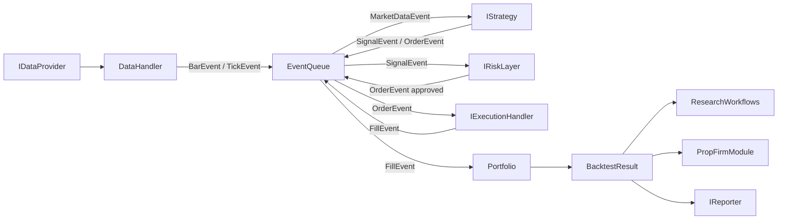
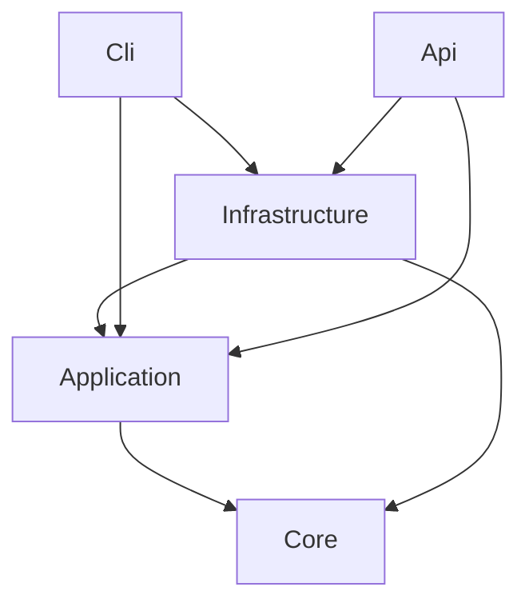

# Design Document — TradingResearchEngine

## Overview

TradingResearchEngine is a .NET 8 / C# 12 event-driven backtesting engine inspired by the QuantStart event-driven architecture. The system is structured around three concentric concerns:

1. **Core engine** — typed event hierarchy, heartbeat loop, event-queue dispatch, and the canonical pipeline: DataHandler → Strategy → RiskLayer → ExecutionHandler → Portfolio.
2. **Research workflows** — parameter sweeps, variance testing, Monte Carlo simulation, and walk-forward analysis built directly on the engine.
3. **Prop-firm evaluation suite** — a bounded module that consumes `BacktestResult` and research outputs to model challenge and instant-funding economics.

The design follows clean-architecture layer boundaries:

```
TradingResearchEngine.Core          ← domain abstractions, event types, interfaces, pure domain logic
TradingResearchEngine.Application   ← use cases, orchestration, research workflows, prop-firm module
TradingResearchEngine.Infrastructure← data providers, persistence, execution adapters, reporters
TradingResearchEngine.Cli           ← CLI host (argument-driven + interactive)
TradingResearchEngine.Api           ← ASP.NET Core minimal API host
TradingResearchEngine.UnitTests
TradingResearchEngine.IntegrationTests
```

Dependency rule: Core ← Application ← Infrastructure ← {Cli, Api}. No upward references.

---

## Architecture

### Event-Driven Pipeline

The engine is driven by two nested loops:

```
Outer heartbeat loop:
  while (dataHandler.HasMore)
    dataHandler.EmitNext(queue)   // enqueues BarEvent or TickEvent
    ProcessQueue()                // drains inner loop

Inner event-dispatch loop:
  while (queue.TryDequeue(out var evt))
    Dispatch(evt)
```

The dispatch table routes each event type to its handler:

| Event type | Handler | Side-effect |
|---|---|---|
| `MarketDataEvent` | `IStrategy.OnMarketData` | Enqueues `SignalEvent`s or `OrderEvent`s |
| `SignalEvent` | `IRiskLayer.ConvertSignal` | Enqueues approved `OrderEvent` or discards |
| `OrderEvent` (pre-risk) | `IRiskLayer.EvaluateOrder` | Enqueues approved `OrderEvent` or discards |
| `OrderEvent` (approved) | `IExecutionHandler.Execute` | Enqueues `FillEvent` |
| `FillEvent` | `Portfolio.Update` + `Analytics.Record` | Mutates portfolio state, appends equity curve |

The RiskLayer is mandatory — there is no code path that allows an `OrderEvent` to reach the `ExecutionHandler` without passing through `IRiskLayer`.

### Mermaid — High-Level Component Flow



### Mermaid — Layer Dependency Graph



### Replay Modes

`ReplayMode` (enum in Core) selects the data granularity:

- `Bar` — `DataHandler` emits one `BarEvent` per heartbeat step.
- `Tick` — `DataHandler` emits one `TickEvent` per heartbeat step.

Both modes use the identical heartbeat-loop and event-dispatch architecture. The only difference is the event subtype enqueued and the `IDataProvider` method called.

### Deterministic Replay

When `ScenarioConfig.RandomSeed` is set, all `Random` / `RandomNumberGenerator` instances in the engine and research workflows are seeded with that value. Given identical `ScenarioConfig` and data, two runs produce bit-identical `BacktestResult` values.

---

## Components and Interfaces

### Core — Event Hierarchy

```csharp
// Base sealed record; all events derive from this
public abstract record EngineEvent(DateTimeOffset Timestamp);

public abstract record MarketDataEvent(string Symbol, DateTimeOffset Timestamp)
    : EngineEvent(Timestamp);

public record BarEvent(
    string Symbol, string Interval,
    decimal Open, decimal High, decimal Low, decimal Close, decimal Volume,
    DateTimeOffset Timestamp)
    : MarketDataEvent(Symbol, Timestamp);

public record TickEvent(
    string Symbol,
    IReadOnlyList<BidLevel> BidLevels,
    IReadOnlyList<AskLevel> AskLevels,
    LastTrade LastTrade,
    DateTimeOffset Timestamp)
    : MarketDataEvent(Symbol, Timestamp);

// Value types for tick data
public readonly record struct BidLevel(decimal Price, decimal Size);
public readonly record struct AskLevel(decimal Price, decimal Size);
public readonly record struct LastTrade(decimal Price, decimal Volume, DateTimeOffset Timestamp);

public record SignalEvent(
    string Symbol, Direction Direction, decimal? Strength, DateTimeOffset Timestamp)
    : EngineEvent(Timestamp);

public record OrderEvent(
    string Symbol, Direction Direction, decimal Quantity, OrderType OrderType,
    decimal? LimitPrice, DateTimeOffset Timestamp, bool RiskApproved = false)
    : EngineEvent(Timestamp);

public record FillEvent(
    string Symbol, Direction Direction, decimal Quantity,
    decimal FillPrice, decimal Commission, decimal SlippageAmount,
    DateTimeOffset Timestamp)
    : EngineEvent(Timestamp);

public enum Direction { Long, Short, Flat }
public enum OrderType { Market, Limit, StopMarket }
```

### Core — EventQueue

```csharp
public interface IEventQueue
{
    void Enqueue(EngineEvent evt);
    bool TryDequeue(out EngineEvent? evt);
    bool IsEmpty { get; }
}

// Implementation backed by ConcurrentQueue<EngineEvent>
public sealed class EventQueue : IEventQueue { ... }
```

### Core — Engine

```csharp
public interface IBacktestEngine
{
    Task<BacktestResult> RunAsync(ScenarioConfig config, CancellationToken ct = default);
}

public sealed class BacktestEngine : IBacktestEngine
{
    // Outer heartbeat loop + inner dispatch loop
    // Dispatch table keyed on event type
    // Catches IStrategy exceptions → Status = Failed
    // Logs unrecognised event types as warnings
}

public enum ReplayMode { Bar, Tick }
```

### Core — Data Handling

```csharp
public interface IDataProvider
{
    IAsyncEnumerable<BarRecord> GetBars(
        string symbol, string interval,
        DateTimeOffset from, DateTimeOffset to);

    IAsyncEnumerable<TickRecord> GetTicks(
        string symbol, DateTimeOffset from, DateTimeOffset to);
}

public sealed record BarRecord(
    string Symbol, string Interval,
    decimal Open, decimal High, decimal Low, decimal Close, decimal Volume,
    DateTimeOffset Timestamp);

public sealed record TickRecord(
    string Symbol,
    IReadOnlyList<BidLevel> BidLevels,
    IReadOnlyList<AskLevel> AskLevels,
    LastTrade LastTrade,
    DateTimeOffset Timestamp);

// DataHandler wraps IDataProvider; emits MarketDataEvents; tracks MalformedRecordCount
public sealed class DataHandler
{
    public bool HasMore { get; }
    public void EmitNext(IEventQueue queue);
    public int MalformedRecordCount { get; }
}
```

### Core — Strategy

```csharp
public interface IStrategy
{
    /// <summary>Returns zero or more SignalEvents or OrderEvents.</summary>
    IReadOnlyList<EngineEvent> OnMarketData(MarketDataEvent evt);
}
```

### Core — Risk Layer

```csharp
public interface IRiskLayer
{
    /// <summary>Converts a SignalEvent to a sized OrderEvent, or null to discard.</summary>
    OrderEvent? ConvertSignal(SignalEvent signal, PortfolioSnapshot snapshot);

    /// <summary>Validates and resizes an OrderEvent, or null to discard.</summary>
    OrderEvent? EvaluateOrder(OrderEvent order, PortfolioSnapshot snapshot);
}
```

### Core — Execution Handler

```csharp
public interface IExecutionHandler
{
    FillEvent Execute(OrderEvent order, MarketDataEvent currentBar);
}

public interface ISlippageModel
{
    /// <summary>Returns a decimal price adjustment (positive = adverse).</summary>
    decimal ComputeAdjustment(OrderEvent order, MarketDataEvent market);
}

public interface ICommissionModel
{
    decimal ComputeCommission(OrderEvent order, decimal fillPrice, decimal quantity);
}
```

### Core — Portfolio

```csharp
public sealed class Portfolio
{
    public IReadOnlyDictionary<string, Position> Positions { get; }
    public decimal CashBalance { get; }
    public decimal TotalEquity { get; }
    public IReadOnlyList<EquityCurvePoint> EquityCurve { get; }
    public IReadOnlyList<ClosedTrade> ClosedTrades { get; }
    public PortfolioSnapshot TakeSnapshot();
    public void Update(FillEvent fill);
}

public sealed record Position(
    string Symbol, decimal Quantity, decimal AverageEntryPrice,
    decimal UnrealisedPnl, decimal RealisedPnl);

public sealed record EquityCurvePoint(DateTimeOffset Timestamp, decimal TotalEquity);

public sealed record ClosedTrade(
    string Symbol, DateTimeOffset EntryTime, DateTimeOffset ExitTime,
    decimal EntryPrice, decimal ExitPrice, decimal Quantity,
    Direction Direction, decimal GrossPnl, decimal Commission, decimal NetPnl);

public sealed record PortfolioSnapshot(
    IReadOnlyDictionary<string, Position> Positions,
    decimal CashBalance, decimal TotalEquity);
```

### Core — Metrics

```csharp
/// <summary>Pure static functions; no side effects.</summary>
public static class MetricsCalculator
{
    public static decimal ComputeMaxDrawdown(IReadOnlyList<EquityCurvePoint> curve);
    public static decimal? ComputeSharpeRatio(IReadOnlyList<ClosedTrade> trades, decimal annualRiskFreeRate);
    public static decimal? ComputeSortinoRatio(IReadOnlyList<ClosedTrade> trades, decimal annualRiskFreeRate);
    public static decimal? ComputeWinRate(IReadOnlyList<ClosedTrade> trades);
    public static decimal? ComputeProfitFactor(IReadOnlyList<ClosedTrade> trades);
    public static decimal? ComputeAverageWin(IReadOnlyList<ClosedTrade> trades);
    public static decimal? ComputeAverageLoss(IReadOnlyList<ClosedTrade> trades);
}
```

### Core — Reporting and Persistence Interfaces

```csharp
public interface IReporter
{
    void RenderToConsole(BacktestResult result);
    string RenderToMarkdown(BacktestResult result);
    void RenderToConsole(ComparisonReport report);
    string RenderToMarkdown(ComparisonReport report);
}

public interface IHasId { string Id { get; } }

public interface IRepository<T> where T : IHasId
{
    Task SaveAsync(T entity, CancellationToken ct = default);
    Task<T?> GetByIdAsync(string id, CancellationToken ct = default);
    Task<IReadOnlyList<T>> ListAsync(CancellationToken ct = default);
    Task DeleteAsync(string id, CancellationToken ct = default);
}
```

### Application — Use Cases and Research Workflows

```csharp
public interface IResearchWorkflow<TOptions, TResult>
{
    Task<TResult> RunAsync(ScenarioConfig baseConfig, TOptions options, CancellationToken ct = default);
}

// Orchestrates a single engine run
public sealed class RunScenarioUseCase { ... }

// Cartesian product of ParameterGrid; Parallel.ForEachAsync
public sealed class ParameterSweepWorkflow
    : IResearchWorkflow<SweepOptions, SweepResult> { ... }

// Applies VariancePreset overrides; runs engine per preset
public sealed class VarianceTestingWorkflow
    : IResearchWorkflow<VarianceOptions, VarianceResult> { ... }

// Bootstrap resampling of ClosedTrade returns
public sealed class MonteCarloWorkflow
    : IResearchWorkflow<MonteCarloOptions, MonteCarloResult> { ... }

// Partitions data range; ParameterSweep on in-sample; Engine on out-of-sample
public sealed class WalkForwardWorkflow
    : IResearchWorkflow<WalkForwardOptions, WalkForwardResult> { ... }

// Accepts List<BacktestResult>; returns ComparisonReport
public sealed class ScenarioComparisonUseCase { ... }
```

### Application — Risk, Execution, Slippage, Commission

```csharp
// DefaultRiskLayer: FixedFractional position sizing; MaxExposurePercent enforcement
public sealed class DefaultRiskLayer : IRiskLayer { ... }

// SimulatedExecutionHandler: applies ISlippageModel + ICommissionModel
public sealed class SimulatedExecutionHandler : IExecutionHandler { ... }

// Slippage models
public sealed class ZeroSlippageModel : ISlippageModel { ... }
public sealed class FixedSpreadSlippageModel : ISlippageModel { ... }

// Commission models
public sealed class ZeroCommissionModel : ICommissionModel { ... }
public sealed class PerTradeCommissionModel : ICommissionModel { ... }
public sealed class PerShareCommissionModel : ICommissionModel { ... }
```

### Application — Prop-Firm Module

```csharp
namespace TradingResearchEngine.Application.PropFirm;

public sealed record ChallengeConfig(
    decimal PassRatePercent, decimal PassToFundedConversionPercent,
    decimal AccountFeeUsd, decimal NotionalSizeUsd,
    decimal MaxDailyDrawdownPercent, decimal MaxTotalDrawdownPercent,
    FirmRuleSet FirmRuleSet);

public sealed record InstantFundingConfig(
    decimal DirectFundedProbabilityPercent, decimal AccountFeeUsd,
    decimal NotionalSizeUsd, decimal GrossMonthlyReturnPercent,
    decimal PayoutSplitPercent, decimal PayoutFrictionFactor,
    int ExpectedPayoutMonths, FirmRuleSet FirmRuleSet);

public sealed record FirmRuleSet(
    string FirmName,
    decimal MaxDailyDrawdownPercent, decimal MaxTotalDrawdownPercent,
    int MinTradingDays,
    decimal? PayoutCapUsd, decimal? ConsistencyRulePercent,
    IReadOnlyList<string> CustomRules);

public sealed class PropFirmEvaluator
{
    // Evaluates BacktestResult against FirmRuleSet
    public RuleEvaluationReport Evaluate(BacktestResult result, FirmRuleSet rules);
    // Computes MonthlyPayoutExpectancy, LifetimeEV, BreakevenMonths
    public PropFirmScenarioResult ComputeEconomics(InstantFundingConfig config);
}

public sealed class PropFirmVarianceWorkflow { ... }
```

### Infrastructure

```csharp
// CsvDataProvider: reads CSV; maps rows to BarRecord/TickRecord; skips malformed rows
public sealed class CsvDataProvider : IDataProvider { ... }

// HttpRestDataProvider: configurable base URL; GET requests; JSON deserialisation
// Designed for subclassing (AlpacaDataProvider, PolygonDataProvider, etc.)
public class HttpRestDataProvider : IDataProvider { ... }

// JsonFileRepository<T>: files named {id}.json in configurable directory
public sealed class JsonFileRepository<T> : IRepository<T> where T : IHasId { ... }

public sealed class ConsoleReporter : IReporter { ... }
public sealed class MarkdownReporter : IReporter { ... }
```

### CLI

```csharp
// System.CommandLine; root command with 'run' subcommand
// --scenario <path>, --output <path>, --simulations <int>, --help
// Interactive mode: InteractiveScenarioBuilder when no --scenario supplied
// Exit codes: 0 = success, 1 = user error, 2 = engine error
```

### API

```csharp
// ASP.NET Core minimal APIs
// POST /scenarios/run        → BacktestResult
// POST /scenarios/sweep      → SweepResult
// POST /scenarios/montecarlo → MonteCarloResult
// POST /scenarios/walkforward→ WalkForwardResult
// HTTP 400 for validation errors (structured JSON)
// HTTP 500 with CorrelationId for internal errors; no stack traces in responses
// CORS via IOptions<CorsOptions>
```

---

## Data Models

### ScenarioConfig

```csharp
public sealed record ScenarioConfig(
    string ScenarioId,
    string Description,
    ReplayMode ReplayMode,
    string DataProviderType,
    Dictionary<string, object> DataProviderOptions,
    string StrategyType,
    Dictionary<string, object> StrategyParameters,
    Dictionary<string, object> RiskParameters,
    string SlippageModelType,
    string CommissionModelType,
    decimal InitialCash,
    decimal AnnualRiskFreeRate,
    int? RandomSeed,
    string? ResearchWorkflowType,
    Dictionary<string, object>? ResearchWorkflowOptions,
    PropFirmOptions? PropFirmOptions);
```

### BacktestResult

```csharp
public sealed record BacktestResult(
    Guid RunId,
    ScenarioConfig ScenarioConfig,
    BacktestStatus Status,
    IReadOnlyList<EquityCurvePoint> EquityCurve,
    IReadOnlyList<ClosedTrade> Trades,
    decimal StartEquity,
    decimal EndEquity,
    decimal MaxDrawdown,
    decimal? SharpeRatio,
    decimal? SortinoRatio,
    int TotalTrades,
    decimal? WinRate,
    decimal? ProfitFactor,
    decimal? AverageWin,
    decimal? AverageLoss,
    long RunDurationMs) : IHasId
{
    public string Id => RunId.ToString();
}

public enum BacktestStatus { Completed, Failed, Cancelled }
```

### Research Workflow Result Types

```csharp
public sealed record SweepResult(
    IReadOnlyList<BacktestResult> Results,
    IReadOnlyList<BacktestResult> RankedBySharpe);

public sealed record VarianceResult(
    IReadOnlyList<(string PresetName, BacktestResult Result)> Variants);

public sealed record MonteCarloResult(
    decimal P10EndEquity, decimal P50EndEquity, decimal P90EndEquity,
    decimal RuinProbability, decimal MedianMaxDrawdown,
    IReadOnlyList<decimal> EndEquityDistribution);

public sealed record WalkForwardResult(
    IReadOnlyList<WalkForwardWindow> Windows);

public sealed record WalkForwardWindow(
    int WindowIndex,
    BacktestResult InSampleResult,
    BacktestResult OutOfSampleResult,
    Dictionary<string, object> SelectedParameters);

public sealed record ComparisonReport(
    IReadOnlyList<ComparisonRow> Rows,
    string BestBySharpe,
    string BestByDrawdown);

public sealed record ComparisonRow(
    string ScenarioId, decimal? SharpeRatio, decimal? SortinoRatio,
    decimal? CalmarRatio, decimal MaxDrawdown, decimal? WinRate,
    decimal? ProfitFactor, decimal? Expectancy,
    decimal? EquityCurveSmoothness, int MaxConsecutiveLosses,
    int TotalTrades, decimal EndEquity);
```

### Prop-Firm Result Types

```csharp
public sealed record PropFirmScenarioResult(
    string PresetName,
    decimal ChallengeProbability,
    decimal MonthlyPayoutExpectancy,
    decimal LifetimeEV,
    int? BreakevenMonths);

public sealed record RuleEvaluationReport(
    bool Passed,
    string ChallengeOutcome,
    IReadOnlyList<string> ViolatedRules);

public sealed record PropFirmVarianceResult(
    IReadOnlyList<PropFirmScenarioResult> Variants);
```

### Configuration Options

```csharp
public sealed class MonteCarloOptions
{
    public int SimulationCount { get; set; } = MonteCarloDefaults.DefaultSimulationCount; // 1000
    public int? Seed { get; set; }
    public decimal RuinThresholdPercent { get; set; }
}

public sealed class RiskOptions
{
    public decimal MaxExposurePercent { get; set; } = RiskDefaults.MaxExposurePercent;
}

public sealed class ReportingOptions
{
    public int DecimalPlaces { get; set; } = ReportingDefaults.DecimalPlaces; // 2
}

public sealed class RepositoryOptions
{
    public string BaseDirectory { get; set; } = string.Empty;
}

public sealed class SweepOptions
{
    public int MaxDegreeOfParallelism { get; set; } = Environment.ProcessorCount;
}

public sealed class WalkForwardOptions
{
    public TimeSpan InSampleLength { get; set; }
    public TimeSpan OutOfSampleLength { get; set; }
    public TimeSpan StepSize { get; set; }
    public bool AnchoredWindow { get; set; }
}
```

---

## Folder Structure

```
src/TradingResearchEngine.Core/
  Events/
    EngineEvent.cs
    MarketDataEvent.cs
    BarEvent.cs
    TickEvent.cs
    SignalEvent.cs
    OrderEvent.cs
    FillEvent.cs
  Queue/
    EventQueue.cs
    IEventQueue.cs
  Engine/
    BacktestEngine.cs
    IBacktestEngine.cs
    ReplayMode.cs
  DataHandling/
    DataHandler.cs
    IDataProvider.cs
    BarRecord.cs
    TickRecord.cs
  Strategy/
    IStrategy.cs
  Risk/
    IRiskLayer.cs
    PortfolioSnapshot.cs
  Execution/
    IExecutionHandler.cs
    ISlippageModel.cs
    ICommissionModel.cs
  Portfolio/
    Portfolio.cs
    Position.cs
    EquityCurvePoint.cs
    ClosedTrade.cs
  Results/
    BacktestResult.cs
    BacktestStatus.cs
  Metrics/
    MetricsCalculator.cs
  Reporting/
    IReporter.cs
  Persistence/
    IRepository.cs
    IHasId.cs
  Configuration/
    ScenarioConfig.cs

src/TradingResearchEngine.Application/
  Engine/
    RunScenarioUseCase.cs
  Risk/
    DefaultRiskLayer.cs
  Execution/
    SimulatedExecutionHandler.cs
    ZeroSlippageModel.cs
    FixedSpreadSlippageModel.cs
    ZeroCommissionModel.cs
    PerTradeCommissionModel.cs
    PerShareCommissionModel.cs
  Research/
    IResearchWorkflow.cs
    ParameterSweepWorkflow.cs
    VarianceTestingWorkflow.cs
    MonteCarloWorkflow.cs
    WalkForwardWorkflow.cs
    ScenarioComparisonUseCase.cs
    Results/
      SweepResult.cs
      VarianceResult.cs
      MonteCarloResult.cs
      WalkForwardResult.cs
      ComparisonReport.cs
  PropFirm/
    ChallengeConfig.cs
    InstantFundingConfig.cs
    FirmRuleSet.cs
    PropFirmEvaluator.cs
    PropFirmVarianceWorkflow.cs
    Results/
      PropFirmScenarioResult.cs
      PropFirmVarianceResult.cs
      RuleEvaluationReport.cs
  Configuration/
    MonteCarloOptions.cs
    RiskOptions.cs
    ReportingOptions.cs
    RepositoryOptions.cs
    SweepOptions.cs
    WalkForwardOptions.cs
  ServiceCollectionExtensions.cs

src/TradingResearchEngine.Infrastructure/
  DataProviders/
    CsvDataProvider.cs
    HttpRestDataProvider.cs
  Persistence/
    JsonFileRepository.cs
  Reporting/
    ConsoleReporter.cs
    MarkdownReporter.cs
  ServiceCollectionExtensions.cs

src/TradingResearchEngine.Cli/
  Program.cs
  Commands/
    RunCommand.cs
  Interactive/
    InteractiveScenarioBuilder.cs

src/TradingResearchEngine.Api/
  Program.cs
  Endpoints/
    ScenarioEndpoints.cs
  Middleware/
    ErrorHandlingMiddleware.cs

tests/TradingResearchEngine.UnitTests/
tests/TradingResearchEngine.IntegrationTests/
```

---

## Correctness Properties

*A property is a characteristic or behavior that should hold true across all valid executions of a system — essentially, a formal statement about what the system should do. Properties serve as the bridge between human-readable specifications and machine-verifiable correctness guarantees.*

Property-based testing (PBT) is appropriate here because the engine contains pure functions (MetricsCalculator, Portfolio.Update, window partitioning, PropFirmEvaluator arithmetic) and universal invariants that hold across a wide input space. The PBT library used is **FsCheck** (via `FsCheck.Xunit`) for .NET.

Each property test runs a minimum of 100 iterations. Tests are tagged with the format:
`// Feature: trading-research-engine, Property N: <property_text>`

---

### Property 1: BacktestResult JSON Round-Trip

*For any* valid `BacktestResult` instance (including those with null optional metrics, empty trade lists, and large equity curves), serialising to JSON and deserialising back SHALL produce a structurally equal object.

**Validates: Requirements 10.6, 27.3**

---

### Property 2: EquityCurve Length Equals Fill Count

*For any* sequence of `FillEvent` instances processed by the `Portfolio`, the length of `Portfolio.EquityCurve` SHALL equal the total number of `FillEvent` instances processed.

**Validates: Requirements 8.6, 27.4**

---

### Property 3: Cash Conservation

*For any* sequence of buy and sell `FillEvent` instances with arbitrary prices, quantities, and commissions, the `Portfolio.CashBalance` after processing SHALL equal:

```
InitialCash
  − Σ (FillPrice × Quantity + Commission)  [for buy fills]
  + Σ (FillPrice × Quantity − Commission)  [for sell fills]
```

**Validates: Requirements 8.4**

---

### Property 4: RiskLayer Mandatory

*For any* `ScenarioConfig` and any `IStrategy` implementation, every `FillEvent` present in the resulting `BacktestResult` SHALL correspond to an `OrderEvent` that was processed and approved by the `IRiskLayer`; no `FillEvent` SHALL exist whose originating `OrderEvent` bypassed the `RiskLayer`.

**Validates: Requirements 6.1, 6.5**

---

### Property 5: Deterministic Replay

*For any* `ScenarioConfig` with `RandomSeed` set, two independent calls to `BacktestEngine.RunAsync` with the same config and data source SHALL produce `BacktestResult` instances that are structurally equal in all fields.

**Validates: Requirements 3.5, 11.5**

---

### Property 6: Monte Carlo Seed Reproducibility

*For any* `MonteCarloOptions` with `Seed` set and any source `BacktestResult`, two calls to `MonteCarloWorkflow.RunAsync` with the same inputs SHALL produce `MonteCarloResult` instances that are equal in all fields (P10, P50, P90, RuinProbability, MedianMaxDrawdown, EndEquityDistribution).

**Validates: Requirements 14.5**

---

### Property 7: WalkForward Window Count

*For any* valid combination of data length, `InSampleLength`, `OutOfSampleLength`, and `StepSize` that forms at least one complete window, the number of windows in `WalkForwardResult.Windows` SHALL equal `floor((DataLength − InSampleLength) / StepSize)`.

**Validates: Requirements 15.3**

---

### Property 8: BreakevenMonths Formula

*For any* `InstantFundingConfig` where `MonthlyPayoutExpectancy > 0`, the `BreakevenMonths` value computed by `PropFirmEvaluator` SHALL equal `ceil(AccountFeeUsd / MonthlyPayoutExpectancy)`.

**Validates: Requirements 19.5**

---

## Error Handling

### Engine-Level Errors

| Scenario | Behaviour |
|---|---|
| `IStrategy.OnMarketData` throws | Catch, log with heartbeat step + symbol, set `BacktestResult.Status = Failed`, halt run |
| Unrecognised event type dequeued | Log warning, discard event, continue |
| `IDataProvider` signals end-of-data | Drain queue, finalise Portfolio, publish `BacktestResult` |
| `ReplayMode = Tick` with bar-only provider | Return descriptive `ConfigurationException` before run starts |
| Required DI service missing | Throw `InvalidOperationException` at startup identifying the missing type |

### Data Layer Errors

| Scenario | Behaviour |
|---|---|
| CSV row with unparseable field | Skip row, increment `MalformedRecordCount`, continue |
| HTTP non-2xx response | Throw `DataProviderException(statusCode, responseBody)` |
| Missing required `ScenarioConfig` field | Return structured validation error listing each invalid field; do not start run |
| `FirmRuleSet` JSON missing required field | Return structured validation error listing each missing field |

### Portfolio Errors

| Scenario | Behaviour |
|---|---|
| `FillEvent` would reduce `CashBalance` below zero | Record fill, set `CashBalance = 0`, log `MarginBreachWarning` |
| `TotalTrades == 0` at result time | Set `SharpeRatio`, `SortinoRatio`, `WinRate`, `ProfitFactor`, `AverageWin`, `AverageLoss` to `null` |

### Risk Layer Errors

| Scenario | Behaviour |
|---|---|
| Order quantity reduced to zero by exposure limit | Discard `OrderEvent`, log `RiskRejection` with reason |
| `MonthlyPayoutExpectancy ≤ 0` in PropFirm | Set `BreakevenMonths = null`, log warning |

### Research Workflow Errors

| Scenario | Behaviour |
|---|---|
| `SimulationCount < 1` in MonteCarloOptions | Return validation error, execute no paths |
| Data range too short for WalkForward | Return validation error describing minimum required length |
| `ScenarioComparison` with fewer than 2 results | Return validation error |
| `ParameterGrid` empty in ParameterSweep | Execute single run with base config, return `SweepResult` with one entry |

### API Errors

| Scenario | HTTP response |
|---|---|
| Request body validation failure | 400 with JSON listing each validation error |
| Internal simulation error | 500 with `CorrelationId` and non-sensitive message; full exception logged server-side |
| No stack traces in any response | Enforced by `ErrorHandlingMiddleware` |

### CLI Errors

| Scenario | Exit code |
|---|---|
| `--scenario` file not found | 1 (user error), descriptive message to stderr |
| Engine error during run | 2 (engine error) |
| `--help` | 0 |

---

## Testing Strategy

### Dual Testing Approach

Unit tests cover specific examples, edge cases, and error conditions. Property-based tests verify universal invariants across randomised inputs. Both are required for comprehensive coverage.

### Unit Tests (`TradingResearchEngine.UnitTests`)

- No references to Infrastructure; all external dependencies replaced with in-memory test doubles or mocks (e.g., `Moq` or hand-written fakes).
- Cover all Core domain logic: `MetricsCalculator`, `Portfolio`, `BacktestEngine` dispatch table, `DefaultRiskLayer`, `SimulatedExecutionHandler`, slippage/commission models.
- Cover all Application use cases: `RunScenarioUseCase`, `ParameterSweepWorkflow`, `MonteCarloWorkflow`, `WalkForwardWorkflow`, `ScenarioComparisonUseCase`, `PropFirmEvaluator`.
- Example-based tests for specific error conditions: strategy exception → `Status = Failed`; unrecognised event discarded; `MalformedRecordCount` incremented; `MarginBreachWarning` logged; `RiskRejection` logged; null metrics when zero trades.

### Property-Based Tests (`TradingResearchEngine.UnitTests`)

Library: **FsCheck** (`FsCheck.Xunit` NuGet package).
Minimum iterations per property: **100** (configured via `[Property(MaxTest = 100)]` or `Arbitrary` generators).

Each property test is tagged with a comment:

```csharp
// Feature: trading-research-engine, Property 1: BacktestResult JSON round-trip
[Property(MaxTest = 100)]
public Property BacktestResult_JsonRoundTrip(BacktestResult result) { ... }
```

| Property | Test class | Generator notes |
|---|---|---|
| 1 — JSON round-trip | `BacktestResultSerializationTests` | Arbitrary `BacktestResult` with nullable optionals, empty/non-empty lists |
| 2 — EquityCurve length | `PortfolioInvariantTests` | Arbitrary `FillEvent` sequences (1–200 fills) |
| 3 — Cash conservation | `PortfolioInvariantTests` | Arbitrary buy/sell fill sequences with positive prices and quantities |
| 4 — RiskLayer mandatory | `EngineRiskLayerTests` | Spy `IRiskLayer`; arbitrary strategy signal sequences |
| 5 — Deterministic replay | `EngineReplayTests` | Arbitrary `ScenarioConfig` with `RandomSeed` set; in-memory CSV data |
| 6 — Monte Carlo seed | `MonteCarloWorkflowTests` | Arbitrary source `BacktestResult`; arbitrary `Seed` |
| 7 — WalkForward window count | `WalkForwardWindowTests` | Arbitrary data lengths and window parameters satisfying minimum constraints |
| 8 — BreakevenMonths | `PropFirmEvaluatorTests` | Arbitrary `InstantFundingConfig` with `MonthlyPayoutExpectancy > 0` |

### Integration Tests (`TradingResearchEngine.IntegrationTests`)

- CSV data loading: `CsvDataProvider` reads a fixture CSV file and returns the correct `BarRecord` sequence.
- Full simulation run: end-to-end `BacktestEngine.RunAsync` with `CsvDataProvider` and a simple moving-average strategy; asserts `Status = Completed` and non-empty `EquityCurve`.
- API endpoint responses: `WebApplicationFactory<Program>` for the Api project; tests `POST /scenarios/run`, `POST /scenarios/sweep`, `POST /scenarios/montecarlo`, `POST /scenarios/walkforward` with valid and invalid request bodies.
- `JsonFileRepository<T>`: save, retrieve, list, delete against a temp directory.

### Testing Boundaries

- UnitTests: no Infrastructure references; no file I/O; no HTTP calls.
- IntegrationTests: may reference Infrastructure; use fixture files in `tests/fixtures/`; use `WebApplicationFactory` for API tests.
- Property tests run in CI with the same iteration count as local development (100 per property).

---

## Future Considerations

- **Live/forward trading**: replace `DataHandler` (subscribe to live feed) and `IExecutionHandler` (submit to broker API); all other components — Strategy, RiskLayer, Portfolio, Analytics — remain unchanged.
- **Blazor UI**: the API already returns JSON-serialisable records; add a `TradingResearchEngine.Blazor` project referencing the Application layer via the API.
- **Named data providers**: subclass `HttpRestDataProvider` in Infrastructure (e.g., `AlpacaDataProvider`, `PolygonDataProvider`); no Core or Application changes required.
- **Multi-account portfolio**: extend `Portfolio` to hold multiple sub-accounts; `IRiskLayer` gains cross-account exposure checks; `PortfolioSnapshot` extended accordingly.
- **AWS deployment**: App Runner (API), ECS Fargate (long-running simulations), Lambda (lightweight scenario runs), S3 + CloudFront (Blazor WASM hosting), API Gateway (managed API front door).
- **Python companion tooling**: data preparation scripts and Jupyter notebooks consuming the API endpoints.
- **Database persistence**: implement `IRepository<T>` against EF Core or Dapper; no Application-layer changes required.
