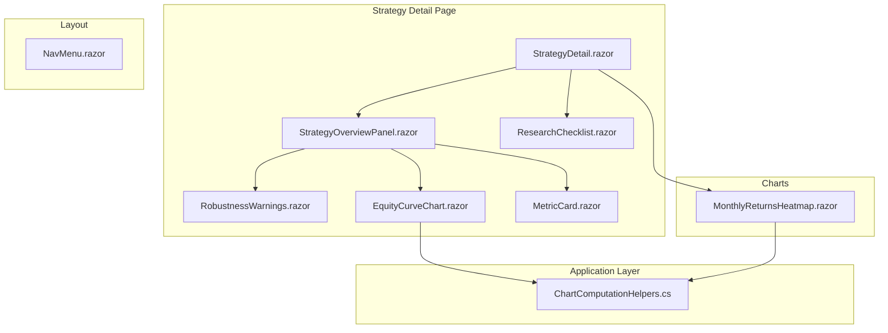

# Design Document: UI Charting & UX Improvements

## Overview

This design covers 13 UI/UX improvements to the TradingResearchEngine Blazor web frontend. The changes span five component areas:

1. **Equity Curve Chart** (Requirements 1–4): Reduce drawdown visual dominance, consolidate duplicate charts, tighten Y-axis scaling, add crosshair tooltips.
2. **Monthly Returns Heatmap** (Requirements 5–6): Improve readability with annotations and dynamic font sizing; normalise color scale to actual data range.
3. **Strategy Overview Panel** (Requirements 7–8): Establish KPI card visual hierarchy; reposition robustness warnings above the chart.
4. **Research Checklist** (Requirements 9–11): Add three visual states, inline progress indicator, and step description tooltips.
5. **Navigation & Controls** (Requirements 12–13): Improve sidebar hierarchy; make version selector visually interactive.

All changes are confined to the `TradingResearchEngine.Web` project. No Core or Application layer changes are required except for a small helper method addition to `ChartComputationHelpers` for Y-axis range computation.

## Architecture

The improvements follow the existing Blazor Server component architecture with Plotly.Blazor for charting and MudBlazor for UI primitives.



**Key architectural decisions:**

1. **Single chart consolidation**: Remove the separate `DrawdownChart.razor` (ApexCharts-based) from the overview panel. The Plotly.Blazor `EquityCurveChart.razor` already supports a drawdown overlay via `ShowDrawdown` parameter — we add a toggle control in the parent panel.

2. **Computation in Application layer**: Y-axis range calculation and heatmap annotation generation are pure functions placed in `ChartComputationHelpers.cs` so they can be unit-tested without Blazor rendering.

3. **Three-state enum for checklist**: Introduce a `ResearchStepStatus` enum (`NotStarted`, `InProgress`, `Completed`) to replace the current boolean model, enabling the three visual states.

4. **No new NuGet packages**: All changes use existing Plotly.Blazor and MudBlazor capabilities.

## Components and Interfaces

### Modified Components

| Component | File | Changes |
|-----------|------|---------|
| `EquityCurveChart.razor` | `Components/Charts/` | Reduce drawdown opacity, tighten Y-axis, add crosshair config, spike lines |
| `MonthlyReturnsHeatmap.razor` | `Components/Charts/` | Add annotations, dynamic height, font sizing, data-driven color scale |
| `StrategyOverviewPanel.razor` | `Components/Pages/Strategies/` | Add drawdown toggle, reposition warnings above chart, KPI hierarchy |
| `MetricCard.razor` | `Components/Shared/` | Add `IsPrimary` parameter for visual hierarchy |
| `ResearchChecklist.razor` | `Components/Shared/` | Three visual states, progress bar, step tooltips |
| `RobustnessWarnings.razor` | `Components/Shared/` | Full-width banner layout |
| `NavMenu.razor` | `Components/Layout/` | Section header typography, indentation, chevron indicators |
| `StrategyDetail.razor` | `Components/Pages/Strategies/` | Version selector styling, confidence badge in header |

### New Types

| Type | Location | Purpose |
|------|----------|---------|
| `ResearchStepStatus` enum | `Application/Research/` | `NotStarted`, `InProgress`, `Completed` — replaces boolean step tracking |
| `ComputeYAxisRange` method | `Application/Helpers/ChartComputationHelpers.cs` | Pure function: `(min, max) → (lower, upper)` with ±1% padding |
| `ComputeHeatmapAnnotations` method | `Application/Helpers/ChartComputationHelpers.cs` | Pure function: monthly returns → annotation text list |

### Component Parameter Changes

**EquityCurveChart.razor** — no new parameters (existing `ShowDrawdown` is sufficient). Internal rendering logic changes.

**MetricCard.razor** — new parameter:
```csharp
[Parameter] public bool IsPrimary { get; set; } = false;
```

**ResearchChecklist.razor** — parameter type change:
```csharp
// Current: accepts ResearchChecklist with boolean fields
// New: accepts a model with ResearchStepStatus per step
[Parameter, EditorRequired]
public ResearchChecklistModel Checklist { get; set; } = default!;
```

**StrategyOverviewPanel.razor** — new parameter:
```csharp
[Parameter] public bool ShowDrawdownOverlay { get; set; } = true;
```

## Data Models

### ResearchStepStatus Enum

```csharp
namespace TradingResearchEngine.Application.Research;

/// <summary>Visual state of a research checklist step.</summary>
public enum ResearchStepStatus
{
    NotStarted,
    InProgress,
    Completed
}
```

### Y-Axis Range Computation

```csharp
/// <summary>
/// Computes tight Y-axis bounds with ±1% padding around the data range.
/// </summary>
public static (decimal Lower, decimal Upper) ComputeYAxisRange(decimal minEquity, decimal maxEquity)
{
    var lower = minEquity * 0.99m;
    var upper = maxEquity * 1.01m;
    return (lower, upper);
}
```

### Heatmap Annotation Model

```csharp
/// <summary>A text annotation for a heatmap cell.</summary>
public sealed record HeatmapAnnotation(int Year, int Month, string Text);

/// <summary>
/// Generates formatted annotation strings for all non-null monthly return cells.
/// </summary>
public static IReadOnlyList<HeatmapAnnotation> ComputeHeatmapAnnotations(
    IReadOnlyList<MonthlyReturn> returns)
{
    return returns
        .Select(r => new HeatmapAnnotation(r.Year, r.Month, $"{r.ReturnPercent:F1}%"))
        .ToList();
}
```

### Step Descriptions Dictionary

```csharp
public static readonly IReadOnlyDictionary<string, string> StepDescriptions = new Dictionary<string, string>
{
    ["InitialBacktest"] = "Runs the strategy on historical data to establish baseline performance metrics.",
    ["MonteCarloRobustness"] = "Resamples trade sequences to assess whether results are robust to ordering effects.",
    ["WalkForwardValidation"] = "Tests the strategy on sequential out-of-sample windows to detect overfitting.",
    ["RegimeSensitivity"] = "Evaluates performance across different market regimes (trending, ranging, volatile).",
    ["RealismImpact"] = "Measures how execution costs (slippage, commissions) degrade theoretical performance.",
    ["ParameterSurface"] = "Maps strategy performance across parameter variations to identify fragile optima.",
    ["FinalHeldOutTest"] = "Runs the strategy on a sealed test set never used during development.",
    ["PropFirmEvaluation"] = "Evaluates whether the strategy meets prop firm challenge rules and economics.",
    ["CpcvDone"] = "Applies combinatorial purged cross-validation to quantify probability of overfitting."
};
```

## Correctness Properties

*A property is a characteristic or behavior that should hold true across all valid executions of a system — essentially, a formal statement about what the system should do. Properties serve as the bridge between human-readable specifications and machine-verifiable correctness guarantees.*

### Property 1: Y-Axis Range Padding

*For any* equity curve with min value `m` and max value `M` where `m > 0` and `M >= m`, the computed Y-axis range SHALL have lower bound equal to `m * 0.99` and upper bound equal to `M * 1.01`.

**Validates: Requirements 3.1**

### Property 2: Heatmap Annotation Completeness

*For any* set of monthly return values, the number of generated heatmap annotations SHALL equal the number of non-null return entries, and each annotation text SHALL be the return value formatted to exactly one decimal place followed by a percent sign.

**Validates: Requirements 5.3**

### Property 3: Heatmap Color Scale Bounds Match Data Range

*For any* non-empty set of monthly return values, the color scale minimum SHALL equal the minimum return value and the color scale maximum SHALL equal the maximum return value in the dataset.

**Validates: Requirements 6.1**

### Property 4: Heatmap Dynamic Height Accommodates All Years

*For any* equity curve spanning `N` distinct calendar years where `N >= 1`, the computed chart height SHALL be at least `N * 30` pixels.

**Validates: Requirements 5.2**

### Property 5: Research Progress Indicator Accuracy

*For any* combination of 9 research step states (each being NotStarted, InProgress, or Completed), the progress bar value SHALL equal `completedCount / 9 * 100` and the displayed text SHALL read `"{completedCount} of 9 completed"` where `completedCount` is the number of steps with status `Completed`.

**Validates: Requirements 10.1, 10.2**

## Error Handling

| Scenario | Handling |
|----------|----------|
| Equity curve is null or empty | Chart renders nothing (existing guard: `if (Curve is null \|\| Curve.Count == 0) return`) |
| All equity values are identical (zero range) | Y-axis range computation returns `(value * 0.99, value * 1.01)` — still produces a visible range |
| Monthly returns list is empty | Heatmap renders nothing; annotations list is empty |
| All monthly returns are null | No annotations generated; color scale defaults to [0, 0] — handled by Plotly gracefully |
| ResearchChecklist is null | Progress bar and checklist section show "No checklist data" fallback (existing pattern) |
| Step description key not found | Tooltip renders empty string; no crash |

## Testing Strategy

### Property-Based Tests (FsCheck.Xunit)

All property tests live in `TradingResearchEngine.UnitTests` and use `FsCheck.Xunit` with minimum 100 iterations per property.

| Property | Test Class | What It Validates |
|----------|-----------|-------------------|
| Property 1: Y-Axis Range Padding | `ChartComputationHelpersProperties` | `ComputeYAxisRange` returns correct ±1% bounds for any positive min/max |
| Property 2: Heatmap Annotation Completeness | `ChartComputationHelpersProperties` | `ComputeHeatmapAnnotations` produces one annotation per non-null entry with correct format |
| Property 3: Color Scale Bounds | `ChartComputationHelpersProperties` | Color scale min/max equals actual data min/max for any non-empty return set |
| Property 4: Dynamic Height | `ChartComputationHelpersProperties` | Computed height >= yearCount * 30 for any year span |
| Property 5: Progress Indicator | `ResearchChecklistProperties` | Progress value and text are correct for any combination of 9 step states |

Tag format:
```csharp
// Feature: ui-charting-ux-improvements, Property 1: Y-Axis Range Padding
[Property(MaxTest = 100)]
```

### Unit Tests (xUnit)

Example-based tests covering the UI configuration assertions:

| Test Class | Coverage |
|-----------|----------|
| `EquityCurveChartTests` | Drawdown opacity <= 0.15, line width >= 2, line color opacity <= 0.4, crosshair config, conditional tooltip content |
| `MonthlyReturnsHeatmapTests` | Font size >= 12px, ZMid = 0, all-positive color variation, hover template format |
| `MetricCardTests` | IsPrimary=true renders Typo.h5, IsPrimary=false renders Typo.h6 |
| `ResearchChecklistTests` | Three visual states (icon + opacity per state), all 9 descriptions present, progress bar 100% when all complete |
| `RobustnessWarningsTests` | Renders nothing when no warnings, renders full-width banner when warnings exist |
| `NavMenuTests` | Section headers use Typo.overline, child links indented >= 16px |
| `VersionSelectorTests` | Variant.Outlined applied, hover class present |

### Testing Approach

- **Unit tests** verify specific rendering configurations and edge cases using bUnit (Blazor component test library) where applicable, or by testing the pure computation helpers directly.
- **Property tests** verify the pure computation functions (`ComputeYAxisRange`, `ComputeHeatmapAnnotations`, progress calculation) hold correct invariants across all valid inputs.
- **Manual testing** is required for visual appearance (opacity perception, color contrast, animation smoothness) since these are subjective visual qualities not amenable to automated assertion.

### Test Configuration

- Property tests: minimum 100 iterations (`[Property(MaxTest = 100)]`)
- Each property test references its design document property in a comment tag
- All tests in `TradingResearchEngine.UnitTests` project (references Application only, not Web)
