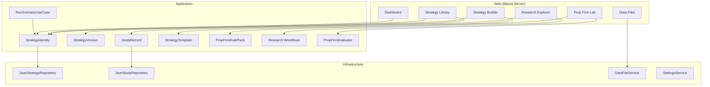
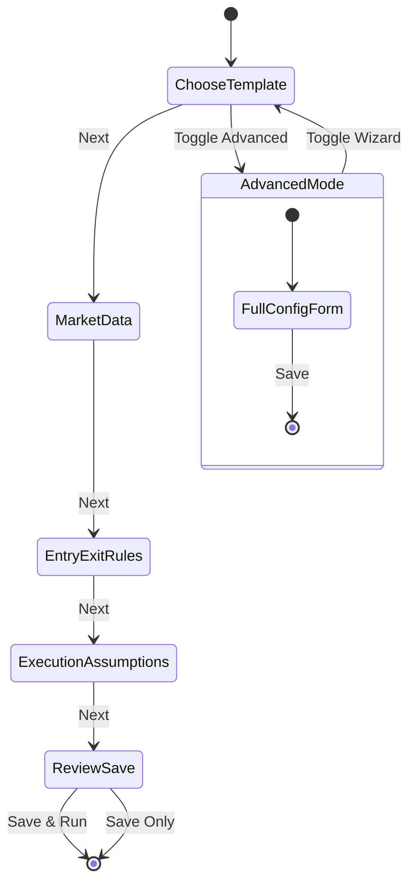

# Design Document — TradingResearchEngine V3 Product & UX

## Overview

V3 transforms TradingResearchEngine from an engine-centric tool into a user-facing research product. The engine (V2/V2.1) remains untouched. V3 adds a product domain model (strategies, versions, studies, evaluations), a guided strategy builder, enriched prop firm modelling, and a progressive-disclosure analytics UX.

All V3 product concepts live in the Application layer. Core remains engine-only. The Blazor Server Web project is the primary UI host.

---

## Architecture

### Layer Ownership

```
Core          — Engine, events, portfolio, metrics (unchanged)
Application   — Use cases, workflows, strategies, prop-firm,
                NEW: StrategyIdentity, StrategyVersion, StudyRecord,
                StrategyTemplate, PropFirmRulePack, ChallengePhase,
                IStrategyRepository, IStudyRepository
Infrastructure— Data providers, JSON persistence, reporters,
                NEW: JsonStrategyRepository, JsonStudyRepository,
                DataFileService, SettingsService
Web           — Blazor Server UI (primary V3 surface)
                NEW: Strategy Builder, Strategy Library, Research Explorer,
                Prop Firm Lab, Dashboard, Settings, Data Files
```

### Dependency Rule (preserved)

```
Core ← Application ← Infrastructure ← { Cli, Api, Web }
```

No product/UI concepts leak into Core.

### Component Diagram



---

## Components and Interfaces

### Application Layer — Product Domain Model

```csharp
// Strategy identity — user's named research concept
public sealed record StrategyIdentity(
    string StrategyId,
    string StrategyName,
    string StrategyType,        // maps to IStrategy via StrategyRegistry
    DateTimeOffset CreatedAt,
    string? Description) : IHasId
{
    public string Id => StrategyId;
}

// Specific parameter configuration of a strategy
public sealed record StrategyVersion(
    string StrategyVersionId,
    string StrategyId,
    int VersionNumber,
    Dictionary<string, object> Parameters,
    ScenarioConfig BaseScenarioConfig,  // full config snapshot
    DateTimeOffset CreatedAt,
    string? ChangeNote) : IHasId
{
    public string Id => StrategyVersionId;
}

// Research workflow execution linked to a strategy version
public sealed record StudyRecord(
    string StudyId,
    string StrategyVersionId,
    StudyType Type,
    StudyStatus Status,
    DateTimeOffset CreatedAt,
    string? SourceRunId,
    string? ErrorSummary) : IHasId
{
    public string Id => StudyId;
}

public enum StudyType { MonteCarlo, WalkForward, Sensitivity, ParameterSweep, Realism, ParameterStability }
public enum StudyStatus { Running, Completed, Failed, Incomplete, Cancelled }

// Pre-built strategy starting point
public sealed record StrategyTemplate(
    string TemplateId,
    string Name,
    string Description,
    string StrategyType,
    string TypicalUseCase,
    Dictionary<string, object> DefaultParameters,
    string RecommendedTimeframe,
    ExecutionRealismProfile RecommendedProfile) : IHasId
{
    public string Id => TemplateId;
}
```

### Application Layer — Prop Firm Model (Extended)

```csharp
public sealed record PropFirmRulePack(
    string RulePackId,
    string FirmName,
    string ChallengeName,
    decimal AccountSizeUsd,
    IReadOnlyList<ChallengePhase> Phases,
    decimal? PayoutSplitPercent,
    decimal? ScalingThresholdPercent,
    IReadOnlyList<string> UnsupportedRules,
    bool IsBuiltIn,
    string? Notes) : IHasId
{
    public string Id => RulePackId;
}

public sealed record ChallengePhase(
    string PhaseName,
    decimal ProfitTargetPercent,
    decimal MaxDailyDrawdownPercent,
    decimal MaxTotalDrawdownPercent,
    int MinTradingDays,
    int? MaxTradingDays,
    decimal? ConsistencyRulePercent,
    bool TrailingDrawdown);

// Phase-level evaluation result
public sealed record PhaseEvaluationResult(
    string PhaseName,
    bool Passed,
    IReadOnlyList<RuleResult> Rules);

public sealed record RuleResult(
    string RuleName,
    RuleStatus Status,
    decimal ActualValue,
    decimal LimitValue,
    decimal Margin);  // positive = within limit, negative = breached

public enum RuleStatus { Passed, NearBreach, Failed }
```

### Application Layer — Repositories

```csharp
// In Application (interfaces only)
public interface IStrategyRepository
{
    Task<StrategyIdentity?> GetAsync(string strategyId, CancellationToken ct = default);
    Task<IReadOnlyList<StrategyIdentity>> ListAsync(CancellationToken ct = default);
    Task SaveAsync(StrategyIdentity strategy, CancellationToken ct = default);
    Task DeleteAsync(string strategyId, CancellationToken ct = default);

    Task<IReadOnlyList<StrategyVersion>> GetVersionsAsync(string strategyId, CancellationToken ct = default);
    Task SaveVersionAsync(StrategyVersion version, CancellationToken ct = default);
}

public interface IStudyRepository
{
    Task<StudyRecord?> GetAsync(string studyId, CancellationToken ct = default);
    Task<IReadOnlyList<StudyRecord>> ListByVersionAsync(string strategyVersionId, CancellationToken ct = default);
    Task SaveAsync(StudyRecord study, CancellationToken ct = default);
}
```

### Infrastructure Layer — Implementations

```csharp
// JSON file-based implementations
public sealed class JsonStrategyRepository : IStrategyRepository
{
    // strategies/{strategyId}.json
    // strategies/{strategyId}/versions/{versionId}.json
}

public sealed class JsonStudyRepository : IStudyRepository
{
    // studies/{studyId}.json
}

public sealed class DataFileService
{
    // Scans data directories, validates CSV files, provides metadata
    public IReadOnlyList<DataFileInfo> ScanDirectory(string path);
    public DataFileValidation Validate(string filePath);
    public DataFilePreview Preview(string filePath, int maxRows = 20);
}

public sealed record DataFileInfo(
    string FilePath, string FileName, string DetectedFormat,
    int RowCount, long FileSizeBytes, DateTimeOffset? RangeStart,
    DateTimeOffset? RangeEnd, DataFileValidationStatus Status);

public enum DataFileValidationStatus { Valid, Warnings, Errors }

public sealed class SettingsService
{
    // Reads/writes app settings from .kiro/settings/app-settings.json
    public AppSettings Load();
    public void Save(AppSettings settings);
}

public sealed record AppSettings(
    string DataDirectory,
    string ExportDirectory,
    ExecutionRealismProfile DefaultRealismProfile,
    decimal DefaultInitialCash,
    decimal DefaultRiskFreeRate,
    string DefaultSizingPolicy);
```

---

## Data Models

### BacktestResult (amended for V3)

```csharp
// Add optional strategy link — trailing parameter with default
public sealed record BacktestResult(
    // ... all existing fields ...
    string? StrategyVersionId = null  // V3: links run to a strategy version
) : IHasId;
```

### Pre-Built Firm Rule Packs (JSON)

Shipped as JSON files in `data/firms/`:

```json
{
  "rulePackId": "ftmo-100k-phase1",
  "firmName": "FTMO",
  "challengeName": "100k Challenge Phase 1",
  "accountSizeUsd": 100000,
  "phases": [
    {
      "phaseName": "Phase 1",
      "profitTargetPercent": 10,
      "maxDailyDrawdownPercent": 5,
      "maxTotalDrawdownPercent": 10,
      "minTradingDays": 4,
      "maxTradingDays": null,
      "consistencyRulePercent": 30,
      "trailingDrawdown": false
    }
  ],
  "payoutSplitPercent": 80,
  "scalingThresholdPercent": null,
  "unsupportedRules": ["Weekend holding restrictions"],
  "isBuiltIn": true,
  "notes": "FTMO 100k challenge as of Q1 2025"
}
```

---

## Strategy Builder — Detailed Design

### Step Flow



### Template Registry

Templates are loaded from `StrategyTemplate` records registered in DI. The builder queries `IReadOnlyList<StrategyTemplate>` to populate the template picker.

Default templates shipped:

| Template | StrategyType | Timeframe | Use Case |
|---|---|---|---|
| SMA Crossover | sma-crossover | Daily | Trend following on any instrument |
| Mean Reversion | mean-reversion | Daily | Mean reversion on range-bound instruments |
| RSI Momentum | rsi | Daily | Momentum on oversold/overbought conditions |
| Bollinger Bands | bollinger-bands | Daily | Mean reversion at band extremes |
| Donchian Breakout | donchian-breakout | Daily | Channel breakout trend following |
| Stationary MR | stationary-mean-reversion | Daily | ADF-filtered mean reversion |

### Builder State Management

The builder maintains a `BuilderDraft` in Blazor component state (not persisted until Save). Each step updates the draft. The draft is a mutable ViewModel that maps to an immutable `ScenarioConfig` on Save.

```csharp
// Web layer only — not in Application
public sealed class BuilderDraft
{
    public string? TemplateId { get; set; }
    public string StrategyName { get; set; } = "";
    public string? Description { get; set; }
    public string StrategyType { get; set; } = "";
    public string Symbol { get; set; } = "";
    public string Timeframe { get; set; } = "Daily";
    public string DataFilePath { get; set; } = "";
    public Dictionary<string, object> Parameters { get; set; } = new();
    public ExecutionRealismProfile RealismProfile { get; set; } = ExecutionRealismProfile.StandardBacktest;
    public decimal InitialCash { get; set; } = 100_000m;
    // ... other fields

    public ScenarioConfig ToScenarioConfig() { /* maps to immutable config */ }
    public StrategyIdentity ToStrategyIdentity() { /* creates identity */ }
    public StrategyVersion ToStrategyVersion(string strategyId) { /* creates v1 */ }
}
```

---

## Error Handling

| Scenario | UI Behaviour | Persistence |
|---|---|---|
| Backtest engine exception | Inline error banner + toast. "Edit & Retry" action. | `BacktestResult` with `Status=Failed` stored |
| Invalid ScenarioConfig | Inline validation errors on builder/form. Run blocked. | Not stored |
| Study abort mid-way | Inline error + "Retry" action. Partial results if available. | `StudyRecord` with `Status=Incomplete` stored |
| MC path failure | Individual path skipped, study continues. Warning in results. | Study stored with reduced path count |
| Prop evaluation missing data | Inline error: "Run backtest first." | Not stored (computed on-demand) |
| Data file validation error | Error list with row numbers on Data Files screen. | Not stored (computed on scan) |
| Cancellation | "Cancelled" status with partial data preserved. | Stored with `Status=Cancelled` |

---

## Testing Strategy

### V3 Unit Tests

| Test | Validates |
|---|---|
| `StrategyIdentity_RoundTrip_Json` | Strategy persistence |
| `StrategyVersion_LinksToParent` | Version hierarchy |
| `StudyRecord_StatusTransitions` | Study lifecycle |
| `PropFirmRulePack_MultiPhase_Evaluation` | Phase-by-phase rule checking |
| `ChallengePhase_NearBreach_Detection` | Margin calculation |
| `StrategyTemplate_DefaultParameters_Valid` | Template validity |
| `DataFileService_ValidCsv_ReturnsValid` | Data validation |
| `DataFileService_MissingColumns_ReturnsErrors` | Data validation |
| `BuilderDraft_ToScenarioConfig_Valid` | Builder output |
| `LegacyRun_NoVersionId_AppearsInLegacy` | Migration |

### V3 Integration Tests

| Test | Validates |
|---|---|
| `JsonStrategyRepository_CRUD` | Strategy persistence |
| `JsonStudyRepository_CRUD` | Study persistence |
| `FullFlow_CreateStrategy_RunBacktest_LinkResult` | End-to-end |
| `PropFirmEvaluation_FTMO100k_Phase1` | Pre-built pack evaluation |

---

## Folder Structure Changes

```
src/TradingResearchEngine.Application/
  Strategy/
    StrategyIdentity.cs          # NEW
    StrategyVersion.cs           # NEW
    StrategyTemplate.cs          # NEW
    IStrategyRepository.cs       # NEW
  Research/
    StudyRecord.cs               # NEW
    IStudyRepository.cs          # NEW
  PropFirm/
    PropFirmRulePack.cs          # NEW (replaces/extends FirmRuleSet)
    ChallengePhase.cs            # NEW
    PhaseEvaluationResult.cs     # NEW

src/TradingResearchEngine.Infrastructure/
  Persistence/
    JsonStrategyRepository.cs    # NEW
    JsonStudyRepository.cs       # NEW
  DataManagement/
    DataFileService.cs           # NEW
  Settings/
    SettingsService.cs           # NEW

src/TradingResearchEngine.Web/
  Components/Pages/
    Dashboard.razor              # UPDATED
    Strategies/
      StrategyLibrary.razor      # NEW
      StrategyDetail.razor       # NEW
      StrategyBuilder.razor      # NEW (5-step wizard)
    Research/
      ResearchExplorer.razor     # NEW
      StudyDetail.razor          # NEW
    PropFirm/
      PropFirmLab.razor          # UPDATED
      FirmComparison.razor       # NEW
      RulePackEditor.razor       # NEW
    Data.razor                   # UPDATED
    Settings.razor               # UPDATED

data/
  firms/
    ftmo-100k-phase1.json        # NEW
    ftmo-100k-phase2.json        # NEW
    myfundedfx-200k.json         # NEW
    topstep-100k.json            # NEW
    the5ers-60k.json             # NEW
```
