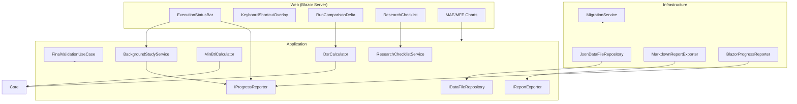
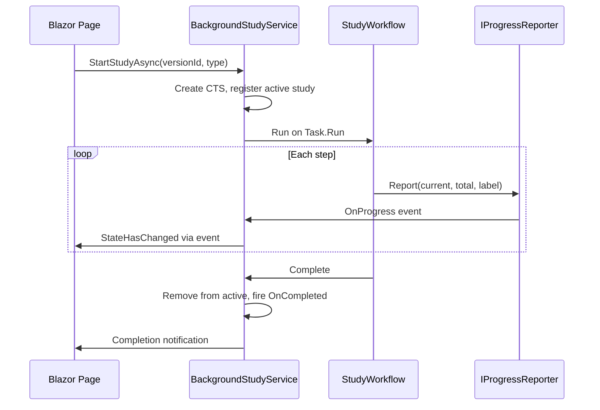
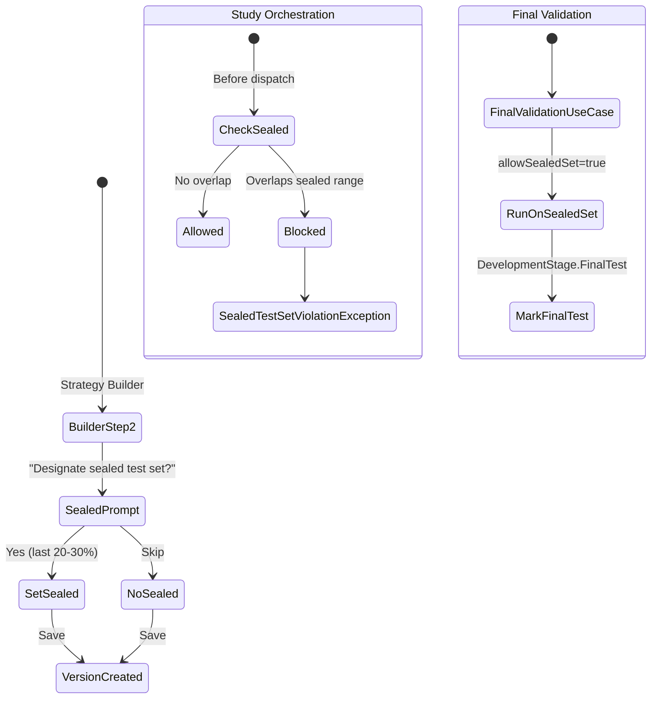

# Design Document — TradingResearchEngine V4 Research Depth & UX Completeness

## Overview

V4 extends the V3 product surface with three categories of improvements: (1) architectural completeness — error handling, progress reporting, export, background execution, migration, and data file management; (2) UX polish — responsive layout, accessibility, keyboard shortcuts, enriched wireframes; (3) research depth — development stage lifecycle, overfitting detection (DSR, MinBTL, trial budget), anchored walk-forward, sealed test sets, and expanded analytics (MAE/MFE, run comparison delta view).

All V4 product concepts continue to live in Application and Infrastructure. Core receives only minimal additions: `FailureDetail`, `DeflatedSharpeRatio`, and `TrialCount` nullable fields on `BacktestResult`, plus a `DateRangeConstraint` value object. The Blazor Server Web project is the primary UI host.

---

## Architecture

### Layer Ownership (V4 additions in bold)

```
Core          — Engine, events, portfolio, metrics
               **NEW: FailureDetail/DSR/TrialCount on BacktestResult,
                      DateRangeConstraint value object**
Application   — Use cases, workflows, strategies, prop-firm, research
               **NEW: IProgressReporter, IReportExporter, IDataFileRepository,
                      DataFileRecord, DevelopmentStage, WalkForwardMode,
                      FinalValidationUseCase, SealedTestSetViolationException,
                      DsrCalculator, MinBtlCalculator, ResearchChecklistService,
                      BackgroundStudyService, StudyType additions**
Infrastructure— Data providers, JSON persistence, reporters, settings
               **NEW: MigrationService, JsonDataFileRepository,
                      MarkdownReportExporter, CsvReportExporter,
                      JsonReportExporter, BlazorProgressReporter**
Web           — Blazor Server UI
               **NEW: ExecutionStatusBar, KeyboardShortcutOverlay,
                      enhanced Dashboard/Settings/Data/StrategyDetail/StudyDetail,
                      MAE/MFE charts, RunComparisonDelta, ResearchChecklist**
```

### Dependency Rule (preserved)

```
Core ← Application ← Infrastructure ← { Cli, Api, Web }
```

### Component Diagram (V4 additions)



---

## Components and Interfaces

### Core Layer — Minimal Additions

```csharp
// BacktestResult gains three nullable trailing fields (same pattern as StrategyVersionId)
public sealed record BacktestResult(
    // ... all existing fields ...
    string? StrategyVersionId = null,   // V3
    string? FailureDetail = null,       // V4: exception message on failed runs
    decimal? DeflatedSharpeRatio = null, // V4: DSR computed post-run
    int? TrialCount = null              // V4: snapshot of TotalTrialsRun at run time
) : IHasId;

// New value object for sealed test set enforcement
// Start is inclusive, End is exclusive: [Start, End)
// This matches the engine's bar filtering convention.
public readonly record struct DateRangeConstraint(
    DateTimeOffset Start,
    DateTimeOffset End,
    bool IsSealed);
```

### Application Layer — New Interfaces

```csharp
// Progress reporting for long-running operations
public interface IProgressReporter
{
    void Report(int current, int total, string label);
}

// Export/report generation
public interface IReportExporter
{
    Task<string> ExportMarkdownAsync(BacktestResult result, CancellationToken ct = default);
    Task<string> ExportTradeCsvAsync(BacktestResult result, CancellationToken ct = default);
    Task<string> ExportEquityCsvAsync(BacktestResult result, CancellationToken ct = default);
    Task<string> ExportJsonAsync(BacktestResult result, CancellationToken ct = default);
}

// Data file persistence
public interface IDataFileRepository
{
    Task<DataFileRecord?> GetAsync(string fileId, CancellationToken ct = default);
    Task<IReadOnlyList<DataFileRecord>> ListAsync(CancellationToken ct = default);
    Task SaveAsync(DataFileRecord record, CancellationToken ct = default);
    Task DeleteAsync(string fileId, CancellationToken ct = default);
}
```

### Application Layer — New Domain Records

```csharp
// Data file metadata (Application layer)
public sealed record DataFileRecord(
    string FileId,
    string FileName,
    string FilePath,
    string? DetectedSymbol,
    string? DetectedTimeframe,
    DateTimeOffset? FirstBar,
    DateTimeOffset? LastBar,
    int BarCount,
    ValidationStatus ValidationStatus,
    string? ValidationError,
    DateTimeOffset AddedAt) : IHasId
{
    public string Id => FileId;
}

public enum ValidationStatus { Pending, Valid, Invalid }

// Research lifecycle
public enum DevelopmentStage
{
    Hypothesis,
    Exploring,
    Optimizing,
    Validating,
    FinalTest,
    Retired
}

// Walk-forward mode
public enum WalkForwardMode { Rolling, Anchored }

```

### Application Layer — Amended Records

```csharp
// StrategyIdentity gains DevelopmentStage and Hypothesis
// Nullable defaults ensure backwards-compatible JSON deserialization
public sealed record StrategyIdentity(
    string StrategyId,
    string StrategyName,
    string StrategyType,
    DateTimeOffset CreatedAt,
    string? Description = null,
    DevelopmentStage Stage = DevelopmentStage.Exploring,  // V4
    string? Hypothesis = null                              // V4
) : IHasId;

// StrategyVersion gains TotalTrialsRun
public sealed record StrategyVersion(
    string StrategyVersionId,
    string StrategyId,
    int VersionNumber,
    Dictionary<string, object> Parameters,
    ScenarioConfig BaseScenarioConfig,
    DateTimeOffset CreatedAt,
    string? ChangeNote = null,
    int TotalTrialsRun = 0,                    // V4: incremented per run/sweep
    DateRangeConstraint? SealedTestSet = null   // V4: locked date range
) : IHasId;

// StudyRecord gains partial result tracking
public sealed record StudyRecord(
    string StudyId,
    string StrategyVersionId,
    StudyType Type,
    StudyStatus Status,
    DateTimeOffset CreatedAt,
    string? SourceRunId = null,
    string? ErrorSummary = null,
    bool IsPartial = false,       // V4
    int CompletedCount = 0,       // V4
    int TotalCount = 0            // V4
) : IHasId;

// StudyType gains new entries
public enum StudyType
{
    MonteCarlo,
    WalkForward,
    AnchoredWalkForward,       // V4
    CombinatorialPurgedCV,     // V4 (deferred to V4.1, placeholder only)
    Sensitivity,
    ParameterSweep,
    Realism,
    ParameterStability,
    RegimeSegmentation         // V4 (from prompt C3)
}
```

### Application Layer — New Services

```csharp
// Deflated Sharpe Ratio calculator
public static class DsrCalculator
{
    /// <summary>
    /// Computes the Deflated Sharpe Ratio given the observed Sharpe,
    /// trial count, skewness, kurtosis, and bar count.
    /// </summary>
    public static decimal Compute(
        decimal observedSharpe,
        int trialCount,
        decimal skewness,
        decimal kurtosis,
        int barCount,
        int barsPerYear);
}

// Minimum Backtest Length calculator
public static class MinBtlCalculator
{
    /// <summary>
    /// Returns the minimum bar count required for 95% confidence
    /// given the observed Sharpe, trial count, skewness, and kurtosis.
    /// </summary>
    public static int MinimumBarsRequired(
        decimal observedSharpe,
        int trialCount,
        decimal skewness,
        decimal kurtosis);
}

// Research checklist computation
public sealed class ResearchChecklistService
{
    /// <summary>
    /// Computes the research checklist for a strategy version by
    /// querying runs, studies, and evaluations.
    /// </summary>
    public async Task<ResearchChecklist> ComputeAsync(
        string strategyVersionId,
        CancellationToken ct = default);
}

public sealed record ResearchChecklist(
    bool InitialBacktest,
    bool MonteCarloRobustness,
    bool WalkForwardValidation,
    bool RegimeSensitivity,
    bool RealismImpact,
    bool ParameterSurface,
    bool FinalHeldOutTest,
    bool PropFirmEvaluation)
{
    public int PassedCount => new[] {
        InitialBacktest, MonteCarloRobustness, WalkForwardValidation,
        RegimeSensitivity, RealismImpact, ParameterSurface,
        FinalHeldOutTest, PropFirmEvaluation
    }.Count(x => x);

    public int TotalChecks => 8;

    public string ConfidenceLevel => PassedCount switch
    {
        >= 7 => "HIGH",
        >= 4 => "MEDIUM",
        _ => "LOW"
    };
}

// Sealed test set enforcement
public sealed class SealedTestSetViolationException : Exception
{
    public SealedTestSetViolationException(string message) : base(message) { }
}

// Final validation use case
public sealed class FinalValidationUseCase
{
    /// <summary>
    /// Runs a single backtest against the sealed test set.
    /// Bypasses the sealed-set guard. Marks strategy as FinalTest stage.
    /// </summary>
    public async Task<ScenarioRunResult> RunAsync(
        string strategyVersionId,
        CancellationToken ct = default);
}

// Background study execution service (singleton, scoped to app lifetime)
// NOTE: This is an Application-layer abstraction. The concrete implementation
// must be registered in the Web host (or Infrastructure) because it manages
// Task.Run lifetime, CancellationTokenSource disposal, and process-level
// concurrency — all host concerns. Each background study execution must
// create its own DI scope to avoid capturing scoped services across task boundaries.
public sealed class BackgroundStudyService : IDisposable
{
    public event Action<StudyProgressUpdate>? OnProgress;
    public event Action<StudyCompletionUpdate>? OnCompleted;

    public Task<string> StartStudyAsync(
        string strategyVersionId,
        StudyType type,
        Dictionary<string, object>? options = null,
        CancellationToken ct = default);

    public void CancelStudy(string studyId);
    public IReadOnlyList<ActiveStudy> GetActiveStudies();
}

public sealed record StudyProgressUpdate(
    string StudyId, int Current, int Total, string Label);

public sealed record StudyCompletionUpdate(
    string StudyId, StudyStatus Status, string? ErrorMessage);

public sealed record ActiveStudy(
    string StudyId, string StrategyVersionId, StudyType Type,
    int Current, int Total, DateTimeOffset StartedAt);
```

### Infrastructure Layer — New Implementations

```csharp
// V2 data migration
public sealed class MigrationService
{
    private const string LockFileName = "migration_v4.lock";

    /// <summary>
    /// Runs once on startup. Creates synthetic strategy for orphaned results.
    /// Checks for lock file and skips if already run.
    /// </summary>
    public async Task MigrateIfNeededAsync(CancellationToken ct = default);
}

// Data file repository
public sealed class JsonDataFileRepository : IDataFileRepository
{
    // datafiles/{fileId}.json
}

// Report exporters
public sealed class MarkdownReportExporter : IReportExporter
{
    // Generates .md file with config table, metrics table, trade log
}

public sealed class CsvReportExporter
{
    // Trade log CSV and equity curve CSV
    public Task<string> ExportTradeCsvAsync(BacktestResult result, string outputDir);
    public Task<string> ExportEquityCsvAsync(BacktestResult result, string outputDir);
}

public sealed class JsonReportExporter
{
    // Full BacktestResult serialized
    public Task<string> ExportJsonAsync(BacktestResult result, string outputDir);
}

// Blazor-specific progress reporter
public sealed class BlazorProgressReporter : IProgressReporter
{
    private readonly Action<int, int, string> _callback;

    public BlazorProgressReporter(Action<int, int, string> callback)
        => _callback = callback;

    public void Report(int current, int total, string label)
        => _callback(current, total, label);
}
```

---

## Data Models

### AppSettings (extended for V4)

```csharp
public sealed record AppSettings(
    string DataDirectory,
    string ExportDirectory,
    string RulePacksDirectory,
    string ResultsDirectory,
    ExecutionRealismProfile DefaultRealismProfile,
    decimal DefaultInitialCash,
    decimal DefaultRiskFreeRate,
    string DefaultSizingPolicy,
    int StudyTimeoutMinutes = 5,        // V4
    int SingleRunTimeoutSeconds = 60);  // V4
```

### Markdown Report Structure

```markdown
# Run Report: {StrategyName} v{VersionNumber}
**Date:** {RunDate}  **Status:** Completed  **Duration:** 1.2s
**DSR:** 1.12  **Trial #:** 5

## Configuration
| Field       | Value              |
|-------------|-------------------|
| Symbol      | EURUSD            |
| Timeframe   | Daily             |
| Date Range  | 2020-01-01–2024-12-31 |
| Initial Cash| $100,000          |
| Realism     | Standard          |

## Key Metrics
| Metric           | Value  |
|------------------|--------|
| Sharpe Ratio     | 1.42   |
| Deflated Sharpe  | 1.12   |
| Max Drawdown     | 8.3%   |
| Win Rate         | 61%    |
| Profit Factor    | 1.87   |
| Expectancy       | $142   |
| Recovery Factor  | 3.41   |
| Total Trades     | 23     |

## Robustness Notes
- ⚠ Total trades < 30 (insufficient sample size)
- Monte Carlo verdict: 🟢 Robust (if study exists)

## Trade Log
| # | Entry | Exit | Dir | Qty | Entry$ | Exit$ | Net P&L | MAE | MFE |
|---|-------|------|-----|-----|--------|-------|---------|-----|-----|
| 1 | 2020-03-15 | 2020-04-02 | Long | 100 | 1.1050 | 1.1180 | $130 | -$45 | $180 |
```

---

## Background Execution Architecture

### Design

Studies run on a background `Task` managed by `BackgroundStudyService` (registered as a singleton). The service maintains a `ConcurrentDictionary<string, CancellationTokenSource>` for active studies.



### Execution Status Bar (MainLayout addition)

The `ExecutionStatusBar` component is added to `MainLayout.razor` below `MudMainContent`. It subscribes to `BackgroundStudyService.OnProgress` and `OnCompleted` events. It renders only when active studies exist or recent completions are undismissed.

```
┌─────────────────────────────────────────────────────────────────┐
│ 🔄 Monte Carlo (EURUSD MR v4): 34% · [View] [Stop]            │
└─────────────────────────────────────────────────────────────────┘
```

On completion:
```
┌─────────────────────────────────────────────────────────────────┐
│ ✅ Monte Carlo (EURUSD MR v4): Complete — 1000 paths · [View Results] [✕] │
└─────────────────────────────────────────────────────────────────┘
```

---

## Sealed Test Set Design

### Flow



### Storage

`DateRangeConstraint` is stored on `StrategyVersion.SealedTestSet`. When null, no sealed set is configured. The Application-layer study orchestrator checks this before dispatching any study workflow.

---

## DSR & Overfitting Detection Design

### Deflated Sharpe Ratio

DSR adjusts the observed Sharpe for the number of trials (multiple testing bias). The formula follows Bailey & López de Prado (2014):

```
DSR = Φ⁻¹(1 - e₀) × √(V[SR̂]) + E[SR̂]
```

Where:
- `e₀` = expected maximum Sharpe from `N` independent trials under the null hypothesis
- `V[SR̂]` = variance of the Sharpe estimator (depends on skewness, kurtosis, bar count)
- `E[SR̂]` = expected Sharpe under the null (zero)

Implementation lives in `DsrCalculator` (Application layer, static pure function). It's called by `RunScenarioUseCase` after a successful run, before persisting the result.

### Trial Count Flow

1. `RunScenarioUseCase.RunAsync` completes a run
2. If `StrategyVersionId` is set, load the `StrategyVersion`
3. Increment `TotalTrialsRun` on the version
4. Snapshot `TotalTrialsRun` into `BacktestResult.TrialCount` — this **includes the current run**
5. Compute DSR using `DsrCalculator.Compute(sharpe, trialCount, skew, kurt, bars, barsPerYear)`
6. Set `BacktestResult.DeflatedSharpeRatio`
7. Persist both the updated version and the result

**Trial count increment rules:**
- Completed runs: increment by 1. TrialCount includes this run.
- Parameter sweeps: increment by N (number of evaluated combinations), not 1.
- Config validation failures: do NOT increment (no execution occurred).
- Runtime failures (Status=Failed): increment by 1 (execution was attempted and produced evaluable partial statistics).
- Cancelled runs: increment by 1 if any bars were processed, otherwise do not increment.

### MinBTL

`MinBtlCalculator.MinimumBarsRequired` returns the minimum bar count for 95% statistical confidence. If the actual bar count is below this threshold, a warning is surfaced on the Run Detail screen.

---

## Research Checklist Design

### Computation

`ResearchChecklistService` queries the following for a given `strategyVersionId`:

| Check | Source | Condition |
|-------|--------|-----------|
| Initial backtest | `IRepository<BacktestResult>` | At least 1 completed run |
| Monte Carlo robustness | `IStudyRepository` | Completed MC study with verdict ≠ Fragile |
| Walk-forward validation | `IStudyRepository` | Completed WF study |
| Regime sensitivity | `IStudyRepository` | Completed RegimeSegmentation study |
| Realism impact | `IStudyRepository` | Completed Realism study |
| Parameter surface | `IStudyRepository` | Completed Sensitivity study |
| Final held-out test | `StrategyVersion.SealedTestSet` + run | Final validation run exists |
| Prop firm evaluation | Prop firm evaluator | At least 1 evaluation completed |

### Display

Rendered as a vertical checklist on Strategy Detail with ✅/⬜ icons and a Confidence Level badge.

---

## Error Handling (V4 additions)

| Scenario | UI Behaviour | Persistence |
|---|---|---|
| Config validation failure | Inline errors, run blocked | Not stored |
| Runtime exception | ❌ Failed banner, collapsed error, [Re-run] / [Edit & Re-run] | `BacktestResult` with `Status=Failed`, `FailureDetail` set |
| Timeout (single run) | Same as runtime exception, message: "Execution timed out after 60s" | Same as runtime exception |
| Timeout (study) | Same as runtime exception on the study level | `StudyRecord` with `Status=Failed` |
| Study cancellation | ⚠️ Partial banner with completed count | `StudyRecord` with `Status=Cancelled`, `IsPartial=true` |
| Migration failure | Logged, app continues normally | Lock file not written, retries next startup |
| Sealed test set violation | Inline error: "This date range overlaps the sealed test set" | Not stored |

---

## Testing Strategy

### V4 Unit Tests

| Test | Validates | Requirements |
|---|---|---|
| `DsrCalculator_KnownInputs_ReturnsExpected` | DSR formula correctness | 19.1, 19.2 |
| `DsrCalculator_SingleTrial_ReturnsRawSharpe` | Edge case: trial count = 1 | 19.1 |
| `MinBtlCalculator_ShortData_ReturnsHighMinimum` | MinBTL formula | 19.6, 19.7 |
| `ResearchChecklist_NoStudies_AllFalse` | Checklist defaults | 18.5 |
| `ResearchChecklist_AllComplete_HighConfidence` | Full checklist | 18.6 |
| `DataFileRecord_RoundTrip_Json` | Data file persistence | 3.7 |
| `DataFileRecord_Validation_MissingColumns` | Validation rules | 3.3 |
| `StudyRecord_PartialFields_Serialize` | Partial study persistence | 7.5 |
| `StrategyIdentity_MissingStage_DefaultsToExploring` | Migration-safe deserialization | 18.1 |
| `StrategyVersion_SealedTestSet_Serializes` | Sealed set persistence | 20.6 |
| `SealedTestSetViolation_OverlappingRange_Throws` | Sealed set enforcement | 20.7 |
| `FinalValidation_BypassesGuard` | Final validation flow | 20.9 |
| `BacktestResult_FailureDetail_NullByDefault` | Backwards compat | 2.2 |
| `MarkdownExport_CompletedRun_ValidMarkdown` | Export format | 6.2 |
| `CsvExport_TradeLog_CorrectColumns` | CSV columns | 6.3 |
| `CsvExport_EquityCurve_CorrectColumns` | CSV columns | 6.5 |
| `WalkForwardMode_Anchored_FixedStart` | Anchored WF logic | 20.4 |

### V4 Integration Tests

| Test | Validates | Requirements |
|---|---|---|
| `MigrationService_OrphanedResults_LinkedToImported` | V2 migration | 4.1, 4.2 |
| `MigrationService_LockFile_SkipsSecondRun` | Idempotency | 4.5 |
| `JsonDataFileRepository_CRUD` | Data file persistence | 15.1 |
| `BackgroundStudyService_StartCancel_PartialResults` | Background execution | 9.1, 7.1 |
| `FullFlow_CreateStrategy_SetSealed_FinalValidation` | End-to-end sealed set | 20.6–20.10 |
| `ExportMarkdown_RoundTrip_ValidContent` | Export integration | 6.1–6.4 |

---

## Strategy Version Execution Window (V4 Amendment)

### Canonical Source

`StrategyVersion.BaseScenarioConfig` is the single source of truth for the execution window:
- **Timeframe**: `ScenarioConfig.Timeframe` (nullable string, new V4 field). Null for legacy configs; inferred from `BarsPerYear` when missing.
- **Start date**: `ScenarioConfig.DataProviderOptions["From"]` (DateTimeOffset)
- **End date**: `ScenarioConfig.DataProviderOptions["To"]` (DateTimeOffset)
- **BarsPerYear**: updated automatically when Timeframe changes (Daily=252, H4=1512, H1=6048, M15=24192)

No parallel model is created. All run launches, study dispatches, and exports read from `BaseScenarioConfig`.

### Core Change

`ScenarioConfig` gains one nullable trailing field:
```csharp
string? Timeframe = null  // "Daily", "H4", "H1", "M15"
```
Backwards-compatible: missing field deserializes to null.

### Application Layer

`ExecutionWindowEditor` (static class in Application/Engine):
- `Validate(version, timeframe, start, end, dataFile?)` — returns `EditResult` with errors or updated version
- `GetCurrentWindow(version)` — extracts (Timeframe, Start, End) from BaseScenarioConfig
- `EstimateBarCount(timeframe, start, end)` — rough bar count estimate

Validation rules:
- Start < End
- Dates within data file bounds (if attached)
- End date must not exclude sealed test set
- FinalTest stage triggers warning (not block)

### Web UI

Strategy Detail gains:
- "Execution Window" card in the left panel showing Timeframe, Start, End, Est. Bars
- "Edit Window" button opening a modal dialog
- Legacy versions show "Not set" / "Inherited" for missing values

---

## Folder Structure Changes (V4)

```
src/TradingResearchEngine.Core/
  Results/
    BacktestResult.cs              # AMENDED (FailureDetail, DSR, TrialCount)
  Configuration/
    DateRangeConstraint.cs         # NEW

src/TradingResearchEngine.Application/
  Strategy/
    StrategyIdentity.cs            # AMENDED (DevelopmentStage, Hypothesis)
    StrategyVersion.cs             # AMENDED (TotalTrialsRun, SealedTestSet)
    DevelopmentStage.cs            # NEW
  Research/
    StudyRecord.cs                 # AMENDED (IsPartial, CompletedCount, TotalCount)
    WalkForwardMode.cs             # NEW
    IProgressReporter.cs           # NEW
    BackgroundStudyService.cs      # NEW
    ResearchChecklistService.cs    # NEW
  DataFiles/
    DataFileRecord.cs              # NEW
    IDataFileRepository.cs         # NEW
    ValidationStatus.cs            # NEW
  Export/
    IReportExporter.cs             # NEW
  Engine/
    FinalValidationUseCase.cs      # NEW
    SealedTestSetViolationException.cs  # NEW
  Metrics/
    DsrCalculator.cs               # NEW
    MinBtlCalculator.cs            # NEW

src/TradingResearchEngine.Infrastructure/
  Persistence/
    JsonDataFileRepository.cs      # NEW
    MigrationService.cs            # NEW
  Export/
    MarkdownReportExporter.cs      # NEW
    CsvReportExporter.cs           # NEW
    JsonReportExporter.cs          # NEW
  Progress/
    BlazorProgressReporter.cs      # NEW

src/TradingResearchEngine.Web/
  Components/Layout/
    MainLayout.razor               # AMENDED (ExecutionStatusBar)
    ExecutionStatusBar.razor        # NEW
    KeyboardShortcutOverlay.razor   # NEW
  Components/Pages/
    Dashboard.razor                # AMENDED (Research Pipeline, Strategy Health)
    Settings.razor                 # AMENDED (directory paths, timeouts, about)
    Data.razor                     # AMENDED (add file, validation details)
  Components/Pages/Strategies/
    StrategyDetail.razor           # AMENDED (ResearchChecklist, Hypothesis)
  Components/Pages/Backtests/
    ResultDetail.razor             # AMENDED (DSR tile, failure state, export menu)
  Components/Pages/Research/
    StudyDetail.razor              # AMENDED (PBO tile, anchored mode toggle)
  Components/Shared/
    ResearchChecklist.razor        # NEW
    RunComparisonDelta.razor       # NEW
    MaeMfeScatter.razor            # NEW
    MaeMfeHistogram.razor          # NEW
    ExportMenu.razor               # NEW
    PartialStudyBanner.razor       # NEW
```
