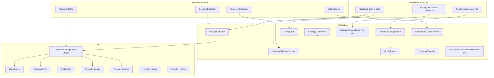
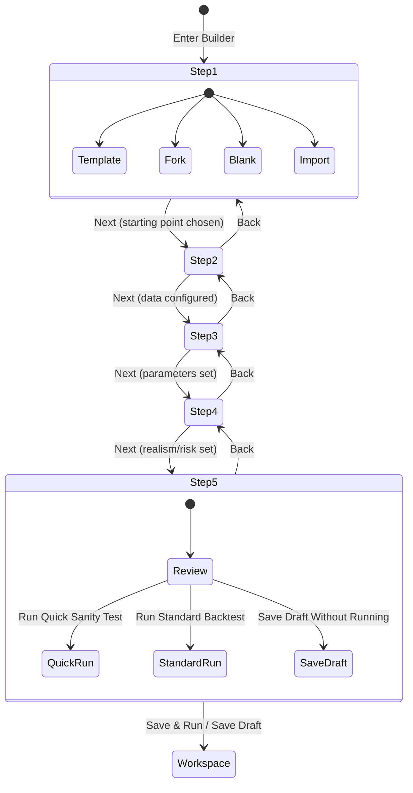
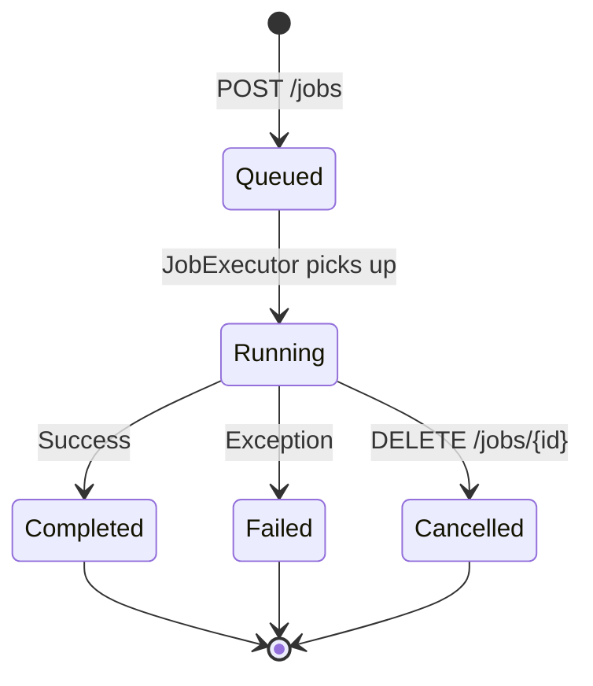
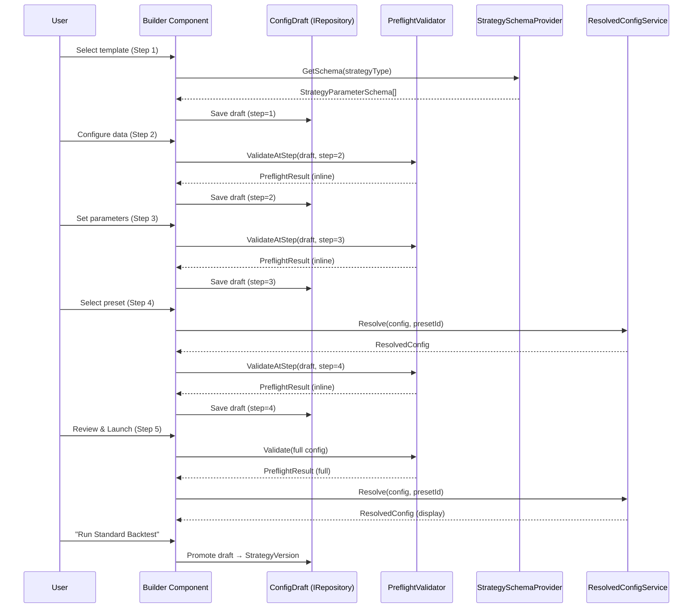

# Design Document — TradingResearchEngine V5 Engine Usability & Quant Upgrades

## Overview

V5 evolves TradingResearchEngine across four dimensions: (1) strategy creation usability — typed parameter schemas, preflight validation, a 5-step guided builder with live research summary rail, config presets, and strategy comparison; (2) configuration ergonomics — `ScenarioConfig` sub-object decomposition with backward-compatible adapter, explicit override precedence, resolved config explainability; (3) API and job workflow — async job lifecycle, standardized progress reporting, ergonomic request DTOs, and discovery endpoints; (4) quant/research depth — execution realism enhancements (gap handling, volume constraints), overfitting defense systematization, portfolio cross-asset foundation, short-selling extensibility path, and benchmarking improvements.

All changes are additive. Existing JSON payloads continue to deserialize and execute without modification. The clean architecture boundary `Core ← Application ← Infrastructure ← {Cli, Api, Web}` is preserved. Advanced no-code/DSL authoring, full CPCV, correlation-aware constraints, and short-selling execution are explicitly deferred to V5.1/V6.

---

## Architecture

### Layer Ownership (V5 additions in bold)

```
Core          — Engine, events, portfolio, metrics
               **NEW: Direction.Short (guarded), LongOnlyGuard,
                      DataConfig/StrategyConfig/RiskConfig/ExecutionConfig/ResearchConfig sub-objects,
                      ScenarioConfig.Effective* computed properties,
                      ExecutionOptions.MaxFillPercentOfVolume,
                      BacktestResult.RealismAdvisories**

Application   — Use cases, workflows, strategies, prop-firm, research
               **NEW: StrategyParameterSchema, ParameterMetaAttribute,
                      IStrategySchemaProvider, StrategySchemaProvider,
                      PreflightValidator, PreflightResult, PreflightFinding,
                      StrategyDiffService, StrategyDiff,
                      ResolvedConfigService, ResolvedConfig,
                      ConfigPreset, ConfigDraft,
                      BacktestJob, JobExecutor, IJobRepository,
                      ProgressSnapshot (extended IProgressReporter),
                      PortfolioConstraints extended (MaxExposurePerSymbol),
                      ResearchChecklistService extended (NextRecommendedAction, TrialBudget),
                      BenchmarkComparisonWorkflow extended (auto buy-and-hold, excess metrics),
                      StrategyVersion extended (SourceType, SourceTemplateId, etc.),
                      StrategyTemplate extended (FamilyPresets, DifficultyLevel)**

Infrastructure— Data providers, JSON persistence, reporters
               **NEW: JsonJobRepository**

Api           — Minimal API host
               **NEW: JobEndpoints, DiscoveryEndpoints,
                      Request DTOs (RunScenarioRequest, SubmitJobRequest, etc.)**

Web           — Blazor Server UI
               **NEW: StrategyBuilder (5-step), BuilderDraft,
                      Research Summary Rail, enhanced Strategy Workspace**
```

### Dependency Rule (preserved)

```
Core ← Application ← Infrastructure ← { Cli, Api, Web }
```

### Component Diagram (V5 additions)



### Strategy Builder Screen Flow



### Job Lifecycle



---

## Components and Interfaces

### Core Layer — New Types

#### ScenarioConfig Sub-Objects (Requirement 13)

```csharp
/// <summary>Data provider settings sub-object for ScenarioConfig decomposition.</summary>
public sealed record DataConfig(
    string DataProviderType,
    Dictionary<string, object> DataProviderOptions,
    string? Timeframe = null,
    int BarsPerYear = 252);

/// <summary>Strategy type and parameters sub-object.</summary>
public sealed record StrategyConfig(
    string StrategyType,
    Dictionary<string, object> StrategyParameters);

/// <summary>Risk parameters, position sizing, and exposure limits sub-object.</summary>
public sealed record RiskConfig(
    Dictionary<string, object> RiskParameters,
    decimal InitialCash = 100_000m,
    decimal AnnualRiskFreeRate = 0.05m);

/// <summary>Execution realism settings sub-object.</summary>
public sealed record ExecutionConfig(
    string SlippageModelType = "ZeroSlippageModel",
    string CommissionModelType = "ZeroCommissionModel",
    FillMode FillMode = FillMode.NextBarOpen,
    ExecutionRealismProfile RealismProfile = ExecutionRealismProfile.StandardBacktest,
    ExecutionOptions? ExecutionOptions = null,
    SessionOptions? SessionOptions = null);

/// <summary>Research workflow and trace settings sub-object.</summary>
public sealed record ResearchConfig(
    string? ResearchWorkflowType = null,
    Dictionary<string, object>? ResearchWorkflowOptions = null,
    int? RandomSeed = null,
    TraceOptions? TraceOptions = null);
```

#### ScenarioConfig (amended — Requirement 13)

```csharp
public sealed record ScenarioConfig(
    // ... all existing V4 fields unchanged ...
    string? Timeframe = null,
    // V5 sub-objects (trailing, default null for backward compat)
    DataConfig? Data = null,
    StrategyConfig? Strategy = null,
    RiskConfig? Risk = null,
    ExecutionConfig? Execution = null,
    ResearchConfig? Research = null) : IHasId
{
    public string Id => ScenarioId;

    /// <summary>Effective data config: sub-object wins, falls back to top-level fields.</summary>
    public DataConfig EffectiveDataConfig => Data ?? new DataConfig(
        DataProviderType, DataProviderOptions, Timeframe, BarsPerYear);

    /// <summary>Effective strategy config: sub-object wins, falls back to top-level fields.</summary>
    public StrategyConfig EffectiveStrategyConfig => Strategy ?? new StrategyConfig(
        StrategyType, StrategyParameters);

    /// <summary>Effective risk config: sub-object wins, falls back to top-level fields.</summary>
    public RiskConfig EffectiveRiskConfig => Risk ?? new RiskConfig(
        RiskParameters, InitialCash, AnnualRiskFreeRate);

    /// <summary>Effective execution config: sub-object wins, falls back to top-level fields.</summary>
    public ExecutionConfig EffectiveExecutionConfig => Execution ?? new ExecutionConfig(
        SlippageModelType, CommissionModelType, FillMode, RealismProfile,
        ExecutionOptions, SessionOptions);

    /// <summary>Effective research config: sub-object wins, falls back to top-level fields.</summary>
    public ResearchConfig EffectiveResearchConfig => Research ?? new ResearchConfig(
        ResearchWorkflowType, ResearchWorkflowOptions, RandomSeed, TraceOptions);

    /// <summary>Effective fill mode: ExecutionOptions override → sub-object → top-level.</summary>
    public FillMode EffectiveFillMode =>
        EffectiveExecutionConfig.ExecutionOptions?.FillModeOverride
        ?? EffectiveExecutionConfig.FillMode;

    public bool EnableEventTrace =>
        EffectiveResearchConfig.TraceOptions?.EnableEventTrace ?? false;
}
```

#### Direction Enum (amended — Requirement 26)

```csharp
/// <summary>
/// Trade direction. V5 adds <c>Short</c> to improve visibility of long-only assumptions;
/// runtime short-selling is guarded by <see cref="LongOnlyGuard"/> and throws
/// <see cref="NotSupportedException"/>. Short execution is a V6 task.
/// Adding the enum value forces handling in exhaustive switch expressions, but does not
/// guarantee coverage in if/else chains or default cases — explicit guard calls are required.
/// </summary>
public enum Direction { Long, Short, Flat }
```

#### LongOnlyGuard (new — Requirement 26)

```csharp
/// <summary>
/// Runtime safety net for long-only V5 scope. Called explicitly at all known
/// Direction consumption points. Complements (but does not replace) exhaustive
/// switch expression handling — if/else chains and default cases require this guard.
/// Removal is a V6 task when short-selling is implemented.
/// </summary>
public static class LongOnlyGuard
{
    /// <summary>Throws <see cref="NotSupportedException"/> when direction is Short.</summary>
    public static void EnsureLongOnly(Direction direction)
    {
        if (direction == Direction.Short)
            throw new NotSupportedException("Short selling is not yet supported.");
    }
}
```

#### ExecutionOptions (amended — Requirement 23)

```csharp
public sealed record ExecutionOptions(
    FillMode? FillModeOverride = null,
    string? SlippageModelOverride = null,
    Dictionary<string, object>? SlippageModelOptions = null,
    bool? EnablePartialFills = null,
    int? DefaultMaxBarsPending = null,
    /// <summary>V5: Cap fill quantity at this percentage of bar volume. Null = no cap.</summary>
    decimal? MaxFillPercentOfVolume = null);
```

#### BacktestResult (amended — Requirement 23)

```csharp
public sealed record BacktestResult(
    // ... all existing V4 fields unchanged ...
    int? TrialCount = null,
    /// <summary>V5: Realism warnings collected during the run (gap fills, volume warnings, session boundary fills).</summary>
    IReadOnlyList<string>? RealismAdvisories = null) : IHasId
{
    public string Id => RunId.ToString();
}
```

### Application Layer — Strategy Schema (Requirements 1, 2)

```csharp
/// <summary>Typed parameter descriptor for a strategy constructor parameter.</summary>
public sealed record StrategyParameterSchema(
    string Name,
    string DisplayName,
    string Type,            // "int", "decimal", "bool", "enum"
    object DefaultValue,
    bool IsRequired,
    object? Min,
    object? Max,
    string[]? EnumChoices,
    string Description,
    SensitivityHint SensitivityHint,
    string Group,           // "Signal", "Entry", "Exit", "Risk", "Filters", "Execution"
    bool IsAdvanced,
    int DisplayOrder);

public enum SensitivityHint { Low, Medium, High }

/// <summary>
/// Attribute for annotating strategy constructor parameters with rich metadata.
/// Falls back to constructor inspection when absent.
/// </summary>
[AttributeUsage(AttributeTargets.Parameter)]
public sealed class ParameterMetaAttribute : Attribute
{
    public string? DisplayName { get; set; }
    public string? Description { get; set; }
    public SensitivityHint SensitivityHint { get; set; } = SensitivityHint.Medium;
    public string Group { get; set; } = "Signal";
    public bool IsAdvanced { get; set; }
    public int DisplayOrder { get; set; }
    public object? Min { get; set; }
    public object? Max { get; set; }
}

/// <summary>Returns typed parameter schemas for registered strategies.</summary>
public interface IStrategySchemaProvider
{
    IReadOnlyList<StrategyParameterSchema> GetSchema(string strategyName);
}

/// <summary>
/// Builds <see cref="StrategyParameterSchema"/> from constructor inspection
/// and optional <see cref="ParameterMetaAttribute"/> annotations.
/// </summary>
public sealed class StrategySchemaProvider : IStrategySchemaProvider
{
    private readonly StrategyRegistry _registry;

    public StrategySchemaProvider(StrategyRegistry registry) => _registry = registry;

    public IReadOnlyList<StrategyParameterSchema> GetSchema(string strategyName)
    {
        var type = _registry.Resolve(strategyName);
        var ctor = type.GetConstructors()
            .OrderByDescending(c => c.GetParameters().Length)
            .FirstOrDefault();
        if (ctor is null) return Array.Empty<StrategyParameterSchema>();

        return ctor.GetParameters()
            .Select((p, i) => BuildSchema(p, i))
            .ToList();
    }

    private static StrategyParameterSchema BuildSchema(ParameterInfo param, int index)
    {
        var meta = param.GetCustomAttribute<ParameterMetaAttribute>();
        return new StrategyParameterSchema(
            Name: param.Name ?? "",
            DisplayName: meta?.DisplayName ?? FormatName(param.Name ?? ""),
            Type: MapType(param.ParameterType),
            DefaultValue: param.HasDefaultValue ? param.DefaultValue! : GetTypeDefault(param.ParameterType),
            IsRequired: !param.HasDefaultValue,
            Min: meta?.Min,
            Max: meta?.Max,
            EnumChoices: param.ParameterType.IsEnum
                ? Enum.GetNames(param.ParameterType) : null,
            Description: meta?.Description ?? "",
            SensitivityHint: meta?.SensitivityHint ?? SensitivityHint.Medium,
            Group: meta?.Group ?? "Signal",
            IsAdvanced: meta?.IsAdvanced ?? false,
            DisplayOrder: meta?.DisplayOrder ?? index);
    }
    // FormatName, MapType, GetTypeDefault are private helpers
}
```

#### StrategyDescriptor (amended — Requirement 2)

```csharp
public sealed record StrategyDescriptor(
    string StrategyType,
    string DisplayName,
    string Family,
    string Description,
    string Hypothesis,
    string? BestFor = null,
    string[]? SuggestedStudies = null,
    /// <summary>V5: Parameter schema list, populated lazily from IStrategySchemaProvider.</summary>
    IReadOnlyList<StrategyParameterSchema>? ParameterSchemas = null);
```

#### StrategyTemplate (amended — Requirement 2)

```csharp
public sealed record StrategyTemplate(
    string TemplateId,
    string Name,
    string Description,
    string StrategyType,
    string TypicalUseCase,
    Dictionary<string, object> DefaultParameters,
    string RecommendedTimeframe,
    ExecutionRealismProfile RecommendedProfile = ExecutionRealismProfile.StandardBacktest,
    StrategyDescriptor? Descriptor = null,
    /// <summary>V5: Named preset overrides keyed by preset name (e.g. "Conservative" → param dict).</summary>
    Dictionary<string, Dictionary<string, object>>? FamilyPresets = null,
    /// <summary>V5: Difficulty classification for builder UX.</summary>
    DifficultyLevel DifficultyLevel = DifficultyLevel.Beginner) : IHasId
{
    public string Id => TemplateId;
}

public enum DifficultyLevel { Beginner, Intermediate, Advanced }
```

#### StrategyVersion (amended — Requirements 2, 6)

```csharp
public sealed record StrategyVersion(
    string StrategyVersionId,
    string StrategyId,
    int VersionNumber,
    Dictionary<string, object> Parameters,
    ScenarioConfig BaseScenarioConfig,
    DateTimeOffset CreatedAt,
    string? ChangeNote = null,
    int TotalTrialsRun = 0,
    DateRangeConstraint? SealedTestSet = null,
    /// <summary>V5: How this version was created.</summary>
    SourceType SourceType = SourceType.Manual,
    /// <summary>V5: Template ID when SourceType is Template.</summary>
    string? SourceTemplateId = null,
    /// <summary>V5: Version ID when SourceType is Fork.</summary>
    string? SourceVersionId = null,
    /// <summary>V5: Original filename when SourceType is Import.</summary>
    string? ImportedFrom = null,
    /// <summary>V5: User's hypothesis for the expected market edge.</summary>
    string? Hypothesis = null,
    /// <summary>V5: How the strategy is most likely to fail.</summary>
    string? ExpectedFailureMode = null) : IHasId
{
    public string Id => StrategyVersionId;
}

/// <summary>How a StrategyVersion was created.</summary>
public enum SourceType { Template, Import, Fork, Manual }
```

#### StrategyVersion Creation Semantics

| Starting Point | StrategyIdentity | VersionNumber | SourceType | SourceTemplateId | SourceVersionId | ImportedFrom |
|---------------|-----------------|---------------|------------|-----------------|----------------|-------------|
| Template | New identity created (user-provided name) | 1 | `Template` | Set to template ID | null | null |
| Fork existing version | Same identity as source | Source version + 1 | `Fork` | null | Set to source version ID | null |
| Import JSON config | New identity created (user-provided name) | 1 | `Import` | null | null | Set to original filename |
| Blank manual | New identity created (user-provided name) | 1 | `Manual` | null | null | null |

In all cases, `Hypothesis` and `ExpectedFailureMode` are populated from the builder Step 1 fields. For template starts, `Hypothesis` is pre-filled from `StrategyDescriptor.Hypothesis` but editable.
```

### Application Layer — Preflight Validation (Requirement 3)

```csharp
/// <summary>Structured preflight validation finding.</summary>
public sealed record PreflightFinding(
    string Field,
    string Message,
    PreflightSeverity Severity,
    string Code);

public enum PreflightSeverity { Error, Warning, Recommendation }

/// <summary>Result of preflight validation.</summary>
public sealed record PreflightResult(
    IReadOnlyList<PreflightFinding> Findings)
{
    public bool HasErrors => Findings.Any(f => f.Severity == PreflightSeverity.Error);
    public int ErrorCount => Findings.Count(f => f.Severity == PreflightSeverity.Error);
    public int WarningCount => Findings.Count(f => f.Severity == PreflightSeverity.Warning);
}

/// <summary>
/// Validates a ScenarioConfig before engine execution. Checks parameter ranges,
/// timeframe consistency, sealed test set conflicts, data sufficiency, and
/// precedence conflicts. Invoked by RunScenarioUseCase before engine construction.
/// </summary>
public sealed class PreflightValidator
{
    private readonly IStrategySchemaProvider _schemaProvider;

    public PreflightValidator(IStrategySchemaProvider schemaProvider)
        => _schemaProvider = schemaProvider;

    public PreflightResult Validate(ScenarioConfig config)
    {
        var findings = new List<PreflightFinding>();
        ValidateMissingParams(config, findings);
        ValidateParamRanges(config, findings);
        ValidateTimeframeConsistency(config, findings);
        ValidateRiskSettings(config, findings);
        ValidateExecutionWindow(config, findings);
        ValidateSealedTestSetConflicts(config, findings);
        ValidateDataSufficiency(config, findings);
        ValidatePrecedenceConflicts(config, findings);
        return new PreflightResult(findings);
    }

    /// <summary>
    /// Validates a partial config draft at a specific builder step.
    /// Only checks relevant to the completed steps are applied; missing fields
    /// from later steps are tolerated and do not produce MISSING_PARAM errors.
    /// </summary>
    /// <remarks>
    /// Step 1: validates strategy type exists in registry.
    /// Step 2: validates data file, timeframe, date range, IS/OOS/sealed split, bar count.
    /// Step 3: validates parameter ranges and required params for the selected strategy.
    /// Step 4: validates risk/realism consistency and precedence conflicts.
    /// Step 5: runs full validation (equivalent to <see cref="Validate"/>).
    /// </remarks>
    public PreflightResult ValidateAtStep(ConfigDraft draft, int completedStep)
    {
        var findings = new List<PreflightFinding>();
        if (completedStep >= 1) ValidateStrategyType(draft, findings);
        if (completedStep >= 2) ValidateDataAndWindow(draft, findings);
        if (completedStep >= 3) ValidateParamsForDraft(draft, findings);
        if (completedStep >= 4) ValidateRealismRiskConsistency(draft, findings);
        if (completedStep >= 5) ValidateFullDraft(draft, findings);
        return new PreflightResult(findings);
    }
    // Private validation methods omitted for brevity
}
```

### Application Layer — Strategy Diff (Requirement 4)

```csharp
/// <summary>A single field change between two strategy versions.</summary>
public sealed record FieldChange(
    string Section,
    string FieldName,
    object? OldValue,
    object? NewValue,
    ChangeSignificance Significance);

public enum ChangeSignificance { Cosmetic, Minor, Material }

/// <summary>Complete diff between two strategy versions.</summary>
public sealed record StrategyDiff(
    IReadOnlyList<FieldChange> ParameterChanges,
    IReadOnlyList<FieldChange> ExecutionChanges,
    IReadOnlyList<FieldChange> DataWindowChanges,
    IReadOnlyList<FieldChange> RiskChanges,
    IReadOnlyList<FieldChange> RealismChanges,
    FieldChange? StageChange,
    FieldChange? HypothesisChange);

/// <summary>
/// Compares two StrategyVersions and produces a structured diff
/// using resolved/effective values (not raw stored values).
/// </summary>
public sealed class StrategyDiffService
{
    public StrategyDiff Compare(StrategyVersion a, StrategyVersion b);
}
```

### Application Layer — Resolved Config (Requirement 16)

```csharp
/// <summary>Provenance of a resolved configuration value.</summary>
public enum ConfigProvenance { Default, Preset, Explicit, Override }

/// <summary>A single resolved value with its provenance.</summary>
public sealed record ResolvedValue(
    string FieldName,
    object? Value,
    ConfigProvenance Provenance);

/// <summary>
/// The final effective configuration after applying defaults, presets, and overrides.
/// Every field is annotated with its provenance.
/// </summary>
public sealed record ResolvedConfig(
    IReadOnlyList<ResolvedValue> DataValues,
    IReadOnlyList<ResolvedValue> StrategyValues,
    IReadOnlyList<ResolvedValue> RiskValues,
    IReadOnlyList<ResolvedValue> ExecutionValues,
    IReadOnlyList<ResolvedValue> ResearchValues);

/// <summary>
/// Resolves a ScenarioConfig with optional preset into a fully annotated ResolvedConfig.
/// </summary>
public sealed class ResolvedConfigService
{
    private readonly IRepository<ConfigPreset> _presetRepo;

    public ResolvedConfigService(IRepository<ConfigPreset> presetRepo)
        => _presetRepo = presetRepo;

    public async Task<ResolvedConfig> ResolveAsync(
        ScenarioConfig config,
        string? presetId = null,
        CancellationToken ct = default);
}
```

### Application Layer — Config Presets (Requirement 15)

```csharp
/// <summary>A named, reusable set of configuration defaults.</summary>
public sealed record ConfigPreset(
    string PresetId,
    string Name,
    string Description,
    PresetCategory Category,
    ExecutionConfig ExecutionConfig,
    RiskConfig? RiskConfig,
    bool IsBuiltIn) : IHasId
{
    public string Id => PresetId;
}

public enum PresetCategory { QuickCheck, Standard, Realistic, ResearchGrade }


/// <summary>Built-in presets shipped with V5.</summary>
public static class DefaultConfigPresets
{
    public static readonly ConfigPreset FastIdeaCheck = new(
        "preset-fast-idea", "Fast Idea Check",
        "Zero-cost, relaxed risk for quick hypothesis validation.",
        PresetCategory.QuickCheck,
        new ExecutionConfig("ZeroSlippageModel", "ZeroCommissionModel",
            FillMode.NextBarOpen, ExecutionRealismProfile.FastResearch),
        null, IsBuiltIn: true);

    public static readonly ConfigPreset StandardBacktest = new(
        "preset-standard", "Standard Backtest",
        "Moderate costs and standard risk for baseline evaluation.",
        PresetCategory.Standard,
        new ExecutionConfig("FixedSpreadSlippageModel", "PerTradeCommissionModel",
            FillMode.NextBarOpen, ExecutionRealismProfile.StandardBacktest),
        null, IsBuiltIn: true);

    public static readonly ConfigPreset ConservativeRealistic = new(
        "preset-conservative", "Conservative Realistic",
        "ATR-scaled slippage, per-share commission, session rules.",
        PresetCategory.Realistic,
        new ExecutionConfig("AtrScaledSlippageModel", "PerShareCommissionModel",
            FillMode.NextBarOpen, ExecutionRealismProfile.BrokerConservative),
        null, IsBuiltIn: true);

    public static readonly ConfigPreset ResearchGrade = new(
        "preset-research-grade", "Research-Grade Validation",
        "BrokerConservative profile with recommendation to run sensitivity and walk-forward studies.",
        PresetCategory.ResearchGrade,
        new ExecutionConfig("AtrScaledSlippageModel", "PerShareCommissionModel",
            FillMode.NextBarOpen, ExecutionRealismProfile.BrokerConservative),
        null, IsBuiltIn: true);

    public static IReadOnlyList<ConfigPreset> All { get; } = new[]
        { FastIdeaCheck, StandardBacktest, ConservativeRealistic, ResearchGrade };
}
```

### Application Layer — Config Draft (Requirement 5)

```csharp
/// <summary>
/// An in-progress strategy configuration being assembled in the builder.
/// Persisted via IRepository&lt;ConfigDraft&gt; on every step transition.
/// Promoted to a StrategyVersion on save.
/// </summary>
public sealed record ConfigDraft(
    string DraftId,
    int CurrentStep,
    string? StrategyName,
    string? StrategyType,
    string? TemplateId,
    SourceType SourceType,
    string? Hypothesis,
    string? ExpectedFailureMode,
    DataConfig? DataConfig,
    Dictionary<string, object>? StrategyParameters,
    ExecutionConfig? ExecutionConfig,
    RiskConfig? RiskConfig,
    string? PresetId,
    Dictionary<string, object>? PresetOverrides,
    DateTimeOffset CreatedAt,
    DateTimeOffset UpdatedAt) : IHasId
{
    public string Id => DraftId;
}
```

#### ConfigDraft Lifecycle

- **Scope:** A `ConfigDraft` is a standalone entity, not scoped to a specific strategy. It represents a single in-progress builder session. In V5 (single-user), there is no per-user scoping.
- **Multiplicity:** Multiple drafts may exist simultaneously (e.g. the user starts two builder sessions). Each has a unique `DraftId`.
- **Expiration:** Drafts do not auto-expire. Stale drafts accumulate until explicitly deleted. A future V5.1 cleanup policy (e.g. delete drafts older than 30 days) may be added, but V5 does not enforce one.
- **Promotion on save:** When the user clicks "Save Draft Without Running" or any "Run" action in Step 5, the builder promotes the draft into a `StrategyVersion` (and a `StrategyIdentity` if this is a new strategy). The draft record is then deleted from `IRepository<ConfigDraft>`. The draft is not kept alongside the version — it is consumed and removed.
- **Resume:** When the builder opens, it checks `IRepository<ConfigDraft>` for existing drafts. If one or more exist, the user is offered a "Resume draft" option. If the user declines, the draft remains until explicitly discarded or promoted.
```

### Application Layer — Job Execution (Requirement 17)

```csharp
/// <summary>Job type for async execution.</summary>
public enum JobType
{
    SingleRun, MonteCarlo, WalkForward, ParameterSweep,
    Sensitivity, Stability, Realism, Perturbation,
    RegimeSegmentation, BenchmarkComparison
}

/// <summary>Job lifecycle status.</summary>
public enum JobStatus { Queued, Running, Completed, Failed, Cancelled }

/// <summary>Snapshot of execution progress.</summary>
public sealed record ProgressSnapshot(
    int Current,
    int Total,
    decimal Percentage,
    string Stage,
    string? CurrentItemLabel,
    TimeSpan ElapsedTime,
    IReadOnlyList<string> Warnings);

/// <summary>
/// Reproducibility snapshot attached to a job, sufficient to reproduce the exact run.
/// </summary>
public sealed record ReproducibilitySnapshot(
    ResolvedConfig ResolvedConfig,
    string DataFileIdentity,
    int? RandomSeed,
    string EngineVersion,
    string? PresetId);

/// <summary>An async execution unit for long-running backtests and studies.</summary>
public sealed record BacktestJob(
    string JobId,
    JobType JobType,
    JobStatus Status,
    DateTimeOffset SubmittedAt,
    DateTimeOffset? StartedAt,
    DateTimeOffset? CompletedAt,
    ProgressSnapshot? Progress,
    string? ResultId,
    string? ErrorMessage,
    ReproducibilitySnapshot? ReproducibilitySnapshot) : IHasId
{
    public string Id => JobId;
}

/// <summary>
/// Executes jobs asynchronously. Manages CancellationTokenSource per active job in memory.
/// Persists job records via IRepository&lt;BacktestJob&gt; for durability.
/// Registered as singleton in the host.
/// </summary>
/// <remarks>
/// <para><b>In-memory vs persisted state:</b> The <c>_active</c> dictionary holds
/// <c>CancellationTokenSource</c> instances for currently running jobs only. This is
/// ephemeral, process-scoped state used for cancellation. The authoritative job record
/// (status, progress, result ID, reproducibility snapshot) is always persisted via
/// <c>IRepository&lt;BacktestJob&gt;</c> on every status transition.</para>
///
/// <para><b>Restart recovery:</b> On startup, <c>JobExecutor</c> calls
/// <c>RecoverOrphanedJobsAsync</c>, which queries persisted jobs with
/// <c>Status == Queued || Status == Running</c> and transitions them to
/// <c>Status = Failed</c> with <c>ErrorMessage = "Process restarted; job was not
/// completed."</c>. No replay or re-execution is attempted. This is the simplest
/// correct policy for single-user, single-tenant V5 scope. A re-queue policy can
/// be added in V5.1 if needed.</para>
/// </remarks>
public sealed class JobExecutor : IDisposable
{
    private readonly ConcurrentDictionary<string, CancellationTokenSource> _active = new();
    private readonly IRepository<BacktestJob> _jobRepo;

    public JobExecutor(IRepository<BacktestJob> jobRepo) => _jobRepo = jobRepo;

    /// <summary>Called once at host startup to mark orphaned Queued/Running jobs as Failed.</summary>
    public Task RecoverOrphanedJobsAsync(CancellationToken ct = default);

    public Task<string> SubmitAsync(
        ScenarioConfig config,
        JobType type,
        Dictionary<string, object>? options = null,
        CancellationToken ct = default);

    public BacktestJob? GetJob(string jobId);
    public bool Cancel(string jobId);
    public IReadOnlyList<BacktestJob> ListJobs();
}
```

### Application Layer — Extended Progress Reporter (Requirement 18)

```csharp
/// <summary>
/// Extended progress reporting with structured snapshots.
/// The existing Report(int, int, string) overload is preserved for backward compat.
/// </summary>
public interface IProgressReporter
{
    void Report(int current, int total, string label);
    void Report(ProgressSnapshot snapshot);
}
```

### Application Layer — Portfolio Constraints (amended — Requirement 25)

```csharp
public sealed class PortfolioConstraints
{
    // ... all existing V4 fields ...

    /// <summary>V5: Maximum exposure to a single symbol as a percentage of equity.</summary>
    public decimal? MaxExposurePerSymbol { get; set; }

    /// <summary>V5.1 roadmap: Maximum exposure to a single sector. Defined but not enforced.</summary>
    public decimal? MaxExposurePerSector { get; set; }

    /// <summary>V5.1 roadmap: Maximum correlated exposure. Defined but not enforced.</summary>
    public decimal? MaxCorrelatedExposure { get; set; }
}
```

### Application Layer — Research Checklist Extension (Requirement 21)

```csharp
/// <summary>V5: Recommended next action for a strategy version.</summary>
public sealed record NextRecommendedAction(
    string ActionLabel,
    string Description,
    StudyType? SuggestedStudyType,
    bool IsWarning);

// ResearchChecklist gains:
public sealed record ResearchChecklist(
    // ... all existing V4 fields ...
    bool PropFirmEvaluation,
    /// <summary>V5: Trial budget status.</summary>
    TrialBudgetStatus TrialBudget = TrialBudgetStatus.Green,
    /// <summary>V5: Computed next recommended action.</summary>
    NextRecommendedAction? NextAction = null)
{
    // ... existing computed properties ...
}

public enum TrialBudgetStatus { Green, Amber, Red }
```

### Application Layer — Benchmark Comparison Extension (Requirement 27)

```csharp
/// <summary>V5: Extended benchmark comparison result with excess metrics.</summary>
public sealed record BenchmarkComparisonResult(
    BacktestResult StrategyResult,
    BacktestResult BenchmarkResult,
    decimal ExcessReturn,
    decimal? InformationRatio,
    decimal? TrackingError,
    decimal? MaxRelativeDrawdown);
```

### Api Layer — New Endpoints (Requirements 17, 19, 20)

```csharp
// JobEndpoints.cs
public static class JobEndpoints
{
    public static void MapJobEndpoints(this IEndpointRouteBuilder app)
    {
        app.MapPost("/jobs", SubmitJob)
            .WithName("SubmitJob").WithTags("Jobs")
            .Produces<JobSubmittedResponse>(StatusCodes.Status202Accepted);

        app.MapGet("/jobs/{jobId}", GetJob)
            .WithName("GetJob").WithTags("Jobs")
            .Produces<BacktestJob>();

        app.MapDelete("/jobs/{jobId}", CancelJob)
            .WithName("CancelJob").WithTags("Jobs")
            .Produces(StatusCodes.Status200OK);

        app.MapGet("/jobs/{jobId}/result", GetJobResult)
            .WithName("GetJobResult").WithTags("Jobs")
            .Produces<BacktestResult>()
            .Produces(StatusCodes.Status404NotFound);
    }
}

// DiscoveryEndpoints.cs
public static class DiscoveryEndpoints
{
    public static void MapDiscoveryEndpoints(this IEndpointRouteBuilder app)
    {
        app.MapGet("/strategies", ListStrategies)
            .WithName("ListStrategies").WithTags("Discovery");

        app.MapGet("/strategies/{name}/schema", GetStrategySchema)
            .WithName("GetStrategySchema").WithTags("Discovery");

        app.MapGet("/workflows", ListWorkflows)
            .WithName("ListWorkflows").WithTags("Discovery");

        app.MapGet("/presets", ListPresets)
            .WithName("ListPresets").WithTags("Discovery");

        app.MapGet("/execution-models", ListExecutionModels)
            .WithName("ListExecutionModels").WithTags("Discovery");
    }
}
```

#### Request DTOs (Requirement 19)

```csharp
// Api/Dtos/
public sealed record SubmitJobRequest(
    ScenarioConfig? Config,
    DataConfig? Data,
    StrategyConfig? Strategy,
    RiskConfig? Risk,
    ExecutionConfig? Execution,
    ResearchConfig? Research,
    JobType JobType,
    string? PresetId,
    Dictionary<string, object>? WorkflowOptions);

public sealed record RunScenarioRequest(
    ScenarioConfig? Config,
    DataConfig? Data,
    StrategyConfig? Strategy,
    RiskConfig? Risk,
    ExecutionConfig? Execution,
    string? PresetId);

public sealed record JobSubmittedResponse(
    string JobId,
    JobStatus Status,
    DateTimeOffset SubmittedAt);
```

#### Discovery Response Shapes (Requirement 20)

```csharp
public sealed record StrategyListItem(
    string Name,
    string DisplayName,
    string Family,
    string Description,
    string Hypothesis,
    string? BestFor,
    string[]? SuggestedStudies,
    DifficultyLevel DifficultyLevel);

public sealed record SchemaResponse(
    string StrategyName,
    string SchemaVersion,
    IReadOnlyList<StrategyParameterSchema> Parameters,
    IReadOnlyList<string>? DeprecatedFields,
    string? CompatibilityNotes);

public sealed record ExecutionModelsResponse(
    IReadOnlyList<NamedItem> SlippageModels,
    IReadOnlyList<NamedItem> CommissionModels,
    IReadOnlyList<NamedItem> FillModes,
    IReadOnlyList<NamedItem> RealismProfiles,
    IReadOnlyList<NamedItem> SessionCalendars,
    IReadOnlyList<NamedItem> PositionSizingPolicies);

public sealed record NamedItem(string Name, string Description);
```

---

## Strategy Builder UX Architecture

### Screen Flow

| Step | Title | Primary Content | Research Summary Rail |
|------|-------|----------------|----------------------|
| 1 | Choose Starting Point | Template cards by family, Fork picker, Blank, Import | Strategy name, source, hypothesis |
| 2 | Data & Execution Window | Data file picker, timeframe, date range, IS/OOS/sealed split timeline | Data file, timeframe, bar count, split visualization |
| 3 | Strategy Parameters | Grouped parameter editor (Simple/Advanced toggle) | Top 3 parameters by sensitivity, validation state |
| 4 | Realism & Risk Profile | Preset cards + Advanced Overrides expander | Preset name, key overrides, risk summary |
| 5 | Review & Launch | Resolved config, preflight findings, launch actions | Readiness status, error/warning counts |

### Interaction Model



### State Model

The builder maintains a `BuilderDraft` ViewModel in Blazor component state. On every step transition, the draft is persisted via `IRepository<ConfigDraft>`. The draft is a mutable ViewModel that maps to immutable domain records on save.

```csharp
// Web layer only — not in Application
public sealed class BuilderViewModel
{
    // Step 1
    public SourceType SourceType { get; set; }
    public string? TemplateId { get; set; }
    public string StrategyName { get; set; } = "";
    public string? Hypothesis { get; set; }
    public string? ExpectedFailureMode { get; set; }

    // Step 2
    public string? DataFilePath { get; set; }
    public string Timeframe { get; set; } = "Daily";
    public DateTimeOffset? StartDate { get; set; }
    public DateTimeOffset? EndDate { get; set; }
    public decimal InSamplePercent { get; set; } = 70m;
    public decimal? SealedTestPercent { get; set; }

    // Step 3
    public Dictionary<string, object> Parameters { get; set; } = new();
    public bool AdvancedMode { get; set; }

    // Step 4
    public string? PresetId { get; set; }
    public Dictionary<string, object> PresetOverrides { get; set; } = new();

    // Computed
    public int CurrentStep { get; set; } = 1;
    public bool IsDirty { get; set; }

    public ConfigDraft ToConfigDraft();
    public ScenarioConfig ToScenarioConfig();
    public StrategyVersion ToStrategyVersion(string strategyId, int versionNumber);
}
```

### Component Model

```
StrategyBuilder.razor
├── BuilderStepIndicator.razor          (step 1-2-3-4-5 progress bar)
├── Step1ChooseStartingPoint.razor
│   ├── TemplateFamilyCards.razor
│   ├── ForkStrategyPicker.razor
│   └── ImportConfigUpload.razor
├── Step2DataExecutionWindow.razor
│   ├── DataFilePicker.razor
│   └── TimelineSplitVisualizer.razor
├── Step3StrategyParameters.razor
│   └── ParameterGroupEditor.razor
├── Step4RealismRiskProfile.razor
│   ├── PresetCards.razor
│   └── AdvancedOverridesPanel.razor
├── Step5ReviewLaunch.razor
│   ├── ResolvedConfigDisplay.razor
│   └── PreflightFindingsPanel.razor
└── ResearchSummaryRail.razor           (persistent side panel)
```

### Responsive Layout

At 1024px+ viewport width: two-pane side-by-side layout with primary content (left, ~65%) and Research Summary Rail (right, ~35%). At narrower viewports: the summary rail collapses to a toggleable bottom sheet. The builder is fully functional at 1024px+; narrower viewport behavior is a design concern.

### Provenance Indicators in the Builder UI

The `ResolvedConfigService` annotates every value with `ConfigProvenance` (Default/Preset/Explicit/Override). This provenance is surfaced during editing in Steps 3 and 4, not only in the Step 5 review:

- **Step 3 (Parameters):** Each parameter row shows a small provenance badge next to the value:
  - "Default" (muted) — value comes from the strategy's constructor default or schema default.
  - "Template" (blue) — value was populated from the selected template's `DefaultParameters`.
  - "Preset" (purple) — value was set by a family preset (e.g. "Conservative").
  - "Custom" (no badge, or a subtle edit icon) — user has manually changed the value.
  - When the user edits a template/preset value, the badge transitions from "Template"/"Preset" to "Custom". A "Reset to Default" action restores the original provenance.

- **Step 4 (Realism & Risk):** Each field in the Advanced Overrides section shows the same provenance badges. When a preset is selected, all fields show "Preset". When the user overrides a specific field, that field transitions to "Custom (based on [preset name])" and the overall preset label updates accordingly.

- **Implementation:** The builder calls `ResolvedConfigService.ResolveAsync` on every field change (debounced) and maps the returned `ConfigProvenance` values to UI badges. The `ResolvedConfig` is the single source of truth for provenance — the builder does not independently track provenance.

---

## Data Models

### ExperimentMetadata (amended — Requirement 16)

```csharp
public sealed record ExperimentMetadata(
    // ... all existing fields ...
    string? EngineVersion,
    /// <summary>V5: Preset ID used for this run, if any.</summary>
    string? PresetId = null,
    /// <summary>V5: Data file hash or last-modified timestamp for reproducibility.</summary>
    string? DataFileIdentity = null);
```

### Discovery Endpoint Schema Versioning (Requirement 20)

Discovery responses include `SchemaVersion`, `DeprecatedFields`, and `CompatibilityNotes` to support programmatic schema evolution detection. Schema versions follow semver-like `"1.0"` format. Backward-incompatible changes increment the major version.

### Built-In Preset Data

Four built-in presets are defined as static instances in `DefaultConfigPresets` (see Components section). Custom presets are persisted via `IRepository<ConfigPreset>` in Infrastructure using the standard `JsonFileRepository<T>` pattern.

---

## Backward Compatibility and Migration Strategy

### Principle: Additive, Never Breaking

All V5 changes follow the established pattern: new fields are trailing parameters with defaults. No existing field is removed or renamed.

### ScenarioConfig Sub-Object Migration

| Scenario | Behavior |
|----------|----------|
| V4 flat JSON (no sub-objects) | Deserializes normally. `Effective*` properties construct sub-objects from top-level fields. |
| V5 sub-object JSON | Sub-objects take precedence. Top-level fields ignored when sub-object present. |
| Mixed (both present) | Sub-object wins. `PreflightValidator` emits Warning: "Both top-level and sub-object values present." |
| New payloads from builder/API | Use sub-object format exclusively. |

### API Backward Compatibility

| Endpoint | V4 Behavior | V5 Behavior |
|----------|-------------|-------------|
| `POST /scenarios/run` | Synchronous, returns `BacktestResult` | Unchanged. Internally creates job, waits, returns result. |
| `POST /scenarios/sweep` | Synchronous | Unchanged. |
| `POST /scenarios/montecarlo` | Synchronous | Unchanged. |
| `POST /scenarios/walkforward` | Synchronous | Unchanged. |
| `POST /jobs` | N/A | New. Returns 202 + `JobId`. |
| `GET /strategies` | N/A | New discovery endpoint. |

When the API receives a V4-format flat `ScenarioConfig`, it processes identically. A `X-Deprecation` response header is included: `"Flat ScenarioConfig format is deprecated; use sub-object format. See /docs/migration."`.

### Direction.Short Guard

Adding `Direction.Short` to the enum improves visibility of long-only assumptions across the codebase. In `switch` expressions with exhaustive pattern matching, the compiler will require a `Short` case — this is the primary benefit. However, this does not guarantee exhaustiveness for all existing code: `if`/`else` chains, `default` cases in `switch` statements, and non-exhaustive patterns will not produce compiler errors. The `LongOnlyGuard.EnsureLongOnly()` call is therefore added explicitly at all known `Direction` consumption points as a runtime safety net. A grep-based audit of all `Direction` references is part of the implementation tasks. No runtime behavior changes for existing code paths.

### BacktestResult.RealismAdvisories

New trailing parameter defaults to `null`. Existing JSON files deserialize with `RealismAdvisories = null`. No migration needed.

---

## Error Handling

### V5 Error Scenarios

| Scenario | UI Behaviour | API Response | Persistence |
|----------|-------------|--------------|-------------|
| Preflight validation errors | Inline per-field errors, run blocked | 400 with `{ errors: [...] }` including `severity` and `code` | Not stored |
| Preflight warnings | Displayed but run proceeds | 200 with warnings in structured JSON body `{ "warnings": [...] }`. An optional `X-Preflight-Warnings-Count` header is included as a convenience for clients that want to detect warnings without parsing the body, but the JSON body is the authoritative source. | Not stored |
| Job submission failure | Error toast | 400 with validation errors | Not stored |
| Job execution failure | Failed status in job list | `GET /jobs/{id}` returns `Failed` status + error message | `BacktestJob` with `Status=Failed` |
| Job cancellation | Cancelled status | `DELETE /jobs/{id}` returns 200 | `BacktestJob` with `Status=Cancelled` |
| Direction.Short attempted | N/A (compile-time guard) | N/A | N/A |
| Gap fill applied | Realism advisory in result | Included in `RealismAdvisories` | Stored on `BacktestResult` |
| Volume cap triggered | Realism advisory + partial fill | Included in `RealismAdvisories` | Stored on `BacktestResult` |
| Schema version mismatch | N/A | `SchemaVersion` field in discovery response | N/A |
| Config draft lost | Builder shows empty state, retry | N/A | Draft persisted on every step transition |
| Dirty form navigation | Unsaved changes prompt | N/A | N/A |
| Overfitting warning (DSR < 0.95) | Warning badge on Run Detail | Included in result metadata | Stored on `BacktestResult` |
| Trial budget exceeded | Amber/Red badge on checklist | N/A | Computed from `TotalTrialsRun` |
| MaxExposurePerSymbol breach | Order rejected, `RiskRejection` log | N/A | Not stored (order discarded) |

---

## Correctness Properties

*A property is a characteristic or behavior that should hold true across all valid executions of a system — essentially, a formal statement about what the system should do. Properties serve as the bridge between human-readable specifications and machine-verifiable correctness guarantees.*

Property-based testing (PBT) is appropriate for V5 because the feature introduces pure functions (PreflightValidator, ResolvedConfigService, StrategyDiffService, StrategySchemaProvider, LongOnlyGuard), data transformations (ScenarioConfig sub-object decomposition, ConfigDraft round-trip), and universal invariants (volume constraints, exposure limits, trial budget rules) that hold across a wide input space. The PBT library is **FsCheck** (via `FsCheck.Xunit`). Each property test runs a minimum of 100 iterations.

These properties are additive to the 8 existing properties from V1–V4 (Properties 1–8 in testing-standards.md). V5 properties are numbered starting at 9.

---

### Property 9: ScenarioConfig Sub-Object Equivalence

*For any* valid `ScenarioConfig` constructed with only top-level properties (flat format), the `Effective*` computed properties SHALL produce sub-objects whose field values are identical to those of a `ScenarioConfig` constructed directly with the equivalent sub-objects. Additionally, *for any* `ScenarioConfig` with both sub-objects and top-level properties present, the sub-object values SHALL take precedence.

**Validates: Requirements 13.3, 13.4, 13.5, 29.1, 29.2**

---

### Property 10: ConfigDraft Persistence Round-Trip

*For any* valid `ConfigDraft` instance (including those with null optional fields, empty parameter dictionaries, and all SourceType variants), serializing to JSON via `IRepository<ConfigDraft>` and deserializing back SHALL produce a structurally equal object.

**Validates: Requirements 5.5**

---

### Property 11: Preflight Errors Block Execution

*For any* `ScenarioConfig` where `PreflightValidator.Validate` returns a `PreflightResult` with at least one `Error`-severity finding, `RunScenarioUseCase` SHALL reject the config without starting engine execution. *For any* `ScenarioConfig` where all findings are `Warning` or `Recommendation` severity, execution SHALL proceed.

**Validates: Requirements 3.4, 3.5**

---

### Property 12: Strategy Schema Completeness

*For any* registered strategy name in `StrategyRegistry.KnownNames`, `IStrategySchemaProvider.GetSchema` SHALL return a non-empty list of `StrategyParameterSchema` where each schema entry has a non-empty `Name`, a valid `Type` (one of "int", "decimal", "bool", "enum"), and the count of schema entries equals the number of constructor parameters on the strategy's primary constructor.

**Validates: Requirements 1.1, 1.3, 1.5**

---

### Property 13: StrategyDiff Correctness

*For any* two `StrategyVersion` instances, `StrategyDiffService.Compare` SHALL return a `StrategyDiff` where: (a) when both versions are identical, all change lists are empty; (b) when a simulation-affecting field differs (strategy parameters, slippage model, commission model, fill mode, realism profile), the corresponding change entry has `Significance = Material`; (c) when only display fields differ (ChangeNote, Hypothesis), the change entry has `Significance = Cosmetic`.

**Validates: Requirements 4.1, 4.3, 4.4**

---

### Property 14: SourceType Assignment

*For any* strategy creation via the builder, the resulting `StrategyVersion.SourceType` SHALL be: `Template` when created from a template (with `SourceTemplateId` set), `Fork` when forked from an existing version (with `SourceVersionId` set and `VersionNumber` incremented), `Import` when imported from JSON (with `ImportedFrom` set and a new `StrategyIdentity` created), and `Manual` when created from blank.

**Validates: Requirements 2.4, 2.6, 2.7, 2.8, 2.9**

---

### Property 15: Preset Application Precedence

*For any* `ConfigPreset` and any `ScenarioConfig`, applying the preset via `ResolvedConfigService.ResolveAsync` SHALL set execution config fields to preset values with `Provenance = Preset`. *For any* field where an explicit value is also provided, the explicit value SHALL win with `Provenance = Explicit`, overriding the preset.

**Validates: Requirements 15.3, 15.4, 16.1, 16.2**

---

### Property 16: Volume Constraint Enforcement

*For any* `ExecutionOptions` with `MaxFillPercentOfVolume` set and any `OrderEvent` where the requested quantity exceeds `MaxFillPercentOfVolume × BarEvent.Volume`, the `SimulatedExecutionHandler` SHALL cap the fill quantity at `MaxFillPercentOfVolume × Volume`. Additionally, *for any* fill where quantity exceeds 10% of bar volume (regardless of `MaxFillPercentOfVolume` setting), a realism advisory SHALL be added to `BacktestResult.RealismAdvisories`.

**Validates: Requirements 23.2, 23.3**

---

### Property 17: Gap-Adjusted Fill Prices

*For any* sequence of consecutive bars where the price gap between bar N and bar N+1 exceeds 2× the rolling ATR, and a pending stop or limit order would have been triggered during the gap, the fill price SHALL be the opening price of the gap bar (bar N+1), not the stop/limit price.

**Validates: Requirements 23.1**

---

### Property 18: Per-Symbol Exposure Enforcement

*For any* portfolio state and any `OrderEvent` where executing the order would cause the symbol's exposure to exceed `PortfolioConstraints.MaxExposurePerSymbol`, the `DefaultRiskLayer` SHALL reject the order and log a `RiskRejection` event. The portfolio's `GetExposureBySymbol()` SHALL return exposure percentages that equal `(position market value / total equity)` for each symbol.

**Validates: Requirements 25.2, 25.3**

---

### Property 19: Trial Budget Status

*For any* `StrategyVersion` with `TotalTrialsRun` and associated study records, the `ResearchChecklist.TrialBudget` SHALL be: `Green` when `TotalTrialsRun ≤ 20` or a completed walk-forward study exists, `Amber` when `20 < TotalTrialsRun ≤ 50` and no completed walk-forward study exists, `Red` when `TotalTrialsRun > 50` and no completed walk-forward study exists.

**Validates: Requirements 21.3, 24.2, 24.5**

---

### Property 20: Benchmark Excess Metrics Computation

*For any* two `BacktestResult` instances (strategy and benchmark) with non-null Sharpe ratios and non-empty equity curves, `BenchmarkComparisonResult` SHALL compute: `ExcessReturn = strategySharpe - benchmarkSharpe`, and `InformationRatio`, `TrackingError`, and `MaxRelativeDrawdown` SHALL all be non-null.

**Validates: Requirements 27.2**

---

### Property 21: LongOnlyGuard Enforcement

*For any* call to `LongOnlyGuard.EnsureLongOnly(Direction.Short)`, the method SHALL throw `NotSupportedException`. *For any* call with `Direction.Long` or `Direction.Flat`, the method SHALL not throw.

**Validates: Requirements 26.1, 26.3**

---

## Testing Strategy

### Dual Testing Approach

Unit tests cover specific examples, edge cases, and error conditions. Property-based tests verify universal invariants across randomized inputs. Both are required.

### V5 Property-Based Tests (FsCheck.Xunit, minimum 100 iterations each)

| Property | Test Class | Tag |
|----------|-----------|-----|
| 9: ScenarioConfig Sub-Object Equivalence | `ScenarioConfigSubObjectProperties` | `Feature: v5-engine-usability-and-quant-upgrades, Property 9: ScenarioConfig sub-object equivalence` |
| 10: ConfigDraft Persistence Round-Trip | `ConfigDraftProperties` | `Feature: v5-engine-usability-and-quant-upgrades, Property 10: ConfigDraft persistence round-trip` |
| 11: Preflight Errors Block Execution | `PreflightValidatorProperties` | `Feature: v5-engine-usability-and-quant-upgrades, Property 11: Preflight errors block execution` |
| 12: Strategy Schema Completeness | `StrategySchemaProperties` | `Feature: v5-engine-usability-and-quant-upgrades, Property 12: Strategy schema completeness` |
| 13: StrategyDiff Correctness | `StrategyDiffProperties` | `Feature: v5-engine-usability-and-quant-upgrades, Property 13: StrategyDiff correctness` |
| 14: SourceType Assignment | `SourceTypeProperties` | `Feature: v5-engine-usability-and-quant-upgrades, Property 14: SourceType assignment` |
| 15: Preset Application Precedence | `PresetPrecedenceProperties` | `Feature: v5-engine-usability-and-quant-upgrades, Property 15: Preset application precedence` |
| 16: Volume Constraint Enforcement | `VolumeConstraintProperties` | `Feature: v5-engine-usability-and-quant-upgrades, Property 16: Volume constraint enforcement` |
| 17: Gap-Adjusted Fill Prices | `GapFillProperties` | `Feature: v5-engine-usability-and-quant-upgrades, Property 17: Gap-adjusted fill prices` |
| 18: Per-Symbol Exposure Enforcement | `ExposureEnforcementProperties` | `Feature: v5-engine-usability-and-quant-upgrades, Property 18: Per-symbol exposure enforcement` |
| 19: Trial Budget Status | `TrialBudgetProperties` | `Feature: v5-engine-usability-and-quant-upgrades, Property 19: Trial budget status` |
| 20: Benchmark Excess Metrics | `BenchmarkMetricsProperties` | `Feature: v5-engine-usability-and-quant-upgrades, Property 20: Benchmark excess metrics computation` |
| 21: LongOnlyGuard Enforcement | `LongOnlyGuardProperties` | `Feature: v5-engine-usability-and-quant-upgrades, Property 21: LongOnlyGuard enforcement` |

### V5 Unit Tests

| Test Class | Validates | Requirements |
|-----------|-----------|-------------|
| `PreflightValidatorTests` | Missing params, range violations, timeframe mismatch, sealed set conflict, insufficient data, precedence conflicts, deprecated patterns | 3.1–3.7, 14.1–14.3 |
| `StrategySchemaProviderTests` | Schema from ParameterMeta attributes, fallback from constructor, all 6 built-in strategies | 1.1–1.7 |
| `ResolvedConfigServiceTests` | Default resolution, preset application, explicit override precedence, provenance annotation | 16.1–16.4 |
| `StrategyDiffServiceTests` | Parameter changes detected, execution changes detected, significance classification, no false positives on identical versions | 4.1–4.5 |
| `ConfigPresetTests` | Four built-in presets valid, preset application populates fields, custom preset CRUD | 15.1–15.5 |
| `ConfigDraftTests` | Draft creation, step transitions, promotion to StrategyVersion | 5.4–5.5 |
| `SourceTypeTests` | Template → SourceType.Template, Fork → SourceType.Fork, Import → SourceType.Import, Blank → SourceType.Manual | 2.6–2.9 |
| `BacktestJobTests` | Job lifecycle (Queued → Running → Completed/Failed/Cancelled), error message storage | 17.1, 17.5 |
| `ProgressSnapshotTests` | Snapshot creation, percentage computation, stage labels | 18.1 |
| `GapDetectionTests` | Gap > 2× ATR detected, gap fill at Open price, no gap fill when gap < 2× ATR | 23.1 |
| `VolumeConstraintTests` | MaxFillPercentOfVolume caps quantity, volume warning at 10%, no warning below 10% | 23.2–23.3 |
| `PortfolioExposureTests` | GetExposureBySymbol correctness, MaxExposurePerSymbol rejection | 25.2–25.3 |
| `ShortSellingGuardTests` | Direction.Short exists, LongOnlyGuard throws for Short, Portfolio rejects short, all strategies emit only Long/Flat | 26.1–26.4 |
| `TrialBudgetTests` | Green/Amber/Red thresholds, walk-forward resets to Green | 24.2, 24.5 |
| `BenchmarkComparisonTests` | Auto buy-and-hold inclusion, excess return computation, information ratio, tracking error | 27.1–27.2 |
| `ResearchChecklistExtensionTests` | NextRecommendedAction computation, over-optimization warning | 21.1–21.3 |
| `DsrWarningTests` | DSR < 0.95 produces warning, DSR ≥ 0.95 no warning | 24.3 |
| `MinBtlPreflightTests` | Bar count below MinBTL threshold produces warning | 24.1 |

### V5 Integration Tests

| Test Class | Validates | Requirements |
|-----------|-----------|-------------|
| `JobEndpointTests` | Submit → poll → result, submit → cancel → cancelled status | 17.2–17.6, 30.6 |
| `DiscoveryEndpointTests` | GET /strategies, /strategies/{name}/schema, /workflows, /presets, /execution-models | 20.1–20.8, 30.7 |
| `ScenarioEndpointBackwardCompatTests` | Existing sync endpoints still work with flat ScenarioConfig | 17.3, 29.3 |
| `ResolveEndpointTests` | POST /scenarios/resolve returns ResolvedConfig | 16.3 |
| `ConfigPresetRepositoryTests` | Custom preset CRUD via JsonFileRepository | 15.5 |
| `ConfigDraftRepositoryTests` | Draft persistence and retrieval | 5.5 |
| `BacktestJobRepositoryTests` | Job persistence across restart | 17.6 |

---

## Folder Structure Changes (V5)

```
src/TradingResearchEngine.Core/
  Configuration/
    ScenarioConfig.cs              # AMENDED (sub-object fields, Effective* properties)
    ExecutionOptions.cs            # AMENDED (MaxFillPercentOfVolume)
    DataConfig.cs                  # NEW
    StrategyConfig.cs              # NEW (name collision: distinct from Application/Strategy/)
    RiskConfig.cs                  # NEW
    ExecutionConfig.cs             # NEW
    ResearchConfig.cs              # NEW
  Events/
    Enums.cs                       # AMENDED (Direction.Short added)
    LongOnlyGuard.cs               # NEW
  Results/
    BacktestResult.cs              # AMENDED (RealismAdvisories)
    ExperimentMetadata.cs          # AMENDED (PresetId, DataFileIdentity)

src/TradingResearchEngine.Application/
  Strategy/
    StrategyParameterSchema.cs     # NEW
    ParameterMetaAttribute.cs      # NEW
    IStrategySchemaProvider.cs     # NEW
    StrategySchemaProvider.cs      # NEW
    StrategyDiffService.cs         # NEW
    StrategyDiff.cs                # NEW
    ConfigDraft.cs                 # NEW
    ConfigPreset.cs                # NEW
    StrategyVersion.cs             # AMENDED (SourceType, SourceTemplateId, etc.)
    StrategyTemplate.cs            # AMENDED (FamilyPresets, DifficultyLevel)
    StrategyDescriptor.cs          # AMENDED (ParameterSchemas)
    SourceType.cs                  # NEW
    DifficultyLevel.cs             # NEW
    SensitivityHint.cs             # NEW
  Engine/
    PreflightValidator.cs          # NEW
    PreflightResult.cs             # NEW
    PreflightFinding.cs            # NEW
    RunScenarioUseCase.cs          # AMENDED (invokes PreflightValidator)
    ResolvedConfigService.cs       # NEW
    ResolvedConfig.cs              # NEW
    ConfigProvenance.cs            # NEW
  Research/
    IProgressReporter.cs           # AMENDED (ProgressSnapshot overload)
    ProgressSnapshot.cs            # NEW
    BacktestJob.cs                 # NEW
    JobExecutor.cs                 # NEW
    JobType.cs                     # NEW
    JobStatus.cs                   # NEW
    ReproducibilitySnapshot.cs     # NEW
    ResearchChecklistService.cs    # AMENDED (NextRecommendedAction, TrialBudget)
    BenchmarkComparisonWorkflow.cs # AMENDED (auto buy-and-hold, excess metrics)
    BenchmarkComparisonResult.cs   # NEW
  Risk/
    PortfolioConstraints.cs        # AMENDED (MaxExposurePerSymbol, roadmap fields)
    DefaultRiskLayer.cs            # AMENDED (MaxExposurePerSymbol enforcement)

src/TradingResearchEngine.Infrastructure/
  Persistence/
    JsonJobRepository.cs           # NEW (IRepository<BacktestJob>)

src/TradingResearchEngine.Api/
  Endpoints/
    ScenarioEndpoints.cs           # AMENDED (preflight validation, deprecation header)
    JobEndpoints.cs                # NEW
    DiscoveryEndpoints.cs          # NEW
  Dtos/
    SubmitJobRequest.cs            # NEW
    RunScenarioRequest.cs          # NEW
    JobSubmittedResponse.cs        # NEW
    StrategyListItem.cs            # NEW
    SchemaResponse.cs              # NEW
    ExecutionModelsResponse.cs     # NEW

src/TradingResearchEngine.Web/
  Components/Pages/Strategies/
    StrategyBuilder.razor          # AMENDED (5-step flow)
    StrategyDetail.razor           # AMENDED (workspace overview, research recommendations)
  Components/Builder/
    BuilderStepIndicator.razor     # NEW
    Step1ChooseStartingPoint.razor  # NEW
    Step2DataExecutionWindow.razor  # NEW
    Step3StrategyParameters.razor   # NEW
    Step4RealismRiskProfile.razor   # NEW
    Step5ReviewLaunch.razor         # NEW
    ResearchSummaryRail.razor       # NEW
    TemplateFamilyCards.razor       # NEW
    ParameterGroupEditor.razor      # NEW
    PresetCards.razor               # NEW
    ResolvedConfigDisplay.razor     # NEW
    PreflightFindingsPanel.razor    # NEW
    TimelineSplitVisualizer.razor   # NEW
  Components/Pages/Backtests/
    ResultDetail.razor             # AMENDED (tiered metrics, realism card, regime section)

tests/TradingResearchEngine.UnitTests/
  V5/
    PreflightValidatorTests.cs     # NEW
    StrategySchemaProviderTests.cs # NEW
    ResolvedConfigServiceTests.cs  # NEW
    StrategyDiffServiceTests.cs    # NEW
    ConfigPresetTests.cs           # NEW
    ConfigDraftTests.cs            # NEW
    SourceTypeTests.cs             # NEW
    BacktestJobTests.cs            # NEW
    GapDetectionTests.cs           # NEW
    VolumeConstraintTests.cs       # NEW
    PortfolioExposureTests.cs      # NEW
    ShortSellingGuardTests.cs      # NEW
    TrialBudgetTests.cs            # NEW
    BenchmarkComparisonTests.cs    # NEW
    ResearchChecklistExtensionTests.cs # NEW
    DsrWarningTests.cs            # NEW
    MinBtlPreflightTests.cs       # NEW
  V5Properties/
    ScenarioConfigSubObjectProperties.cs  # NEW
    ConfigDraftProperties.cs              # NEW
    PreflightValidatorProperties.cs       # NEW
    StrategySchemaProperties.cs           # NEW
    StrategyDiffProperties.cs             # NEW
    SourceTypeProperties.cs               # NEW
    PresetPrecedenceProperties.cs         # NEW
    VolumeConstraintProperties.cs         # NEW
    GapFillProperties.cs                  # NEW
    ExposureEnforcementProperties.cs      # NEW
    TrialBudgetProperties.cs              # NEW
    BenchmarkMetricsProperties.cs         # NEW
    LongOnlyGuardProperties.cs            # NEW

tests/TradingResearchEngine.IntegrationTests/
  V5/
    JobEndpointTests.cs            # NEW
    DiscoveryEndpointTests.cs      # NEW
    ScenarioEndpointBackwardCompatTests.cs # NEW
    ResolveEndpointTests.cs        # NEW
    ConfigPresetRepositoryTests.cs # NEW
    ConfigDraftRepositoryTests.cs  # NEW
    BacktestJobRepositoryTests.cs  # NEW

docs/
  V5-Developer-Guide.md           # NEW
  V5-Migration-Guide.md           # NEW
  V5-Quant-Assumptions.md         # NEW
```

---

## Rejected Alternatives

### ScenarioConfig: Full Replacement vs Sub-Object Adapter

**Rejected:** Replacing `ScenarioConfig` with a new `ScenarioConfigV5` record and requiring all consumers to migrate.

**Reason:** This would break every existing JSON payload, every test, and every CLI/API consumer simultaneously. The sub-object adapter pattern (computed `Effective*` properties) achieves the same ergonomic goal while preserving backward compatibility. The flat fields become a deprecated but functional fallback.

### ConfigDraft: Browser LocalStorage vs IRepository

**Rejected:** Persisting `ConfigDraft` directly to browser `localStorage` in the Blazor Web layer.

**Reason:** This hard-codes the storage mechanism to a specific UI host. Using `IRepository<ConfigDraft>` keeps the Application layer host-agnostic. The Infrastructure layer can implement this as JSON files (consistent with all other persistence), and a future browser-storage implementation can be added as an alternative `IRepository<ConfigDraft>` without changing Application code.

### Direction.Short: Full Implementation vs Guard Pattern

**Rejected:** Implementing full short-selling execution in V5.

**Reason:** Short-selling requires changes to Portfolio accounting (negative positions, short margin), risk layer (short exposure limits), execution handler (borrow costs, short squeeze modeling), and all strategies. This is a V6-scale effort. The guard pattern improves visibility of long-only assumptions — exhaustive `switch` expressions will require a `Short` case at compile time, and explicit `LongOnlyGuard` calls protect `if`/`else` and `default` paths at runtime — while deferring the actual execution implementation.

### Job Execution: Hangfire/Background Service vs In-Process JobExecutor

**Rejected:** Using Hangfire or `IHostedService` for job execution.

**Reason:** Hangfire adds a NuGet dependency and persistence requirement (SQL/Redis) outside the approved package list. `IHostedService` is appropriate for long-lived background work but adds complexity for the simple "submit and poll" pattern. The in-process `JobExecutor` with `ConcurrentDictionary<string, CancellationTokenSource>` is sufficient for single-user, single-tenant V5 scope. A Hangfire upgrade path is available for V6 multi-user scenarios.

### Discovery Endpoints: GraphQL vs REST

**Rejected:** Exposing discovery data via a GraphQL endpoint.

**Reason:** The project uses ASP.NET Core minimal APIs exclusively. Adding GraphQL would require new NuGet packages and a different query paradigm. REST GET endpoints with JSON responses are consistent with the existing API style and sufficient for the discovery use case.
