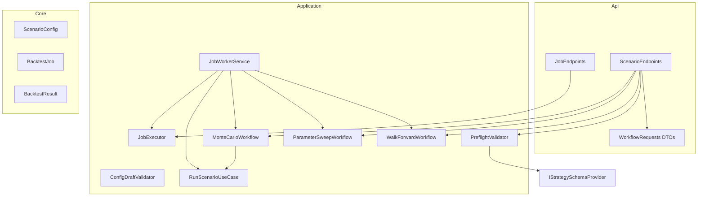
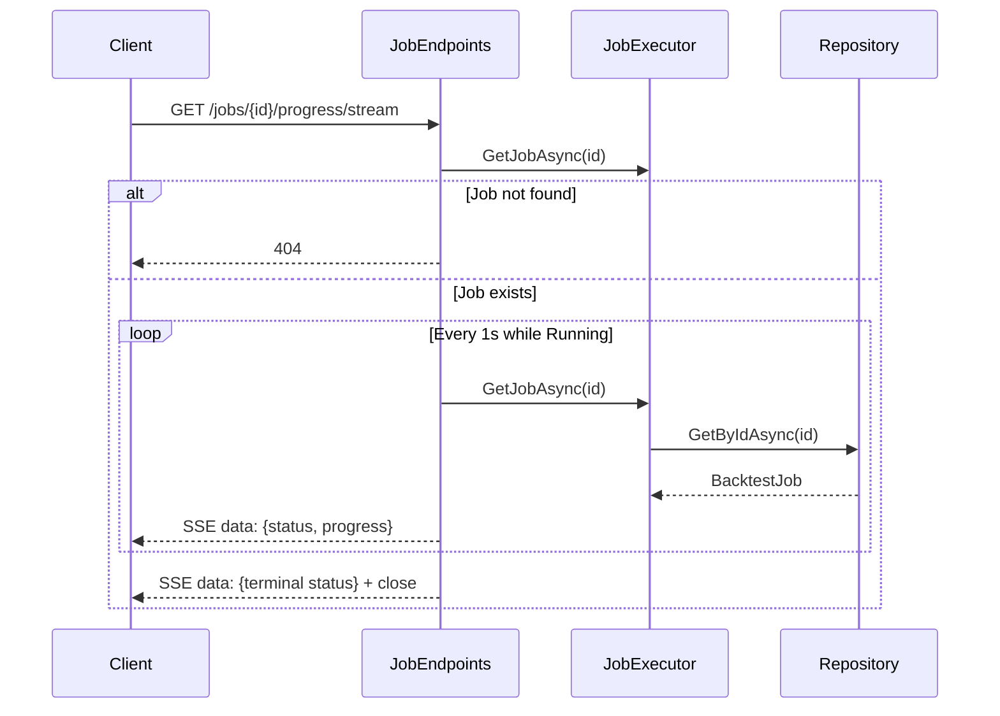

# Design Document — V5.1 Engine Fixes

## Overview

V5.1 addresses six confirmed issues in the V5.0 codebase. Each fix is scoped to a specific layer of the solution and maps directly to one requirement in `requirements.md`. The changes span the Api, Application, and Core projects; no Infrastructure changes are required.

| Issue | Layer(s) | Summary |
|-------|----------|---------|
| 1 — Workflow Options | Api, Application | Typed request wrappers pass caller-supplied options to workflows |
| 2 — Job Worker | Api, Application | `BackgroundService` polls and executes queued jobs |
| 3 — Draft Validation | Application | Static `ConfigDraftValidator` enforces step-completeness rules |
| 4 — Parameter Key Validation | Application | `PreflightValidator` checks keys against `IStrategySchemaProvider` |
| 5 — SSE Streaming | Api | `GET /jobs/{jobId}/progress/stream` pushes progress via SSE |
| 6 — Block Bootstrap | Application | `MonteCarloOptions.BlockSize` enables block resampling |

Dependency order: Issue 1 must land before Issues 2 and 6 (both consume the options wrappers). Issues 3, 4, and 5 are independent.

## Architecture

The existing layered architecture is preserved. All new types respect the dependency rule `Core ← Application ← Infrastructure ← {Cli, Api}`.



### SSE Streaming Flow



## Components and Interfaces

### Issue 1 — Typed Request Wrappers

**New file:** `src/TradingResearchEngine.Api/Dtos/WorkflowRequests.cs`

```csharp
namespace TradingResearchEngine.Api.Dtos;

/// <summary>Request wrapper for the parameter sweep endpoint.</summary>
public sealed record SweepRequest(ScenarioConfig Config, SweepOptions? Options = null);

/// <summary>Request wrapper for the Monte Carlo endpoint.</summary>
public sealed record MonteCarloRequest(ScenarioConfig Config, MonteCarloOptions? Options = null);

/// <summary>Request wrapper for the walk-forward endpoint.</summary>
public sealed record WalkForwardRequest(ScenarioConfig Config, WalkForwardOptions? Options = null);
```

**Modified file:** `src/TradingResearchEngine.Api/Endpoints/ScenarioEndpoints.cs`

Each workflow endpoint changes from binding a bare `ScenarioConfig` to binding the corresponding wrapper. The endpoint extracts `request.Config` for preflight validation and `request.Options ?? new XxxOptions()` for the workflow call. The `/scenarios/run` endpoint remains unchanged.

Backward compatibility: each endpoint also accepts a bare `ScenarioConfig` body. This is implemented via a two-pass deserialization approach in the endpoint body (~10 lines, no edge cases):

1. Read the request body into a `JsonElement` (single buffered read).
2. Check whether the root object contains a `"Config"` property.
3. If `"Config"` exists → deserialize as the typed wrapper (e.g. `MonteCarloRequest`).
4. If `"Config"` is absent → deserialize as a bare `ScenarioConfig`, wrap it into the request type with `Options = null`, and add an `X-Deprecation` response header.

```csharp
using var doc = await JsonDocument.ParseAsync(httpContext.Request.Body);
MonteCarloRequest request;
if (doc.RootElement.TryGetProperty("Config", out _))
{
    request = doc.RootElement.Deserialize<MonteCarloRequest>(jsonOptions)!;
}
else
{
    var config = doc.RootElement.Deserialize<ScenarioConfig>(jsonOptions)!;
    request = new MonteCarloRequest(config);
    httpContext.Response.Headers["X-Deprecation"] =
        "Bare ScenarioConfig body is deprecated. Wrap in { \"Config\": ... }.";
}
```

This avoids the complexity of a custom `JsonConverter` and keeps the branching logic explicit and local to each endpoint.

**Validation addition:** When `WalkForwardRequest.Options` is provided, the endpoint validates that `InSampleLength`, `OutOfSampleLength`, and `StepSize` are non-zero `TimeSpan` values before calling the workflow. Zero values return HTTP 400 with a structured error.

### Issue 2 — Background Job Worker

**Modified file:** `src/TradingResearchEngine.Application/Research/BacktestJob.cs`

Add `ScenarioConfig? Config` parameter to the record. Existing callers that don't supply it get `null` (backward compatible via default parameter).

```csharp
public sealed record BacktestJob(
    string JobId,
    JobType JobType,
    JobStatus Status,
    DateTimeOffset SubmittedAt,
    DateTimeOffset? StartedAt = null,
    DateTimeOffset? CompletedAt = null,
    ProgressSnapshot? Progress = null,
    string? ResultId = null,
    string? ErrorMessage = null,
    ReproducibilitySnapshot? ReproducibilitySnapshot = null,
    ScenarioConfig? Config = null) : IHasId
{
    public string Id => JobId;
}
```

**Modified file:** `src/TradingResearchEngine.Application/Research/JobExecutor.cs`

`SubmitAsync` gains a `ScenarioConfig config` parameter and persists it on the job record.

```csharp
public async Task<string> SubmitAsync(
    JobType jobType, ScenarioConfig config, CancellationToken ct = default)
```

**New file:** `src/TradingResearchEngine.Application/Research/JobWorkerService.cs`

```csharp
/// <summary>
/// Background service that polls for queued jobs and dispatches them
/// to the appropriate workflow or use case.
/// </summary>
public sealed class JobWorkerService : BackgroundService
{
    // Constructor-injected: IServiceScopeFactory, JobExecutor, ILogger<JobWorkerService>
    // Poll interval: configurable via IOptions<JobWorkerOptions>, default 2s

    protected override async Task ExecuteAsync(CancellationToken stoppingToken);
    private async Task ProcessJobAsync(BacktestJob job, CancellationToken stoppingToken);
    private async Task DispatchAsync(BacktestJob job, IServiceScope scope, CancellationToken ct);
}
```

Dispatch logic by `JobType`:
- `SingleRun` → `RunScenarioUseCase.RunAsync(job.Config)`
- `ParameterSweep` → `ParameterSweepWorkflow.RunAsync(job.Config, sweepOptions)`
- `MonteCarlo` → `MonteCarloWorkflow.RunAsync(job.Config, mcOptions)`
- `WalkForward` → `WalkForwardWorkflow.RunAsync(job.Config, wfOptions)`
- Unknown → `MarkFailedAsync(jobId, "Unsupported job type: {JobType}")`

The worker links the per-job `CancellationToken` from `JobExecutor.GetCancellationToken(jobId)` with the host `stoppingToken` via `CancellationTokenSource.CreateLinkedTokenSource`. On exception, the worker calls `MarkFailedAsync` with `ex.Message` (never `ex.StackTrace`).

**Modified file:** `src/TradingResearchEngine.Api/Endpoints/JobEndpoints.cs`

`SubmitJob` passes `request.Config!` to `executor.SubmitAsync`.

**Modified file:** `src/TradingResearchEngine.Api/Program.cs`

```csharp
builder.Services.AddHostedService<JobWorkerService>();
```

**New file:** `src/TradingResearchEngine.Application/Configuration/JobWorkerOptions.cs`

Placed in `Application/Configuration` alongside other option classes (`MonteCarloOptions`, `SweepOptions`, etc.):

```csharp
/// <summary>
/// Configuration for <see cref="JobWorkerService"/> polling and concurrency.
/// </summary>
public sealed class JobWorkerOptions
{
    /// <summary>Interval between queue polls. Default 2 seconds.</summary>
    public TimeSpan PollInterval { get; set; } = TimeSpan.FromSeconds(2);

    /// <summary>
    /// Maximum number of jobs processed concurrently by the worker.
    /// Default 1 prevents CPU saturation when multiple queued jobs exist
    /// simultaneously alongside sweep jobs with their own internal
    /// MaxDegreeOfParallelism.
    /// </summary>
    public int MaxConcurrentJobs { get; set; } = 1;
}
```

Bound via `IOptions<JobWorkerOptions>` in `Program.cs`:

```csharp
builder.Services.Configure<JobWorkerOptions>(
    builder.Configuration.GetSection("JobWorker"));
```

### Issue 3 — ConfigDraft Step Validation

**New file:** `src/TradingResearchEngine.Application/Strategy/ConfigDraftValidator.cs`

```csharp
/// <summary>
/// Validates that a <see cref="ConfigDraft"/> has all required fields
/// for its <see cref="ConfigDraft.CurrentStep"/>. Called server-side
/// before every draft persistence operation.
/// </summary>
public static class ConfigDraftValidator
{
    /// <summary>
    /// Returns an empty list when the draft is valid for its current step.
    /// Returns one error string per missing field otherwise.
    /// </summary>
    public static IReadOnlyList<string> ValidateStep(ConfigDraft draft);
}
```

Validation rules (cumulative — step N includes all rules from steps < N):
- Step ≥ 1: `StrategyName` must be non-null/non-whitespace.
- Step ≥ 2: `StrategyType` must be non-null/non-whitespace; `DataConfig` must be non-null.
- Step ≥ 3: `StrategyParameters` must be non-null and contain at least one entry.
- Step ≥ 4: `ExecutionConfig` must be non-null; `RiskConfig` must be non-null.
- Step = 5: All of the above (cumulative check).

The validator is a pure static function with no dependencies. It is called by whatever handler persists drafts (e.g. a `SaveDraftUseCase` or endpoint handler). If errors are returned, the handler returns HTTP 400 with the error list and does not persist.

### Issue 4 — Parameter Key Validation

**Modified file:** `src/TradingResearchEngine.Application/Engine/PreflightValidator.cs`

Add a new `ValidateUnknownKeys` method called from `Validate()`, positioned after `ValidateRequiredFields` and before `ValidateMissingParams`:

```csharp
private void ValidateUnknownKeys(ScenarioConfig config, List<PreflightFinding> findings)
{
    var strategyType = config.EffectiveStrategyConfig.StrategyType;
    if (string.IsNullOrWhiteSpace(strategyType)) return;

    IReadOnlyList<StrategyParameterSchema> schema;
    try { schema = _schemaProvider.GetSchema(strategyType); }
    catch { return; }

    var knownNames = new HashSet<string>(
        schema.Select(s => s.Name), StringComparer.OrdinalIgnoreCase);
    var parameters = config.EffectiveStrategyConfig.StrategyParameters;

    foreach (var key in parameters.Keys)
    {
        if (!knownNames.Contains(key))
        {
            findings.Add(new PreflightFinding(
                $"StrategyParameters.{key}",
                $"Unknown parameter '{key}'.",
                PreflightSeverity.Error,
                "UNKNOWN_PARAM"));
        }
    }
}
```

Key matching is case-insensitive (`StringComparer.OrdinalIgnoreCase`) to align with ASP.NET Core's default `System.Text.Json` deserialization behaviour.

The existing `ValidateMissingParams` method already handles missing required parameters. The severity is updated to distinguish two cases:

- Missing parameter that **has** a `DefaultValue` in the `StrategyParameterSchema` → emit `PreflightSeverity.Warning` (non-blocking). The engine will use the schema default, so this is informational. Satisfies Requirement 4.6.
- Missing parameter with **no** `DefaultValue` (truly required, no fallback) → emit `PreflightSeverity.Error` (blocking). The engine has no safe value to substitute.

```csharp
foreach (var schemaDef in schema.Where(s => s.IsRequired))
{
    if (!parameters.ContainsKey(schemaDef.Name))
    {
        var severity = schemaDef.DefaultValue is not null
            ? PreflightSeverity.Warning
            : PreflightSeverity.Error;

        findings.Add(new PreflightFinding(
            $"StrategyParameters.{schemaDef.Name}",
            $"Missing required parameter '{schemaDef.Name}'.",
            severity,
            "MISSING_PARAM"));
    }
}
```

This prevents over-softening validation for parameters that genuinely have no fallback value.

The existing `ValidateParamRanges` method already handles range validation.

### Issue 5 — SSE Progress Streaming

**Modified file:** `src/TradingResearchEngine.Api/Endpoints/JobEndpoints.cs`

New endpoint registration in `MapJobEndpoints`:

```csharp
app.MapGet("/jobs/{jobId}/progress/stream", StreamJobProgress)
    .WithName("StreamJobProgress").WithTags("Jobs")
    .Produces(StatusCodes.Status200OK, contentType: "text/event-stream")
    .Produces(StatusCodes.Status404NotFound);
```

Handler implementation:
1. Look up the job. Return 404 if not found.
2. Set response headers: `Content-Type: text/event-stream`, `Cache-Control: no-cache`, `Connection: keep-alive`.
3. Enter a loop that polls `JobExecutor.GetJobAsync` every 1 second.
4. Write `data: {json}\n\n` for each poll (SSE format).
5. On terminal status (`Completed`, `Failed`, `Cancelled`), write the final event and break.
6. On client disconnect (`CancellationToken` cancelled), exit the loop silently — no error logging.

**Cache-read-through guarantee:** `JobExecutor.GetJobAsync` ALWAYS reads through to `IRepository<BacktestJob>` (i.e. the persisted store) — it never returns job state from an in-memory cache. The `_active` dictionary on `JobExecutor` holds only `CancellationTokenSource` references for cancellation signalling, not job state. This ensures the SSE polling loop always sees the latest `ProgressSnapshot` and `Status` values written by `JobWorkerService` via the repository, even when the worker and the SSE endpoint run on different threads.

### Issue 6 — Block Bootstrap

**Modified file:** `src/TradingResearchEngine.Application/Configuration/OptionClasses.cs`

Add `BlockSize` property to `MonteCarloOptions`:

```csharp
/// <summary>
/// Block size for block bootstrap resampling. Default 1 = IID bootstrap.
/// Values > 1 sample contiguous blocks to preserve serial autocorrelation.
/// </summary>
public int BlockSize { get; set; } = 1;
```

**Modified file:** `src/TradingResearchEngine.Application/Research/MonteCarloWorkflow.cs`

In `RunSimulation`, replace the single-index sampling with block-aware logic:

```csharp
// Before the simulation loop:
int effectiveBlockSize = Math.Min(options.BlockSize, tradeCount);
if (effectiveBlockSize < options.BlockSize)
{
    // Emit warning: BlockSize clamped to tradeCount
}

// Inside the inner loop:
if (effectiveBlockSize <= 1)
{
    // Existing IID path: int idx = rng.Next(tradeCount);
}
else
{
    // Block bootstrap: pick a new block start every effectiveBlockSize trades
    if (i % effectiveBlockSize == 0)
        blockStart = rng.Next(tradeCount);
    int idx = (blockStart + (i % effectiveBlockSize)) % tradeCount;
    sampledReturn = returns[idx];
}
```

When `BlockSize = 1` and the same `Seed` is supplied, the RNG call sequence is identical to V5.0 (`rng.Next(tradeCount)` per trade), so output is bit-for-bit identical — preserving backward compatibility.

**Modified file:** `src/TradingResearchEngine.Application/Engine/PreflightValidator.cs`

Add `BlockSize < 1` validation in a new `ValidateMonteCarloOptions` method (called when the research workflow type is `MonteCarlo`):

```csharp
if (monteCarloOptions.BlockSize < 1)
    findings.Add(new PreflightFinding(
        "MonteCarloOptions.BlockSize",
        "BlockSize must be >= 1.",
        PreflightSeverity.Error,
        "RANGE_VIOLATION"));
```

## Data Models

### New Types

| Type | Project | Kind | Purpose |
|------|---------|------|---------|
| `SweepRequest` | Api/Dtos | `record` | Wraps `ScenarioConfig` + `SweepOptions?` |
| `MonteCarloRequest` | Api/Dtos | `record` | Wraps `ScenarioConfig` + `MonteCarloOptions?` |
| `WalkForwardRequest` | Api/Dtos | `record` | Wraps `ScenarioConfig` + `WalkForwardOptions?` |
| `ConfigDraftValidator` | Application/Strategy | `static class` | Pure validation logic for `ConfigDraft` |
| `JobWorkerService` | Application/Research | `class : BackgroundService` | Polls and dispatches queued jobs |
| `JobWorkerOptions` | Application/Configuration | `class` | Configurable poll interval and concurrency limit for the worker |

### Modified Types

| Type | Change |
|------|--------|
| `BacktestJob` | Add `ScenarioConfig? Config = null` parameter |
| `MonteCarloOptions` | Add `int BlockSize { get; set; } = 1` |
| `PreflightValidator` | Add `ValidateUnknownKeys` method; adjust `ValidateMissingParams` severity |
| `JobExecutor.SubmitAsync` | Accept `ScenarioConfig config` parameter |

### Serialization

All new types are records or simple classes with public properties — fully compatible with `System.Text.Json` default serialization. `BacktestJob.Config` is nullable and omitted from JSON when null (existing `JsonIgnoreCondition.WhenWritingNull` policy).


## Correctness Properties

*A property is a characteristic or behavior that should hold true across all valid executions of a system — essentially, a formal statement about what the system should do. Properties serve as the bridge between human-readable specifications and machine-verifiable correctness guarantees.*

### Property 1: Monte Carlo path count equals SimulationCount

*For any* valid `MonteCarloOptions` with `SimulationCount` in [1, 200] and any valid `BacktestResult` with at least one trade, the `MonteCarloResult.SampledPaths` collection SHALL contain exactly `SimulationCount` entries.

**Validates: Requirements 1.1**

### Property 2: ConfigDraft step validation produces correct errors for missing fields

*For any* `ConfigDraft` with `CurrentStep` in [2, 5] and any combination of null/missing required fields for that step, `ConfigDraftValidator.ValidateStep` SHALL return an error list containing exactly the expected error messages for each missing field, and no other step-related errors.

**Validates: Requirements 3.1, 3.2, 3.3, 3.4, 3.5, 3.8**

### Property 3: ConfigDraft with all required fields for its step produces no errors

*For any* `ConfigDraft` with `CurrentStep` in [1, 5] where all required fields for that step and all prior steps are populated with valid values, `ConfigDraftValidator.ValidateStep` SHALL return an empty error list.

**Validates: Requirements 3.6**

### Property 4: Unknown parameter keys produce UNKNOWN_PARAM errors (case-insensitive)

*For any* `ScenarioConfig` whose `StrategyParameters` dictionary contains a key that does not match any `StrategyParameterSchema.Name` case-insensitively, `PreflightValidator.Validate` SHALL emit a `PreflightFinding` with `Code = "UNKNOWN_PARAM"` and `Severity = Error` for that key. Conversely, for any key that matches a schema name under case-insensitive comparison, no `UNKNOWN_PARAM` finding SHALL be emitted.

**Validates: Requirements 4.1, 4.7**

### Property 5: Missing required parameters produce severity based on DefaultValue presence

*For any* `ScenarioConfig` where a required parameter (per `StrategyParameterSchema.IsRequired`) is absent from `StrategyParameters`:
- If the schema entry has a non-null `DefaultValue`, `PreflightValidator.Validate` SHALL emit a `PreflightFinding` with `Severity = Warning` (non-blocking).
- If the schema entry has a null `DefaultValue`, `PreflightValidator.Validate` SHALL emit a `PreflightFinding` with `Severity = Error` (blocking).

**Validates: Requirements 4.2, 4.6**

### Property 6: Out-of-range parameter values produce RANGE_VIOLATION errors

*For any* numeric parameter value in `ScenarioConfig.StrategyParameters` that falls below `StrategyParameterSchema.Min` or above `StrategyParameterSchema.Max`, `PreflightValidator.Validate` SHALL emit a `PreflightFinding` with `Code = "RANGE_VIOLATION"` and `Severity = Error`.

**Validates: Requirements 4.3**

### Property 7: Valid parameters produce no parameter-related error findings

*For any* `ScenarioConfig` whose `StrategyParameters` contains only keys present in the strategy schema (case-insensitive) with values within declared `Min`/`Max` ranges, `PreflightValidator.Validate` SHALL emit zero findings with codes `UNKNOWN_PARAM` or `RANGE_VIOLATION`.

**Validates: Requirements 4.4**

### Property 8: Block bootstrap produces contiguous blocks

*For any* return sequence of length ≥ 2 and any `BlockSize` in [2, sequence length], the Monte Carlo simulation SHALL sample returns in contiguous blocks of exactly `BlockSize` consecutive indices (wrapping circularly), with a new random block start chosen every `BlockSize` trades.

**Validates: Requirements 6.2**

### Property 9: BlockSize clamped when exceeding trade count

*For any* `MonteCarloOptions` with `BlockSize` greater than the number of trades in the source result, the effective block size used in simulation SHALL equal the trade count (clamped), and the simulation SHALL complete without error.

**Validates: Requirements 6.4**

### Property 10: Monte Carlo determinism with same seed and BlockSize

*For any* seed value, any `BlockSize` ≥ 1, and any valid `BacktestResult` with trades, running `MonteCarloWorkflow.RunSimulation` twice with identical inputs SHALL produce bit-for-bit identical `MonteCarloResult` values (same `P10EndEquity`, `P50EndEquity`, `P90EndEquity`, `RuinProbability`, and all path values).

**Validates: Requirements 6.7**

### Property 11: Config persisted on BacktestJob round-trip

*For any* valid `ScenarioConfig`, submitting it via `JobExecutor.SubmitAsync` and then retrieving the job via `GetJobAsync` SHALL return a `BacktestJob` whose `Config` property is equivalent to the original `ScenarioConfig`.

**Validates: Requirements 2.1**

### Property 12: Failed job ErrorMessage contains no stack traces

*For any* exception thrown during job execution, the `ErrorMessage` persisted on the failed `BacktestJob` SHALL NOT contain stack trace patterns (lines matching `"   at "` or file path patterns like `".cs:line"`).

**Validates: Requirements 2.4**

### Property 13: Unknown JobType produces formatted error message

*For any* `JobType` value not in the set {`SingleRun`, `ParameterSweep`, `MonteCarlo`, `WalkForward`}, the `JobWorkerService` SHALL transition the job to `Failed` with `ErrorMessage` exactly equal to `$"Unsupported job type: {jobType}"`.

**Validates: Requirements 2.8**

## Error Handling

### API Layer

| Scenario | HTTP Status | Response Shape |
|----------|-------------|----------------|
| Invalid `WalkForwardOptions` (zero TimeSpan) | 400 | `{ "errors": [{ "field": "Options.InSampleLength", "message": "..." }] }` |
| Unknown parameter key in `StrategyParameters` | 400 | `{ "errors": [{ "field": "StrategyParameters.xxx", "message": "Unknown parameter 'xxx'.", "code": "UNKNOWN_PARAM" }] }` |
| Out-of-range parameter value | 400 | `{ "errors": [{ "field": "StrategyParameters.xxx", "message": "...", "code": "RANGE_VIOLATION" }] }` |
| `BlockSize < 1` | 400 | `{ "errors": [{ "field": "MonteCarloOptions.BlockSize", "message": "BlockSize must be >= 1.", "code": "RANGE_VIOLATION" }] }` |
| Invalid `ConfigDraft` step fields | 400 | `{ "errors": ["Step 2 requires StrategyType to be set.", ...] }` |
| SSE stream for non-existent job | 404 | Standard 404 |
| Job workflow exception | Job `Failed` | `ErrorMessage` = `ex.Message` (no stack trace) |
| Unrecognised `JobType` | Job `Failed` | `ErrorMessage` = `"Unsupported job type: {JobType}"` |
| Unhandled exception | 500 | `{ "correlationId": "...", "message": "An unexpected error occurred." }` |

### Application Layer

- `JobWorkerService` catches all exceptions from workflow dispatch. It calls `JobExecutor.MarkFailedAsync(jobId, ex.Message)`. Stack traces are never persisted on the job record.
- `ConfigDraftValidator.ValidateStep` is a pure function that returns errors — it never throws.
- `PreflightValidator.Validate` catches `StrategyNotFoundException` from `IStrategySchemaProvider.GetSchema` and skips schema validation (the missing strategy is already caught by `ValidateRequiredFields`).

### SSE Stream

- Client disconnect (`OperationCanceledException` from `CancellationToken`) is caught silently — no error log entry.
- If the job disappears mid-stream (deleted from repository), the stream closes cleanly.

## Testing Strategy

### Property-Based Tests (FsCheck.Xunit)

All property tests live in `src/TradingResearchEngine.UnitTests/`. Each test class follows the naming convention `<Subject>Properties`. Each test is tagged with:

```csharp
// Feature: v51-engine-fixes, Property N: <description>
[Property(MaxTest = 100)]
```

| Property | Test Class | Dependencies |
|----------|-----------|--------------|
| P1: MC path count | `MonteCarloWorkflowProperties` | `MonteCarloWorkflow` (direct), mock `RunScenarioUseCase` |
| P2: Draft step validation errors | `ConfigDraftValidatorProperties` | `ConfigDraftValidator` (static, no mocks) |
| P3: Draft valid step no errors | `ConfigDraftValidatorProperties` | `ConfigDraftValidator` (static, no mocks) |
| P4: Unknown keys + case-insensitive | `PreflightValidatorProperties` | `PreflightValidator`, mock `IStrategySchemaProvider` |
| P5: Missing required → Warning or Error by DefaultValue | `PreflightValidatorProperties` | `PreflightValidator`, mock `IStrategySchemaProvider` |
| P6: Out-of-range → Error | `PreflightValidatorProperties` | `PreflightValidator`, mock `IStrategySchemaProvider` |
| P7: Valid params → no errors | `PreflightValidatorProperties` | `PreflightValidator`, mock `IStrategySchemaProvider` |
| P8: Block contiguity | `MonteCarloWorkflowProperties` | `MonteCarloWorkflow.RunSimulation` (internal, via InternalsVisibleTo or public overload) |
| P9: BlockSize clamping | `MonteCarloWorkflowProperties` | `MonteCarloWorkflow.RunSimulation` |
| P10: MC determinism | `MonteCarloWorkflowProperties` | `MonteCarloWorkflow.RunSimulation` |
| P11: Config round-trip on job | `JobExecutorProperties` | `JobExecutor`, in-memory `IRepository<BacktestJob>` |
| P12: No stack traces in error | `JobWorkerServiceProperties` | `JobWorkerService`, mock workflows |
| P13: Unknown JobType message | `JobWorkerServiceProperties` | `JobWorkerService`, mock workflows |

### Unit Tests (xUnit)

Example-based and edge-case tests complement the property tests:

| Test | Validates |
|------|-----------|
| MC defaults applied when Options is null | Req 1.2 |
| WalkForward zero TimeSpan returns 400 | Req 1.4 |
| `/scenarios/run` unchanged | Req 1.6 |
| Bare ScenarioConfig → X-Deprecation header | Req 1.8 |
| Orphaned job recovery | Req 2.6 |
| BlockSize default is 1 | Req 6.1 |
| BlockSize=1 + seed regression test | Req 6.5 |
| SSE 404 for non-existent job | Req 5.5 |
| SSE headers (Content-Type, Cache-Control, Connection) | Req 5.1, 5.6 |

### Integration Tests

| Test | Validates |
|------|-----------|
| Full job lifecycle (Queued → Running → Completed) | Req 2.2, 2.3 |
| Job cancellation flow | Req 2.5 |
| SSE stream emits events during running job | Req 5.2, 5.3 |
| SSE client disconnect handled gracefully | Req 5.4 |
| OpenAPI spec contains wrapper schemas | Req 1.7 |

### Regression Tests

- `MonteCarloBlockSize1Regression`: Run with `BlockSize=1`, `Seed=42`, a known trade sequence, and verify output matches a captured V5.0 baseline. This ensures the block bootstrap code path does not alter IID behavior. (Req 6.5)

### Test Boundaries

- UnitTests reference Core and Application only (per workspace rules).
- All external dependencies (repositories, schema providers) are replaced with in-memory fakes or Moq mocks.
- Integration tests use `WebApplicationFactory` for API endpoint tests.

**WebApplicationFactory isolation:** Integration tests MUST remove `JobWorkerService` from the hosted services in the factory override to prevent the background worker from polling and dispatching jobs during test execution. This avoids race conditions and flaky tests under parallel execution.

```csharp
builder.ConfigureServices(services =>
{
    // Remove the background job worker so tests control dispatch manually
    services.RemoveAll<IHostedService>();
    // — or, to be surgical and preserve other hosted services:
    // var descriptor = services.SingleOrDefault(
    //     d => d.ImplementationType == typeof(JobWorkerService));
    // if (descriptor is not null) services.Remove(descriptor);
});
```

Tests that need to exercise the job lifecycle should trigger dispatch manually (e.g. by calling `JobWorkerService.ProcessJobAsync` directly or by invoking the workflow use case in-process).
