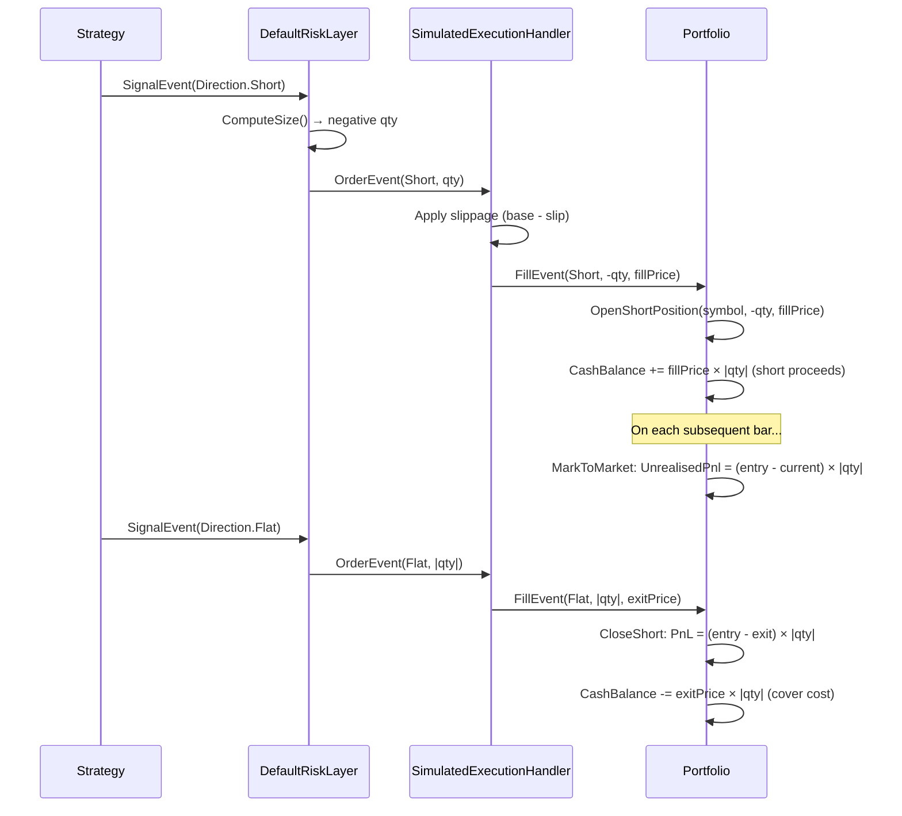
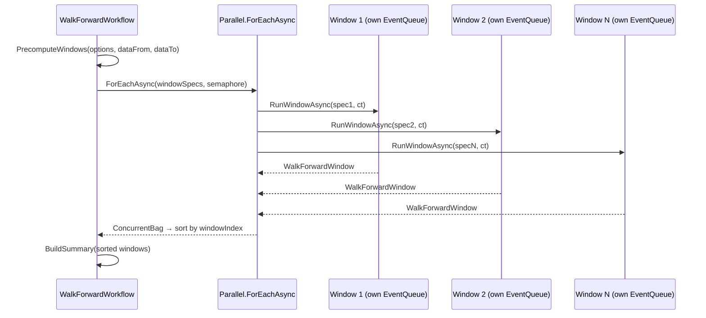
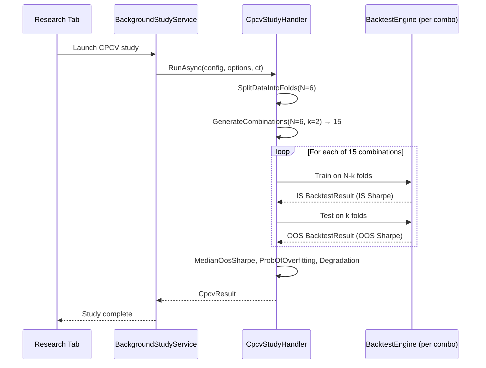

# Design Document: V6 Engine Upgrades

## Overview

V6 is the fourth major evolution of TradingResearchEngine, delivering four sequential tracks: (1) full long/short execution replacing the V5 `LongOnlyGuard`, (2) SQLite index persistence and parallel research workflow execution, (3) Plotly.Blazor interactive charting across strategy detail and research result pages, and (4) quant depth improvements including CPCV implementation, prop-firm evaluation wiring, and timeframe-aware recommendations.

The design preserves the existing `Core ← Application ← Infrastructure ← { Cli, Api, Web }` dependency rule. All new domain types are immutable records. `EventQueue` and `Portfolio` remain non-thread-safe — each parallel backtest run creates its own instances. SQLite is additive over JSON files (index-only, not a replacement). New NuGet packages: `Microsoft.Data.Sqlite` (Infrastructure), `Plotly.Blazor` (Web).

## Architecture

```mermaid
graph TD
    subgraph Core
        Portfolio[Portfolio<br/>+ ShortPositions]
        BPY[BarsPerYearDefaults]
        Direction[Direction enum<br/>Long / Short / Flat]
        IRepo[IRepository&lt;T&gt;]
    end

    subgraph Application
        SEH[SimulatedExecutionHandler<br/>long + short fills]
        DRL[DefaultRiskLayer<br/>signed quantity support]
        Strategies[4 Bidirectional Strategies]
        PFV[PreflightValidator<br/>+ BARSYEAR_MISMATCH]
        WFW[WalkForwardWorkflow<br/>Parallel.ForEachAsync]
        PSW[ParameterSweepWorkflow<br/>Parallel.ForEachAsync]
        CPCV[CpcvStudyHandler<br/>C&#40;N,k&#41; combinations]
        RCS[ResearchChecklistService<br/>9 items]
        IPFER[IPropFirmEvaluationRepository]
        IBTR[IBacktestResultRepository]
        IPFL[IPropFirmPackLoader]
    end

    subgraph Infrastructure
        SqlIdx[SqliteIndexRepository&lt;T&gt;<br/>index.db]
        JsonRepo[JsonFileRepository&lt;T&gt;<br/>primary store]
        JPFER[JsonPropFirmEvaluationRepository]
        JPFL[JsonPropFirmPackLoader]
        DukCache[DukascopyDataProvider<br/>+ aggregated cache]
    end

    subgraph Web
        ECC[EquityCurveChart]
        MRH[MonthlyReturnsHeatmap]
        TPH[TradePnlHistogram]
        HPH[HoldingPeriodHistogram]
        MCFC[MonteCarloFanChart]
        WFCC[WalkForwardCompositeChart]
        PSHM[ParameterSweepHeatmap]
        TSV[TimelineSplitVisualizer<br/>+ bar density]
    end

    Core --> Application
    Application --> Infrastructure
    Infrastructure --> Web
    SqlIdx --> JsonRepo
    SqlIdx -.->|index queries| IRepo

```



## Sequence Diagrams

### Track 1: Short Sell Execution Flow



### Track 2: Parallel Walk-Forward Execution



### Track 4: CPCV Study Flow



## Components and Interfaces

### Track 1 Components

#### Portfolio (Core — modified)

**Purpose**: Tracks open long and short positions, cash balance, and equity curve.

```csharp
/// <summary>
/// Tracks open positions, cash balance, and equity curve by consuming FillEvent instances.
/// V6: Adds ShortPositions dictionary for short position tracking with correct mark-to-market.
/// </summary>
public sealed class Portfolio
{
    // Existing long positions
    private readonly Dictionary<string, PositionState> _positions;
    // V6: Short positions tracked separately
    private readonly Dictionary<string, ShortPositionState> _shortPositions;

    /// <summary>Open short positions keyed by symbol.</summary>
    public IReadOnlyDictionary<string, Position> ShortPositions { get; }

    /// <summary>Count of all open positions (long + short).</summary>
    public int OpenPositionCount => _positions.Count(p => p.Value.Quantity > 0m)
                                  + _shortPositions.Count(p => p.Value.Quantity > 0m);

    /// <summary>
    /// Returns exposure by symbol summing both long and short (absolute values).
    /// </summary>
    public Dictionary<string, decimal> GetExposureBySymbol();

    /// <summary>V6: Updates portfolio from a fill, handling Long, Short, and Flat directions.</summary>
    public void Update(FillEvent fill);

    /// <summary>V6: Mark-to-market updates both long and short unrealised PnL.</summary>
    public void MarkToMarket(string symbol, decimal price, DateTimeOffset timestamp);
}
```

**Responsibilities**:
- Track long positions (existing) and short positions (new `_shortPositions` dictionary)
- Compute `TotalEquity = CashBalance + Σ(longUnrealisedPnl) + Σ(shortUnrealisedPnl)`
- Short unrealised PnL: `(EntryPrice - CurrentPrice) × |Quantity|`
- `GetExposureBySymbol()` sums absolute values of both long and short exposure
- `OpenPositionCount` counts both long and short open positions

#### SimulatedExecutionHandler (Application — modified)

**Purpose**: Simulates order execution for both long and short directions.

```csharp
public sealed class SimulatedExecutionHandler : IExecutionHandler
{
    /// <summary>
    /// V6: Executes orders for Long, Short, and Flat directions.
    /// LongOnlyGuard.EnsureLongOnly call removed.
    /// Short fills: base price - slippage (favorable to seller).
    /// </summary>
    public ExecutionResult Execute(OrderEvent order, MarketDataEvent currentBar);
}
```

**Preconditions:**
- `order` is non-null with valid symbol and positive quantity
- `currentBar` is a `BarEvent` or `TickEvent`

**Postconditions:**
- For `Direction.Short`: `fillPrice = basePrice - slippageAmount`
- For `Direction.Long`: `fillPrice = basePrice + slippageAmount`
- Returns `ExecutionResult` with `ExecutionOutcome.Filled`
- No `LongOnlyGuard.EnsureLongOnly` call in any code path

#### BarsPerYearDefaults (Core — new)

```csharp
/// <summary>
/// Canonical intraday bar-count constants for Forex (24h × 252 trading days).
/// Used by PreflightValidator and Step2DataExecutionWindow for auto-population.
/// </summary>
public static class BarsPerYearDefaults
{
    public const int M1  = 362880;  // 252 × 1440
    public const int M5  = 72576;   // 252 × 288
    public const int M15 = 24192;   // 252 × 96
    public const int M30 = 12096;   // 252 × 48
    public const int H1  = 6048;    // 252 × 24
    public const int H2  = 3024;    // 252 × 12
    public const int H4  = 1512;    // 252 × 6
    public const int D1  = 252;     // 252 × 1

    /// <summary>Returns the BarsPerYear for a given timeframe string, or null if unknown.</summary>
    public static int? ForTimeframe(string timeframe);

    /// <summary>
    /// Converts a bar count to a human-readable duration string.
    /// E.g. 500 bars at M15 → "~52 trading days of 15-minute data required"
    /// </summary>
    public static string BarsToHumanDuration(int bars, string timeframe);
}
```

### Track 2 Components

#### IBacktestResultRepository (Application — new)

```csharp
/// <summary>
/// Extended persistence interface for backtest results with indexed queries.
/// </summary>
public interface IBacktestResultRepository : IRepository<BacktestResult>
{
    /// <summary>Lists results for a specific strategy version via SQLite index.</summary>
    Task<IReadOnlyList<BacktestResult>> ListByVersionAsync(
        string versionId, CancellationToken ct = default);

    /// <summary>Lists results for a specific strategy via SQLite index.</summary>
    Task<IReadOnlyList<BacktestResult>> ListByStrategyAsync(
        string strategyId, CancellationToken ct = default);
}
```

#### SqliteIndexRepository&lt;T&gt; (Infrastructure — new)

```csharp
/// <summary>
/// Index-only SQLite layer over existing JSON files.
/// Primary store remains JSON; SQLite provides O(log n) lookups.
/// </summary>
public sealed class SqliteIndexRepository<T> : IBacktestResultRepository
    where T : IHasId
{
    /// <summary>On startup, scans JSON directory and builds/rebuilds SQLite index.</summary>
    public Task InitializeAsync(CancellationToken ct = default);

    /// <summary>Reads JSON file directly via index path (O(1)).</summary>
    public Task<T?> GetByIdAsync(string id, CancellationToken ct = default);

    /// <summary>Writes JSON then upserts index row.</summary>
    public Task SaveAsync(T entity, CancellationToken ct = default);

    /// <summary>Removes JSON file and index row.</summary>
    public Task DeleteAsync(string id, CancellationToken ct = default);
}
```

#### IPropFirmPackLoader (Application — new)

```csharp
/// <summary>
/// Loads prop firm rule packs from persistent storage.
/// Replaces inline LoadBuiltInPacks() calls.
/// </summary>
public interface IPropFirmPackLoader
{
    Task<IReadOnlyList<PropFirmRulePack>> LoadAllPacksAsync(CancellationToken ct = default);
    Task<PropFirmRulePack?> LoadPackAsync(string firmId, CancellationToken ct = default);
}
```

#### IPropFirmEvaluationRepository (Application — new)

```csharp
/// <summary>
/// Persistence for prop firm evaluation records.
/// Wires checklist item 8 in ResearchChecklistService.
/// </summary>
public interface IPropFirmEvaluationRepository
{
    Task<bool> HasCompletedEvaluationAsync(
        string strategyVersionId, CancellationToken ct = default);
    Task SaveEvaluationAsync(
        string strategyVersionId, PropFirmEvaluationRecord record,
        CancellationToken ct = default);
}
```

### Track 3 Components

#### Chart Components (Web — new)

All chart components use `Plotly.Blazor` and are `@rendermode InteractiveServer`.

| Component | Parameters | Purpose |
|---|---|---|
| `EquityCurveChart` | `IReadOnlyList<EquityCurvePoint> Curve`, `string Title`, `bool ShowDrawdown` | Equity line + drawdown overlay |
| `MonthlyReturnsHeatmap` | `IReadOnlyList<EquityCurvePoint> Curve` | Calendar grid of monthly return % |
| `TradePnlHistogram` | `IReadOnlyList<ClosedTrade> Trades` | 20-bin PnL distribution |
| `HoldingPeriodHistogram` | `IReadOnlyList<ClosedTrade> Trades` | Duration-in-bars distribution |
| `MonteCarloFanChart` | `IReadOnlyList<MonteCarloPercentileBand> Bands`, `decimal StartEquity` | P10/P50/P90 fan |
| `WalkForwardCompositeChart` | `WalkForwardSummary Summary` | Stitched OOS curve + window shading |
| `ParameterSweepHeatmap` | `SweepResult`, `string XParam`, `string YParam`, `string MetricName` | 2D parameter heatmap |

### Track 4 Components

#### CpcvStudyHandler (Application — implemented)

```csharp
/// <summary>
/// Combinatorial Purged Cross-Validation (De Prado, 2018).
/// Generates C(N,k) train/test combinations and computes overfitting probability.
/// </summary>
public sealed class CpcvStudyHandler : IResearchWorkflow<CpcvOptions, CpcvResult>
{
    public Task<CpcvResult> RunAsync(
        ScenarioConfig config, CpcvOptions options, CancellationToken ct = default);
}
```

## Data Models

### New Domain Records (Core)

```csharp
/// <summary>V6: BarsPerYear defaults — see BarsPerYearDefaults static class above.</summary>

/// <summary>V6: Execution config extended with AllowReversals flag.</summary>
public sealed record ExecutionConfig(
    // ... existing fields ...
    /// <summary>V6: When true, a Short signal while Long (or vice versa) closes then opens. Default false.</summary>
    bool AllowReversals = false);
```

### New Domain Records (Application)

```csharp
/// <summary>CPCV configuration options.</summary>
public sealed record CpcvOptions(
    int NumPaths = 6,
    int TestFolds = 2,
    int? Seed = null);

/// <summary>CPCV study result.</summary>
public sealed record CpcvResult(
    decimal MedianOosSharpe,
    decimal ProbabilityOfOverfitting,
    decimal PerformanceDegradation,
    IReadOnlyList<decimal> OosSharpeDistribution,
    int TotalCombinations,
    IReadOnlyList<decimal> IsSharpeDistribution);

/// <summary>Prop firm evaluation persistence record.</summary>
public sealed record PropFirmEvaluationRecord(
    string EvaluationId,
    string StrategyVersionId,
    string FirmName,
    string PhaseName,
    bool Passed,
    DateTimeOffset EvaluatedAt) : IHasId
{
    public string Id => EvaluationId;
}

/// <summary>V6: StrategyIdentity extended with RetirementNote.</summary>
public sealed record StrategyIdentity(
    string StrategyId,
    string StrategyName,
    string StrategyType,
    DateTimeOffset CreatedAt,
    string? Description = null,
    DevelopmentStage Stage = DevelopmentStage.Exploring,
    string? Hypothesis = null,
    /// <summary>V6: Optional note explaining why the strategy was retired.</summary>
    string? RetirementNote = null) : IHasId
{
    public string Id => StrategyId;
}
```

**Validation Rules**:
- `CpcvOptions.NumPaths` ≥ 3, `TestFolds` ≥ 1, `TestFolds < NumPaths`
- `PropFirmEvaluationRecord` requires non-empty `StrategyVersionId` and `FirmName`
- `RetirementNote` is only meaningful when `Stage == DevelopmentStage.Retired`

### SQLite Index Schema

```sql
CREATE TABLE IF NOT EXISTS BacktestResultIndex (
    Id TEXT PRIMARY KEY,
    StrategyVersionId TEXT NOT NULL,
    RunDate TEXT,
    Status TEXT,
    FilePath TEXT NOT NULL
);
CREATE INDEX IF NOT EXISTS idx_br_version ON BacktestResultIndex(StrategyVersionId);
CREATE INDEX IF NOT EXISTS idx_br_date ON BacktestResultIndex(RunDate);

CREATE TABLE IF NOT EXISTS StudyIndex (
    Id TEXT PRIMARY KEY,
    StrategyVersionId TEXT NOT NULL,
    StudyType TEXT,
    CompletedAt TEXT,
    FilePath TEXT NOT NULL
);
CREATE INDEX IF NOT EXISTS idx_study_version ON StudyIndex(StrategyVersionId);
```


## Key Functions with Formal Specifications

### Function: Portfolio.Update(FillEvent fill) — V6 Short Support

```csharp
public void Update(FillEvent fill)
```

**Preconditions:**
- `fill` is non-null with valid `Symbol`, positive `Quantity`, positive `FillPrice`
- `fill.Direction` ∈ { `Long`, `Short`, `Flat` }

**Postconditions:**
- `Direction.Long`: `CashBalance` decreases by `fillPrice × qty + commission`; long position opened/added
- `Direction.Short`: `CashBalance` increases by `fillPrice × qty - commission` (short proceeds); short position opened in `_shortPositions`
- `Direction.Flat` with open long: long closed, `CashBalance` increases by `fillPrice × qty - commission`, `ClosedTrade` recorded with `Direction.Long`
- `Direction.Flat` with open short: short closed, `CashBalance` decreases by `fillPrice × qty + commission` (cover cost), `ClosedTrade` recorded with `Direction.Short`, `PnL = (entryPrice - exitPrice) × qty`
- `Direction.Flat` with no position: no cash change, orphan fill logged
- `TotalEquity` recalculated after every update
- Equity curve point appended

**Loop Invariants:** N/A (no loops)

### Function: SimulatedExecutionHandler.Execute(OrderEvent, MarketDataEvent) — V6

```csharp
public ExecutionResult Execute(OrderEvent order, MarketDataEvent currentBar)
```

**Preconditions:**
- `order.Direction` ∈ { `Long`, `Short`, `Flat` }
- `order.Quantity > 0`
- `currentBar` is `BarEvent` or `TickEvent`

**Postconditions:**
- No `LongOnlyGuard.EnsureLongOnly` call
- `Direction.Long`: `fillPrice = basePrice + slippageAmount`
- `Direction.Short`: `fillPrice = basePrice - slippageAmount`
- `Direction.Flat`: `fillPrice = basePrice - slippageAmount` (closing, favorable to closer)
- For tick data: Short fills at Bid, Long fills at Ask, Flat fills at Bid
- Returns `ExecutionResult(Filled, fillEvent)`

### Function: DefaultRiskLayer.ConvertSignal — V6 Short Support

```csharp
public OrderEvent? ConvertSignal(SignalEvent signal, PortfolioSnapshot snapshot)
```

**Preconditions:**
- `signal.Direction` ∈ { `Long`, `Short`, `Flat` }

**Postconditions:**
- `Direction.Short`: sizing policy returns quantity, order created with `Direction.Short`
- `Direction.Flat` with open short: creates close order with short position's quantity
- `Direction.Flat` with open long: creates close order with long position's quantity (existing)
- Exposure checks use `Math.Abs(quantity)` for both long and short
- No `LongOnlyGuard.EnsureLongOnly` call

### Function: IPositionSizingPolicy.ComputeSize — V6 Signed Quantity

```csharp
decimal ComputeSize(SignalEvent signal, PortfolioSnapshot snapshot, MarketDataEvent market)
```

**Preconditions:**
- `signal.Direction` ∈ { `Long`, `Short` } (Flat signals don't reach sizing)

**Postconditions:**
- `Direction.Long`: returns positive quantity
- `Direction.Short`: returns positive quantity (sign applied by caller in DefaultRiskLayer)
- Returns 0 to skip the trade

### Function: CpcvStudyHandler.RunAsync

```csharp
public Task<CpcvResult> RunAsync(
    ScenarioConfig config, CpcvOptions options, CancellationToken ct = default)
```

**Preconditions:**
- `options.NumPaths` ≥ 3
- `options.TestFolds` ≥ 1 and `< options.NumPaths`
- Data range in `config` is sufficient for `NumPaths` folds
- `options.Seed` provides deterministic output when set

**Postconditions:**
- `TotalCombinations == C(NumPaths, TestFolds)`
- `OosSharpeDistribution.Count == TotalCombinations`
- `IsSharpeDistribution.Count == TotalCombinations`
- `ProbabilityOfOverfitting` ∈ [0, 1] = fraction of combinations where that combination's OOS Sharpe < that same combination's IS Sharpe
- `PerformanceDegradation` = 1 - (MedianOosSharpe / MedianIsSharpe)
- Same seed + same inputs → identical result

### Function: WalkForwardWorkflow.RunAsync — V6 Parallel

```csharp
public async Task<WalkForwardResult> RunAsync(
    ScenarioConfig baseConfig, WalkForwardOptions options, CancellationToken ct = default)
```

**Preconditions:**
- `options.StepSize > TimeSpan.Zero`
- Data range ≥ `InSampleLength + OutOfSampleLength`

**Postconditions:**
- All windows executed via `Parallel.ForEachAsync` with `SemaphoreSlim(ProcessorCount - 1)`
- Each window has its own `EventQueue` instance (no shared mutable state)
- Results sorted by `windowIndex` after parallel collection
- `CancellationToken` propagated to every parallel unit
- Same seed + config → identical results as sequential execution
- Window count formula unchanged (Property 7 still holds)

## Algorithmic Pseudocode

### Portfolio.Update — Short Position Handling

```csharp
// V6 Portfolio.Update algorithm
ALGORITHM UpdatePortfolio(fill)
INPUT: fill of type FillEvent
OUTPUT: Updated portfolio state (cash, positions, equity curve)

BEGIN
    // No LongOnlyGuard — all directions handled
    SWITCH fill.Direction
        CASE Direction.Long:
            cost ← fill.FillPrice × fill.Quantity + fill.Commission
            newCash ← CashBalance - cost
            IF newCash < 0 THEN
                LOG MarginBreachWarning
                newCash ← 0
            END IF
            CashBalance ← newCash
            AddOrUpdateLongPosition(fill)

        CASE Direction.Short:
            // Short sale proceeds: receive cash for selling borrowed shares
            proceeds ← fill.FillPrice × fill.Quantity - fill.Commission
            CashBalance ← CashBalance + proceeds
            OpenShortPosition(fill)

        CASE Direction.Flat:
            IF HasLongPosition(fill.Symbol) THEN
                proceeds ← fill.FillPrice × fill.Quantity - fill.Commission
                CashBalance ← CashBalance + proceeds
                CloseLongPosition(fill)
            ELSE IF HasShortPosition(fill.Symbol) THEN
                // Cover cost: pay to buy back borrowed shares
                cost ← fill.FillPrice × fill.Quantity + fill.Commission
                CashBalance ← CashBalance - cost
                CloseShortPosition(fill)
                // PnL = (EntryPrice - ExitPrice) × Quantity
            ELSE
                LOG OrphanFlatFill
            END IF
    END SWITCH

    MarkToMarketFromFill(fill)
    RecalculateTotalEquity()
    AppendEquityCurvePoint(fill.Timestamp)
END
```

### CPCV Combinatorial Algorithm

```csharp
ALGORITHM RunCpcv(config, options)
INPUT: config of type ScenarioConfig, options of type CpcvOptions
OUTPUT: result of type CpcvResult

BEGIN
    N ← options.NumPaths       // default 6
    k ← options.TestFolds      // default 2
    rng ← new Random(options.Seed ?? Environment.TickCount)

    // Step 1: Split data into N equal-length folds
    dataRange ← ResolveDataRange(config)
    foldLength ← dataRange.Duration / N
    folds ← []
    FOR i ← 0 TO N-1 DO
        folds.Add(DateRange(dataRange.Start + i × foldLength,
                            dataRange.Start + (i+1) × foldLength))
    END FOR

    // Step 2: Generate all C(N, k) combinations
    combinations ← GenerateCombinations(N, k)
    ASSERT combinations.Count == Factorial(N) / (Factorial(k) × Factorial(N-k))

    // Step 3: Run each combination (per-combination IS Sharpe — De Prado 2018)
    oosDistribution ← []
    isDistribution ← []
    overfitCount ← 0
    FOR EACH combo IN combinations DO
        ct.ThrowIfCancellationRequested()

        testFoldIndices ← combo
        trainFoldIndices ← {0..N-1} \ testFoldIndices

        // Train: run engine on concatenated train folds → this combination's IS Sharpe
        trainConfig ← BuildConfigForFolds(config, folds, trainFoldIndices)
        trainResult ← RunEngine(trainConfig, ct)
        comboIsSharpe ← trainResult.SharpeRatio ?? 0

        // Test: run engine on concatenated test folds → this combination's OOS Sharpe
        testConfig ← BuildConfigForFolds(config, folds, testFoldIndices)
        testResult ← RunEngine(testConfig, ct)
        comboOosSharpe ← testResult.SharpeRatio ?? 0

        oosDistribution.Add(comboOosSharpe)
        isDistribution.Add(comboIsSharpe)

        // Per-combination comparison: OOS vs that same combination's IS
        IF comboOosSharpe < comboIsSharpe THEN
            overfitCount ← overfitCount + 1
        END IF
    END FOR

    // Step 4: Compute summary statistics
    medianOos ← Median(oosDistribution)
    medianIs ← Median(isDistribution)
    probOverfit ← overfitCount / combinations.Count
    degradation ← 1 - (medianOos / medianIs)  // guard div-by-zero

    RETURN CpcvResult(medianOos, probOverfit, degradation,
                      oosDistribution, combinations.Count,
                      isDistribution)
END
```

### Parallel Walk-Forward Window Execution

```csharp
ALGORITHM ParallelWalkForward(baseConfig, options)
INPUT: baseConfig, options of type WalkForwardOptions
OUTPUT: WalkForwardResult

BEGIN
    // Step 1: Pre-compute all window date ranges (pure, no I/O)
    windowSpecs ← PrecomputeWindows(options, dataFrom, dataTo)

    // Step 2: Execute in parallel with bounded concurrency
    maxConcurrency ← Max(1, Environment.ProcessorCount - 1)
    semaphore ← new SemaphoreSlim(maxConcurrency)
    results ← new ConcurrentBag<WalkForwardWindow>()

    PARALLEL FOR EACH spec IN windowSpecs WITH ct DO
        AWAIT semaphore.WaitAsync(ct)
        TRY
            // Each window creates its own EventQueue — no shared state
            window ← AWAIT RunWindowAsync(spec, ct)
            IF window IS NOT NULL THEN
                results.Add(window)
            END IF
        FINALLY
            semaphore.Release()
        END TRY
    END PARALLEL

    // Step 3: Sort by window index and build summary
    sorted ← results.OrderBy(w => w.WindowIndex).ToList()
    RETURN new WalkForwardResult(sorted, ComputeMeanEfficiency(sorted))
END
```

### BarsToHumanDuration Helper

```csharp
ALGORITHM BarsToHumanDuration(bars, timeframe)
INPUT: bars (int), timeframe (string, e.g. "M15", "H1", "D1")
OUTPUT: human-readable duration string

BEGIN
    barsPerYear ← BarsPerYearDefaults.ForTimeframe(timeframe)
    IF barsPerYear IS NULL THEN
        RETURN $"{bars} bars"
    END IF

    barsPerDay ← barsPerYear / 252
    tradingDays ← CEILING(bars / barsPerDay)

    timeframeLabel ← SWITCH timeframe
        "M1" → "1-minute", "M5" → "5-minute", "M15" → "15-minute",
        "M30" → "30-minute", "H1" → "1-hour", "H2" → "2-hour",
        "H4" → "4-hour", "D1" → "daily"

    RETURN $"~{tradingDays} trading days of {timeframeLabel} data required"
END
```

## Example Usage

### Short Selling — Strategy Bidirectional Signal

```csharp
// DonchianBreakoutStrategy with Direction parameter
[StrategyName("donchian-breakout")]
public sealed class DonchianBreakoutStrategy : IStrategy
{
    private readonly int _period;
    private readonly DirectionMode _directionMode; // Long, Short, Both

    public DonchianBreakoutStrategy(
        [ParameterMeta(DisplayName = "Period", ...)] int period = 20,
        [ParameterMeta(DisplayName = "Direction", Description = "Signal direction mode",
            Group = "Signal", DisplayOrder = 1)]
        DirectionMode directionMode = DirectionMode.Long)
    {
        _period = period;
        _directionMode = directionMode;
    }

    public IReadOnlyList<EngineEvent> OnMarketData(MarketDataEvent evt)
    {
        // ... existing channel computation ...

        // Upper breakout → Long (when mode is Long or Both)
        if (bar.Close > _priorUpperBand && _position != Direction.Long
            && _directionMode is DirectionMode.Long or DirectionMode.Both)
        {
            _position = Direction.Long;
            signals.Add(new SignalEvent(bar.Symbol, Direction.Long, bar.Close, bar.Timestamp));
        }
        // Lower breakdown → Short (when mode is Short or Both)
        else if (bar.Close < _priorLowerBand && _position != Direction.Short
            && _directionMode is DirectionMode.Short or DirectionMode.Both)
        {
            _position = Direction.Short;
            signals.Add(new SignalEvent(bar.Symbol, Direction.Short, bar.Close, bar.Timestamp));
        }
        // Exit conditions
        else if (bar.Close < _priorLowerBand && _position == Direction.Long)
        {
            _position = Direction.Flat;
            signals.Add(new SignalEvent(bar.Symbol, Direction.Flat, bar.Close, bar.Timestamp));
        }
        else if (bar.Close > _priorUpperBand && _position == Direction.Short)
        {
            _position = Direction.Flat;
            signals.Add(new SignalEvent(bar.Symbol, Direction.Flat, bar.Close, bar.Timestamp));
        }

        return signals;
    }
}
```

### SQLite Index — Startup and Query

```csharp
// Infrastructure: SqliteIndexRepository initialization
var repo = new SqliteIndexRepository<BacktestResult>(jsonDir, indexDbPath, logger);
await repo.InitializeAsync(ct); // scans JSON, builds index

// O(log n) query by version
var results = await repo.ListByVersionAsync("ver-abc-123", ct);

// Save: writes JSON then upserts index
await repo.SaveAsync(backtestResult, ct);
```

### CPCV Launch from Research Tab

```csharp
// Wire into BackgroundStudyService
var options = new CpcvOptions(NumPaths: 6, TestFolds: 2, Seed: 42);
var result = await cpcvHandler.RunAsync(config, options, ct);

// result.TotalCombinations == 15
// result.ProbabilityOfOverfitting ∈ [0, 1]
// result.MedianOosSharpe — median of 15 OOS Sharpe values
```

### BarsPerYear Auto-Population in Builder

```csharp
// Step2DataExecutionWindow.razor
private void OnTimeframeChanged(string timeframe)
{
    var bpy = BarsPerYearDefaults.ForTimeframe(timeframe);
    if (bpy.HasValue)
        _draft.BarsPerYear = bpy.Value;
}
```

## Correctness Properties

*A property is a characteristic or behavior that should hold true across all valid executions of a system — essentially, a formal statement about what the system should do. Properties serve as the bridge between human-readable specifications and machine-verifiable correctness guarantees.*

### Property 9: Short/Long PnL Symmetry

*For any* entry price, exit price, and positive quantity, a long trade with PnL `(exitPrice - entryPrice) × quantity` and a symmetric short trade with PnL `(entryPrice - exitPrice) × quantity` shall have equal absolute PnL magnitude.

**Validates: Requirements 1.2, 25.1**

### Property 10: Portfolio Equity Conservation with Shorts

*For any* portfolio state containing a mix of long and short positions at arbitrary prices and quantities, TotalEquity shall equal `CashBalance + Σ(longUnrealisedPnl) + Σ(shortUnrealisedPnl)` where `shortUnrealisedPnl = (entryPrice - currentPrice) × |quantity|`.

**Validates: Requirements 1.3, 1.4, 1.5, 1.6**

### Property 11: CPCV Combination Count

*For any* valid NumPaths N ≥ 3 and TestFolds 1 ≤ k < N, the CpcvStudyHandler shall produce exactly `C(N, k) = N! / (k! × (N-k)!)` combinations, and the OosSharpeDistribution shall contain exactly that many entries.

**Validates: Requirements 22.1, 22.2**

### Property 12: Parallel Walk-Forward Determinism

*For any* scenario config, walk-forward options, and seed, parallel execution shall produce identical window results to sequential execution, sorted by window index.

**Validates: Requirements 8.4, 8.6**

### Property 13: BarsPerYear Consistency

*For any* timeframe in {M1, M5, M15, M30, H1, H2, H4, D1}, `BarsPerYearDefaults.ForTimeframe(timeframe)` shall equal `252 × barsPerDay(timeframe)` where barsPerDay is the number of bars in one 24-hour Forex trading day for that timeframe.

**Validates: Requirements 5.1, 5.2**

### Property 14: SQLite Index Sync

*For any* entity saved via SqliteIndexRepository, the index row's FilePath shall point to a valid JSON file whose deserialised content has the same Id as the entity.

**Validates: Requirements 6.2, 6.3, 6.4**

### Property 15: Slippage Direction Symmetry

*For any* order quantity and base price, a short fill shall have `fillPrice = basePrice - slippageAmount` and a long fill shall have `fillPrice = basePrice + slippageAmount`, ensuring slippage is always adverse to the trader.

**Validates: Requirements 2.1, 2.2**

### Property 16: CPCV Per-Combination Overfitting

*For any* valid CPCV run, ProbabilityOfOverfitting shall equal the count of combinations where that combination's OOS Sharpe is less than that same combination's IS Sharpe (computed from that combination's own training folds), divided by the total number of combinations. Each combination compares against its own IS Sharpe, not a single global IS Sharpe.

**Validates: Requirements 22.3, 22.4**

### Property 17: CPCV Determinism

*For any* seed and input configuration, running CpcvStudyHandler twice with the same seed and inputs shall produce identical CpcvResult output.

**Validates: Requirement 22.7**

### Property 18: Monthly Return Computation

*For any* non-empty equity curve spanning multiple calendar months, the ChartDataHelpers monthly return method shall produce one return value per calendar month, computed as the percentage change from the first to last equity point within that month.

**Validates: Requirements 13.2, 18.1**

### Property 19: PnL Binning Coverage

*For any* non-empty list of trade PnL values, the ChartDataHelpers binning method shall produce exactly 20 bins whose range covers the minimum to maximum PnL value in the input.

**Validates: Requirements 13.3, 18.2**

### Property 20: BarsToHumanDuration Formatting

*For any* positive bar count and known timeframe string, `BarsPerYearDefaults.BarsToHumanDuration` shall return a string matching the format `"~{tradingDays} trading days of {timeframeLabel} data required"` where tradingDays equals `⌈bars / (barsPerYear / 252)⌉`.

**Validates: Requirement 24.1**

### Property 21: Confidence Level Thresholds

*For any* research checklist with N completed items out of 9 total, the ResearchChecklistService shall return ConfidenceLevel HIGH when N ≥ 8, MEDIUM when 5 ≤ N < 8, and LOW when N < 5.

**Validates: Requirement 23.2**


## Error Handling

### Short Position Errors

**Condition**: `Direction.Short` signal when a long position is already open for the same symbol and `AllowReversals == false`
**Response**: `DefaultRiskLayer` logs `RiskRejection` and returns `null` (order suppressed)
**Recovery**: Strategy must emit `Direction.Flat` first to close the long, then `Direction.Short` on the next signal

**Condition**: `Direction.Flat` fill with no open position (long or short)
**Response**: Portfolio logs `OrphanFlatFill` warning, no cash modification
**Recovery**: No action needed — defensive guard prevents cash inflation

### SQLite Index Errors

**Condition**: Index database file is corrupted or missing on startup
**Response**: `SqliteIndexRepository.InitializeAsync` rebuilds the index from a full JSON directory scan
**Recovery**: Automatic — no data loss since JSON files are the source of truth

**Condition**: Index row points to a deleted/moved JSON file
**Response**: `GetByIdAsync` returns `null`, logs warning, removes stale index row
**Recovery**: Self-healing — stale rows cleaned on access

### CPCV Errors

**Condition**: Data range too short for `NumPaths` folds (each fold has < 30 bars)
**Response**: Throws `InvalidOperationException` with descriptive message before any engine runs
**Recovery**: User increases data range or reduces `NumPaths`

**Condition**: All OOS Sharpe values are zero (e.g., no trades in test folds)
**Response**: Returns `CpcvResult` with `ProbabilityOfOverfitting = 1.0`, `PerformanceDegradation = 1.0`
**Recovery**: Informational — indicates strategy doesn't generalise

### Parallel Execution Errors

**Condition**: `CancellationToken` cancelled during parallel walk-forward
**Response**: All in-flight windows receive cancellation, `OperationCanceledException` propagated
**Recovery**: Partial results discarded — user re-runs the study

**Condition**: Individual window fails (engine exception)
**Response**: Window result is `null`, excluded from final results, logged as warning
**Recovery**: Remaining windows continue — partial walk-forward result returned

## Testing Strategy

### Unit Testing Approach

All V6 tests live in `UnitTests/V6/` following `<SubjectUnderTest>Tests` naming convention. UnitTests references Core and Application only.

**Track 1 Tests** (`ShortSellingTests.cs`, `BarsPerYearDefaultsTests.cs`):
- Short open: fill at correct price with negative quantity
- Short close: PnL = (entry - exit) × qty
- Short mark-to-market: TotalEquity moves inversely to price
- Short reversal when `AllowReversals = true`
- `LongOnlyGuard` removed: `Direction.Short` no longer throws
- All 8 BarsPerYear constants are positive integers
- M1 = 252 × 1440 exactly
- Preflight emits `BARSYEAR_MISMATCH_INTRADAY` warning for daily BarsPerYear on M1 data

**Track 2 Tests** (`SqliteIndexRepositoryTests.cs`, `ParallelWalkForwardTests.cs`, `StrategyRetirementTests.cs`):
- Index built correctly from existing JSON files
- `ListByVersionAsync` returns only matching items
- Save → index row created; Delete → index row removed
- Cold start (no index file) falls back to full scan and rebuilds
- Same seed + config → identical results as sequential execution
- Cancellation token respected
- Retired strategy hidden from default view
- RetirementNote persisted and retrieved correctly
- Un-retire sets stage to Hypothesis

**Track 3 Tests** (`MonthlyReturnCalculatorTests.cs`, `TradePnlBinningTests.cs`):
- Equity curve covering 3 months → 3 monthly returns computed correctly
- Single bar → single month return
- Returns normalised as percentages
- 20 bins cover full PnL range
- Empty trades list → empty histogram

**Track 4 Tests** (`PropFirmChecklistTests.cs`, `CpcvTests.cs`, `BarsToHumanDurationTests.cs`):
- `HasCompletedEvaluation = true` unlocks 8th checklist item
- Confidence reaches HIGH with 8/9 items
- C(6,2) produces 15 combinations
- Single-trade result → graceful empty output
- Deterministic with same seed
- `ProbabilityOfOverfitting = 1.0` when all OOS Sharpes negative
- Known bar counts at each timeframe produce correct human-readable strings

### Property-Based Testing Approach

**Property Test Library**: FsCheck.Xunit (existing)

New V6 property tests (minimum 100 iterations each):

```csharp
// Feature: trading-research-engine, Property 9: ShortLongPnlSymmetry
[Property(MaxTest = 100)]
public Property ShortLongPnlSymmetry_IdenticalMagnitude()
// A long trade and symmetric short trade on same price series produce equal-magnitude PnL

// Feature: trading-research-engine, Property 10: PortfolioEquityConservationWithShorts
[Property(MaxTest = 100)]
public Property PortfolioEquity_IncludesShortUnrealisedPnl()
// TotalEquity == Cash + longUnrealised + shortUnrealised at all times
```

### Integration Testing Approach

Integration tests for SQLite index (`IntegrationTests/V6/`):
- Full CRUD cycle with real JSON files and SQLite database
- Index rebuild from existing JSON directory
- Concurrent access patterns (multiple readers, single writer)

## Performance Considerations

- **Parallel Walk-Forward**: Concurrency bounded by `SemaphoreSlim(ProcessorCount - 1)` to avoid CPU saturation. Each window creates its own `EventQueue` and `Portfolio` — no lock contention on shared state.
- **Parallel Parameter Sweep**: Same pattern. Already partially parallel in V5; V6 formalises the `SemaphoreSlim` pattern.
- **SQLite Index**: `GetByIdAsync` is O(1) via primary key lookup. `ListByVersionAsync` is O(log n) via indexed column. `ListAsync` queries the SQLite index for file paths (ordered by `RunDate DESC`) and reads matching JSON files — no directory scan.
- **Intraday Cache**: Second-level aggregated cache eliminates redundant `DukascopyHelpers.Aggregate` calls. Cache invalidation: aggregated CSV is valid if newer than source 1m cache file.
- **Chart Rendering**: All Plotly.Blazor charts are `InteractiveServer` — data transformation happens server-side, only the rendered chart is sent to the client. Data transformation helpers are pure static functions extracted for testability.

## Security Considerations

- **SQLite Database**: Stored in `{AppData}/TradingResearchEngine/index.db` — same security model as existing JSON files (single-user, local app).
- **No new external network calls**: SQLite is local-only. Plotly.Blazor renders client-side from server-provided data.
- **Input validation**: `CpcvOptions` validated before any engine runs. `PropFirmEvaluationRecord` validated on save.
- **No secrets**: No API keys or credentials introduced in V6.

## Dependencies

### New NuGet Packages

| Package | Project | Purpose |
|---|---|---|
| `Microsoft.Data.Sqlite` | Infrastructure | SQLite index layer |
| `Plotly.Blazor` | Web | Interactive charting |

### Existing Dependencies (unchanged)

- xUnit, FsCheck.Xunit, Moq (UnitTests)
- MudBlazor (Web)
- CsvHelper (Infrastructure)
- System.CommandLine (Cli)
- Polly (Infrastructure)
- Microsoft.Extensions.* (all layers)

### File Changes Summary

**New Files:**
- `Core/Configuration/BarsPerYearDefaults.cs`
- `Application/Research/IBacktestResultRepository.cs`
- `Application/PropFirm/IPropFirmEvaluationRepository.cs`
- `Application/PropFirm/PropFirmEvaluationRecord.cs`
- `Application/PropFirm/IPropFirmPackLoader.cs`
- `Application/Research/CpcvOptions.cs` (or inline in CpcvStudyHandler)
- `Application/Research/Results/CpcvResult.cs`
- `Infrastructure/Persistence/SqliteIndexRepository.cs`
- `Infrastructure/Persistence/JsonPropFirmEvaluationRepository.cs`
- `Infrastructure/PropFirm/JsonPropFirmPackLoader.cs`
- `Web/Components/Charts/EquityCurveChart.razor` (upgrade from Shared)
- `Web/Components/Charts/MonthlyReturnsHeatmap.razor`
- `Web/Components/Charts/TradePnlHistogram.razor` (upgrade from Shared)
- `Web/Components/Charts/HoldingPeriodHistogram.razor`
- `Web/Components/Charts/MonteCarloFanChart.razor`
- `Web/Components/Charts/WalkForwardCompositeChart.razor`
- `Web/Components/Charts/ParameterSweepHeatmap.razor`
- `Web/Helpers/ChartDataHelpers.cs` (pure static data transformation)
- `UnitTests/V6/ShortSellingTests.cs`
- `UnitTests/V6/BarsPerYearDefaultsTests.cs`
- `UnitTests/V6/SqliteIndexRepositoryTests.cs`
- `UnitTests/V6/ParallelWalkForwardTests.cs`
- `UnitTests/V6/StrategyRetirementTests.cs`
- `UnitTests/V6/MonthlyReturnCalculatorTests.cs`
- `UnitTests/V6/TradePnlBinningTests.cs`
- `UnitTests/V6/PropFirmChecklistTests.cs`
- `UnitTests/V6/CpcvTests.cs`
- `UnitTests/V6/BarsToHumanDurationTests.cs`

**Modified Files:**
- `Core/Portfolio/Portfolio.cs` — add `_shortPositions`, update `Update()`, `MarkToMarket()`, `GetExposureBySymbol()`
- `Core/Configuration/ExecutionConfig.cs` — add `AllowReversals` parameter
- `Application/Execution/SimulatedExecutionHandler.cs` — remove `LongOnlyGuard`, handle `Direction.Short`
- `Application/Risk/DefaultRiskLayer.cs` — remove `LongOnlyGuard`, handle short signals
- `Application/Strategies/DonchianBreakoutStrategy.cs` — add `DirectionMode` parameter
- `Application/Strategies/VolatilityScaledTrendStrategy.cs` — add bidirectional signals
- `Application/Strategies/ZScoreMeanReversionStrategy.cs` — wire `Direction.Short`
- `Application/Strategies/StationaryMeanReversionStrategy.cs` — wire `Direction.Short`
- `Application/Strategy/StrategyIdentity.cs` — add `RetirementNote` parameter
- `Application/Engine/PreflightValidator.cs` — add `BARSYEAR_MISMATCH_INTRADAY` warning, `BarsToHumanDuration`
- `Application/Research/WalkForwardWorkflow.cs` — parallel execution
- `Application/Research/ParameterSweepWorkflow.cs` — formalise `SemaphoreSlim` pattern
- `Application/Research/CpcvStudyHandler.cs` — full implementation
- `Application/Research/ResearchChecklistService.cs` — wire prop firm eval, add CPCV item, update thresholds
- `Infrastructure/DataProviders/DukascopyDataProvider.cs` — second-level aggregated cache
- `Web/Components/Builder/Step2DataExecutionWindow.razor` — BarsPerYear auto-populate, timeframe selector
- `Web/Components/Builder/TimelineSplitVisualizer.razor` — bar-count density
- `Web/Components/Pages/Strategies/StrategyDetail.razor` — equity curve chart, benchmark excess Sharpe
- `Web/Components/Pages/Strategies/StrategyLibrary.razor` — retirement toggle
- `Web/Components/Pages/Backtests/ResultDetail.razor` — Charts tab
- `.kiro/steering/tech.md` — add Microsoft.Data.Sqlite, Plotly.Blazor
- `.kiro/steering/product.md` — add V6 scope section
