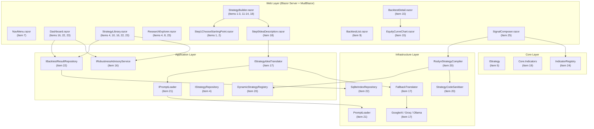
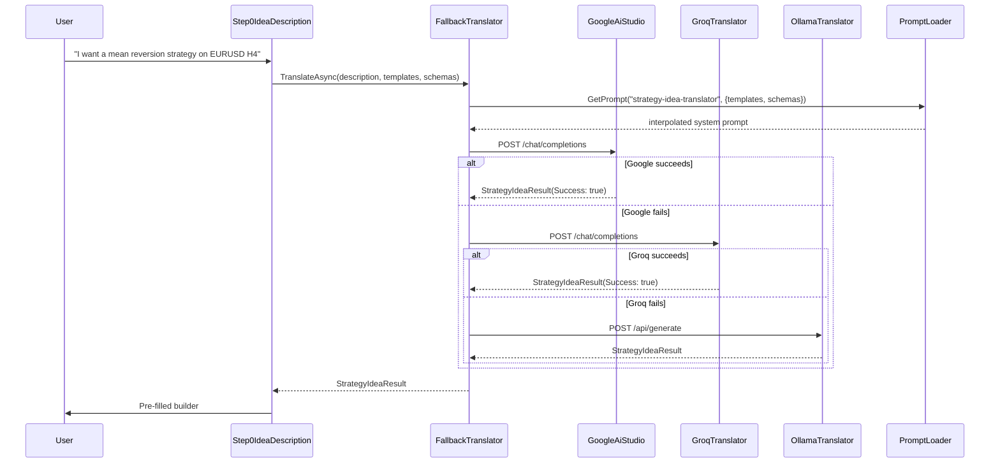
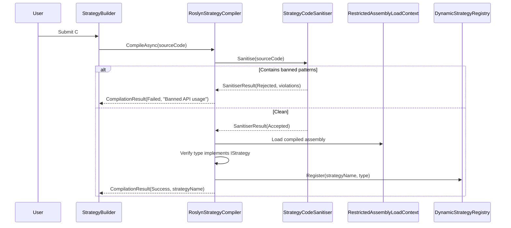
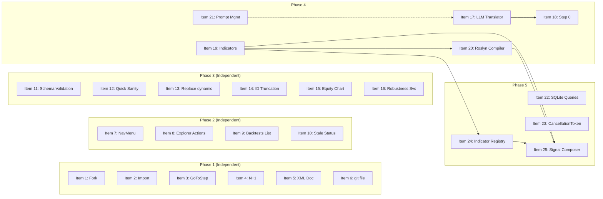

# Design Document — V7 Implementation Plan

## Overview

This design covers 25 improvements across five phases for the TradingResearchEngine platform. The changes span bug fixes, navigation improvements, builder quality, LLM-assisted strategy creation, and long-term architectural upgrades. All changes respect the existing clean architecture (`Core ← Application ← Infrastructure ← Web`), use .NET 8 / C# 12 idioms, and follow the project's established patterns for records, immutability, `IOptions<T>` configuration, and `System.Text.Json` serialisation.

### Design Principles

- **Minimal surface area**: each item changes only the files necessary; no speculative abstractions.
- **Layer discipline**: new interfaces land in Application; implementations in Infrastructure or Web. Core only gains the indicator library (Item 19) and indicator registry (Item 24).
- **Backward compatibility**: existing JSON persistence files remain valid; new fields use nullable defaults.
- **Security by default**: Roslyn compilation (Item 20) uses a restricted `AssemblyLoadContext` and a code sanitiser deny-list. LLM integration (Item 17) enforces a feature flag and never sends data when disabled.

### High-Level Architecture



---

## Architecture

### Layer Placement Summary

| Item | Layer | New Types | Modified Types |
|------|-------|-----------|----------------|
| 1 | Web | — | `Step1ChooseStartingPoint.razor`, `StrategyBuilder.razor` |
| 2 | Web | — | `Step1ChooseStartingPoint.razor`, `StrategyBuilder.razor` |
| 3 | Web | — | `StrategyBuilder.razor`, `BuilderStepIndicator.razor`, `BuilderViewModel.cs` |
| 4 | App+Infra+Web | — | `IStrategyRepository.cs`, `JsonStrategyRepository`, `ResearchExplorer.razor`, `StrategyLibrary.razor` |
| 5 | Core | — | `IStrategy.cs` |
| 6 | Root | — | `git` (delete), `.gitignore` |
| 7 | Web | — | `NavMenu.razor` |
| 8 | Web | — | `ResearchExplorer.razor` |
| 9 | Web | `BacktestList.razor` | — |
| 10 | App+Web | `StalenessOptions.cs` | `StrategyLibrary.razor`, `appsettings.json` |
| 11 | App+Web | `SchemaValidator.cs` | `StrategyBuilder.razor` |
| 12 | Web | — | `StrategyBuilder.razor`, `BacktestDetail.razor` |
| 13 | Web | — | `StrategyBuilder.razor` |
| 14 | App | `StrategyIdGenerator.cs` | `StrategyBuilder.razor` |
| 15 | Web | `EquityCurveChart.razor` | `BacktestDetail.razor` |
| 16 | App | `IRobustnessAdvisoryService.cs`, `RobustnessAdvisoryService.cs`, `RobustnessThresholds.cs` | `Dashboard.razor`, `StrategyLibrary.razor` |
| 17 | App+Infra | `IStrategyIdeaTranslator.cs`, `StrategyIdeaResult.cs`, `LlmProviderOptions.cs`, `GoogleAiStudioTranslator.cs`, `GroqTranslator.cs`, `OllamaTranslator.cs`, `FallbackStrategyIdeaTranslator.cs` | `appsettings.json`, `ServiceCollectionExtensions.cs` |
| 18 | Web | `Step0IdeaDescription.razor` | `StrategyBuilder.razor`, `BuilderStepIndicator.razor`, `BuilderViewModel.cs` |
| 19 | Core | `IIndicator.cs`, `SimpleMovingAverage.cs`, `ExponentialMovingAverage.cs`, `AverageTrueRange.cs`, `RelativeStrengthIndex.cs`, `BollingerBands.cs`, `RollingZScore.cs`, `DonchianChannel.cs` | `ZScoreMeanReversionStrategy.cs` |
| 20 | App+Infra | `IRoslynStrategyCompiler.cs`, `RoslynStrategyCompiler.cs`, `StrategyCodeSanitiser.cs`, `DynamicStrategyRegistry.cs`, `CompilationOptions.cs` | `StrategyRegistry.cs` |
| 21 | App+Infra | `IPromptLoader.cs`, `PromptLoader.cs` | `ServiceCollectionExtensions.cs` |
| 22 | App+Infra+Web | — | `IBacktestResultRepository.cs`, `SqliteIndexRepository.cs`, `Dashboard.razor`, `StrategyLibrary.razor` |
| 23 | Web | — | `Dashboard.razor`, `ResearchExplorer.razor`, `StrategyLibrary.razor`, `BacktestList.razor` |
| 24 | Core | `IndicatorRegistry.cs`, `IndicatorDescriptor.cs` | — |
| 25 | Web+App | `SignalComposer.razor`, `ComposerCanvas.razor`, `IndicatorNode.razor`, `RuleNode.razor`, `ActionNode.razor`, `ComposerGraph.cs`, `ComposerToStrategyTranslator.cs` | — |

---

## Components and Interfaces

### Phase 1 — Fix Broken Functionality

#### Item 1: Fix Fork Handler in Step1ChooseStartingPoint

**Problem**: `_forkStrategyId` is stored in local component state but never raised to the parent `StrategyBuilder.razor`. Selecting a strategy to fork has zero effect on `BuilderViewModel`.

**Design**:

Add two new `[Parameter]` callbacks to `Step1ChooseStartingPoint.razor`:

```csharp
[Parameter] public EventCallback<StrategyIdentity> OnForkSelected { get; set; }
```

When the user selects a strategy in fork mode, invoke `OnForkSelected` with the full `StrategyIdentity`. In the parent `StrategyBuilder.razor`, handle the callback:

```csharp
private async Task HandleForkSelected(StrategyIdentity identity)
{
    var latestVersion = await StrategyRepo.GetLatestVersionAsync(identity.StrategyId);
    if (latestVersion is null)
    {
        Snackbar.Add($"'{identity.StrategyName}' has no versions to fork.", Severity.Warning);
        return;
    }
    _vm.StrategyType = latestVersion.BaseScenarioConfig.EffectiveStrategyConfig.StrategyType;
    _vm.Parameters = new Dictionary<string, object>(latestVersion.Parameters);
    _vm.Timeframe = latestVersion.BaseScenarioConfig.Timeframe ?? "Daily";
    _vm.Hypothesis = latestVersion.Hypothesis;
    _vm.SourceType = SourceType.Fork;
    _vm.IsDirty = true;
    LoadSchemaForCurrentStrategy();
    StateHasChanged();
}
```

**Files changed**:
- `src/TradingResearchEngine.Web/Components/Builder/Step1ChooseStartingPoint.razor` — add `OnForkSelected` parameter, invoke on selection change
- `src/TradingResearchEngine.Web/Components/Pages/Strategies/StrategyBuilder.razor` — wire `OnForkSelected="HandleForkSelected"`, add handler method

#### Item 2: Fix Import JSON — Parse and Apply

**Problem**: `_importJson` is bound to a text field but never deserialised. The input is silently discarded.

**Design**:

Add an `EventCallback<ScenarioConfig>` named `OnImportApplied` to `Step1ChooseStartingPoint.razor`. When the user is in Import mode and the parent calls `NextStep()`, the parent first attempts deserialisation:

```csharp
// In StrategyBuilder.razor, before advancing from Step 1 in Import mode:
if (_vm.SourceType == SourceType.Import && !string.IsNullOrWhiteSpace(_importJson))
{
    try
    {
        var config = JsonSerializer.Deserialize<ScenarioConfig>(_importJson,
            new JsonSerializerOptions { PropertyNameCaseInsensitive = true });
        if (config is null) throw new JsonException("Deserialised to null.");
        PopulateFromImport(config);
    }
    catch (JsonException ex)
    {
        Snackbar.Add($"Invalid JSON: {ex.Message}", Severity.Error);
        return; // stay on Step 1
    }
}
```

The `PopulateFromImport` method maps `ScenarioConfig` fields to `BuilderViewModel`:

```csharp
private void PopulateFromImport(ScenarioConfig config)
{
    _vm.StrategyType = config.EffectiveStrategyConfig.StrategyType;
    _vm.Parameters = new Dictionary<string, object>(config.EffectiveStrategyConfig.StrategyParameters);
    _vm.SlippageModelType = config.EffectiveExecutionConfig.SlippageModelType;
    _vm.CommissionModelType = config.EffectiveExecutionConfig.CommissionModelType;
    _vm.InitialCash = config.EffectiveRiskConfig.InitialCash;
    _vm.AnnualRiskFreeRate = config.EffectiveRiskConfig.AnnualRiskFreeRate;
    _vm.SourceType = SourceType.Import;
    _vm.IsDirty = true;
    LoadSchemaForCurrentStrategy();
}
```

To pass `_importJson` from the child to the parent, add `[Parameter] public EventCallback<string> OnImportJsonChanged { get; set; }` to Step1 and bind it to the text field's value change. Alternatively, expose `_importJson` via a two-way binding on the parent.

**Files changed**:
- `src/TradingResearchEngine.Web/Components/Builder/Step1ChooseStartingPoint.razor` — add `OnImportJsonChanged` callback
- `src/TradingResearchEngine.Web/Components/Pages/Strategies/StrategyBuilder.razor` — add `PopulateFromImport`, deserialisation logic in `NextStep()`

#### Item 3: Fix GoToStep — Allow Navigation to Previously Visited Steps

**Problem**: `GoToStep(int step)` only allows backward navigation (`step < _vm.CurrentStep`). Users cannot jump forward to previously visited steps.

**Design**:

Add `MaxVisitedStep` to `BuilderViewModel`:

```csharp
public int MaxVisitedStep { get; set; } = 1;
```

Update `NextStep()` to track the high-water mark:

```csharp
private async Task NextStep()
{
    if (!CanAdvance()) return;
    _vm.CurrentStep++;
    _vm.MaxVisitedStep = Math.Max(_vm.MaxVisitedStep, _vm.CurrentStep);
    // ... rest unchanged
}
```

Replace the `GoToStep` guard:

```csharp
private async Task GoToStep(int step)
{
    if (step >= 1 && step <= _vm.MaxVisitedStep)
    {
        _vm.CurrentStep = step;
        await PersistDraft();
    }
    // else: ignore — step not yet reached
}
```

Update `BuilderStepIndicator.razor` to accept `MaxVisitedStep` and render three visual states:
- **Current**: filled primary colour
- **Visited** (step <= MaxVisitedStep, step != CurrentStep): outlined primary, clickable
- **Not reached** (step > MaxVisitedStep): greyed out, non-interactive (`disabled`)

**Files changed**:
- `src/TradingResearchEngine.Web/Components/Builder/BuilderViewModel.cs` — add `MaxVisitedStep` property
- `src/TradingResearchEngine.Web/Components/Pages/Strategies/StrategyBuilder.razor` — update `GoToStep`, `NextStep`
- `src/TradingResearchEngine.Web/Components/Shared/BuilderStepIndicator.razor` — accept `MaxVisitedStep`, render three states

#### Item 4: Fix N+1 Queries in ResearchExplorer and StrategyLibrary

**Problem**: Both pages execute O(n) sequential repository calls per row.

**Design**:

**ResearchExplorer fix**: Replace the per-study `GetVersionAsync` + `GetAsync` loop with two batch calls:

```csharp
protected override async Task OnInitializedAsync()
{
    var allStudies = await StudyRepo.ListAsync();
    var allStrategies = await StrategyRepo.ListAsync();
    var allVersions = /* need a batch version lookup */;

    // Build lookup: versionId -> strategyId
    // Then strategyId -> strategyName
    var strategyNameById = allStrategies.ToDictionary(s => s.StrategyId, s => s.StrategyName);

    // For version -> strategy mapping, we need all versions.
    // Add a new method or use existing data.
}
```

Since `IStrategyRepository` doesn't have a "list all versions" method, and we need version-to-strategy mapping, the simplest fix is to load all strategies once and build a lookup by `StrategyType` (which is what the current code ultimately resolves to). However, the current code resolves by `StrategyVersionId`, so we need a batch version lookup.

Add to `IStrategyRepository`:

```csharp
/// <summary>Returns version counts per strategy ID in a single I/O operation.</summary>
Task<IReadOnlyDictionary<string, int>> GetVersionCountsAsync(
    IEnumerable<string> strategyIds, CancellationToken ct = default);

/// <summary>Returns all versions across all strategies in a single I/O operation.</summary>
Task<IReadOnlyList<StrategyVersion>> ListAllVersionsAsync(CancellationToken ct = default);
```

**ResearchExplorer** uses `ListAllVersionsAsync()` to build a `Dictionary<string, string>` mapping `StrategyVersionId → StrategyId`, then joins with the strategies list. Total: 3 calls (`ListAsync` studies, `ListAsync` strategies, `ListAllVersionsAsync` versions) — O(1) regardless of row count.

**StrategyLibrary** uses `GetVersionCountsAsync` instead of the per-strategy `GetVersionsAsync` loop.

**Infrastructure implementation**: `GetVersionCountsAsync` scans the versions directory once, groups by `StrategyId`, and returns counts. `ListAllVersionsAsync` reads all version JSON files in one pass.

**Files changed**:
- `src/TradingResearchEngine.Application/Strategy/IStrategyRepository.cs` — add `GetVersionCountsAsync`, `ListAllVersionsAsync`
- `src/TradingResearchEngine.Infrastructure/Strategy/JsonStrategyRepository.cs` — implement both methods
- `src/TradingResearchEngine.Web/Components/Pages/Research/ResearchExplorer.razor` — replace per-row loop with batch join
- `src/TradingResearchEngine.Web/Components/Pages/Strategies/StrategyLibrary.razor` — replace per-row `GetVersionsAsync` with `GetVersionCountsAsync`

#### Item 5: Fix IStrategy XML Doc Comment

**Problem**: The XML doc still says "all strategies are long-only" — short selling shipped in V6.

**Design**: Replace the `<summary>` and `<remarks>` on `IStrategy`:

```csharp
/// <summary>
/// Consumes market data events and produces zero or more <see cref="SignalEvent"/>
/// or <see cref="OrderEvent"/> instances per bar/tick.
/// </summary>
/// <remarks>
/// <para>
/// Strategies emit <c>Direction.Long</c> to enter a long position,
/// <c>Direction.Short</c> to enter a short position, and
/// <c>Direction.Flat</c> to exit the current position.
/// </para>
/// <para>
/// When <c>AllowReversals</c> is enabled on <c>ExecutionConfig</c>,
/// the engine supports direct long-to-short and short-to-long transitions
/// without an intermediate flat signal.
/// </para>
/// </remarks>
```

**Files changed**:
- `src/TradingResearchEngine.Core/Strategy/IStrategy.cs`

#### Item 6: Delete Orphaned `git` File

**Design**: Delete the zero-byte `git` file at the repository root. Add `/git` to `.gitignore`.

**Files changed**:
- `git` (delete)
- `.gitignore` (add rule)


### Phase 2 — Navigation & Discovery

#### Item 7: Restructure NavMenu

**Problem**: The NavMenu exposes only a fraction of the application. Seven research-workflow pages are unreachable. Data pages are incorrectly grouped under SETTINGS.

**Design**: Replace the entire `NavMenu.razor` content with a structured hierarchy using `MudNavGroup` for collapsible sections. Persist expanded/collapsed state to `localStorage` via JS interop.

```
DASHBOARD         → /                          (MudNavLink)
STRATEGIES        (MudNavGroup)
  My Strategies   → /strategies/library
  New Strategy    → /strategies/builder
RESEARCH          (MudNavGroup)
  Explorer        → /research/explorer
  Parameter Sweep → /research/sweep
  Monte Carlo     → /research/montecarlo
  Walk-Forward    → /research/walkforward
  Perturbation    → /research/perturbation
  Variance        → /research/variance
  Benchmark       → /research/benchmark
BACKTESTS         → /backtests                 (MudNavLink)
PROP FIRM LAB     → /propfirm/evaluate         (MudNavLink)
DATA              (MudNavGroup)
  Market Data     → /market-data
  Data Files      → /data
SETTINGS          → /settings                  (MudNavLink)
```

**JS interop for persistence**: Add a small JS module (`navMenuState.js`) that reads/writes `MudNavGroup` expanded state to `localStorage` keyed by section name. Each `MudNavGroup` binds its `Expanded` property to a C# field initialised from `localStorage` on `OnAfterRenderAsync(firstRender: true)`.

**Files changed**:
- `src/TradingResearchEngine.Web/Components/Layout/NavMenu.razor` — full rewrite
- `src/TradingResearchEngine.Web/wwwroot/js/navMenuState.js` — new JS interop module

#### Item 8: Add Launch Actions to Research Explorer

**Problem**: `ResearchExplorer.razor` is read-only. No way to start a new study from it.

**Design**: Add a toolbar above the studies table:

```razor
<MudStack Row="true" AlignItems="AlignItems.Center" Class="mb-3" Spacing="2">
    <MudMenu Label="New Study" StartIcon="@Icons.Material.Filled.Add"
             Variant="Variant.Filled" Color="Color.Primary">
        <MudMenuItem OnClick="@(() => LaunchStudy("sweep"))">Parameter Sweep</MudMenuItem>
        <MudMenuItem OnClick="@(() => LaunchStudy("montecarlo"))">Monte Carlo</MudMenuItem>
        <MudMenuItem OnClick="@(() => LaunchStudy("walkforward"))">Walk-Forward</MudMenuItem>
        <MudMenuItem OnClick="@(() => LaunchStudy("perturbation"))">Perturbation</MudMenuItem>
        <MudMenuItem OnClick="@(() => LaunchStudy("variance"))">Variance</MudMenuItem>
        <MudMenuItem OnClick="@(() => LaunchStudy("benchmark"))">Benchmark</MudMenuItem>
    </MudMenu>
    <MudSelect T="string" @bind-Value="_strategyFilter" Label="Filter by Strategy"
               Clearable="true" Variant="Variant.Outlined" Style="min-width:200px">
        @foreach (var s in _allStrategies)
        { <MudSelectItem Value="@s.StrategyId">@s.StrategyName</MudSelectItem> }
    </MudSelect>
</MudStack>
```

`LaunchStudy` navigates to the corresponding page, optionally appending `?StrategyId=` from a selected table row:

```csharp
private void LaunchStudy(string type)
{
    var url = $"/research/{type}";
    if (!string.IsNullOrEmpty(_selectedStudyStrategyId))
        url += $"?StrategyId={_selectedStudyStrategyId}";
    Nav.NavigateTo(url);
}
```

**Files changed**:
- `src/TradingResearchEngine.Web/Components/Pages/Research/ResearchExplorer.razor` — add toolbar, filter dropdown, `LaunchStudy` method

#### Item 9: Add Backtests List Page

**Problem**: Individual backtest result pages are only reachable from transient snackbar links. No browsable list exists.

**Design**: Create `BacktestList.razor` at route `/backtests`:

```csharp
@page "/backtests"
@inject IBacktestResultRepository ResultRepo
@inject NavigationManager Nav
```

Renders a `MudTable<BacktestResult>` with columns: Strategy Type, Run Date, Sharpe Ratio, Max Drawdown, Total Trades, Status. Supports server-side sorting and client-side filtering by strategy type and status.

**Key design decisions**:
- Uses `IBacktestResultRepository` (not the generic `IRepository<BacktestResult>`) to leverage SQLite index queries once Item 22 is complete. Initially falls back to `ListAsync()`.
- Row click navigates to `/backtests/{id}`.
- Run date is parsed from the `RunId` prefix using the existing `TryParseRunDate` helper (extracted to a shared utility).

**Files changed**:
- `src/TradingResearchEngine.Web/Components/Pages/Backtests/BacktestList.razor` — new file

#### Item 10: Implement Stale Strategy Status

**Problem**: The "Stale" filter chip in `StrategyLibrary.razor` is hardcoded `Disabled="true"`.

**Design**:

Add configuration:

```csharp
// src/TradingResearchEngine.Application/Configuration/StalenessOptions.cs
public sealed class StalenessOptions
{
    public int StalenessThresholdDays { get; set; } = 30;
}
```

Bind in `appsettings.json`:

```json
"Staleness": { "StalenessThresholdDays": 30 }
```

In `StrategyLibrary.razor`, inject `IOptions<StalenessOptions>` and compute staleness:

```csharp
private bool IsStale(StrategyIdentity strategy, BacktestResult? lastRun)
{
    if (lastRun is null) return false; // untested, not stale
    var runDate = TryParseRunDate(lastRun.Id);
    if (runDate is null) return false;
    return (DateTime.UtcNow - runDate.Value).TotalDays > _stalenessOptions.Value.StalenessThresholdDays;
}
```

Update `GetStatus` to return `"Stale"` when `IsStale` is true. Enable the "Stale" filter chip (remove `Disabled="true"`). Add a `Color.Warning` "STALE" badge to strategy cards.

**Files changed**:
- `src/TradingResearchEngine.Application/Configuration/StalenessOptions.cs` — new
- `src/TradingResearchEngine.Web/Components/Pages/Strategies/StrategyLibrary.razor` — add staleness logic, enable filter
- `src/TradingResearchEngine.Web/appsettings.json` — add `Staleness` section
- `src/TradingResearchEngine.Web/Program.cs` — register `IOptions<StalenessOptions>`

### Phase 3 — Builder & Engine Quality

#### Item 11: Schema-Driven Validation for Builder Steps 3 and 4

**Problem**: `CanAdvance()` returns `true` unconditionally for steps 3 and 4. Invalid parameter values pass silently.

**Design**:

Create a pure validation helper in the Application layer:

```csharp
// src/TradingResearchEngine.Application/Strategy/SchemaValidator.cs
public static class SchemaValidator
{
    public static IReadOnlyList<ValidationError> ValidateParameters(
        Dictionary<string, object> parameters,
        IReadOnlyList<StrategyParameterSchema> schemas)
    {
        var errors = new List<ValidationError>();
        foreach (var schema in schemas)
        {
            if (!parameters.TryGetValue(schema.Name, out var value))
            {
                if (schema.IsRequired)
                    errors.Add(new(schema.Name, $"{schema.DisplayName} is required."));
                continue;
            }
            if (schema.Min is not null && CompareValues(value, schema.Min) < 0)
                errors.Add(new(schema.Name, $"{schema.DisplayName} must be >= {schema.Min}."));
            if (schema.Max is not null && CompareValues(value, schema.Max) > 0)
                errors.Add(new(schema.Name, $"{schema.DisplayName} must be <= {schema.Max}."));
        }
        return errors;
    }

    public static IReadOnlyList<ValidationError> ValidateRiskProfile(
        Dictionary<string, object> riskParams, decimal stopLoss)
    {
        // Validate allocation sum <= 100, stop-loss > 0
    }
}

public sealed record ValidationError(string FieldName, string Message);
```

Update `CanAdvance()` in `StrategyBuilder.razor`:

```csharp
3 => SchemaValidator.ValidateParameters(_vm.Parameters, _schemas).Count == 0,
4 => SchemaValidator.ValidateRiskProfile(_vm.PresetOverrides, /* stopLoss */).Count == 0,
```

Wire validation errors to MudBlazor form validation in `Step3StrategyParameters.razor` by passing the error list and displaying per-field `MudTextField` validation messages.

**Files changed**:
- `src/TradingResearchEngine.Application/Strategy/SchemaValidator.cs` — new
- `src/TradingResearchEngine.Web/Components/Pages/Strategies/StrategyBuilder.razor` — update `CanAdvance()`
- `src/TradingResearchEngine.Web/Components/Pages/Strategies/Steps/Step3StrategyParameters.razor` — display validation errors

#### Item 12: Differentiate Quick Sanity from Standard Backtest

**Problem**: Both launch buttons call `RunUseCase.RunAsync` with the same config. Quick Sanity gives no faster feedback.

**Design**:

In the `OnLaunchAction("quick-sanity")` handler, apply transient overrides to the `ScenarioConfig` before passing it to the runner:

```csharp
case "quick-sanity":
    var (_, version) = await SaveDraftAndVersion();
    var quickConfig = _vm.ToScenarioConfig() with
    {
        RealismProfile = ExecutionRealismProfile.FastResearch,
        // Reduce to last 2 years of data via DataConfig override
        Data = _vm.ToScenarioConfig().EffectiveDataConfig with
        {
            // Signal to engine to use reduced date range
        },
    };
    var result = await Task.Run(() => RunUseCase.RunAsync(quickConfig));
    HandleRunResult(result, isQuickSanity: true);
    break;
```

The quick sanity flag is passed to the result page via a query parameter (`?quickSanity=true`) so the result page can display a "Quick Sanity — reduced dataset" banner. The overrides are never persisted to `ConfigDraft` or `StrategyVersion`.

**Files changed**:
- `src/TradingResearchEngine.Web/Components/Pages/Strategies/StrategyBuilder.razor` — apply transient overrides
- `src/TradingResearchEngine.Web/Components/Pages/Backtests/BacktestDetail.razor` — display quick sanity badge

#### Item 13: Replace `dynamic` Result Type in HandleRunResult

**Problem**: `HandleRunResult(dynamic result)` bypasses compile-time safety.

**Design**: `RunScenarioUseCase.RunAsync` already returns `Task<ScenarioRunResult>`. The `ScenarioRunResult` record has `IsSuccess`, `Result` (nullable `BacktestResult`), and `Errors`. Replace:

```csharp
// Before:
private void HandleRunResult(dynamic result) { ... }

// After:
private void HandleRunResult(ScenarioRunResult result, bool isQuickSanity = false)
{
    if (result.IsSuccess && result.Result is not null)
    {
        Snackbar.Add($"Backtest completed: {result.Result.TotalTrades} trades", Severity.Success);
        var url = $"/backtests/{result.Result.RunId}";
        if (isQuickSanity) url += "?quickSanity=true";
        Nav.NavigateTo(url);
    }
    else
    {
        var msg = result.Errors is { Count: > 0 }
            ? string.Join("; ", result.Errors)
            : "Unknown error";
        Snackbar.Add($"Run failed: {msg}", Severity.Error);
    }
}
```

Also fix the `await Task.Run(() => RunUseCase.RunAsync(config))` pattern — `RunAsync` is already async, so this should be `await RunUseCase.RunAsync(config)` (the `Task.Run` wrapper is unnecessary and hides exceptions).

**Files changed**:
- `src/TradingResearchEngine.Web/Components/Pages/Strategies/StrategyBuilder.razor` — replace `dynamic` with `ScenarioRunResult`

#### Item 14: Fix StrategyId Truncation

**Problem**: `$"strategy-{Guid.NewGuid():N}".Substring(0, 20)` produces IDs with only 11 random characters.

**Design**:

Extract ID generation to a testable static helper in the Application layer:

```csharp
// src/TradingResearchEngine.Application/Strategy/StrategyIdGenerator.cs
public static class StrategyIdGenerator
{
    private static readonly Regex NonSlugChars = new("[^a-z0-9-]", RegexOptions.Compiled);

    public static string Generate(string? strategyName)
    {
        if (string.IsNullOrWhiteSpace(strategyName))
            return $"strategy-{Guid.NewGuid().ToString("N")[..8]}";

        var slug = NonSlugChars.Replace(
            strategyName.ToLowerInvariant().Replace(' ', '-'), "");
        if (slug.Length == 0)
            return $"strategy-{Guid.NewGuid().ToString("N")[..8]}";

        var truncatedSlug = slug[..Math.Min(slug.Length, 20)];
        var suffix = Guid.NewGuid().ToString("N")[..8];
        return $"{truncatedSlug}-{suffix}";
    }
}
```

This produces IDs like `vol-trend-eurusd-a1b2c3d4` — human-readable, URL-safe, with 32 bits of randomness.

Update `SaveDraftAndVersion` in `StrategyBuilder.razor` to call `StrategyIdGenerator.Generate(_vm.StrategyName)`.

**Files changed**:
- `src/TradingResearchEngine.Application/Strategy/StrategyIdGenerator.cs` — new
- `src/TradingResearchEngine.Web/Components/Pages/Strategies/StrategyBuilder.razor` — use `StrategyIdGenerator`

#### Item 15: Add Equity Curve Chart to Backtest Result Page

**Problem**: `BacktestResult` contains equity curve data but it is never rendered visually.

**Design**:

Create `EquityCurveChart.razor` using the existing `Plotly.Blazor` package (already referenced by the Web project — no new dependency needed):

```csharp
// src/TradingResearchEngine.Web/Components/Charts/EquityCurveChart.razor
@using Plotly.Blazor
@using Plotly.Blazor.Traces

<PlotlyChart @bind-Config="_config" @bind-Layout="_layout" @bind-Data="_data" />

@code {
    [Parameter] public IReadOnlyList<EquityCurvePoint> EquityCurve { get; set; } = [];

    // Build two traces:
    // 1. Line trace for equity value (primary Y-axis)
    // 2. Filled area trace for drawdown (secondary Y-axis or shading)
}
```

Wire into `BacktestDetail.razor` above the metrics table, guarded by `@if (Result.EquityCurve.Count > 0)`.

**Files changed**:
- `src/TradingResearchEngine.Web/Components/Charts/EquityCurveChart.razor` — new
- `src/TradingResearchEngine.Web/Components/Pages/Backtests/BacktestDetail.razor` — add chart component

#### Item 16: Extract RobustnessAdvisoryService

**Problem**: Warning threshold logic is duplicated verbatim in `Dashboard.razor` and `StrategyLibrary.razor`.

**Design**:

```csharp
// src/TradingResearchEngine.Application/Research/IRobustnessAdvisoryService.cs
public interface IRobustnessAdvisoryService
{
    IReadOnlyList<string> GetWarnings(BacktestResult result);
}

// src/TradingResearchEngine.Application/Research/RobustnessThresholds.cs
public sealed class RobustnessThresholds
{
    public decimal MaxSharpeRatio { get; set; } = 3.0m;
    public int MinTotalTrades { get; set; } = 30;
    public decimal MinKRatio { get; set; } = 0m;
    public decimal MaxDrawdownPercent { get; set; } = 0.20m;
}

// src/TradingResearchEngine.Application/Research/RobustnessAdvisoryService.cs
public sealed class RobustnessAdvisoryService : IRobustnessAdvisoryService
{
    private readonly RobustnessThresholds _thresholds;

    public RobustnessAdvisoryService(IOptions<RobustnessThresholds> options)
        => _thresholds = options.Value;

    public IReadOnlyList<string> GetWarnings(BacktestResult result)
    {
        var warnings = new List<string>();
        if (result.SharpeRatio > _thresholds.MaxSharpeRatio)
            warnings.Add($"Sharpe > {_thresholds.MaxSharpeRatio}");
        if (result.TotalTrades < _thresholds.MinTotalTrades)
            warnings.Add($"{result.TotalTrades} trades");
        if (result.EquityCurveSmoothness < _thresholds.MinKRatio)
            warnings.Add("K-Ratio < 0");
        if (result.MaxDrawdown > _thresholds.MaxDrawdownPercent)
            warnings.Add($"DD {result.MaxDrawdown:P0}");
        return warnings;
    }
}
```

Register as `services.AddSingleton<IRobustnessAdvisoryService, RobustnessAdvisoryService>()`. Replace inline threshold checks in both `Dashboard.razor` and `StrategyLibrary.razor` with `_robustnessService.GetWarnings(run)`.

**Files changed**:
- `src/TradingResearchEngine.Application/Research/IRobustnessAdvisoryService.cs` — new
- `src/TradingResearchEngine.Application/Research/RobustnessAdvisoryService.cs` — new
- `src/TradingResearchEngine.Application/Research/RobustnessThresholds.cs` — new
- `src/TradingResearchEngine.Web/Components/Pages/Dashboard.razor` — replace inline checks
- `src/TradingResearchEngine.Web/Components/Pages/Strategies/StrategyLibrary.razor` — replace inline checks
- `src/TradingResearchEngine.Web/appsettings.json` — add `RobustnessThresholds` section


### Phase 4 — LLM Strategy Assistant

#### Item 17: IStrategyIdeaTranslator with Provider Abstraction

**Problem**: No LLM integration exists. New strategies can only be created by choosing a pre-compiled template.

**Design**:



**Application layer interfaces**:

```csharp
// src/TradingResearchEngine.Application/AI/IStrategyIdeaTranslator.cs
public interface IStrategyIdeaTranslator
{
    Task<StrategyIdeaResult> TranslateAsync(
        string userDescription,
        IReadOnlyList<StrategyTemplate> templates,
        IReadOnlyList<StrategyParameterSchema> schemas,
        CancellationToken ct = default);
}

// src/TradingResearchEngine.Application/AI/StrategyIdeaResult.cs
public sealed record StrategyIdeaResult(
    bool Success,
    string? SelectedTemplateId = null,
    string? StrategyType = null,
    Dictionary<string, object>? SuggestedParameters = null,
    string? SuggestedHypothesis = null,
    string? SuggestedTimeframe = null,
    string? FailureReason = null,
    string? GeneratedStrategyCode = null);

// src/TradingResearchEngine.Application/AI/IPromptLoader.cs
public interface IPromptLoader
{
    string GetPrompt(string promptName);
    string GetPrompt(string promptName, Dictionary<string, string> tokens);
}
```

**Configuration**:

```csharp
// src/TradingResearchEngine.Application/Configuration/LlmProviderOptions.cs
public sealed class LlmProviderOptions
{
    public bool EnableAIStrategyAssist { get; set; }
    public string Provider { get; set; } = "GoogleAIStudio";
    public string BaseUrl { get; set; } = "";
    public string Model { get; set; } = "gemini-2.5-flash";
    public string ApiKey { get; set; } = "";
    public string[] FallbackProviders { get; set; } = ["Groq", "Ollama"];
    public string OllamaBaseUrl { get; set; } = "http://localhost:11434";
    public string OllamaModel { get; set; } = "llama3";
    public string GroqBaseUrl { get; set; } = "https://api.groq.com/openai/v1/";
    public string GroqApiKey { get; set; } = "";
    public string GroqModel { get; set; } = "llama-3.3-70b-versatile";
}
```

**Infrastructure implementations**:

Each provider implements `IStrategyIdeaTranslator` and uses `HttpClient` (via `IHttpClientFactory`) to call the respective API. All providers:
- Use the OpenAI-compatible `/chat/completions` endpoint (Google AI Studio and Groq support this)
- Set `response_format: { "type": "json_schema", ... }` where supported
- Deserialise the response into `StrategyIdeaResult`
- Wrap HTTP/JSON errors into `StrategyIdeaResult(Success: false, FailureReason: ...)`

`FallbackStrategyIdeaTranslator` wraps the provider chain:

```csharp
public sealed class FallbackStrategyIdeaTranslator : IStrategyIdeaTranslator
{
    private readonly IReadOnlyList<IStrategyIdeaTranslator> _providers;
    private readonly LlmProviderOptions _options;

    public async Task<StrategyIdeaResult> TranslateAsync(...)
    {
        if (!_options.EnableAIStrategyAssist)
            return new StrategyIdeaResult(false, FailureReason: "AI assist is disabled.");

        foreach (var provider in _providers)
        {
            try
            {
                var result = await provider.TranslateAsync(description, templates, schemas, ct);
                if (result.Success) return result;
            }
            catch (Exception ex)
            {
                _logger.LogWarning(ex, "Provider {Provider} failed", provider.GetType().Name);
            }
        }
        return new StrategyIdeaResult(false, FailureReason: "All LLM providers failed.");
    }
}
```

**Security considerations**:
- API keys are loaded from configuration (environment variables or user secrets in development) — never hardcoded.
- When `EnableAIStrategyAssist` is `false`, no HTTP calls are made and no user data leaves the application.
- The system prompt is loaded from a file, not embedded in code, allowing updates without recompilation.

**Files created**:
- `src/TradingResearchEngine.Application/AI/IStrategyIdeaTranslator.cs`
- `src/TradingResearchEngine.Application/AI/StrategyIdeaResult.cs`
- `src/TradingResearchEngine.Application/AI/IPromptLoader.cs`
- `src/TradingResearchEngine.Application/Configuration/LlmProviderOptions.cs`
- `src/TradingResearchEngine.Infrastructure/AI/GoogleAiStudioTranslator.cs`
- `src/TradingResearchEngine.Infrastructure/AI/GroqTranslator.cs`
- `src/TradingResearchEngine.Infrastructure/AI/OllamaTranslator.cs`
- `src/TradingResearchEngine.Infrastructure/AI/FallbackStrategyIdeaTranslator.cs`
- `Prompts/strategy-idea-translator-system-prompt.md`

**Files modified**:
- `src/TradingResearchEngine.Web/appsettings.json` — add `LlmProvider` section
- `src/TradingResearchEngine.Infrastructure/ServiceCollectionExtensions.cs` — register providers

#### Item 18: Add "Describe Your Idea" Step 0 to Strategy Builder

**Problem**: The builder starts at template/fork selection. No natural-language entry point.

**Design**:

Create `Step0IdeaDescription.razor`:

```razor
<MudText Typo="Typo.h6" Class="mb-3">Describe Your Trading Idea</MudText>

<MudTextField @bind-Value="_description" Label="Your Idea" Lines="5"
              Placeholder="Describe your trading idea in plain language..."
              Class="mb-3" />

<MudStack Row="true" Spacing="2">
    <MudButton Variant="Variant.Filled" Color="Color.Primary"
               Disabled="@(!_aiEnabled || _loading)"
               OnClick="TranslateIdea">
        Use AI to prefill →
    </MudButton>
    <MudButton Variant="Variant.Text" OnClick="@(() => OnSkip.InvokeAsync())">
        Skip, start manually →
    </MudButton>
</MudStack>

@if (_loading)
{
    <MudProgressLinear Indeterminate="true" Class="mt-2" />
    <MudText Typo="Typo.caption" Class="text-muted">Analysing your idea…</MudText>
}

@if (_error is not null)
{
    <MudAlert Severity="Severity.Error" Class="mt-2">@_error</MudAlert>
}
```

**Builder integration**: Shift all existing steps by +1 (Step 0 is new, old Step 1 becomes Step 1, etc.). Update `BuilderViewModel.CurrentStep` to start at 0. Update `BuilderStepIndicator` to show 6 steps (0–5). When AI succeeds, advance to Step 2 (old Step 2 = data config) with fields pre-populated.

**Rationale for step numbering**: Rather than renumbering all existing steps, Step 0 is treated as a "pre-step". `MaxVisitedStep` starts at 0. The step indicator shows "Idea → Source → Data → Parameters → Realism → Launch".

**Files created**:
- `src/TradingResearchEngine.Web/Components/Pages/Strategies/Steps/Step0IdeaDescription.razor`

**Files modified**:
- `src/TradingResearchEngine.Web/Components/Pages/Strategies/StrategyBuilder.razor` — add Step 0 case, shift step numbering
- `src/TradingResearchEngine.Web/Components/Shared/BuilderStepIndicator.razor` — support 6 steps
- `src/TradingResearchEngine.Web/Components/Builder/BuilderViewModel.cs` — `CurrentStep` default to 0

#### Item 19: Core Indicators Library

**Problem**: All six strategies implement rolling-window indicator arithmetic inline. No shared, composable indicator layer.

**Design**:

```csharp
// src/TradingResearchEngine.Core/Indicators/IIndicator.cs
namespace TradingResearchEngine.Core.Indicators;

/// <summary>
/// A stateful, composable technical indicator that processes price data
/// one bar at a time and produces a typed output value.
/// </summary>
/// <typeparam name="TOutput">The indicator's output type.</typeparam>
public interface IIndicator<TOutput>
{
    /// <summary>Current output value. Null until the indicator has received enough data.</summary>
    TOutput? Value { get; }

    /// <summary>True when the indicator has received enough data to produce a valid output.</summary>
    bool IsReady { get; }

    /// <summary>Feeds a new price bar to the indicator.</summary>
    void Update(decimal close, decimal? high = null, decimal? low = null);

    /// <summary>Resets the indicator to its initial state.</summary>
    void Reset();
}
```

**Implementations** (all in `src/TradingResearchEngine.Core/Indicators/`):

| Class | Output Type | Warmup Period | Notes |
|-------|------------|---------------|-------|
| `SimpleMovingAverage` | `decimal` | `Period` | Circular buffer, O(1) per update |
| `ExponentialMovingAverage` | `decimal` | `Period` | Standard multiplier: `2/(Period+1)` |
| `AverageTrueRange` | `decimal` | `Period` | Requires high/low; Wilder smoothing |
| `RelativeStrengthIndex` | `decimal` | `Period` | Wilder smoothing for avg gain/loss |
| `BollingerBands` | `BollingerBandsOutput` | `Period` | Upper, Middle, Lower, BandWidth |
| `RollingZScore` | `decimal` | `Period` | (value - mean) / stddev |
| `DonchianChannel` | `DonchianChannelOutput` | `Period` | Upper (highest high), Lower (lowest low), Middle |

```csharp
public sealed record BollingerBandsOutput(decimal Upper, decimal Middle, decimal Lower, decimal BandWidth);
public sealed record DonchianChannelOutput(decimal Upper, decimal Lower, decimal Middle);
```

**Migration proof-of-concept**: Refactor `ZScoreMeanReversionStrategy` to use `RollingZScore` from the indicator library instead of inline rolling-window arithmetic. The strategy's constructor accepts a `RollingZScore` instance (or creates one internally with the configured period).

**Files created**:
- `src/TradingResearchEngine.Core/Indicators/IIndicator.cs`
- `src/TradingResearchEngine.Core/Indicators/SimpleMovingAverage.cs`
- `src/TradingResearchEngine.Core/Indicators/ExponentialMovingAverage.cs`
- `src/TradingResearchEngine.Core/Indicators/AverageTrueRange.cs`
- `src/TradingResearchEngine.Core/Indicators/RelativeStrengthIndex.cs`
- `src/TradingResearchEngine.Core/Indicators/BollingerBands.cs`
- `src/TradingResearchEngine.Core/Indicators/RollingZScore.cs`
- `src/TradingResearchEngine.Core/Indicators/DonchianChannel.cs`
- `src/TradingResearchEngine.Core/Indicators/BollingerBandsOutput.cs`
- `src/TradingResearchEngine.Core/Indicators/DonchianChannelOutput.cs`

**Files modified**:
- `src/TradingResearchEngine.Core/Strategy/ZScoreMeanReversionStrategy.cs` — use `RollingZScore`

#### Item 20: Dynamic Roslyn Strategy Compiler

**Problem**: No mechanism to register a new strategy type at runtime without recompiling.

**Design**:



**Application layer**:

```csharp
// src/TradingResearchEngine.Application/Strategy/DynamicStrategyRegistry.cs
public sealed class DynamicStrategyRegistry
{
    private readonly StrategyRegistry _registry;

    public void Register(string name, Type strategyType)
    {
        // Validate implements IStrategy, then add to registry
        _registry.RegisterDynamic(name, strategyType);
    }
}
```

Extend `StrategyRegistry` with a `RegisterDynamic(string name, Type type)` method that adds to the internal dictionary (same validation as `RegisterAssembly` but for a single type).

**Infrastructure layer**:

```csharp
// src/TradingResearchEngine.Infrastructure/Compilation/IRoslynStrategyCompiler.cs
public interface IRoslynStrategyCompiler
{
    Task<CompilationResult> CompileAsync(string sourceCode, CancellationToken ct = default);
}

public sealed record CompilationResult(
    bool Success,
    string? StrategyName = null,
    Type? StrategyType = null,
    IReadOnlyList<string>? Errors = null,
    IReadOnlyList<string>? Warnings = null);
```

**StrategyCodeSanitiser** — a pure function that scans source code for banned patterns:

```csharp
public static class StrategyCodeSanitiser
{
    private static readonly string[] BannedPatterns =
    [
        "HttpClient", "WebClient", "File.", "Directory.", "Process.",
        "Environment.", "Assembly.Load", "Type.GetType",
        "Activator.CreateInstance", "Marshal", "unsafe", "extern", "DllImport"
    ];

    public static SanitiserResult Sanitise(string sourceCode)
    {
        var violations = BannedPatterns
            .Where(p => sourceCode.Contains(p, StringComparison.Ordinal))
            .ToList();
        return violations.Count == 0
            ? SanitiserResult.Accepted()
            : SanitiserResult.Rejected(violations);
    }
}
```

**Security considerations**:
- Compiled assemblies are loaded in a `RestrictedAssemblyLoadContext` that only allows references to `TradingResearchEngine.Core` and `System.Runtime`. No file system, network, or reflection APIs are available.
- The feature is gated behind `EnableDynamicStrategyCompilation` (default: `false`).
- Full source code, sanitiser result, and compilation diagnostics are logged to a structured audit log via `ILogger<RoslynStrategyCompiler>`.
- The `Microsoft.CodeAnalysis.CSharp` NuGet package is required (add to Infrastructure project).

**Configuration**:

```csharp
public sealed class CompilationOptions
{
    public bool EnableDynamicStrategyCompilation { get; set; } = false;
}
```

**Files created**:
- `src/TradingResearchEngine.Infrastructure/Compilation/IRoslynStrategyCompiler.cs`
- `src/TradingResearchEngine.Infrastructure/Compilation/RoslynStrategyCompiler.cs`
- `src/TradingResearchEngine.Infrastructure/Compilation/StrategyCodeSanitiser.cs`
- `src/TradingResearchEngine.Infrastructure/Compilation/RestrictedAssemblyLoadContext.cs`
- `src/TradingResearchEngine.Infrastructure/Compilation/CompilationOptions.cs`
- `src/TradingResearchEngine.Application/Strategy/DynamicStrategyRegistry.cs`

**Files modified**:
- `src/TradingResearchEngine.Application/Strategy/StrategyRegistry.cs` — add `RegisterDynamic`
- `src/TradingResearchEngine.Infrastructure/TradingResearchEngine.Infrastructure.csproj` — add `Microsoft.CodeAnalysis.CSharp` package

#### Item 21: Prompt Management — Load System Prompts from Files

**Problem**: If LLM system prompts are hardcoded strings, updating them requires recompilation.

**Design**:

```csharp
// src/TradingResearchEngine.Infrastructure/AI/PromptLoader.cs
public sealed class PromptLoader : IPromptLoader
{
    private readonly IReadOnlyDictionary<string, string> _prompts;

    public PromptLoader(string promptsDirectory)
    {
        var prompts = new Dictionary<string, string>(StringComparer.OrdinalIgnoreCase);
        if (Directory.Exists(promptsDirectory))
        {
            foreach (var file in Directory.GetFiles(promptsDirectory, "*.md"))
            {
                var name = Path.GetFileNameWithoutExtension(file);
                prompts[name] = File.ReadAllText(file);
            }
        }
        _prompts = prompts;
    }

    public string GetPrompt(string promptName)
    {
        if (_prompts.TryGetValue(promptName, out var content))
            return content;
        throw new InvalidOperationException(
            $"Prompt '{promptName}' not found. Available: {string.Join(", ", _prompts.Keys)}");
    }

    public string GetPrompt(string promptName, Dictionary<string, string> tokens)
    {
        var template = GetPrompt(promptName);
        foreach (var (key, value) in tokens)
            template = template.Replace($"{{{key}}}", value);
        return template;
    }
}
```

Registered as a singleton in DI, initialised with the `Prompts/` directory path.

**Files created**:
- `src/TradingResearchEngine.Infrastructure/AI/PromptLoader.cs`

**Files modified**:
- `src/TradingResearchEngine.Infrastructure/ServiceCollectionExtensions.cs` — register `IPromptLoader`


### Phase 5 — Long-Term Architecture

#### Item 22: SQLite Index for BacktestResult Queries on Web Pages

**Problem**: `Dashboard.razor` and `StrategyLibrary.razor` call `ResultRepo.ListAsync()` which deserialises the entire result collection on every page load.

**Design**:

Extend `IBacktestResultRepository` with targeted query methods:

```csharp
// Add to IBacktestResultRepository:
Task<IReadOnlyList<BacktestResult>> GetRecentRunsAsync(int limit, CancellationToken ct = default);
Task<IReadOnlyDictionary<string, BacktestResult>> GetLastRunPerStrategyAsync(CancellationToken ct = default);
Task<IReadOnlyList<BacktestResult>> GetRunSummariesByStrategyAsync(string strategyId, CancellationToken ct = default);
```

Implement in `SqliteIndexRepository` using targeted SQLite queries:

```sql
-- GetRecentRunsAsync
SELECT json_path FROM backtest_index ORDER BY run_date DESC LIMIT @limit;

-- GetLastRunPerStrategyAsync
SELECT json_path FROM backtest_index
WHERE rowid IN (
    SELECT MAX(rowid) FROM backtest_index GROUP BY strategy_type
);

-- GetRunSummariesByStrategyAsync
SELECT json_path FROM backtest_index WHERE strategy_id = @strategyId;
```

Each method reads only the required JSON files (not the entire collection).

**Dashboard changes**: Replace `_runs = (await ResultRepo.ListAsync()).OrderByDescending(...)` with:
- `_recentRuns = await ResultRepo.GetRecentRunsAsync(10);`
- `_lastRunMap = await ResultRepo.GetLastRunPerStrategyAsync();`

**StrategyLibrary changes**: Replace `var allRuns = (await ResultRepo.ListAsync())...` with targeted queries per strategy or a batch method.

**Files modified**:
- `src/TradingResearchEngine.Application/Research/IBacktestResultRepository.cs` — add new methods
- `src/TradingResearchEngine.Infrastructure/Persistence/SqliteIndexRepository.cs` — implement new queries
- `src/TradingResearchEngine.Web/Components/Pages/Dashboard.razor` — use targeted queries
- `src/TradingResearchEngine.Web/Components/Pages/Strategies/StrategyLibrary.razor` — use targeted queries

#### Item 23: Add CancellationToken to Blazor Page Initialisation

**Problem**: Multiple pages perform async I/O in `OnInitializedAsync` without honouring component disposal.

**Design**:

Apply a consistent pattern to all affected pages:

```csharp
@implements IDisposable

@code {
    private readonly CancellationTokenSource _cts = new();

    protected override async Task OnInitializedAsync()
    {
        _strategies = (await StrategyRepo.ListAsync(_cts.Token)).ToList();
        // ... all async calls pass _cts.Token
    }

    public void Dispose()
    {
        _cts.Cancel();
        _cts.Dispose();
    }
}
```

**Affected pages**:
- `Dashboard.razor`
- `ResearchExplorer.razor`
- `StrategyLibrary.razor`
- `BacktestList.razor` (new in Item 9)
- Any other Razor component with async `OnInitializedAsync`

**Files modified**:
- `src/TradingResearchEngine.Web/Components/Pages/Dashboard.razor`
- `src/TradingResearchEngine.Web/Components/Pages/Research/ResearchExplorer.razor`
- `src/TradingResearchEngine.Web/Components/Pages/Strategies/StrategyLibrary.razor`
- `src/TradingResearchEngine.Web/Components/Pages/Backtests/BacktestList.razor`

#### Item 24: Indicator Registry for Visual Composer

**Problem**: No structured metadata about indicators for a future drag-and-drop UI.

**Design**:

```csharp
// src/TradingResearchEngine.Core/Indicators/IndicatorDescriptor.cs
public sealed record IndicatorDescriptor(
    string Name,
    string Description,
    IReadOnlyList<IndicatorParameterDescriptor> Parameters,
    string OutputType);

public sealed record IndicatorParameterDescriptor(
    string Name,
    string Type,
    object? Min,
    object? Max,
    object DefaultValue);

// src/TradingResearchEngine.Core/Indicators/IndicatorRegistry.cs
public static class IndicatorRegistry
{
    public static IReadOnlyList<IndicatorDescriptor> All { get; } = new[]
    {
        new IndicatorDescriptor("SMA", "Simple Moving Average",
            new[] { new IndicatorParameterDescriptor("Period", "int", 2, 500, 20) },
            "decimal"),
        new IndicatorDescriptor("EMA", "Exponential Moving Average",
            new[] { new IndicatorParameterDescriptor("Period", "int", 2, 500, 20) },
            "decimal"),
        new IndicatorDescriptor("ATR", "Average True Range",
            new[] { new IndicatorParameterDescriptor("Period", "int", 2, 500, 14) },
            "decimal"),
        new IndicatorDescriptor("RSI", "Relative Strength Index",
            new[] { new IndicatorParameterDescriptor("Period", "int", 2, 500, 14) },
            "decimal"),
        new IndicatorDescriptor("BollingerBands", "Bollinger Bands",
            new[]
            {
                new IndicatorParameterDescriptor("Period", "int", 2, 500, 20),
                new IndicatorParameterDescriptor("StdDevMultiplier", "decimal", 0.5m, 5.0m, 2.0m)
            },
            "BollingerBandsOutput"),
        new IndicatorDescriptor("ZScore", "Rolling Z-Score",
            new[] { new IndicatorParameterDescriptor("Period", "int", 2, 500, 20) },
            "decimal"),
        new IndicatorDescriptor("DonchianChannel", "Donchian Channel",
            new[] { new IndicatorParameterDescriptor("Period", "int", 2, 500, 20) },
            "DonchianChannelOutput"),
    };
}
```

This parallels the existing `DefaultStrategyTemplates.All` pattern.

**Files created**:
- `src/TradingResearchEngine.Core/Indicators/IndicatorDescriptor.cs`
- `src/TradingResearchEngine.Core/Indicators/IndicatorRegistry.cs`

#### Item 25: Signal Composer UI (Visual Canvas)

**Problem**: The only way to create strategy logic is through pre-compiled C# or LLM code generation.

**Design**:

**Data model** (Application layer):

```csharp
// src/TradingResearchEngine.Application/Composer/ComposerGraph.cs
public sealed record ComposerGraph(
    string GraphId,
    IReadOnlyList<ComposerNode> Nodes,
    IReadOnlyList<ComposerEdge> Edges);

public sealed record ComposerNode(
    string NodeId,
    ComposerNodeType NodeType,
    string TypeName,           // e.g. "SMA", "CrossAbove", "EnterLong"
    Dictionary<string, object> Parameters,
    double X, double Y);       // canvas position

public enum ComposerNodeType { Indicator, Rule, Action }

public sealed record ComposerEdge(
    string EdgeId,
    string SourceNodeId,
    string SourcePort,
    string TargetNodeId,
    string TargetPort);
```

**Translator** (Application layer):

```csharp
// src/TradingResearchEngine.Application/Composer/ComposerToStrategyTranslator.cs
public sealed class ComposerToStrategyTranslator
{
    private readonly IRoslynStrategyCompiler _compiler;

    public async Task<CompilationResult> TranslateAsync(
        ComposerGraph graph, CancellationToken ct = default)
    {
        var sourceCode = GenerateStrategySource(graph);
        return await _compiler.CompileAsync(sourceCode, ct);
    }

    private string GenerateStrategySource(ComposerGraph graph)
    {
        // Walk the graph topologically
        // Generate C# source code that:
        // 1. Creates indicator instances from Indicator nodes
        // 2. Evaluates Rule nodes as boolean conditions
        // 3. Emits Direction signals from Action nodes
    }
}
```

**Web layer components**:

- `SignalComposer.razor` — page at `/strategies/composer`, hosts the canvas
- `ComposerCanvas.razor` — SVG-based canvas with drag-and-drop node placement and edge drawing
- `IndicatorNode.razor` — renders an indicator node with parameter inputs, sourced from `IndicatorRegistry.All`
- `RuleNode.razor` — renders a rule node (`CrossAbove`, `CrossBelow`, `GreaterThan`, `LessThan`, `And`, `Or`)
- `ActionNode.razor` — renders an action node (`Enter Long`, `Enter Short`, `Exit`, `Size by ATR`)

The canvas uses SVG for node rendering and edge drawing. Nodes are positioned via CSS transforms. Edges are drawn as SVG `<path>` elements with Bézier curves. The graph is serialised to JSON via `System.Text.Json` for persistence.

**Dependencies**: Items 19 (indicators), 20 (Roslyn compiler), 24 (indicator registry).

**Files created**:
- `src/TradingResearchEngine.Application/Composer/ComposerGraph.cs`
- `src/TradingResearchEngine.Application/Composer/ComposerToStrategyTranslator.cs`
- `src/TradingResearchEngine.Web/Components/Pages/Strategies/SignalComposer.razor`
- `src/TradingResearchEngine.Web/Components/Composer/ComposerCanvas.razor`
- `src/TradingResearchEngine.Web/Components/Composer/IndicatorNode.razor`
- `src/TradingResearchEngine.Web/Components/Composer/RuleNode.razor`
- `src/TradingResearchEngine.Web/Components/Composer/ActionNode.razor`

---

## Data Models

### New Records and Types

```csharp
// Application Layer — AI
public sealed record StrategyIdeaResult(
    bool Success,
    string? SelectedTemplateId = null,
    string? StrategyType = null,
    Dictionary<string, object>? SuggestedParameters = null,
    string? SuggestedHypothesis = null,
    string? SuggestedTimeframe = null,
    string? FailureReason = null,
    string? GeneratedStrategyCode = null);

// Application Layer — Configuration
public sealed class LlmProviderOptions { /* see Item 17 */ }
public sealed class StalenessOptions { public int StalenessThresholdDays { get; set; } = 30; }
public sealed class RobustnessThresholds { /* see Item 16 */ }
public sealed class CompilationOptions { public bool EnableDynamicStrategyCompilation { get; set; } }

// Application Layer — Validation
public sealed record ValidationError(string FieldName, string Message);

// Application Layer — Composer
public sealed record ComposerGraph(string GraphId, IReadOnlyList<ComposerNode> Nodes, IReadOnlyList<ComposerEdge> Edges);
public sealed record ComposerNode(string NodeId, ComposerNodeType NodeType, string TypeName, Dictionary<string, object> Parameters, double X, double Y);
public sealed record ComposerEdge(string EdgeId, string SourceNodeId, string SourcePort, string TargetNodeId, string TargetPort);
public enum ComposerNodeType { Indicator, Rule, Action }

// Core Layer — Indicators
public sealed record BollingerBandsOutput(decimal Upper, decimal Middle, decimal Lower, decimal BandWidth);
public sealed record DonchianChannelOutput(decimal Upper, decimal Lower, decimal Middle);
public sealed record IndicatorDescriptor(string Name, string Description, IReadOnlyList<IndicatorParameterDescriptor> Parameters, string OutputType);
public sealed record IndicatorParameterDescriptor(string Name, string Type, object? Min, object? Max, object DefaultValue);

// Infrastructure Layer — Compilation
public sealed record CompilationResult(bool Success, string? StrategyName = null, Type? StrategyType = null, IReadOnlyList<string>? Errors = null, IReadOnlyList<string>? Warnings = null);
public sealed record SanitiserResult(bool Accepted, IReadOnlyList<string>? Violations = null);
```

### Modified Types

| Type | Change |
|------|--------|
| `BuilderViewModel` | Add `MaxVisitedStep` property; change `CurrentStep` default to `0` |
| `IStrategyRepository` | Add `GetVersionCountsAsync`, `ListAllVersionsAsync` |
| `IBacktestResultRepository` | Add `GetRecentRunsAsync`, `GetLastRunPerStrategyAsync`, `GetRunSummariesByStrategyAsync` |
| `StrategyRegistry` | Add `RegisterDynamic(string name, Type type)` |
| `IStrategy` (XML doc only) | Update doc comments to reflect V6+ capabilities |

---

## Correctness Properties

*A property is a characteristic or behavior that should hold true across all valid executions of a system — essentially, a formal statement about what the system should do. Properties serve as the bridge between human-readable specifications and machine-verifiable correctness guarantees.*

### Property 1: BuilderViewModel population preserves source fields

*For any* valid `StrategyVersion` with arbitrary `StrategyType`, `Parameters`, `Timeframe`, and `Hypothesis` values, populating a `BuilderViewModel` from that version should preserve all four fields exactly. Similarly, *for any* valid `ScenarioConfig`, mapping it to a `BuilderViewModel` via `PopulateFromImport` should preserve `StrategyType`, `Parameters`, `SlippageModelType`, `CommissionModelType`, `InitialCash`, and `AnnualRiskFreeRate`.

**Validates: Requirements 1.2, 2.2**

### Property 2: ScenarioConfig JSON round-trip

*For any* valid `ScenarioConfig`, serialising it to JSON via `System.Text.Json` and then deserialising the JSON back should produce a `ScenarioConfig` that is structurally equivalent to the original (all fields match).

**Validates: Requirement 2.1**

### Property 3: MaxVisitedStep navigation invariant

*For any* sequence of `NextStep` and `GoToStep(N)` operations on a `BuilderViewModel`, `GoToStep(N)` should set `CurrentStep` to `N` if and only if `N <= MaxVisitedStep`. When `N > MaxVisitedStep`, `CurrentStep` should remain unchanged. `MaxVisitedStep` should always equal the maximum step index ever reached.

**Validates: Requirements 3.1, 3.2, 3.3**

### Property 4: GetVersionCountsAsync batch correctness

*For any* set of strategies with varying numbers of versions, `GetVersionCountsAsync` should return a dictionary where each strategy ID maps to the exact count of versions that exist for that strategy.

**Validates: Requirements 4.2, 4.3**

### Property 5: Staleness computation

*For any* strategy with a last run date and *any* positive staleness threshold in days, `IsStale` should return `true` if and only if the run date is older than `DateTime.UtcNow` minus the threshold. Strategies with no runs should never be stale.

**Validates: Requirement 10.2**

### Property 6: Parameter schema validation

*For any* numeric parameter value and *any* `StrategyParameterSchema` with `Min` and `Max` bounds, `SchemaValidator.ValidateParameters` should return an error for that parameter if and only if the value is outside the `[Min, Max]` range.

**Validates: Requirement 11.1**

### Property 7: Risk allocation validation

*For any* set of risk allocation percentages, `SchemaValidator.ValidateRiskProfile` should return a validation error if and only if the sum exceeds 100% or any stop-loss value is non-positive.

**Validates: Requirement 11.3**

### Property 8: Strategy ID generation

*For any* strategy name (including empty, whitespace-only, and names with special characters), `StrategyIdGenerator.Generate` should produce an ID that: (a) matches the regex `^[a-z0-9-]+$` (URL-safe), (b) contains at least 8 hexadecimal characters of randomness, and (c) when the name is non-empty, contains a slug derived from the name.

**Validates: Requirements 14.1, 14.2, 14.3, 14.4**

### Property 9: RobustnessAdvisoryService threshold warnings

*For any* `BacktestResult` with arbitrary metric values and *any* `RobustnessThresholds` configuration, `GetWarnings` should return a warning for each metric that exceeds its configured threshold and no warnings for metrics within bounds.

**Validates: Requirements 16.1, 16.2**

### Property 10: Fallback translator chain

*For any* ordered list of LLM providers where each provider either succeeds or fails, the `FallbackStrategyIdeaTranslator` should return the result of the first provider that succeeds. If all providers fail, it should return a failure result. When `EnableAIStrategyAssist` is `false`, it should return failure immediately without invoking any provider.

**Validates: Requirements 17.4, 17.5**

### Property 11: Indicator reset and replay determinism

*For any* indicator implementation and *any* data series of close/high/low values, calling `Reset()` and then replaying the same data series should produce output values identical to the first pass through the data.

**Validates: Requirement 19.6**

### Property 12: StrategyCodeSanitiser banned pattern rejection

*For any* source code string, the `StrategyCodeSanitiser` should reject the code if and only if it contains at least one of the banned patterns (`HttpClient`, `WebClient`, `File.`, `Directory.`, `Process.`, `Environment.`, `Assembly.Load`, `Type.GetType`, `Activator.CreateInstance`, `Marshal`, `unsafe`, `extern`, `DllImport`).

**Validates: Requirement 20.2**

### Property 13: Prompt token interpolation

*For any* prompt template string containing `{templates_json}` and `{schemas_json}` placeholders and *any* replacement values, `PromptLoader.GetPrompt(name, tokens)` should return a string where all placeholders are replaced with the provided values and no `{templates_json}` or `{schemas_json}` tokens remain.

**Validates: Requirement 21.5**

### Property 14: IndicatorRegistry completeness

*For every* indicator implementation in the `TradingResearchEngine.Core.Indicators` namespace, `IndicatorRegistry.All` should contain a descriptor with a matching `Name`.

**Validates: Requirements 24.1, 24.3**

### Property 15: ComposerGraph JSON round-trip

*For any* valid `ComposerGraph` with arbitrary nodes, edges, and parameters, serialising to JSON and deserialising back should produce a structurally equivalent graph.

**Validates: Requirement 25.4**

---

## Error Handling

### Phase 1

| Scenario | Handling |
|----------|----------|
| Fork: strategy has no versions | `MudAlert` with `Severity.Warning` — "No versions to fork" |
| Import: invalid JSON | `MudAlert` with `Severity.Error` showing `JsonException.Message`; remain on Step 1 |
| Import: JSON deserialises to null | Treated as invalid JSON |
| GoToStep: step > MaxVisitedStep | Silently ignored (no navigation) |

### Phase 3

| Scenario | Handling |
|----------|----------|
| Schema validation: parameter out of range | Per-field `MudTextField` validation message; `CanAdvance()` returns `false` |
| Risk validation: sum > 100% | Per-field validation message |
| HandleRunResult: run fails | `Snackbar` with `Severity.Error` showing joined error messages |

### Phase 4

| Scenario | Handling |
|----------|----------|
| LLM: all providers fail | `MudAlert` on Step 0 with failure reason; options to retry or skip |
| LLM: feature disabled | "Use AI to prefill" button disabled with tooltip |
| Roslyn: banned API detected | `CompilationResult(Success: false)` with violation list |
| Roslyn: code doesn't implement IStrategy | `CompilationResult(Success: false)` with descriptive error |
| Roslyn: compilation errors | `CompilationResult(Success: false)` with diagnostic messages |
| Roslyn: feature disabled | `CompilationResult(Success: false, Errors: ["Dynamic compilation is disabled"])` |
| PromptLoader: missing prompt | `InvalidOperationException` listing available prompts |

### Phase 5

| Scenario | Handling |
|----------|----------|
| SQLite query fails | Fall back to `ListAsync()` with a logged warning |
| CancellationToken: component disposed during load | `OperationCanceledException` caught silently; no state update |

---

## Testing Strategy

### Testing Framework

- **xUnit** for all example-based tests
- **FsCheck.Xunit** for all property-based tests (`[Property(MaxTest = 100)]`)
- **Moq** for mocking in UnitTests
- UnitTests references Core and Application only — never Infrastructure

### Property-Based Tests

Each property test is tagged with:

```csharp
// Feature: v7-implementation-plan, Property N: <description>
[Property(MaxTest = 100)]
```

**Property tests to implement** (in `src/TradingResearchEngine.UnitTests/V7/`):

| Property | Test Class | Test Method | FsCheck Generators |
|----------|-----------|-------------|-------------------|
| 1 | `BuilderViewModelProperties` | `PopulateFromVersion_PreservesAllFields` | Arbitrary `StrategyVersion` with random parameters |
| 2 | `ScenarioConfigProperties` | `JsonRoundTrip_PreservesAllFields` | Arbitrary `ScenarioConfig` |
| 3 | `BuilderNavigationProperties` | `GoToStep_RespectsMaxVisitedStep` | Random sequences of step operations |
| 4 | `StrategyRepositoryProperties` | `GetVersionCounts_MatchesActualCounts` | Random strategy/version sets |
| 5 | `StalenessProperties` | `IsStale_CorrectForAnyDateAndThreshold` | Random dates and thresholds |
| 6 | `SchemaValidatorProperties` | `ValidateParameters_RespectsMinMaxBounds` | Random numeric values and bounds |
| 7 | `SchemaValidatorProperties` | `ValidateRiskProfile_RejectsSumOver100` | Random allocation percentages |
| 8 | `StrategyIdGeneratorProperties` | `Generate_ProducesUrlSafeIdWithSuffix` | Random strategy names (including empty/whitespace) |
| 9 | `RobustnessAdvisoryProperties` | `GetWarnings_MatchesThresholds` | Random `BacktestResult` metrics and thresholds |
| 10 | `FallbackTranslatorProperties` | `Chain_ReturnsFirstSuccess` | Random provider success/failure sequences |
| 11 | `IndicatorProperties` | `ResetReplay_ProducesIdenticalOutput` | Random price series per indicator |
| 12 | `StrategyCodeSanitiserProperties` | `Sanitise_RejectsBannedPatterns` | Random source code with/without banned patterns |
| 13 | `PromptLoaderProperties` | `Interpolate_ReplacesAllTokens` | Random template strings and replacement values |
| 14 | `IndicatorRegistryProperties` | `All_ContainsDescriptorForEveryIndicator` | Reflection-based discovery |
| 15 | `ComposerGraphProperties` | `JsonRoundTrip_PreservesGraph` | Arbitrary `ComposerGraph` |

### Example-Based Unit Tests

| Item | Test Class | Key Test Cases |
|------|-----------|---------------|
| 1 | `ForkHandlerTests` | Fork with versions populates VM; fork with no versions shows warning |
| 2 | `ImportJsonTests` | Valid JSON populates VM; invalid JSON shows error; null JSON stays on step |
| 3 | `GoToStepTests` | Forward to visited step works; forward to unvisited step blocked |
| 5 | `IStrategyDocTests` | XML doc does not contain "long-only" phrase |
| 11 | `SchemaValidatorTests` | Out-of-range value fails; in-range value passes; missing required field fails |
| 12 | `QuickSanityTests` | Quick sanity applies overrides; standard backtest does not modify config |
| 14 | `StrategyIdGeneratorTests` | Empty name gets "strategy-" prefix; 10,000 rapid generations are unique |
| 16 | `RobustnessAdvisoryServiceTests` | Each threshold boundary (Sharpe=3.0, Trades=30, K-Ratio=0, DD=20%) |
| 17 | `FallbackTranslatorTests` | Feature flag disabled returns immediately; single provider success; all fail |
| 19 | `IndicatorTests` | SMA/EMA/ATR/RSI/BB/ZScore/Donchian against known reference values (Excel-calculated) |
| 20 | `StrategyCodeSanitiserTests` | Each banned pattern individually; clean code passes; IStrategy check |
| 21 | `PromptLoaderTests` | Missing prompt throws; interpolation replaces tokens; no-token prompt returned as-is |

### Integration Tests

| Item | Test Class | Scope |
|------|-----------|-------|
| 4 | `StrategyRepositoryIntegrationTests` | `GetVersionCountsAsync` against temp JSON directory |
| 17 | `LlmProviderIntegrationTests` | Mock HTTP responses for each provider |
| 20 | `RoslynCompilerIntegrationTests` | Compile valid IStrategy source; reject invalid source; restricted ALC |
| 22 | `SqliteIndexQueryTests` | `GetRecentRunsAsync`, `GetLastRunPerStrategyAsync` against test SQLite DB |

### Test File Locations

```
src/TradingResearchEngine.UnitTests/V7/
  BuilderViewModelProperties.cs
  BuilderNavigationProperties.cs
  ScenarioConfigProperties.cs
  SchemaValidatorProperties.cs
  SchemaValidatorTests.cs
  StrategyIdGeneratorProperties.cs
  StrategyIdGeneratorTests.cs
  RobustnessAdvisoryProperties.cs
  RobustnessAdvisoryServiceTests.cs
  FallbackTranslatorProperties.cs
  FallbackTranslatorTests.cs
  IndicatorProperties.cs
  IndicatorTests.cs
  StrategyCodeSanitiserProperties.cs
  StrategyCodeSanitiserTests.cs
  PromptLoaderProperties.cs
  PromptLoaderTests.cs
  IndicatorRegistryProperties.cs
  ComposerGraphProperties.cs
  StalenessProperties.cs

src/TradingResearchEngine.IntegrationTests/V7/
  StrategyRepositoryIntegrationTests.cs
  LlmProviderIntegrationTests.cs
  RoslynCompilerIntegrationTests.cs
  SqliteIndexQueryTests.cs
```

### Dependency Graph for Implementation Order



### New NuGet Packages Required

| Package | Project | Item |
|---------|---------|------|
| `Microsoft.CodeAnalysis.CSharp` | Infrastructure | 20 |

All other dependencies (`Plotly.Blazor`, `System.Text.Json`, `Microsoft.Extensions.Http`, `Polly`, `FsCheck.Xunit`, `Moq`) are already referenced.
