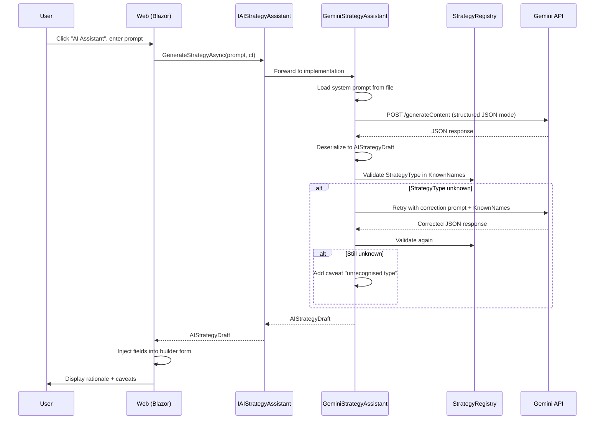
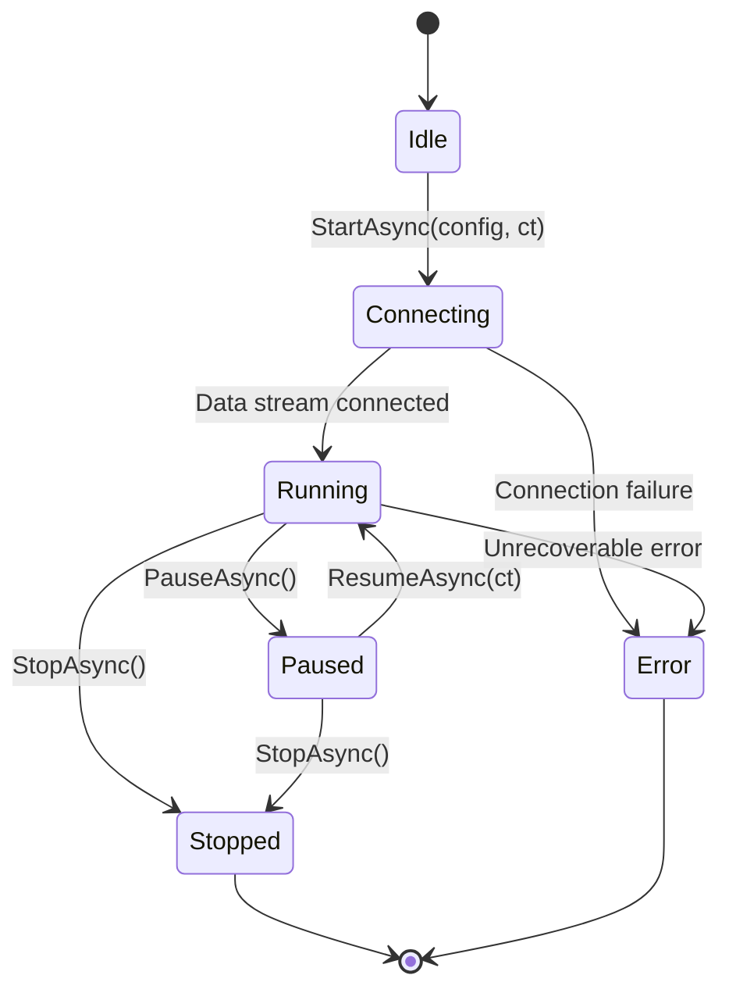
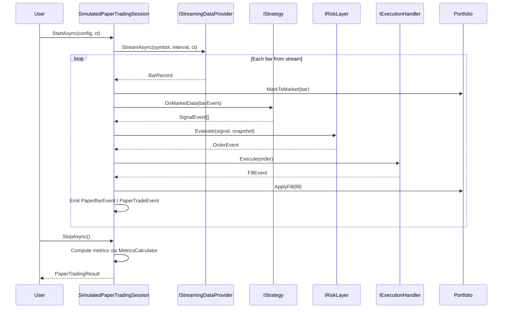
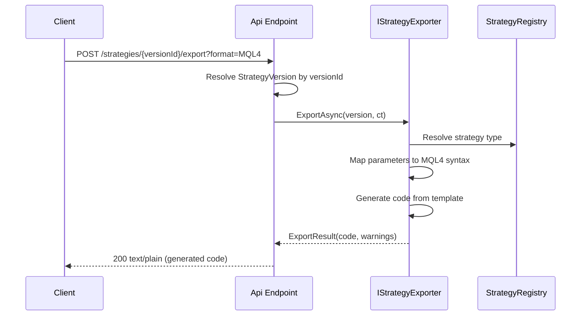
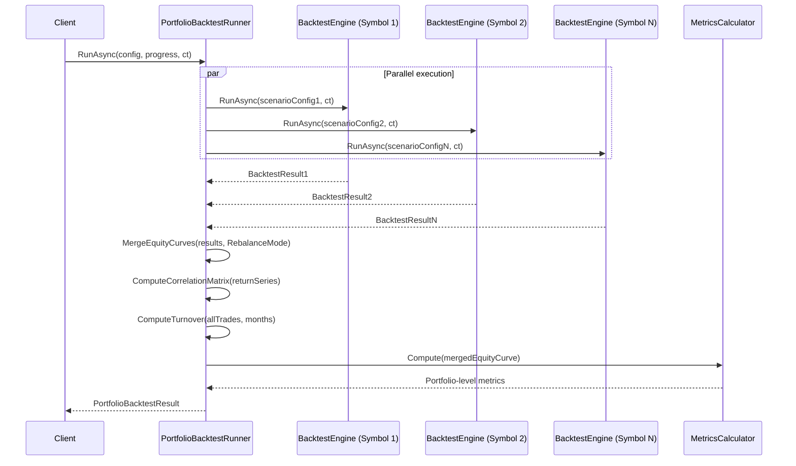

# Design Document — V8: AI Strategy Builder, Export Engine, Paper Trading, Indicator Library & Portfolio Backtesting

## Overview

V8 extends TradingResearchEngine with four parallel capability tracks that integrate into the existing hexagonal architecture (`Core ← Application ← Infrastructure ← { Cli, Api, Web }`). Each track introduces new abstractions at the appropriate layer, preserving the dependency rule and immutable-record conventions.

**Track 1 — AI Strategy Builder & Export Engine**: Google Gemini integration for natural-language strategy generation with structured JSON output, plus MQL4/MQL5/PineScript export for deploying strategies to external platforms.

**Track 2 — Paper Trading Mode**: Simulated live trading using the same execution pipeline as backtesting, with streaming data, real-time portfolio updates, and metric equivalence guarantees.

**Track 3 — Indicator Library**: Shared indicator wrappers backed by Skender.Stock.Indicators, replacing inline circular-buffer computations in all 6 built-in strategies.

**Track 4 — Portfolio Backtesting & Performance**: Parallel multi-symbol backtest execution with correlation analysis, equity curve merging, and object pooling for hot-path allocation reduction.

---

## Architecture

### High-Level Component Diagram

```mermaid
graph TB
    subgraph "Presentation Layer"
        CLI[TradingResearchEngine.Cli]
        API[TradingResearchEngine.Api]
        WEB[TradingResearchEngine.Web]
    end

    subgraph "Infrastructure Layer"
        GeminiImpl[GeminiStrategyAssistant]
        MQL4Exp[MQL4StrategyExporter]
        MQL5Exp[MQL5StrategyExporter]
        PineExp[PineScriptExporter]
        PollingStream[PollingStreamingDataProvider]
    end

    subgraph "Application Layer"
        AIAssistant[IAIStrategyAssistant]
        Exporter[IStrategyExporter]
        PaperSession[SimulatedPaperTradingSession]
        Indicators[IIndicatorSeries&lt;T&gt; Wrappers]
        PortfolioRunner[PortfolioBacktestRunner]
        GeminiOpts[GeminiOptions]
    end

    subgraph "Core Layer"
        IPaper[IPaperTradingSession]
        IStreaming[IStreamingDataProvider]
        PortConfig[PortfolioBacktestConfig]
        BarPool[BarDataPool]
        PaperTypes[PaperTradingStatus / Events / Result]
    end

    CLI --> PollingStream
    API --> Exporter
    WEB --> AIAssistant
    WEB --> PaperSession

    GeminiImpl -.-> AIAssistant
    MQL4Exp -.-> Exporter
    MQL5Exp -.-> Exporter
    PineExp -.-> Exporter
    PollingStream -.-> IStreaming

    PaperSession --> IPaper
    PaperSession --> IStreaming
    PaperSession --> Indicators
    PortfolioRunner --> PortConfig
    PortfolioRunner --> BarPool

```



### Dependency Rule Compliance

| New Component | Layer | References |
|---|---|---|
| `IPaperTradingSession`, `IStreamingDataProvider`, `PortfolioBacktestConfig`, `BarDataPool`, `PaperTradingStatus`, `PaperBarEvent`, `PaperTradeEvent`, `PaperTradingResult`, `PortfolioRebalanceMode` | Core | — |
| `IAIStrategyAssistant`, `IStrategyExporter`, `IIndicatorSeries<T>`, `SimulatedPaperTradingSession`, `PortfolioBacktestRunner`, `GeminiOptions`, `AIStrategyDraft`, `ExportFormat`, `ExportResult`, `PaperSessionRecord`, indicator wrappers | Application | Core |
| `GeminiStrategyAssistant`, `MQL4StrategyExporter`, `MQL5StrategyExporter`, `PineScriptExporter`, `PollingStreamingDataProvider` | Infrastructure | Application, Core |
| `TradingResearchEngine.Benchmarks` | Benchmarks (new) | Infrastructure, Application |

### NuGet Package Additions

| Package | Project | Purpose |
|---|---|---|
| `Microsoft.Extensions.ObjectPool` | Core | `BarDataPool` for hot-path allocation reduction |
| `Skender.Stock.Indicators` (2.x) | Application | Indicator computation backing `IIndicatorSeries<T>` |
| `Mscc.GenerativeAI` | Infrastructure | Google Gemini API client for `GeminiStrategyAssistant` |
| `BenchmarkDotNet` | Benchmarks | Performance measurement suite |

---

## Components and Interfaces

### Track 1 — AI Strategy Builder & Export Engine

#### IAIStrategyAssistant (Application)

```csharp
namespace TradingResearchEngine.Application.AI;

/// <summary>
/// Generates and refines strategy drafts using a large language model.
/// </summary>
public interface IAIStrategyAssistant
{
    /// <summary>
    /// Generates a strategy draft from a natural-language description.
    /// </summary>
    Task<AIStrategyDraft> GenerateStrategyAsync(
        string naturalLanguagePrompt, CancellationToken ct);

    /// <summary>
    /// Refines an existing draft using backtest results and user feedback.
    /// </summary>
    Task<AIStrategyDraft> RefineStrategyAsync(
        AIStrategyDraft current, BacktestResult lastResult,
        string refinementPrompt, CancellationToken ct);
}
```

#### IStrategyExporter (Application)

```csharp
namespace TradingResearchEngine.Application.Export;

/// <summary>
/// Converts a validated StrategyVersion into equivalent source code
/// for an external trading platform.
/// </summary>
public interface IStrategyExporter
{
    /// <summary>The export format this exporter handles.</summary>
    ExportFormat Format { get; }

    /// <summary>
    /// Generates platform-specific source code for the given strategy version.
    /// </summary>
    Task<ExportResult> ExportAsync(
        StrategyVersion version, CancellationToken ct);
}
```

#### GeminiStrategyAssistant (Infrastructure)

```csharp
namespace TradingResearchEngine.Infrastructure.AI;

/// <summary>
/// Google Gemini implementation of <see cref="IAIStrategyAssistant"/>.
/// Uses structured JSON output mode for reliable parsing.
/// </summary>
public sealed class GeminiStrategyAssistant : IAIStrategyAssistant
{
    // Constructor: IOptions<GeminiOptions>, StrategyRegistry, ILogger<GeminiStrategyAssistant>
    // Uses Mscc.GenerativeAI client internally
    // Loads system prompt from GeminiOptions.SystemPromptFilePath
    // Retries once on unknown StrategyType with correction prompt
}
```

#### Strategy Exporters (Infrastructure)

```csharp
namespace TradingResearchEngine.Infrastructure.Export;

public sealed class MQL4StrategyExporter : IStrategyExporter { ... }
public sealed class MQL5StrategyExporter : IStrategyExporter { ... }
public sealed class PineScriptExporter : IStrategyExporter { ... }
```

Each exporter:
- Maps all 6 built-in strategy types to target platform logic
- Emits `// NOTE:` comments where exact equivalence is impossible
- Returns empty `Code` with a `Warning` for unsupported types
- Uses template-based code generation with parameter substitution

### Track 2 — Paper Trading

#### IPaperTradingSession (Core)

```csharp
namespace TradingResearchEngine.Core.PaperTrading;

/// <summary>
/// Abstraction for a simulated live trading session that streams bars
/// and trades in real time.
/// </summary>
public interface IPaperTradingSession
{
    /// <summary>Current session lifecycle status.</summary>
    PaperTradingStatus Status { get; }

    /// <summary>Live portfolio state, updated on every bar.</summary>
    Portfolio.Portfolio Portfolio { get; }

    /// <summary>Observable stream of bar events with portfolio snapshots.</summary>
    IObservable<PaperBarEvent> BarStream { get; }

    /// <summary>Observable stream of trade events with portfolio snapshots.</summary>
    IObservable<PaperTradeEvent> TradeStream { get; }

    /// <summary>Starts the paper trading session.</summary>
    Task StartAsync(ScenarioConfig config, CancellationToken ct);

    /// <summary>Stops the session and produces final results.</summary>
    Task<PaperTradingResult> StopAsync();

    /// <summary>Pauses bar consumption, preserving portfolio state.</summary>
    Task PauseAsync();

    /// <summary>Resumes bar consumption after a pause.</summary>
    Task ResumeAsync(CancellationToken ct);
}
```

#### IStreamingDataProvider (Core)

> **Design Note:** The Core data abstraction is `IDataProvider` (in `Core/DataHandling/`). `IMarketDataProvider` lives in Application for market data acquisition and is a separate concern. `IStreamingDataProvider` extends `IDataProvider` because it provides the same bar-level data but via a streaming mechanism.

```csharp
namespace TradingResearchEngine.Core.DataHandling;

/// <summary>
/// Extends <see cref="IDataProvider"/> with real-time streaming capability.
/// </summary>
public interface IStreamingDataProvider : IDataProvider
{
    /// <summary>
    /// Streams bars as they become available (real-time or simulated playback).
    /// </summary>
    IAsyncEnumerable<BarRecord> StreamAsync(
        string symbol, string interval, CancellationToken ct);
}
```

#### SimulatedPaperTradingSession (Application)

```csharp
namespace TradingResearchEngine.Application.PaperTrading;

/// <summary>
/// Paper trading session that reuses the same execution pipeline as backtesting.
/// Guarantees metric equivalence with historical backtests for the same data.
/// </summary>
public sealed class SimulatedPaperTradingSession : IPaperTradingSession
{
    // Constructor: IStreamingDataProvider, IStrategy, IRiskLayer,
    //   IExecutionHandler, ISlippageModel, ICommissionModel,
    //   IRepository<PaperSessionRecord>, ILogger<SimulatedPaperTradingSession>
    // Internal: EventQueue, Portfolio, MetricsCalculator
    // State machine: Idle → Connecting → Running ⇄ Paused → Stopped | Error
}
```

#### PollingStreamingDataProvider (Infrastructure)

```csharp
namespace TradingResearchEngine.Infrastructure.DataProviders;

/// <summary>
/// Polls an existing <see cref="IDataProvider"/> at a configurable interval
/// and emits bars as an async stream. Supports fast-forward playback.
/// </summary>
public sealed class PollingStreamingDataProvider : IStreamingDataProvider
{
    // Constructor: IDataProvider inner, TimeSpan pollInterval, double speedRatio
    // StreamAsync: yields bars from inner provider at pollInterval / speedRatio
    // speedRatio = 1.0 → real-time; 10.0 → 10× faster
}
```

### Track 3 — Indicator Library

#### IIndicatorSeries<TResult> (Application)

```csharp
namespace TradingResearchEngine.Application.Indicators;

/// <summary>
/// Streaming, warm-up-aware indicator computation interface.
/// </summary>
/// <typeparam name="TResult">The indicator result type.</typeparam>
public interface IIndicatorSeries<TResult>
{
    /// <summary>Adds a new bar and recomputes the indicator.</summary>
    void Add(BarRecord bar);

    /// <summary>Resets the indicator to its initial state.</summary>
    void Reset();

    /// <summary>All computed results in chronological order.</summary>
    IReadOnlyList<TResult> Results { get; }

    /// <summary>True when enough bars have been added for valid computation.</summary>
    bool IsWarm { get; }
}
```

#### Indicator Wrappers (Application)

All live in `TradingResearchEngine.Application/Indicators/`:

| Class | Skender Method | TResult | Warm-up Period |
|---|---|---|---|
| `SmaIndicator` | `GetSma` | `SmaResult` | `period` |
| `EmaIndicator` | `GetEma` | `EmaResult` | `period` |
| `RsiIndicator` | `GetRsi` | `RsiResult` | `period + 1` |
| `MacdIndicator` | `GetMacd` | `MacdResult` | `slowPeriod + signalPeriod - 1` |
| `BollingerBandsIndicator` | `GetBollingerBands` | `BollingerBandsResult` | `period` |
| `AtrIndicator` | `GetAtr` | `AtrResult` | `period + 1` |
| `StochasticIndicator` | `GetStoch` | `StochResult` | `period + signalPeriod - 1` |
| `DonchianIndicator` | `GetDonchian` | `DonchianResult` | `period` |

**Incremental Computation Design:**

Each wrapper internally maintains a bounded `Queue<Quote>` with capacity `WarmupPeriod × 2` (Skender's input type). On each `Add()` call, the wrapper converts `BarRecord` to `Quote`, enqueues it (dequeuing the oldest if at capacity), and calls the corresponding Skender batch method on only the windowed queue contents. This ensures:

- **Worst-case per-bar cost is O(WarmupPeriod)** rather than O(n) where n is total bars processed.
- Memory usage is bounded regardless of backtest length.
- Skender's batch methods still receive enough history for accurate computation (the window is always ≥ WarmupPeriod).

This is a deliberate trade-off: Skender's API is batch-oriented (no incremental/streaming mode), so we cannot avoid calling the batch method on each bar. By bounding the input window, we prevent linear growth in computation time as the backtest progresses. For indicators with short warm-up periods (e.g., SMA-20), this means ~40 quotes recomputed per bar — negligible cost. For longer periods (e.g., EMA-200), ~400 quotes per bar — still acceptable for bar-level (not tick-level) processing.

### Track 4 — Portfolio Backtesting & Performance

#### PortfolioBacktestRunner (Application)

```csharp
namespace TradingResearchEngine.Application.Portfolio;

/// <summary>
/// Orchestrates parallel multi-symbol backtests and aggregates results
/// into a portfolio-level view with correlation analysis.
/// </summary>
public sealed class PortfolioBacktestRunner
{
    /// <summary>
    /// Runs a portfolio backtest with parallel per-symbol execution.
    /// </summary>
    public async Task<PortfolioBacktestResult> RunAsync(
        PortfolioBacktestConfig config,
        IProgressReporter progress,
        CancellationToken ct);

    // Internal algorithms:
    // - MergeEquityCurves(results, mode) → merged EquityCurvePoint[]
    // - ComputeCorrelationMatrix(returnSeries) → double[][]
    // - ComputeTurnover(trades, months) → decimal
}
```

**Key Algorithms:**

1. **Correlation Matrix Computation**: Pearson correlation on daily return series. For N symbols, produces an N×N symmetric matrix. Uses the standard formula: `r = Σ((xi - x̄)(yi - ȳ)) / √(Σ(xi - x̄)² × Σ(yi - ȳ)²)`. Diagonal is always 1.0.

2. **Equity Curve Merging**:
   - `EqualWeight`: Each symbol's equity curve is scaled by `InitialCash / SymbolCount`, then summed point-by-point aligned by timestamp.
   - `VolatilityParity`: Each symbol's weight is `(1/σᵢ) / Σ(1/σⱼ)` where σ is the annualised standard deviation of returns. Curves are weighted and summed.
   - `None`: Simple sum of all per-symbol equity curves (no rebalancing).

3. **Turnover Computation**: `AnnualisedTurnover = (TotalPositionChanges / MonthsInBacktest) × 12`

#### BarDataPool (Core)

```csharp
namespace TradingResearchEngine.Core.DataHandling;

/// <summary>
/// Object pool for hot-path collections used in DataHandler and Portfolio.
/// Reduces GC pressure during large backtests.
/// </summary>
public sealed class BarDataPool
{
    // Uses Microsoft.Extensions.ObjectPool.ObjectPool<List<BarRecord>>
    // Uses System.Buffers.ArrayPool<decimal> for return arrays
    // Transparent to callers — IStrategy.OnMarketData signature unchanged
}
```

---

## Data Models

### Core Layer Records

```csharp
namespace TradingResearchEngine.Core.PaperTrading;

/// <summary>Session lifecycle states.</summary>
public enum PaperTradingStatus
{
    Idle, Connecting, Running, Paused, Stopped, Error
}

/// <summary>Bar event emitted during paper trading with portfolio snapshot.</summary>
public sealed record PaperBarEvent(
    BarRecord Bar,
    DateTimeOffset Timestamp,
    PortfolioSnapshot Snapshot);

/// <summary>Trade event emitted when a position is closed during paper trading.</summary>
public sealed record PaperTradeEvent(
    ClosedTrade Trade,
    DateTimeOffset Timestamp,
    PortfolioSnapshot Snapshot);

/// <summary>Final result produced when a paper trading session stops.</summary>
public sealed record PaperTradingResult(
    Portfolio.Portfolio FinalPortfolio,
    IReadOnlyList<ClosedTrade> ClosedTrades,
    BacktestResult EquivalentBacktestResult,
    PaperTradingStatus FinalStatus,
    DateTimeOffset StartedAt,
    DateTimeOffset StoppedAt);
```

```csharp
namespace TradingResearchEngine.Core.Configuration;

/// <summary>Portfolio-level risk constraints for multi-symbol backtesting.</summary>
public sealed record PortfolioRiskConfig(
    /// <summary>Max total risk across all open positions as a percentage.</summary>
    decimal MaxPortfolioHeatPercent = 20m,
    /// <summary>Max allowed pairwise correlation before blocking new positions.</summary>
    decimal MaxCorrelationAllowed = 0.85m,
    /// <summary>How to weight symbols in the portfolio.</summary>
    PortfolioRebalanceMode RebalanceMode = PortfolioRebalanceMode.None);

/// <summary>Portfolio rebalancing strategy.</summary>
public enum PortfolioRebalanceMode
{
    /// <summary>No rebalancing — simple sum of equity curves.</summary>
    None,
    /// <summary>Equal capital allocation per symbol.</summary>
    EqualWeight,
    /// <summary>Inverse-volatility weighting.</summary>
    VolatilityParity
}

/// <summary>
/// Multi-symbol backtest configuration. First-class alternative to ScenarioConfig.
/// </summary>
public sealed record PortfolioBacktestConfig(
    IReadOnlyList<DataConfig> Symbols,
    IReadOnlyList<StrategyConfig> Strategies,
    PortfolioRiskConfig PortfolioRisk,
    ExecutionConfig Execution,
    decimal InitialCash = 100_000m,
    int? Seed = null,
    string? Timeframe = null);
```

### Application Layer Records

```csharp
namespace TradingResearchEngine.Application.AI;

/// <summary>
/// Immutable record representing a machine-generated strategy configuration.
/// </summary>
public sealed record AIStrategyDraft(
    string StrategyName,
    string Hypothesis,
    string StrategyType,
    IReadOnlyDictionary<string, object> Parameters,
    RiskConfig SuggestedRisk,
    string Rationale,
    IReadOnlyList<string> Caveats,
    SourceType SourceType = SourceType.AIGenerated);
```

```csharp
namespace TradingResearchEngine.Application.Export;

/// <summary>Target platform for strategy export.</summary>
public enum ExportFormat
{
    MQL4, MQL5, PineScript
}

/// <summary>Result of a strategy export operation.</summary>
public sealed record ExportResult(
    ExportFormat Format,
    string FileName,
    string Code,
    IReadOnlyList<string> Warnings);
```

```csharp
namespace TradingResearchEngine.Application.PaperTrading;

/// <summary>Persisted metadata for a paper trading session.</summary>
public sealed record PaperSessionRecord(
    string Id,
    string StrategyVersionId,
    DateTimeOffset StartedAt,
    DateTimeOffset? StoppedAt,
    PaperTradingStatus Status,
    decimal? FinalPnl,
    int TradeCount) : IHasId;
```

```csharp
namespace TradingResearchEngine.Application.Configuration;

/// <summary>
/// Configuration for the Google Gemini AI strategy assistant.
/// </summary>
public sealed record GeminiOptions
{
    /// <summary>Gemini API key. Never logged or exposed in API responses.</summary>
    public string? ApiKey { get; init; }

    /// <summary>Model name (default: gemini-2.0-flash).</summary>
    public string ModelName { get; init; } = "gemini-2.0-flash";

    /// <summary>Maximum retry attempts for failed/invalid responses.</summary>
    public int MaxRetries { get; init; } = 2;

    /// <summary>Path to the system prompt file.</summary>
    public string SystemPromptFilePath { get; init; } = "Prompts/strategy-assistant-system.md";
}
```

```csharp
namespace TradingResearchEngine.Application.Portfolio;

/// <summary>Aggregated result of a multi-symbol portfolio backtest.</summary>
public sealed record PortfolioBacktestResult(
    IReadOnlyList<BacktestResult> SymbolResults,
    BacktestResult PortfolioResult,
    IReadOnlyDictionary<string, IReadOnlyDictionary<string, double>> CorrelationMatrix,
    decimal AnnualisedTurnover,
    PortfolioRebalanceMode RebalanceMode);
```

---

## Sequence Diagrams

### AI Strategy Generation Flow



### Paper Trading Session Lifecycle





### Strategy Export Flow



### Portfolio Backtest Execution



---

## Folder Structure (New Code)

```
src/
  TradingResearchEngine.Core/
    PaperTrading/
      IPaperTradingSession.cs
      PaperTradingStatus.cs
      PaperBarEvent.cs
      PaperTradeEvent.cs
      PaperTradingResult.cs
    Configuration/
      PortfolioBacktestConfig.cs       (new)
      PortfolioRiskConfig.cs           (new)
      PortfolioRebalanceMode.cs        (new)
    DataHandling/
      IStreamingDataProvider.cs        (new)
      BarDataPool.cs                   (new)

  TradingResearchEngine.Application/
    AI/
      IAIStrategyAssistant.cs
      AIStrategyDraft.cs
    Export/
      IStrategyExporter.cs             (new — replaces existing IReportExporter scope)
      ExportFormat.cs
      ExportResult.cs
    PaperTrading/
      SimulatedPaperTradingSession.cs
      PaperSessionRecord.cs
    Indicators/
      IIndicatorSeries.cs
      SkenderIndicatorAdapter.cs
      SmaIndicator.cs
      EmaIndicator.cs
      RsiIndicator.cs
      MacdIndicator.cs
      BollingerBandsIndicator.cs
      AtrIndicator.cs
      StochasticIndicator.cs
      DonchianIndicator.cs
    Portfolio/
      PortfolioBacktestRunner.cs
      PortfolioBacktestResult.cs
    Configuration/
      GeminiOptions.cs                 (new)

  TradingResearchEngine.Infrastructure/
    AI/
      GeminiStrategyAssistant.cs
    Export/
      MQL4StrategyExporter.cs
      MQL5StrategyExporter.cs
      PineScriptExporter.cs
    DataProviders/
      PollingStreamingDataProvider.cs   (new)

  TradingResearchEngine.Benchmarks/     (new project)
    Program.cs
    BacktestEngineBenchmarks.cs
    TradingResearchEngine.Benchmarks.csproj

  TradingResearchEngine.UnitTests/
    AI/
      GeminiStrategyAssistantTests.cs
    Export/
      MQL4StrategyExporterTests.cs
      MQL5StrategyExporterTests.cs
      PineScriptExporterTests.cs
    PaperTrading/
      SimulatedPaperTradingSessionTests.cs
    Indicators/
      IndicatorSeriesProperties.cs
      SmaIndicatorTests.cs
      EmaIndicatorTests.cs
      ...
    Portfolio/
      PortfolioBacktestRunnerProperties.cs
      PortfolioBacktestRunnerTests.cs

  TradingResearchEngine.IntegrationTests/
    Portfolio/
      PortfolioRunnerIntegrationTests.cs
    Strategies/
      StrategyRegressionTests.cs
```


---

## Correctness Properties

*A property is a characteristic or behavior that should hold true across all valid executions of a system — essentially, a formal statement about what the system should do. Properties serve as the bridge between human-readable specifications and machine-verifiable correctness guarantees.*

### Property 1: AI Strategy Draft JSON Round-Trip

*For any* valid structured JSON response from the Gemini API containing all required fields (StrategyName, Hypothesis, StrategyType, Parameters, SuggestedRisk, Rationale, Caveats), deserializing it into an `AIStrategyDraft` and then serializing back to JSON should produce a semantically equivalent object with all fields preserved.

**Validates: Requirements 1.1, 1.2**

### Property 2: Unknown Strategy Type Triggers Exactly One Retry

*For any* strategy type string that is not present in `StrategyRegistry.KnownNames`, the AI assistant shall issue exactly one retry request whose prompt contains the complete list of known strategy names.

**Validates: Requirements 1.5, 1.6**

### Property 3: Export Produces Valid Platform-Specific Structure

*For any* valid `StrategyVersion` with a known built-in strategy type and *for any* `ExportFormat`, the exporter shall produce a non-empty `Code` string containing the required structural elements for that format: MQL4 requires `OnInit()`, `OnTick()`, `OnDeinit()`; MQL5 requires `CTrade`, `OnTick()`; PineScript requires `strategy()`, `strategy.entry()`.

**Validates: Requirements 4.1, 5.1, 6.1**

### Property 4: Paper Trading State Machine Validity

*For any* sequence of valid lifecycle operations (Start, Pause, Resume, Stop) applied to a paper trading session, the session status shall always be a valid `PaperTradingStatus` value, and pausing shall halt portfolio equity changes until resume is called.

**Validates: Requirements 9.2, 10.6**

### Property 5: Paper Trading Metric Equivalence

*For any* historical bar sequence fed through a mocked `IStreamingDataProvider`, the `PaperTradingResult` metrics (Sharpe, MaxDrawdown, WinRate, TradeCount) shall match the `BacktestResult` metrics produced by running the same bar sequence through `BacktestEngine` with identical strategy, risk, execution, slippage, and commission configuration.

**Validates: Requirements 10.1, 28.1**

### Property 6: Paper StopAsync Produces Valid Result

*For any* paper trading session that has processed at least one bar and is in Running or Paused state, calling `StopAsync()` shall transition status to `Stopped` and produce a `PaperTradingResult` with non-null `EquivalentBacktestResult` and `FinalPortfolio`.

**Validates: Requirements 10.3, 28.2**

### Property 7: Indicator Streaming Matches Batch Computation

*For any* sequence of `BarRecord` values and *for any* indicator type, adding bars one-by-one to an `IIndicatorSeries<T>` wrapper shall produce `Results` identical to calling the corresponding Skender batch method on the complete bar sequence.

**Validates: Requirements 14.3, 14.4, 15.4**

### Property 8: Indicator IsWarm Transition

*For any* indicator wrapper with warm-up period W, `IsWarm` shall be `false` when `Results.Count < W` and `true` when `Results.Count >= W`. The transition from false to true shall occur exactly once and at the W-th `Add()` call.

**Validates: Requirements 15.2**

### Property 9: Strategy Refactor Regression Equivalence

*For any* of the 6 built-in strategies run on a fixed-seed dataset, the refactored implementation using `IIndicatorSeries<T>` wrappers shall produce metrics matching the pre-refactor implementation to 4 decimal places (1e-4 tolerance).

**Validates: Requirements 16.3, 16.4**

### Property 10: Portfolio Strategy-to-Symbol Mapping

*For any* `PortfolioBacktestConfig` with either 1 strategy (applied to all N symbols) or exactly N strategies (one per symbol), the runner shall correctly map each symbol to its designated strategy without duplication or omission.

> **Design Note:** `PortfolioBacktestConfig.Strategies` uses the existing `StrategyConfig` record from `Core/Configuration/StrategyConfig.cs` (V5 sub-object decomposition). No extraction prerequisite is needed — `StrategyConfig` is already a standalone Core type.

**Validates: Requirements 18.4**

### Property 11: Equity Curve Merge Weight Invariants

*For any* set of per-symbol equity curves and `EqualWeight` rebalance mode, the merged portfolio equity at any timestamp shall equal the sum of each symbol's equity scaled by `1/N`. For `VolatilityParity`, weights shall sum to 1.0 and each weight shall be proportional to the inverse of that symbol's return standard deviation.

**Validates: Requirements 19.3**

### Property 12: Correlation Matrix Mathematical Properties

*For any* set of per-symbol return series, the computed correlation matrix shall be symmetric (`M[i][j] == M[j][i]`), have diagonal values of 1.0, and all values shall be in the range `[-1.0, 1.0]`.

**Validates: Requirements 19.4, 27.2**

### Property 13: Portfolio Turnover Non-Negative

*For any* set of closed trades across any number of symbols and any backtest duration, the computed annualised turnover shall be non-negative.

**Validates: Requirements 19.6**

### Property 14: Portfolio Determinism

*For any* `PortfolioBacktestConfig` with a fixed `Seed` value, running the portfolio backtest twice with identical inputs shall produce identical `PortfolioBacktestResult` (same equity curves, same correlation matrix, same metrics).

**Validates: Requirements 19.8, 27.1**

### Property 15: Portfolio Sharpe Diversification Bound

*For any* portfolio backtest where all pairwise correlations are positive (> 0), the portfolio-level Sharpe ratio shall be less than or equal to the maximum individual symbol Sharpe ratio.

**Validates: Requirements 27.3**

---

## Error Handling

### AI Strategy Assistant

| Error Condition | Handling |
|---|---|
| Gemini API key null/empty | Log warning at startup, disable AI features gracefully (return descriptive error, no crash) |
| Gemini API timeout/network error | Retry up to `GeminiOptions.MaxRetries` with exponential backoff (via Polly) |
| Invalid JSON response | Retry once; if still invalid, throw `InvalidOperationException` with context |
| Unknown StrategyType | Retry once with correction prompt; if still unknown, return draft with caveat |
| CancellationToken cancelled | Throw `OperationCanceledException` immediately |
| System prompt file not found | Throw `FileNotFoundException` with path at startup validation |

### Strategy Export

| Error Condition | Handling |
|---|---|
| Unknown/unsupported strategy type | Return `ExportResult` with empty `Code` and single `Warning` |
| Missing strategy parameters | Fall back to default parameter values; add `Warning` |
| VersionId not found | API returns HTTP 400 with structured error |
| Invalid format parameter | API returns HTTP 400 with structured error |

### Paper Trading

| Error Condition | Handling |
|---|---|
| StartAsync called when not Idle | Throw `InvalidOperationException` |
| StopAsync called when already Stopped | No-op, return cached result |
| PauseAsync called when not Running | Throw `InvalidOperationException` |
| ResumeAsync called when not Paused | Throw `InvalidOperationException` |
| Streaming data provider failure | Transition to Error status, log exception |
| Strategy throws during OnMarketData | Transition to Error status, log exception, preserve portfolio state |
| CancellationToken cancelled | Graceful stop → produce partial PaperTradingResult |

### Portfolio Backtest

| Error Condition | Handling |
|---|---|
| Empty Symbols list | Validation error before execution |
| Strategies count != 1 and != Symbols count | Validation error before execution |
| Per-symbol engine failure | Collect error, continue other symbols, report partial results |
| CancellationToken cancelled | Cancel all in-flight engines, return partial results |
| Correlation computation with < 2 data points | Return NaN for that pair |

---

## Testing Strategy

### Property-Based Tests (FsCheck.Xunit)

All property tests use `[Property(MaxTest = 100)]` minimum and are tagged:

```csharp
// Feature: v8-ai-export-paper-indicators-portfolio, Property N: <description>
```

**Properties to implement:**
1. AI Strategy Draft JSON round-trip
2. Unknown strategy type triggers exactly one retry
3. Export produces valid platform-specific structure
4. Paper trading state machine validity
5. Paper trading metric equivalence
6. Paper StopAsync produces valid result
7. Indicator streaming matches batch computation
8. Indicator IsWarm transition
9. Strategy refactor regression equivalence
10. Portfolio strategy-to-symbol mapping
11. Equity curve merge weight invariants
12. Correlation matrix mathematical properties
13. Portfolio turnover non-negative
14. Portfolio determinism
15. Portfolio Sharpe diversification bound

### Unit Tests (xUnit + Moq)

**AI Assistant:**
- Valid JSON response → correct AIStrategyDraft deserialization
- Unknown StrategyType → exactly one retry with correction prompt
- CancellationToken → OperationCanceledException
- Refinement includes Sharpe, MaxDrawdown, WinRate, TradeCount, DSR in context
- Empty API key → graceful disable

**Strategy Exporters (per format × 6 strategies = 18 tests + edge cases):**
- Each of 3 exporters × 6 built-in strategies → non-empty code
- Unknown strategy type → empty code + warning
- Missing parameters → defaults used without exception

**Paper Trading:**
- StopAsync → status Stopped + valid PaperTradingResult
- CancellationToken → graceful stop
- PauseAsync → portfolio state frozen
- ResumeAsync → bar consumption resumes

**Indicators:**
- Each wrapper produces correct results for known input sequences
- Reset clears state completely
- IsWarm transitions at correct bar count

### Integration Tests

**Portfolio Runner:**
- Determinism: same seed + inputs → identical result
- Correlation matrix symmetry
- Portfolio Sharpe ≤ max(symbol Sharpes) when correlation > 0
- 3-symbol run completes without error

**Strategy Regression (R16):**
- Each of 6 strategies on fixed-seed dataset
- Assert metrics match pre-refactor values to 4 decimal places (1e-4 tolerance)

**API Endpoints:**
- `POST /strategies/{versionId}/export` → 200 with code
- `POST /strategies/{versionId}/export` with invalid versionId → 400
- `POST /portfolios/run` → 200 with PortfolioBacktestResult
- `POST /portfolios/sweep` → 200 with list

### Benchmark Tests (BenchmarkDotNet)

- `SingleSymbol_1Year_Daily` (252 bars)
- `SingleSymbol_1Year_H1` (6048 bars)
- `SingleSymbol_5Year_M15` (120960 bars)
- `PortfolioRun_5Symbols_1Year_Daily`
- `ParameterSweep_10x10_Daily`

All benchmarks use `[MemoryDiagnoser]`, `[SimpleJob(RuntimeMoniker.Net80)]`, `[Orderer(SummaryOrderPolicy.FastestToSlowest)]`. Results exported to `artifacts/benchmarks/` as markdown and JSON.

**Object Pooling Validation:** `SingleSymbol_5Year_M15` allocated bytes must decrease ≥ 20% vs pre-pooling baseline (manual verification, not CI gate).
