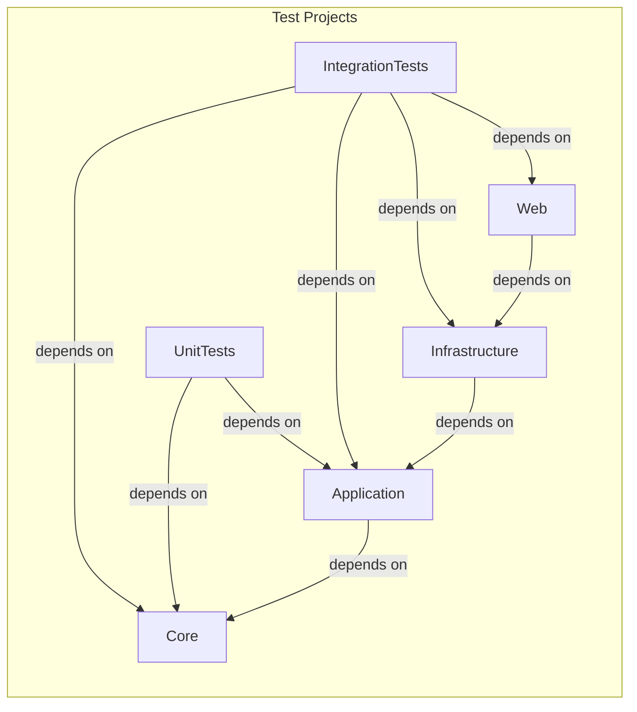
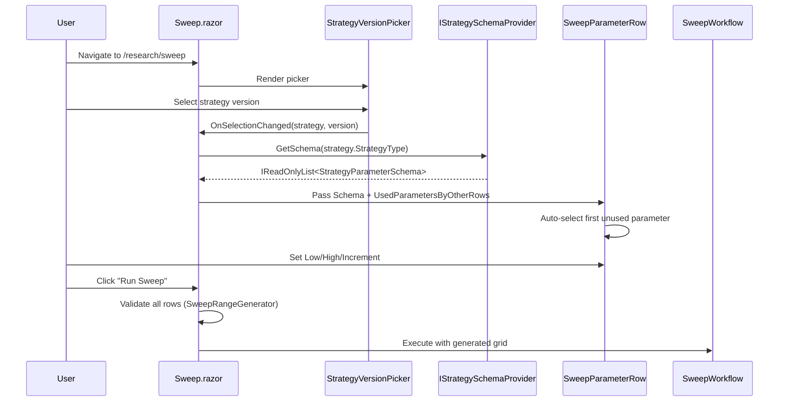

# Design Document: Web-Only UX Overhaul

## Overview

This feature transforms TradingResearchEngine from a multi-host application (CLI + API + Web) into a Web UI-only product. The change involves:

1. **Project removal** — Delete CLI and API host projects from the solution, file system, and all references.
2. **README/CHANGELOG overhaul** — Rewrite README as a Web-focused product page; extract version history into CHANGELOG.md.
3. **Parameter Sweep UX** — Schema-driven dropdown, range inputs (Low/High/Increment), and auto-selection of unused parameters.
4. **Dashboard KPI improvements** — Contextual Last Sharpe tile with strategy name, clickable navigation, and robustness warnings ordering fix.
5. **Component extraction** — Split oversized ResultDetail (~350 lines) and StrategyDetail (~917 lines) into smaller presentational components.
6. **Dead code cleanup** — Remove orphaned references, update documentation, fix integration tests.

### Design Decisions

| Decision | Rationale |
|----------|-----------|
| Delete CLI/API directories entirely (not just unload) | Eliminates confusion; git history preserves the code |
| Retain `samples/` directory as test data | Scenario JSON files are referenced by integration tests (StrategyRegressionTests); retained as test infrastructure, not a CLI-facing user artifact (see Implementation Constraints below) |
| Range generation as a static pure function | Enables property-based testing; reusable outside Razor context |
| Place non-component sweep support types in `Features/Research/Sweep/` | Separates pure logic and models from Razor component files for clarity |
| Extract Razor sub-components into same folder as parent page | Keeps related UI files co-located; avoids deep nesting |
| Use `CascadingParameter` sparingly | Pass data via explicit `[Parameter]` for clarity and testability |
| Rewrite integration tests to use `WebApplicationFactory<Program>` from Web project | Web is now the only host; tests validate the same DI graph |

### Implementation Constraints

**`samples/` directory retention**: Requirement 1 AC5 states that `samples/` should be removed if it exists solely for CLI scenario usage. Investigation shows that `samples/scenarios/*.json` files are referenced by integration tests (`StrategyRegressionTests`) and are not CLI-exclusive. The directory is therefore retained as test data infrastructure. If future test migrations remove this dependency, `samples/` can be revisited for removal. This constraint should be reflected in the requirements as a clarifying note if needed.

## Architecture

After this feature, the solution structure becomes:

```
TradingResearchEngine.sln
src/
  TradingResearchEngine.Core/
  TradingResearchEngine.Application/
  TradingResearchEngine.Infrastructure/
  TradingResearchEngine.Web/              ← sole application host
  TradingResearchEngine.Benchmarks/
  TradingResearchEngine.UnitTests/
  TradingResearchEngine.IntegrationTests/
samples/                                  ← retained as test data (not a user-facing artifact)
docs/
```

Dependency rule: `Core ← Application ← Infrastructure ← Web`

The arrows below represent "depends on" (points from dependent to dependency):



### Solution File Changes

Remove from `TradingResearchEngine.sln`:
- Project entry `{9954C210-15A3-436D-ABBA-A11D402CC46C}` (TradingResearchEngine.Cli)
- Project entry `{373A1D60-A70B-40A5-8D24-3CD37E837CDB}` (TradingResearchEngine.Api)
- All `ProjectConfigurationPlatforms` entries for those GUIDs
- All `NestedProjects` entries for those GUIDs

### Directory Deletions

| Path | Action |
|------|--------|
| `src/TradingResearchEngine.Cli/` | Delete entire directory |
| `src/TradingResearchEngine.Api/` | Delete entire directory |

### Reference Cleanup

| File | Change |
|------|--------|
| `src/TradingResearchEngine.IntegrationTests/TradingResearchEngine.IntegrationTests.csproj` | Remove `ProjectReference` to Cli and Api |
| `src/TradingResearchEngine.IntegrationTests/TradingResearchEngine.IntegrationTests.csproj` | Add `ProjectReference` to Web (for `WebApplicationFactory<Program>`) |

## Components and Interfaces

### Parameter Sweep — Schema-Driven Selection

#### Component: `SweepParameterRow.razor`

Location: `Components/Pages/Research/SweepParameterRow.razor`

A self-contained row component that replaces the current inline `GridEntry` rendering in `Sweep.razor`.

```csharp
// Parameters
[Parameter] public IReadOnlyList<StrategyParameterSchema>? Schema { get; set; }
[Parameter] public HashSet<string> UsedParametersByOtherRows { get; set; } = new();
[Parameter] public EventCallback<SweepRowModel> OnChanged { get; set; }
[Parameter] public EventCallback OnRemoved { get; set; }
[Parameter] public SweepRowModel Model { get; set; } = new();
```

**Behavior:**

- When `Schema` is non-null and non-empty → render a `MudSelect<string>` dropdown populated from `Schema` parameter names.
- When `Schema` is null or empty → render a `MudTextField<string>` for free-text parameter name (fallback).
- When a parameter is selected from the dropdown → display helper text showing `Description` and `SensitivityHint` from the matching `StrategyParameterSchema`.

**Duplicate-parameter selection rules:**

1. The dropdown for a given row SHALL always include the row's own currently-selected parameter as a visible and selectable option (so the user can re-confirm or see their choice).
2. Parameters that are selected by *other* rows (passed via `UsedParametersByOtherRows`) SHALL be excluded from the dropdown options, OR shown as disabled/greyed items — implementation may choose either approach as long as the user cannot accidentally create duplicate selections.
3. When a **new row** is added, auto-selection SHALL pick the first schema parameter whose name is NOT in `UsedParametersByOtherRows`. If all parameters are already used by other rows, the new row's selection SHALL be left empty.
4. When an existing row's parameter is changed, the parent `Sweep.razor` SHALL recompute `UsedParametersByOtherRows` for all sibling rows and re-render them so their dropdowns update accordingly.

#### Model: `SweepRowModel`

Location: `src/TradingResearchEngine.Web/Features/Research/Sweep/SweepRowModel.cs`

```csharp
public sealed class SweepRowModel
{
    public string ParameterName { get; set; } = "";
    public decimal Low { get; set; }
    public decimal High { get; set; }
    public decimal Increment { get; set; } = 1m;
}
```

#### Pure Function: `SweepRangeGenerator`

Location: `src/TradingResearchEngine.Web/Features/Research/Sweep/SweepRangeGenerator.cs`

```csharp
public static class SweepRangeGenerator
{
    /// <summary>
    /// Generates a list of values from Low to High (inclusive) stepping by Increment.
    /// Returns null if inputs are invalid (Increment &lt;= 0 or Low &gt; High).
    /// This is a pure generation helper — user-facing validation messages are the
    /// responsibility of the calling UI layer.
    /// </summary>
    public static IReadOnlyList<decimal>? Generate(decimal low, decimal high, decimal increment)
    {
        if (increment <= 0m || low > high) return null;
        var values = new List<decimal>();
        for (var v = low; v <= high; v += increment)
            values.Add(v);
        return values;
    }
}
```

**Validation contract:**

- `SweepRangeGenerator` is a pure generation helper. It returns `null` for invalid inputs as a signal to the caller.
- The UI layer (`SweepParameterRow.razor` or `Sweep.razor`) is responsible for:
  - Detecting `null` return and mapping it to user-facing validation messages (e.g., "Increment must be greater than 0", "Low must be ≤ High").
  - Displaying these messages inline via `MudAlert` or field-level validation.
  - Preventing sweep execution when any row has invalid range inputs.
- This separation keeps the pure function testable without UI dependencies while giving the UI full control over error presentation.

#### Pure Function: `SweepParameterSelector`

Location: `src/TradingResearchEngine.Web/Features/Research/Sweep/SweepParameterSelector.cs`

```csharp
public static class SweepParameterSelector
{
    /// <summary>
    /// Returns the first schema parameter name not already in usedNames, or null if all are used.
    /// </summary>
    public static string? SelectNext(
        IReadOnlyList<StrategyParameterSchema> schema,
        IReadOnlySet<string> usedNames)
    {
        return schema.FirstOrDefault(s => !usedNames.Contains(s.Name))?.Name;
    }
}
```

#### Updated `Sweep.razor` Data Flow



### Dashboard — Last Sharpe Tile

#### Changes to `Dashboard.razor`

The Last Sharpe tile (Zone 2, second `MudItem`) gains:

1. **Strategy name caption** — Below the Sharpe value, display the strategy name resolved from `_strategyIdByType` lookup, or fall back to `StrategyType` string, or hide if no runs.
2. **Click navigation** — Wrap the tile in a clickable handler:
   - If strategy ID resolvable → navigate to `/strategies/{strategyId}`
   - If no strategy ID but run exists → navigate to `/backtests/history`
   - If no runs → tile is not clickable (no cursor:pointer, no onclick)
3. **Conditional styling** — Add `cursor:pointer` only when clickable.

#### Data Flow for Strategy Name Resolution

The existing `_strategyIdByType` dictionary already maps `StrategyType → StrategyId`. To get the display name:

```csharp
private string? GetLastSharpeStrategyName()
{
    if (_latestRun is null) return null;
    var strategyType = _latestRun.ScenarioConfig.StrategyType;
    var match = _strategies.FirstOrDefault(s => s.StrategyType == strategyType);
    return match?.StrategyName ?? strategyType;
}

private string? GetLastSharpeNavigationTarget()
{
    if (_latestRun is null) return null;
    var strategyType = _latestRun.ScenarioConfig.StrategyType;
    if (_strategyIdByType.TryGetValue(strategyType, out var strategyId))
        return $"/strategies/{strategyId}";
    return "/backtests/history";
}
```

### Dashboard — Robustness Warnings Ordering Fix

#### Design Rule

The robustness warnings panel SHALL use the application's canonical recent-run ordering already established in Dashboard data loading. The implementation rule is:

1. Reuse the existing `_runs` collection which is loaded with `OrderByDescending(r => r.RunId)` ordering.
2. `RunId` uses the format `yyyyMMdd-HHmmss-...`, which means descending `RunId` order is equivalent to descending run-date order. This is the canonical recency ordering for the application.
3. Filter to `Status == Completed`, then take the first 10 from this already-ordered collection.
4. Do NOT create a second independent recency sort — the existing ordering satisfies Requirement 11.
5. Add an explicit code comment documenting that `_runs` ordering is the canonical recency source and why `RunId` descending satisfies the "most recent by run date" requirement.

The implementation makes the existing canonical recency ordering explicit and reuses it:

```csharp
// _runs is ordered by descending RunId (format: yyyyMMdd-HHmmss-...), which is the
// application's canonical recency ordering. This satisfies Requirement 11: robustness
// warnings evaluate the 10 most recent completed runs by run date.
var recentCompleted = _runs
    .Where(r => r.Status == BacktestStatus.Completed)
    .Take(10);
```

### ResultDetail Component Extraction

#### Extraction Plan

The current `ResultDetail.razor` (~350 lines of markup + ~100 lines of code) is split into:

| New Component | Location | Content Extracted |
|---------------|----------|-------------------|
| `ResultMetricsPanel.razor` | `Components/Pages/Backtests/ResultMetricsPanel.razor` | Tier 1 metrics grid (Sharpe, Max DD, Win Rate, K-Ratio, DSR, Trial #) + Tier 2 tabbed metrics (Extended Metrics, Trade Stats) |
| `ResultEquityCurvePanel.razor` | `Components/Pages/Backtests/ResultEquityCurvePanel.razor` | Top equity curve chart + Charts tab content (equity+drawdown, monthly returns, trade PnL, holding period) |
| `ResultTradeLogPanel.razor` | `Components/Pages/Backtests/ResultTradeLogPanel.razor` | Trades tab table with pagination |
| `ResultRealismPanel.razor` | `Components/Pages/Backtests/ResultRealismPanel.razor` | Realism Assumptions card + RobustnessWarnings + IS vs OOS panel |

#### Parameter Passing

Each extracted component receives data via explicit `[Parameter]` properties:

```csharp
// ResultMetricsPanel.razor
[Parameter, EditorRequired] public BacktestResult Result { get; set; } = default!;

// ResultEquityCurvePanel.razor
[Parameter, EditorRequired] public BacktestResult Result { get; set; } = default!;
[Parameter] public IReadOnlyList<BarRecord>? BarRecords { get; set; }

// ResultTradeLogPanel.razor
[Parameter, EditorRequired] public IReadOnlyList<ClosedTrade> Trades { get; set; } = default!;

// ResultRealismPanel.razor
[Parameter, EditorRequired] public BacktestResult Result { get; set; } = default!;
```

#### Shell Component (`ResultDetail.razor` after refactoring)

Retains:
- `@page "/backtests/{Id}"` route declaration
- All `@inject` directives
- `OnInitializedAsync` data loading logic
- Header, breadcrumbs, status banner, failed/cancelled alerts
- Action band (Study + Prop Firm + AI Refine)
- Export menu
- Tab container structure (delegates tab content to sub-components)

#### Preservation Guarantees

After extraction, the following MUST remain unchanged:
- Route behavior: `@page "/backtests/{Id}"` continues to resolve identically
- All navigation links within the page (breadcrumbs, action buttons) continue to target the same URLs
- All action handlers (export, study launch, prop firm evaluation, AI refine) continue to function identically
- Tab switching behavior remains unchanged
- No new routes are introduced by extracted components

### StrategyDetail Component Extraction

#### Extraction Plan

The current `StrategyDetail.razor` (917 lines) is split into:

| New Component | Location | Content Extracted |
|---------------|----------|-------------------|
| `StrategyOverviewPanel.razor` | `Components/Pages/Strategies/StrategyOverviewPanel.razor` | Latest run summary, benchmark chip, robustness warnings, equity curve, development stage, research progress, recommended next study, quick actions |
| `StrategyVersionsPanel.razor` | `Components/Pages/Strategies/StrategyVersionsPanel.razor` | Version parameters table, execution config table, execution window display + edit button |
| `StrategyRunsPanel.razor` | `Components/Pages/Strategies/StrategyRunsPanel.razor` | KPI summary bar + runs table |
| `StrategyStudiesPanel.razor` | `Components/Pages/Strategies/StrategyStudiesPanel.razor` | Study launch bar + studies table |

#### Parameter Passing

```csharp
// StrategyOverviewPanel.razor
[Parameter, EditorRequired] public StrategyIdentity Strategy { get; set; } = default!;
[Parameter] public BacktestResult? LatestRun { get; set; }
[Parameter] public ResearchChecklist? Checklist { get; set; }
[Parameter] public StrategyDescriptor? Descriptor { get; set; }
[Parameter] public decimal? BenchmarkExcessSharpe { get; set; }
[Parameter] public EventCallback OnRunRequested { get; set; }
[Parameter] public StrategyVersion? SelectedVersion { get; set; }

// StrategyVersionsPanel.razor
[Parameter, EditorRequired] public StrategyVersion Version { get; set; } = default!;
[Parameter, EditorRequired] public StrategyIdentity Strategy { get; set; } = default!;
[Parameter] public (string? Timeframe, DateTimeOffset? Start, DateTimeOffset? End, int? EstimatedBars) ExecWindow { get; set; }
[Parameter] public EventCallback OnEditWindowRequested { get; set; }

// StrategyRunsPanel.razor
[Parameter, EditorRequired] public List<BacktestResult> Runs { get; set; } = new();
[Parameter] public BacktestResult? LatestRun { get; set; }

// StrategyStudiesPanel.razor
[Parameter, EditorRequired] public StrategyIdentity Strategy { get; set; } = default!;
[Parameter] public StrategyVersion? SelectedVersion { get; set; }
[Parameter] public BacktestResult? LatestRun { get; set; }
[Parameter] public List<StudyRecord> Studies { get; set; } = new();
[Parameter] public StrategyDescriptor? Descriptor { get; set; }
```

#### Shell Component (`StrategyDetail.razor` after refactoring)

Retains:
- `@page "/strategies/{StrategyId}"` route declaration
- All `@inject` directives
- `OnInitializedAsync` and `LoadVersionData` logic
- Header band (name, chips, version selector, run button, overflow menu)
- Tab container (`MudTabs`) — delegates each tab's content to sub-components
- All dialogs (Run, Rename, Hypothesis, Edit Window)
- Prop Firm tab (kept inline — it has its own state management)
- `@code` block with state fields and event handlers

#### Preservation Guarantees

After extraction, the following MUST remain unchanged:
- Route behavior: `@page "/strategies/{StrategyId}"` continues to resolve identically
- Tab switching behavior (Overview, Versions, Runs, Studies, Prop Firm) remains unchanged
- All navigation links within the page continue to target the same URLs
- All action handlers (run, rename, hypothesis, edit window, study launch) continue to function identically
- Dialog behavior remains unchanged (dialogs stay in the shell component)
- No new routes are introduced by extracted components

## Data Models

No new domain models are introduced. This feature reuses existing types:

| Type | Layer | Usage in This Feature |
|------|-------|----------------------|
| `StrategyParameterSchema` | Application | Populates sweep dropdown |
| `IStrategySchemaProvider` | Application | Loads schema for selected strategy |
| `BacktestResult` | Core | Dashboard tile data, robustness warnings |
| `StrategyIdentity` | Application | Strategy name resolution |
| `StrategyVersion` | Application | Version selection in sweep |
| `SweepRowModel` | Web (new) | UI state for a single sweep parameter row |

### New UI-Only Types

```csharp
// SweepRowModel — mutable UI state for a parameter sweep row
public sealed class SweepRowModel
{
    public string ParameterName { get; set; } = "";
    public decimal Low { get; set; }
    public decimal High { get; set; }
    public decimal Increment { get; set; } = 1m;
}
```

## Correctness Properties

*A property is a characteristic or behavior that should hold true across all valid executions of a system — essentially, a formal statement about what the system should do. Properties serve as the bridge between human-readable specifications and machine-verifiable correctness guarantees.*

### Property 1: Range generation produces correct sequence

*For any* valid inputs where Low ≤ High and Increment > 0, `SweepRangeGenerator.Generate(low, high, increment)` SHALL return a list where:
- The first element equals Low
- Each subsequent element equals the previous element plus Increment
- All elements are ≤ High
- The list length equals `floor((high - low) / increment) + 1`

**Validates: Requirements 7.2**

### Property 2: Range generation rejects invalid inputs

*For any* inputs where Increment ≤ 0 OR Low > High, `SweepRangeGenerator.Generate(low, high, increment)` SHALL return null.

**Validates: Requirements 7.3, 7.4**

### Property 3: Auto-selection picks first unused parameter

*For any* non-empty list of `StrategyParameterSchema` items and any subset of used parameter names, `SweepParameterSelector.SelectNext(schema, usedNames)` SHALL return the `Name` of the first schema entry whose `Name` is not in `usedNames`, or null if all names are in `usedNames`.

**Validates: Requirements 8.1, 8.2**

### Property 4: Robustness warnings evaluate only completed runs in recency order

*For any* list of `BacktestResult` items with mixed statuses, filtering to `Status == Completed` and taking the first 10 by descending RunId SHALL produce a subset where:
- All items have `Status == Completed`
- The count is ≤ 10
- The items are ordered by RunId descending (most recent first)
- No non-Completed run appears in the result

**Validates: Requirements 11.1, 11.3**

## Error Handling

| Scenario | Handling |
|----------|----------|
| `IStrategySchemaProvider.GetSchema` throws | Catch exception, set schema to null, fall back to free-text input. Log warning. |
| Range validation fails (Increment ≤ 0 or Low > High) | `SweepRangeGenerator` returns null; UI layer displays inline `MudAlert` with specific message ("Increment must be greater than 0" or "Low must be ≤ High"). Prevent sweep execution. |
| Strategy name resolution fails for Last Sharpe tile | Fall back to displaying `StrategyType` string. Never show empty tile. |
| No completed runs for robustness warnings | Show empty panel (no warnings section rendered). |
| Component parameter is null when expected | Use `[EditorRequired]` attribute for compile-time safety. Render graceful fallback for optional parameters. |
| Integration tests fail after API removal | Remove `V8EndpointTests.cs` entirely. Repoint `WebApplicationFactory<Program>` to Web's `Program` class. |

## Testing Strategy

### Approach

This feature is primarily a UI refactoring and project structure change. The testing strategy uses:

- **Property-based tests** for the two pure functions (`SweepRangeGenerator`, `SweepParameterSelector`) and the robustness warnings filtering logic.
- **Example-based unit tests** for specific UI behaviors and edge cases.
- **Smoke tests** (build verification) for structural changes (project removal, reference cleanup).
- **Integration tests** updated to use Web host instead of API host.

### Property-Based Tests

Library: **FsCheck.Xunit** (already in use)

Configuration: Minimum 100 iterations per property (`[Property(MaxTest = 100)]`).

Each property test is tagged:
```csharp
// Feature: web-only-ux-overhaul, Property 1: Range generation produces correct sequence
// Feature: web-only-ux-overhaul, Property 2: Range generation rejects invalid inputs
// Feature: web-only-ux-overhaul, Property 3: Auto-selection picks first unused parameter
// Feature: web-only-ux-overhaul, Property 4: Robustness warnings evaluate only completed runs in recency order
```

Property tests live in `src/TradingResearchEngine.UnitTests/`.

### Unit Tests (Example-Based)

| Test | Validates |
|------|-----------|
| `SweepRangeGenerator_ZeroIncrement_ReturnsNull` | Req 7.3 |
| `SweepRangeGenerator_NegativeIncrement_ReturnsNull` | Req 7.3 |
| `SweepRangeGenerator_LowGreaterThanHigh_ReturnsNull` | Req 7.4 |
| `SweepRangeGenerator_LowEqualsHigh_ReturnsSingleElement` | Req 7.2 edge case |
| `SweepParameterSelector_AllUsed_ReturnsNull` | Req 8.2 |
| `SweepParameterSelector_EmptySchema_ReturnsNull` | Req 8.2 edge case |
| `LastSharpeTile_NoStrategyId_NavigatesToBacktestsHistory` | Req 10.2 |
| `SweepParameterRow_PreservesOwnSelection_ExcludesOtherRows` | Req 8.1 duplicate-parameter behavior |

### Integration Test Updates

| Current | After |
|---------|-------|
| `Api/V8EndpointTests.cs` using `WebApplicationFactory<Program>` from Api | **Delete entirely** — API endpoints no longer exist |
| IntegrationTests.csproj references Cli and Api | Remove both references; add reference to Web |
| Tests using `WebApplicationFactory<Program>` | Repoint to `TradingResearchEngine.Web.Program` (add `InternalsVisibleTo` or public partial class) |

The Web project needs a `Program` class accessible to tests. Add to `src/TradingResearchEngine.Web/Program.cs`:
```csharp
// Enable WebApplicationFactory access from integration tests
public partial class Program { }
```

### Build Verification

After all changes:
1. `dotnet build TradingResearchEngine.sln` — zero errors
2. `dotnet test TradingResearchEngine.sln` — all tests pass (minus removed API tests)
3. Verify no remaining references to `TradingResearchEngine.Cli` or `TradingResearchEngine.Api` in any `.csproj` or `.sln` file

### File/Folder Structure After Changes

```
src/TradingResearchEngine.Web/
  Features/
    Research/
      Sweep/
        SweepRangeGenerator.cs         (new — pure generation helper)
        SweepParameterSelector.cs      (new — pure selection helper)
        SweepRowModel.cs               (new — UI state model)
  Components/
    Pages/
      Research/
        Sweep.razor                    (updated — uses SweepParameterRow)
        SweepParameterRow.razor        (new — schema dropdown + range inputs)
      Backtests/
        ResultDetail.razor             (slimmed — shell only)
        ResultMetricsPanel.razor       (new — extracted)
        ResultEquityCurvePanel.razor   (new — extracted)
        ResultTradeLogPanel.razor      (new — extracted)
        ResultRealismPanel.razor       (new — extracted)
      Strategies/
        StrategyDetail.razor           (slimmed — shell only)
        StrategyOverviewPanel.razor    (new — extracted)
        StrategyVersionsPanel.razor    (new — extracted)
        StrategyRunsPanel.razor        (new — extracted)
        StrategyStudiesPanel.razor     (new — extracted)
      Dashboard.razor                  (updated — Last Sharpe tile + warnings fix)
samples/                               (retained — test data for integration tests)
```
